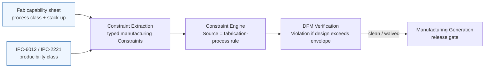

# Manufacturing Constraints (DFM)

**Summary.** Design For Manufacturability (DFM) is the body of fabrication and assembly limits that decide whether a board that is *electrically correct* can also be *physically built* at acceptable yield. Every number — minimum trace and space, minimum annular ring and drill, plated-hole aspect ratio, copper-to-edge clearance, solder-mask sliver, panelization and tooling margins — is **sourced from a real fabrication process**, not chosen by the designer: it is the consequence of how copper is etched, how holes are drilled and plated, how layers register to one another, and how a panel is depanelized. This document belongs in the Engineering Science Layer because the runtime's [DFM Verification](../../docs/state-machines/dfm-verification.md) phase, its [Constraint Engine](../../docs/engineering/constraint-engine.md) "manufacturing" constraint type, its board-edge keep-out, and the [Manufacturing Generation](../../docs/state-machines/manufacturing-generation.md) release gate all silently assume this body of fab physics — yet the runtime never states *why* a 0.1 mm sliver flakes off or *why* a 0.15 mm hole through a 1.6 mm board fails to plate. It grounds the single idea the whole verification gate rests on: **a manufacturing constraint is a fabrication-process fact reified as a machine-checkable limit, and "the fab can build it" is a precondition for release, not an afterthought.**

---

## Core principles

The governing meta-principle is **provenance**: a DFM constraint is not a preference, it is a *limit the chosen fabricator's process imposes*. The fab publishes a **capability sheet** (a design-rule set keyed to a process class and stack-up); the design must lie inside that envelope. Two fabs, or two [IPC](../../docs/engineering/standards-and-compliance.md)-6012 producibility classes, yield two different envelopes for the *same* board. Therefore every limit below is a **parameter**, never a universal constant — the runtime must carry the *source* of each, not just its value.


*Figure: a DFM constraint flows from a physical fab process into a typed, checkable limit, then gates the release — the value is fab-sourced, so its provenance must travel with it.*

### 1. Feature resolution — minimum trace and space come from subtractive etching

Standard copper is **subtractive**: a uniform copper foil is masked with resist and the *exposed* copper is etched away. The etchant attacks sideways as well as downward, so a trace ends up with a trapezoidal cross-section and is **narrower at the top than the resist that defined it** — an *undercut*. The severity is captured by the **etch factor**:

```text
etch_factor  EF = (etch depth) / (lateral undercut)        # higher EF = less undercut = better
undercut     u  ≈ t_cu / EF                                # t_cu = finished copper thickness
w_finished      ≈ w_designed − 2·u                          # both edges undercut
```
*Listing: the finished trace is the designed width minus undercut on each edge; undercut grows with copper thickness, which is why minimum feature size scales with copper weight.*

Consequences that are pure physics, not taste:

- **Minimum trace/space scales with copper thickness.** 1 oz copper is ≈ 35 µm; 2 oz ≈ 70 µm. Thicker copper undercuts more, so a 2 oz process needs *wider* minimum trace and space (often roughly doubled) than a 0.5 oz process. Ampacity (see [ohm's law](../electrical/ohms-law.md)) wants thick copper for current; resolution wants thin copper for fine pitch — a direct, fab-rooted trade.
- **Process classes are discrete capability tiers.** Standard subtractive etch resolves ≈ 5–6 mil (≈ 125–150 µm) trace/space; advanced ≈ 4 mil; HDI ≈ 3 mil; below ≈ 2 mil ordinarily requires a *semi-additive* (mSAP/SAP) process where copper is plated up rather than etched down, with much less undercut. The number a design may use is whichever tier the chosen fab quotes.
- **Space is as constrained as width.** Two adjacent traces must keep enough gap that, after undercut tolerance and registration, the etch resolves them as separate conductors. Minimum *space* protects against shorts the same way minimum *width* protects against opens and necks.

### 2. Drilled holes — minimum drill, annular ring, and registration budget

A plated through-hole (PTH) or via is a **drilled barrel** plated with copper and landed on a **pad**. The copper ring of pad that remains around the finished hole is the **annular ring**:

```text
annular_ring  AR = (D_pad − D_hole_finished) / 2
```

The annular ring must survive *every misalignment in the stack* and still leave a minimum landing, or the hole **breaks out** of its pad (tangency, AR → 0) and the connection is unreliable. Sizing a pad is therefore a **tolerance budget**, not a single subtraction:

```text
D_pad ≥ D_hole + 2·AR_min + 2·(reg + wander + plating_tol)
        └ finished hole ┘   └ minimum land ┘   └ misregistration + drill wander + plating variation ┘
```
*Listing: the pad must be large enough that, after layer-to-layer registration error, drill wander, and plating tolerance, the IPC-class minimum annular ring still remains on the worst-case side.*

- **Annular-ring minimum is class-driven.** [IPC-6012](../../docs/engineering/standards-and-compliance.md) Class 2 commonly requires ≈ 50 µm (2 mil) external annular ring; Class 3 demands more margin and forbids breakout; inner layers allow smaller rings but pay for registration. The *class is the source* of the number.
- **Minimum drill is a tool/process floor.** Mechanical drilling bottoms out around 0.15–0.20 mm; finer holes need **laser-drilled microvias** (≈ 0.10 mm and below), which are blind/buried and change the stack-up. Smaller holes also cost more and drill slower.
- **Registration couples layers.** The same physical misalignment that eats annular ring eats inner-layer clearance; tightening one tightens the whole budget. This is why annular ring is a *manufacturing* constraint and not merely a footprint detail.

### 3. Aspect ratio — plating chemistry sets the hole/thickness coupling

Copper is electroplated into the drilled barrel from solution. The plating's ability to throw copper to the *center* of a deep, narrow hole degrades as the hole gets deeper relative to its diameter — the **aspect ratio**:

```text
aspect_ratio  ARp = T_board / D_drill          # through-hole: board thickness / drill diameter
constraint:   ARp ≤ ARp_max                     # typically 8:1 … 10:1 for PTH
⇒ minimum drill is board-thickness-dependent:
              D_drill ≥ T_board / ARp_max
```
*Listing: a thick board forbids tiny holes — not for mechanical reasons but because the plating cannot uniformly coat a high-aspect barrel, leaving thin spots or voids that crack under thermal cycling.*

- **High AR ⇒ thin/voided center plating ⇒ thermal-fatigue failure.** Under temperature cycling the barrel and laminate expand at different rates (CTE mismatch, see [materials-science](../physics/materials-science.md) and [thermal-physics](../physics/thermal-physics.md)); a thin barrel cracks. The AR limit is a *reliability* limit dressed as a geometry rule.
- **Microvias have their own AR.** Laser microvia aspect ratio (depth : diameter) is far tighter, ≈ 0.75:1 to 1:1, which is *why* HDI builds stack microvias layer-by-layer instead of drilling one deep hole.
- **It couples to the stack-up.** Because `D_drill ≥ T_board / ARp_max`, the [floor-planning](../../docs/state-machines/pcb-floor-planning.md) stack-up decision and the smallest via a router may place are not independent — they are two ends of one inequality.

### 4. Copper-to-edge clearance — the board-edge keep-out

The board outline is created by **routing or V-scoring** a mechanical tool through the panel; that cut has position tolerance and leaves a rough, sometimes burred edge. Copper that reaches the cut line is **exposed, smeared, burred, or delaminated** at depanelization, and on a plane it can short to the routing bit or to an adjacent board. Hence a mandatory **copper-to-edge clearance** — an annular keep-out band along the entire outline in which no copper (trace, pad, or pour) may sit:

```text
edge_keepout = route_tolerance + burr_margin + creepage_if_HV
typical: copper pulled back ≥ 0.25–0.5 mm from a routed edge (more for V-score and for high voltage)
```
*Listing: the edge band is fab-sourced (cut tolerance + burr) and, for mains-adjacent edges, creepage-sourced; planes especially must be pulled back, since a plane reaching the edge is the worst short and delamination risk.*

This is exactly the runtime's **board-edge keep-out**: copper inside the band is a DFM violation, so the keep-out is applied as un-routable area *before* routing rather than rejected after. It both removes routing resource and protects the manufacturing step that physically separates boards.

### 5. Solder-mask sliver and dam — what mask can and cannot hold

Solder mask is a polymer film opened over pads. The mask **web** (also "dam") between two adjacent openings is a thin strip of mask; below a minimum width it is a **sliver** that will not adhere and **flakes off during processing**, exposing copper and inviting **solder bridges**:

```text
mask_sliver_min : minimum width of mask remaining between two openings
                  ≈ 0.10 mm (4 mil) standard, ≈ 0.075 mm (3 mil) advanced — below this the web flakes
mask_clearance / expansion : opening is grown beyond the copper pad by the
                  mask-to-copper registration tolerance, so mask never creeps onto the solderable pad
```
*Listing: a mask web narrower than the sliver minimum cannot survive; conversely, the opening must be expanded past the pad by the registration tolerance, trading off against the sliver between neighbours — fine-pitch parts squeeze both at once.*

- **Mask-defined vs copper-defined pads.** When the opening is smaller than the pad the pad is *mask-defined* (mask sets the solder boundary); when larger, *copper-defined*. The choice changes the solder fillet and is itself a manufacturability decision.
- **Slivers and "acid traps" are detected geometrically.** A sliver is a thin polygon; an *acid trap* is an acute copper notch that holds etchant and over-etches. Both are [computational-geometry](../mathematics/computational-geometry.md) problems on the mask and copper layers, which is why the DFM phase enumerates "solder-mask slivers" and "acid traps" explicitly.

### 6. Panelization and tooling — the board is built in an array

Fabs process **panels**, not single boards: an array of identical boards plus a border (rails / tooling strip) carrying **fiducials** for optical alignment, **tooling holes** for registration, and the **breakaway** structures that let the boards be separated. Two depanelization methods, each with its own keep-out:

- **V-scoring** cuts partial grooves top and bottom along straight lines; the remaining **web** snaps. The score consumes a strip and stresses nearby copper/components, so components and copper must stand back from the score line.
- **Tab-rout + mouse-bites** routs a slot around each board leaving small perforated **tabs**; breaking them leaves rough **nibs** that intrude past the nominal outline — so the edge keep-out (clause 4) must also clear the nib.

```text
panel_utilization = (n_boards · area_board) / area_panel        # cost driver: wasted border = wasted laminate
constraints: rail width, fiducial count/placement, min board-to-board gap,
             component setback from V-score, tab/mouse-bite keep-out, max panel size (process travel)
```
*Listing: panelization adds geometry the single-board view never sees — array gap, rail, fiducials, breakaway keep-outs — and trades panel utilization (cost) against handling and breakout stress.*

Panelization is where DFM stops being per-feature and becomes **per-array**: a board that is individually perfect can still be unbuildable if it cannot be panelized within the fab's max panel size, fiducial, and breakaway rules.

---

## Why it matters for electronics & PCB design

- **An electrically perfect board can be physically impossible.** A net can be the right width for its current and still be *thinner than the fab can etch*; a via can be the right size for signal integrity and still have *too high an aspect ratio to plate*. DFM is the floor under every other constraint — the point where "correct" must also be "buildable."
- **DFM limits are yield, not pass/fail in isolation.** Pushing every feature to the absolute minimum is legal but *lowers yield* and raises cost; DFM constraints are the boundary of the high-yield region. The [producibility class](../../docs/engineering/standards-and-compliance.md) is the explicit choice of where on that curve to sit.
- **The numbers move with the fab.** Because each limit is fab-sourced, a design verified against Fab A's sheet is *not* verified against Fab B's. Treating DFM numbers as universal constants is the classic way a design that "passed DFM" gets rejected at a different shop.
- **DFM defects are caught late and cost the most.** A sliver or breakout discovered at fabrication is a re-spin; the entire architecture front-loads these checks precisely because the feedback loop through a physical fab is measured in weeks and dollars, not milliseconds.
- **It couples otherwise-independent decisions.** Stack-up thickness limits minimum drill (aspect ratio); copper weight limits minimum trace (etch); edge cut method limits copper pullback. DFM is where the placement, routing, and floor-plan domains discover they share one physical substrate.

---

## Mapping to the runtime

This section is the point of the layer: each principle names the concrete EAK artifact it grounds and why violating it would be an engineering bug.

- **The Constraint Engine's "manufacturing" type *is* clauses 1, 2, 5 made checkable.** [`constraint-engine.md`](../../docs/engineering/constraint-engine.md) lists the Manufacturing constraint family as "minimum trace/space, drill sizes, annular ring, solder-mask sliver — typically authored by DFM/fab-process inputs," and its constraint **Source** field explicitly includes "a fabrication-process rule." That Source field is *this document's meta-principle reified*: the limit carries its fab provenance so two fabs produce two envelopes. **Bug if violated:** storing a DFM number with no source makes it impossible to re-validate when the fab changes, silently certifying a design against the wrong envelope.
- **Constraint Extraction proposes the typed limits (all clauses).** [`constraint-extraction.md`](../../docs/state-machines/constraint-extraction.md) `DerivingConstraints` proposes typed [Constraints](../../docs/foundation/engineering-domain-model.md#constraint) — including *keep-out* and *manufacturing rule* — with [Physical-Quantity](../../docs/engineering/units-and-quantities.md) bounds. The board-edge keep-out (clause 4), annular-ring and drill (clause 2), and mask sliver (clause 5) enter the design here as first-class, typed objects rather than hard-coded magic numbers. **Bug if violated:** an untyped or unit-less DFM bound defeats the [units-and-quantities](../../docs/engineering/units-and-quantities.md) invariant and lets a mil compare against a millimetre.
- **DFM Verification is the gate that enforces the envelope.** [`dfm-verification.md`](../../docs/state-machines/dfm-verification.md) `EvaluatingRules` runs the [Verification Engine](../../docs/engineering/verification-engine.md) over exactly these checks — it names "acid traps, solder-mask slivers, component spacing for assembly, panelization." A design outside the fab envelope yields an error-severity [Violation](../../docs/foundation/engineering-domain-model.md#violation); unwaived, the phase `Failed` loops back to [Component Placement](../../docs/state-machines/component-placement.md) (manufacturability defects are usually placement-driven). **Bug if violated:** if DFM passed a sub-minimum sliver or a breakout, the runtime would emit a buildable-looking package that the fab rejects.
- **The board-edge keep-out (Phase-3 increment 9) is clause 4 as fab-sourced un-routable area.** The increment fabrication-sources the edge clearance band and applies it *before* routing, so every searched path is edge-legal by construction (see [routing](../pcb/routing.md)). It is simultaneously a `clearance` term for routing and a DFM rule for copper-to-edge. **Bug if violated:** a router ignoring the band returns "optimal" copper that the edge-clearance DFM rule then rejects — guaranteed loop-back; the keep-out exists precisely to forbid that.
- **Per-net-class trace widths (Phase-3 increment 10) sit on top of the clause-1 floor.** In principle net-class width is chosen for ampacity ([ohm's law](../electrical/ohms-law.md)) but must be **≥ the fab minimum trace** of clause 1; the fab limit is the floor, the ampacity target is the desired value, and DFM checks the floor. *Implementation gap:* the current per-net-class width is a fixed constant per `NetClass` (Power = 0.50, Ground = 0.50, Signal = 0.25 mm), **not** yet ampacity- or impedance-derived, and the `drc-trace-width` rule checks only the fabrication-process floor (see [compliance report](../compliance/compliance-report.md)). **Bug if violated:** a net-class width below the etch minimum is un-manufacturable even though it carries the current — width feasibility is bounded *below* by the fab, not only above by current.
- **The regulator VIN/VOUT rail split (Phase-3 increment 11) makes two real, manufacturable rails.** Splitting one collapsed power rail into distinct VIN and VOUT [Nets](../../docs/foundation/engineering-domain-model.md#net) means each must be realized at a net-class width that is *both* wide enough for its current and ≥ the fab minimum, and each via on those rails must respect annular ring (clause 2) and aspect ratio (clause 3). **Bug if violated:** a collapsed rail hides that the high-current copper and its vias must independently clear DFM — the split surfaces them as separately checkable objects.
- **The "Fabrication" rule category and unrouted-net rule (Phase-3 increment 7) anchor DFM as its own constraint class.** The increment added a Fabrication category alongside an independent unrouted-net DRC rule, establishing fab-sourced limits as a first-class category distinct from electrical DRC. This document is the engineering "why" behind that category. **Bug if violated:** folding fab limits into generic DRC loses the provenance and class-tiering that make DFM re-validatable per fab.
- **Manufacturing Generation is the terminal phase that emits the fab output set (clauses 2, 4, 5, 6).** [`manufacturing-generation.md`](../../docs/state-machines/manufacturing-generation.md) is the terminal phase with the global release gate; it may run **only** from a clean/waived DRC+DFM design. The implemented [`ManufacturingIr`](../../docs/compiler/ir/manufacturing-ir.md) (`eak/crates/eak-compiler/src/lib.rs`) carries the **board** (outline + a layer *count* only), the assembly **placements** (pick-and-place geometry), the refdes→MPN **assignments**, the **copper tracks**, and the procurement **BOM line items** — joined from the routed `PcbIr` and the `BomIr`. The drill table, solder-mask geometry, and the per-layer stack-up — the very features clauses 2, 3, and 5 govern — are **specified** for the fab output set as typed [Physical Quantities](../../docs/engineering/units-and-quantities.md) but are **not yet emitted** by the implementation: a documented gap (see [compliance report](../compliance/compliance-report.md)). **Bug if violated:** generating a package whose geometry was never checked against the fab envelope breaks the IR's "completeness + verified-source" invariants — and until the drill/mask/stack-up gap is closed, those features stay outside that gate rather than being silently certified by it.
- **The Manufacturing IR's verified-source precondition is the DFM gate as a hard law.** [`manufacturing-ir.md`](../../docs/compiler/ir/manufacturing-ir.md) invariant 1 forbids producing the IR from a design with open error-severity violations; clean/waived DFM is part of that precondition. This is "the fab can build it" elevated from a checklist to a *typed precondition of release*. **Bug if violated:** any path that produced the IR while a DFM error was open would let an un-buildable design escape to a fab house — the exact failure the gate exists to stop.
- **Standards & compliance supplies the producibility class that sets the numbers.** [`standards-and-compliance.md`](../../docs/engineering/standards-and-compliance.md) is where the IPC-6012 class (annular ring, plating) and IPC-2221/2222 spacing tables enter; the class is the *source* of clause 2 and clause 5 minima. **Bug if violated:** verifying against the wrong class number passes a Class-1 board as Class-3, mis-stating its real producibility.

---

## Failure modes if violated

- **Sub-resolution trace/space (clause 1).** A trace or gap below the fab minimum etches to an *open* (necked/missing conductor) or a *short* (bridged gap); thick-copper undercut makes the as-built width drift further from intent. The board passes connectivity in CAD and fails electrical test after fabrication.
- **Breakout / lost annular ring (clause 2).** A pad too small for the registration budget lets the drilled hole tangent or break out of its land; the joint is intermittent and fails in the field or at test — a Class-3 reject even if it "works" on the bench.
- **High-aspect, voided barrels (clause 3).** A hole too small for the board thickness plates thin or voided in the center and cracks under thermal cycling — a latent reliability defect invisible at first power-on, exactly the failure the aspect-ratio limit prevents.
- **Copper to the edge (clause 4).** Copper inside the edge band is burred, smeared, or delaminated at depanelization, and a plane can short to the routing tool or the neighbouring board; this is why the keep-out is enforced as un-routable area, not flagged after the fact.
- **Mask slivers and bridges (clause 5).** A mask web below the sliver minimum flakes off, exposing copper between fine-pitch pads and producing solder bridges at assembly — a yield crater on exactly the densest, most expensive parts.
- **Unbuildable panel (clause 6).** A board that cannot be panelized within the fab's max panel, fiducial, or breakaway rules, or whose copper/components sit in the V-score/mouse-bite keep-out, is individually perfect and collectively unmanufacturable; the defect appears only when the array is laid out.
- **Treating fab numbers as constants (meta-principle).** Hard-coding one fab's minima and dropping the Source provenance certifies a design against an envelope it will never be built in; when the fab or class changes, nothing re-validates and the "passed DFM" stamp is a lie. The Constraint Engine's fab-process Source field exists precisely to forbid this.

---

## Related documents

- [`ohms-law.md`](../electrical/ohms-law.md) — trace-width-for-ampacity; the fab minimum (clause 1) is the *floor* under the current-driven width target.
- [`materials-science.md`](../physics/materials-science.md) — copper etch behaviour, laminate, plating chemistry, and CTE mismatch behind etch factor, aspect ratio, and barrel fatigue.
- [`thermal-physics.md`](../physics/thermal-physics.md) — thermal cycling that turns a high-aspect, thin-plated barrel (clause 3) into a fatigue crack.
- [`computational-geometry.md`](../mathematics/computational-geometry.md) — how slivers, acid traps, edge bands, and clearances become polygons and blocked regions the DFM checks run over.
- [`constraint-satisfaction.md`](../mathematics/constraint-satisfaction.md) — DFM limits as typed constraints in the same satisfaction framework as electrical and geometric rules.
- [`routing.md`](../pcb/routing.md) — where the board-edge keep-out and per-net-class width reshape the routing graph; the manufacturability clause of routing correctness.
- [`power-distribution.md`](../pcb/power-distribution.md) — plane pullback from the edge and high-current rail widths (clause 4, and the VIN/VOUT split) seen from the power domain.
- Runtime: [`dfm-verification.md`](../../docs/state-machines/dfm-verification.md) · [`constraint-extraction.md`](../../docs/state-machines/constraint-extraction.md) · [`manufacturing-generation.md`](../../docs/state-machines/manufacturing-generation.md) · [`constraint-engine.md`](../../docs/engineering/constraint-engine.md) · [`verification-engine.md`](../../docs/engineering/verification-engine.md) · [`standards-and-compliance.md`](../../docs/engineering/standards-and-compliance.md) · [`units-and-quantities.md`](../../docs/engineering/units-and-quantities.md) · [`manufacturing-ir.md`](../../docs/compiler/ir/manufacturing-ir.md) · [`pcb-ir.md`](../../docs/compiler/ir/pcb-ir.md) · [`pcb-floor-planning.md`](../../docs/state-machines/pcb-floor-planning.md) · [`GLOSSARY.md`](../../docs/GLOSSARY.md)
