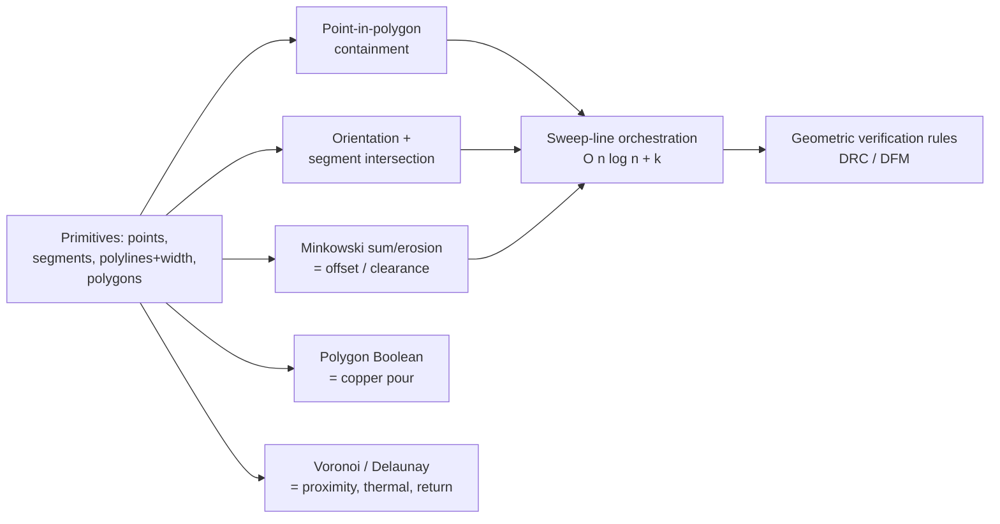
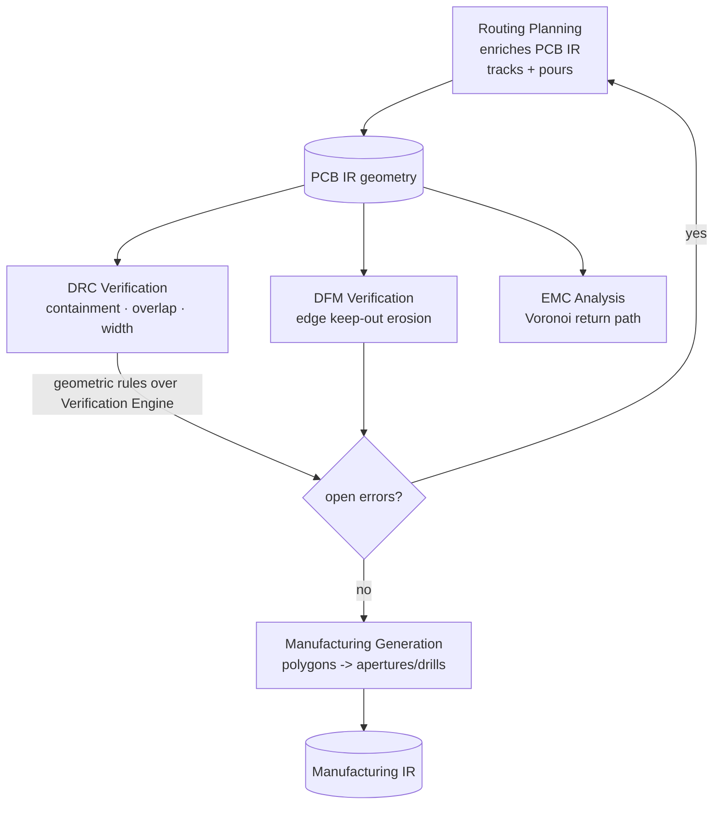

# Computational Geometry

**Summary.** Computational geometry is the branch of mathematics and computer science that studies algorithms for objects defined by their *shape and position* — points, line segments, polygons, and the operations on them (containment, intersection, distance, union, offset). It belongs in the Engineering Science Layer because a printed circuit board *is* geometry: every copper feature, clearance, courtyard, pour, and keep-out is a set of points in the plane R², and almost every physical-domain verdict the runtime issues is, underneath, a geometric predicate. This document grounds the runtime's physical-domain reasoning — the [PCB IR](../../docs/compiler/ir/pcb-ir.md)'s `Track / Routing` and `Footprint` geometry, the [Routing Planning](../../docs/state-machines/routing-planning.md) phase, the geometric rules of [DRC](../../docs/state-machines/drc-verification.md)/[DFM](../../docs/state-machines/dfm-verification.md) verification, copper-pour generation, and the lowering to [Manufacturing IR](../../docs/compiler/ir/manufacturing-ir.md). When the runtime asks "does this courtyard fit on the board?", "are these two traces too close?", or "does this pour short two nets?", it is asking a computational-geometry question, and the correctness of the answer is the correctness of the board.

---

## Core principles

### Copper as geometry: the planar model

Every physical feature reduces to one of a few primitives in the plane (with a layer index for the third, discrete dimension):

- A **point** `p = (x, y)` — a pad center, via center, vertex.
- A **segment** `s = (p₀, p₁)` — a track centerline run, a board-edge edge.
- A **polyline with width** — a track. A centerline polyline of width `w` is geometrically the *Minkowski sum of the polyline with a disk of radius w/2* (a "stadium"/capsule per segment): the true copper occupies every point within `w/2` of the centerline.
- A **polygon** (possibly with holes) — a courtyard, a board outline, a copper pour, a keep-out region. Holes are encoded by winding/orientation (outer boundary counter-clockwise, holes clockwise).

All clearances, overlaps, and containments are then set operations on these primitives. The runtime keeps every coordinate as a typed [Physical Quantity](../../docs/engineering/units-and-quantities.md) on an integer sub-micron grid, never a bare float (see [Numerical robustness](#numerical-robustness) and [P9](../../docs/foundation/principles.md)).

### Point-in-polygon (containment)

Does point `p` lie inside polygon `P`? Two standard, equivalent-for-simple-polygons predicates:

- **Ray casting / crossing number** — shoot a ray from `p` to infinity; count edge crossings. Odd ⇒ inside, even ⇒ outside. O(n) per query for an n-vertex polygon.
- **Winding number** — sum the signed angles subtended by the edges; non-zero ⇒ inside. Handles self-overlapping polygons correctly where the parity rule does not.

```text
inside(p, P):                      # crossing-number form
  c = false
  for each edge (a, b) of P:
    if ((a.y > p.y) != (b.y > p.y)) and
       (p.x < (b.x - a.x) * (p.y - a.y) / (b.y - a.y) + a.x):
      c = not c
  return c
```

The decisive engineering subtlety is the **boundary case**: a point *exactly on* an edge is neither strictly inside nor outside. The runtime must fix one convention (open set vs. closed set) and apply it everywhere, because a courtyard whose edge coincides with the board outline must get a single, deterministic verdict.

### Segment intersection and the orientation predicate

The atom of nearly every geometric test is the **orientation** (signed-area) predicate:

```text
orient(a, b, c) = sign( (b.x - a.x)*(c.y - a.y) - (b.y - a.y)*(c.x - a.x) )
  > 0  left turn (counter-clockwise)
  < 0  right turn (clockwise)
  = 0  collinear
```

Two segments `(p₁,p₂)` and `(p₃,p₄)` properly intersect iff `p₃,p₄` straddle the line of `p₁p₂` **and** vice-versa, i.e. `orient(p₁,p₂,p₃) ≠ orient(p₁,p₂,p₄)` and `orient(p₃,p₄,p₁) ≠ orient(p₃,p₄,p₂)`. Collinear-overlap is a separate case handled by interval tests. This O(1) predicate, applied with an axis-aligned **bounding-box (AABB) quick reject**, is what decides whether two tracks cross, whether two courtyards overlap, and whether a track exits the board.

### Distance, clearance, and Minkowski sums

The **Minkowski sum** of two sets is `A ⊕ B = { a + b : a ∈ A, b ∈ B }`. Two facts make it the workhorse of clearance reasoning:

1. **Offsetting = sum with a disk.** "Grow polygon `P` outward by `r`" is exactly `P ⊕ D(r)` where `D(r)` is a disk of radius `r`: straight edges translate outward, convex corners become circular arcs. "Shrink by `r`" is the **Minkowski erosion** `P ⊖ D(r)` (inward offset). A keep-out of width `r` around an obstacle is its offset; the board-edge keep-out is the *erosion* of the board outline.
2. **Clearance ⇔ intersection of an offset.** Two features `A`, `B` satisfy clearance `c` iff `dist(A, B) ≥ c`, which holds iff the grown region `A ⊕ D(c)` does **not** intersect `B`. So "is the clearance respected?" becomes "do these two (offset) polygons intersect?" — solvable with the orientation predicate above.

For convex polygons, `A ⊕ B` is computed in O(n+m) by merging edge vectors in angular order; for general (non-convex) polygons it is built from convex pieces. PCB tooling exploits this for trace-to-trace spacing, pad-to-pad clearance, and keep-out generation, where the "disk" radius is the required clearance.

```text
# two parallel tracks, centerlines d apart, widths w1 and w2, required clearance c
edge_gap = d - (w1/2) - (w2/2)        # copper-to-copper distance
respects_clearance = (edge_gap >= c)  # NOT (d >= c): centerlines mislead by (w1+w2)/2
```

This worked form is exactly why widths must be carried per net class: with `w1 ≠ w2`, the centerline distance `d` over-states the true gap by `(w1+w2)/2`, and a check written against centerlines silently passes a board that is short in copper.

### Polygon clipping and Boolean operations (copper pours)

A copper pour (ground/power plane fill) is the result of a **Boolean chain** on polygons:

```text
pour = (region ∩ board_usable_area)            # clip to allowed area
       − ⋃ (obstacle_i ⊕ D(clearance_i))       # subtract every grown obstacle
       − ⋃ thermal_relief_spokes_negative      # carve thermal reliefs
then drop_islands(connectivity_to_source)       # remove copper not joined to the net
```

The set operations (union ∪, intersection ∩, difference −) on polygons are computed by **polygon-clipping** algorithms (the Vatti, Weiler–Atherton, and Greiner–Hormann families): edges are split at every intersection, then output rings are traced according to a **fill rule** (even-odd or non-zero winding). General clipping runs in O((n+k) log n) for n edges and k intersections. Two outputs matter physically: the **fill rule** decides what counts as "inside" when boundaries overlap, and the **connectivity/island pass** removes copper not electrically tied to the pour's net — floating copper that would otherwise act as an unintended antenna.

### Voronoi diagrams and Delaunay triangulation (proximity, thermal, return path)

Given a set of *sites* (pads, vias, pins), the **Voronoi diagram** partitions the plane into cells, one per site, where a cell is the locus of points closer to that site than to any other. Its straight-line dual is the **Delaunay triangulation**, which maximizes the minimum triangle angle and obeys the **empty-circumcircle** property (no site lies inside any triangle's circumcircle). Both are computable in O(n log n). They give the runtime three reasoning tools:

- **Nearest-neighbour and closest-pair clearance** — the closest pair of sites is always a Delaunay edge, so the tightest spacing in a cloud of features is found without all-pairs comparison.
- **Thermal catchment** — a thermal via's Voronoi cell approximates the copper area it draws heat from; balanced cells imply balanced heat spreading. This links to [heat transfer](../physics/thermal-physics.md).
- **Return-path reasoning** — high-frequency return current flows in the reference copper directly beneath/around the signal, choosing the nearest low-impedance path; the Voronoi partition of reference vias/stitches approximates how return current is shared, which is the geometric substrate of [Maxwell's equations](../physics/maxwell-equations.md) and impedance control.

### Medial axis and largest empty circle (spacing headroom)

The **medial axis** of a polygon is the locus of centers of all maximal inscribed disks — equivalently, a subset of the Voronoi diagram of the polygon's edges. It answers "how much room is there *inside* a region?" The radius of the largest inscribed disk at a point is the local clearance headroom, which the runtime uses to reason about whether a track of a given net-class width can fit through a channel between two obstacles, and where a fanout via has the most slack. The **largest empty circle** over a set of sites (its center is a Voronoi vertex or lies on the convex hull) locates the emptiest spot for an added via or test point. Both reduce a "can it fit / where is there space" question to a closest-feature distance, computed once in O(n log n) and queried in O(log n), instead of trial-and-error placement.

### Sweep-line algorithms (how DRC scales)

Comparing every feature against every other is O(n²) — untenable for boards with tens of thousands of segments. A **plane sweep** moves an imaginary line across the board, keeping an ordered **active set** of features the line currently crosses; only geometric neighbours in that ordering are ever compared. The Bentley–Ottmann sweep reports all `k` segment intersections in O((n+k) log n), and a sweep over feature intervals finds all clearance-violating pairs in O(n log n + k) instead of O(n²).


*Figure: the geometric primitives and the sweep-line that composes them into scalable design-rule evaluation.*

### Numerical robustness

Geometry is exact in theory and fragile in floating point: a near-collinear `orient()` can flip sign, producing a self-contradictory topology (a pour that does not close, an intersection reported then denied). The disciplines are: snap all coordinates to an **integer grid** (sub-micron), use **exact / adaptive-precision predicates** for `orient()` and in-circle tests so their *sign* is always correct, and define a single tolerance for "touching". This is what makes the geometry layer satisfy determinism ([P4](../../docs/foundation/principles.md)): the same board must always yield the same verdict, bit-for-bit, on every machine. See [numerical methods](./numerical-methods.md) for the underlying error analysis.

---

## Why it matters for electronics & PCB design

The physical correctness of a board is overwhelmingly a geometric question:

- **Shorts and opens** are geometry. Two nets touch (a short) iff their copper polygons intersect; a net is open iff its track polyline fails to connect its pads. Both are Boolean/intersection tests.
- **Manufacturability limits are clearances.** Minimum trace width, minimum spacing, annular ring, edge clearance, and acid-trap angles are all "distance ≥ limit" or "angle ≥ limit" predicates — Minkowski/offset and orientation tests.
- **Signal integrity is proximity.** Controlled impedance, crosstalk, and return-path discontinuity depend on how near copper is to its reference and its neighbours — Voronoi/Delaunay and distance reasoning ([Maxwell's equations](../physics/maxwell-equations.md), [Ohm's law](../electrical/ohms-law.md)).
- **Thermal performance is area.** How much copper a hot part can dump heat into is the area of a pour region and the catchment of thermal vias — polygon area (Boolean) and Voronoi partition.
- **Fabrication output is geometry.** Gerber apertures, drill files, and solder-mask layers are literally polygons and flashes; a Boolean error in the pour is a Boolean error in the shipped artifact.

Get the geometry wrong and the board is wrong in copper — which is unrecoverable after fabrication.

---

## Mapping to the runtime

This is the layer's purpose: each geometric principle is embodied by a concrete EAK artifact, and violating the principle is an engineering bug in that artifact.

| Geometric principle | Runtime artifact that embodies it | Why a violation is a runtime bug |
|---|---|---|
| **Point-in-polygon containment** | `drc-out-of-bounds` rule in [DRC Verification](../../docs/state-machines/drc-verification.md): *every placement courtyard must lie within the board outline*. | If containment is computed wrongly, a part hanging off the edge passes DRC and the board cannot be assembled. |
| **Segment intersection / open-set overlap** | `drc-courtyard-overlap` rule (AABB, **open-set**) in [DRC Verification](../../docs/state-machines/drc-verification.md): no two same-side courtyards overlap. | A wrong intersection test either passes physically colliding parts or false-fails abutting parts, blocking a valid design. The *open-set* choice is exactly the boundary convention from [Core principles](#point-in-polygon-containment). |
| **Minkowski erosion (inward offset)** | The **board-edge keep-out** (Phase-3 increment 9), **fabrication-sourced**: containment is checked against `outline ⊖ D(edge_clearance)`, with the clearance read from a `Fabrication` requirement, not hard-coded. See [DFM Verification](../../docs/state-machines/dfm-verification.md) and the [Constraint Engine](../../docs/engineering/constraint-engine.md). | If the erosion radius or its source is wrong, copper sits too near the routed edge and is sheared off in depaneling. Sourcing it from a `Fabrication` constraint keeps the *policy* (the number) separate from the *mechanism* (the geometry) per [P7](../../docs/foundation/principles.md). |
| **Polyline-with-width + Minkowski clearance** | **Per-net-class trace widths** (increment 10): each [Track](../../docs/compiler/ir/pcb-ir.md) carries the width of its net class, and `drc-trace-width` checks it against the fabrication **process floor**. Widths are typed [Physical Quantities](../../docs/engineering/units-and-quantities.md). | A track is copper of width `w` (a stadium), not a zero-width line; computing clearance from the centerline alone under-counts by `w/2` per side and ships a short. |
| **Polygon Boolean / island removal** | Copper-**pour** generation enriching the [PCB IR](../../docs/compiler/ir/pcb-ir.md) `Track / Routing` during [Routing Planning](../../docs/state-machines/routing-planning.md) (exposed as the `run_pour` capability). | A Boolean error merges two nets (a short) or leaves floating islands (an EMC antenna / DFM defect). The connectivity pass is what makes a pour electrically meaningful. |
| **Connectivity as set separation** | The **regulator VIN/VOUT rail split** (increment 11): the previously collapsed power rail becomes two distinct nets, each its own copper geometry. Completeness is guarded by `drc-unrouted-net` and net realization in [Routing Planning](../../docs/state-machines/routing-planning.md). | If pour/clip geometry let VIN and VOUT copper touch, the regulator's input and output short — a destructive bug. Keeping them as disjoint polygon sets is the geometric statement of "two nets." |
| **Voronoi / Delaunay proximity** | Thermal-spreading and **return-path** reasoning consumed by [EMC Analysis](../../docs/state-machines/emc-analysis.md) and the [Planning Engine](../../docs/engineering/planning-engine.md) when proposing routing and reference stitching. | Mis-estimating nearest reference or thermal catchment yields impedance discontinuities and hot spots that only surface in hardware. |
| **Sweep-line evaluation** | The geometric rule pass of the [Verification Engine](../../docs/engineering/verification-engine.md) that DRC/DFM specialize — it must scale to real boards in deterministic, idempotent runs ([P4](../../docs/foundation/principles.md)). | An O(n²) or non-deterministic evaluation either fails to terminate at scale or yields different verdicts across runs, breaking replay. |
| **Geometry → manufacturing lowering** | The transformation from [PCB IR](../../docs/compiler/ir/pcb-ir.md) to [Manufacturing IR](../../docs/compiler/ir/manufacturing-ir.md) in [Manufacturing Generation](../../docs/state-machines/manufacturing-generation.md) ([transformations](../../docs/compiler/transformations.md)). | Apertures and drills are the *same* polygons; any Boolean inconsistency upstream is faithfully fabricated into defective copper. |

Two structural points tie this to the architecture. First, geometric constraints (clearance, keep-out, edge clearance) are stored and checked by the [Constraint Engine](../../docs/engineering/constraint-engine.md) as machine-checkable predicates over [PCB IR](../../docs/compiler/ir/pcb-ir.md) geometry — the engine is the home of the *numbers*, the geometry layer is the home of the *math*. Second, all of this respects [P6](../../docs/foundation/principles.md): the [Engineering State](../../docs/GLOSSARY.md#engineering-state) holds one canonical geometric model, and each IR (PCB, Manufacturing) is a projection of it — the courtyard checked by DRC and the aperture flashed by the fab are the *same* polygon, not two drifting copies.


*Figure: how the geometric model flows from Routing through verification gates to the fabricated Manufacturing IR.*

---

## Failure modes if violated

- **Non-robust predicates → non-deterministic verdicts.** A floating-point `orient()` that flips sign on near-collinear input makes DRC pass on one machine and fail on another, breaking replay and [P4](../../docs/foundation/principles.md). The fix is integer grids and exact-sign predicates; absent it, the geometry layer is unsound.
- **Boundary-convention drift.** If `drc-out-of-bounds` treats "on the edge" as inside but `drc-courtyard-overlap` treats "touching" as not overlapping, the two rules disagree about the same coincident geometry, and the gate result depends on which ran. A single open/closed convention is mandatory.
- **Clearance from centerline, not copper.** Treating a track as a zero-width segment under-measures spacing by `w/2` per side; with per-net-class widths this error is rule-dependent and ships intermittent shorts. Clearance must be the Minkowski/offset distance between full copper bodies.
- **Wrong offset shape (AABB instead of true Minkowski).** Using a bounding box for a keep-out over-clears in some directions and under-clears at convex corners, producing either acid traps (too tight) or unroutable boards (too loose).
- **Boolean pour errors.** A clip that merges adjacent regions shorts nets — catastrophic for the VIN/VOUT split (increment 11); a clip that omits the island pass leaves floating copper that radiates and fails EMC/DFM. Self-intersecting input polygons make the winding rule undefined and fill garbage.
- **Eroded edge keep-out mis-sourced.** If the board-edge erosion radius is hard-coded instead of read from the `Fabrication` requirement (increment 9), the runtime silently encodes one fab's process into every design and ships copper that a stricter fab shears off — a [P7](../../docs/foundation/principles.md) (policy-in-mechanism) violation.
- **Untyped coordinates.** Mixing millimetres and mils without typed [Physical Quantities](../../docs/engineering/units-and-quantities.md) yields a 25.4× clearance error — a class of bug [P9](../../docs/foundation/principles.md) exists to make impossible.
- **Quadratic evaluation.** A naïve all-pairs DRC is correct but does not terminate on real boards; the sweep-line is not an optimization luxury but the condition for the verification phase to run at all.

---

## Related documents

- Sibling Engineering Science — [graph theory](./graph-theory.md) (nets/connectivity as graphs, the dual of pour separation), [numerical methods](./numerical-methods.md) (robust predicates and error bounds), [Maxwell's equations](../physics/maxwell-equations.md) and [heat transfer](../physics/thermal-physics.md) (the physics the proximity geometry approximates), [Ohm's law](../electrical/ohms-law.md) (width/area to resistance).
- Runtime anchors — [PCB IR](../../docs/compiler/ir/pcb-ir.md) · [Manufacturing IR](../../docs/compiler/ir/manufacturing-ir.md) · [Transformations](../../docs/compiler/transformations.md) · [Routing Planning](../../docs/state-machines/routing-planning.md) · [DRC Verification](../../docs/state-machines/drc-verification.md) · [DFM Verification](../../docs/state-machines/dfm-verification.md) · [EMC Analysis](../../docs/state-machines/emc-analysis.md) · [Manufacturing Generation](../../docs/state-machines/manufacturing-generation.md) · [Verification Engine](../../docs/engineering/verification-engine.md) · [Constraint Engine](../../docs/engineering/constraint-engine.md) · [Planning Engine](../../docs/engineering/planning-engine.md) · [Units & quantities](../../docs/engineering/units-and-quantities.md) · [Principles](../../docs/foundation/principles.md) · [Engineering domain model](../../docs/foundation/engineering-domain-model.md) · [Glossary](../../docs/GLOSSARY.md).
