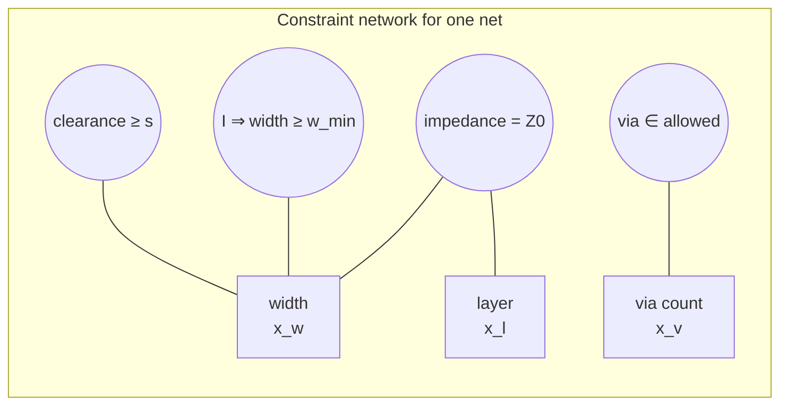
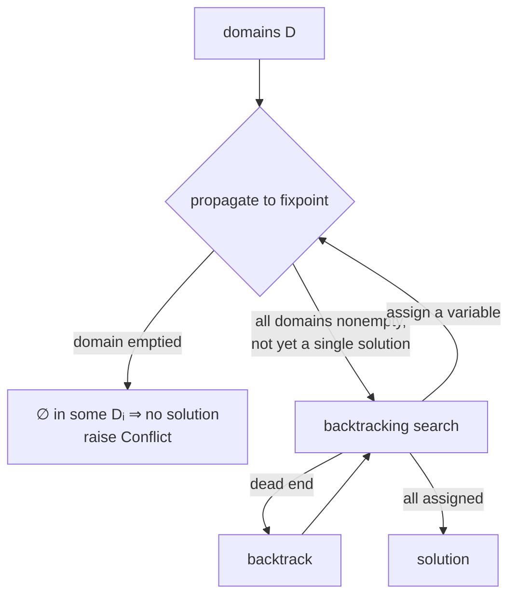
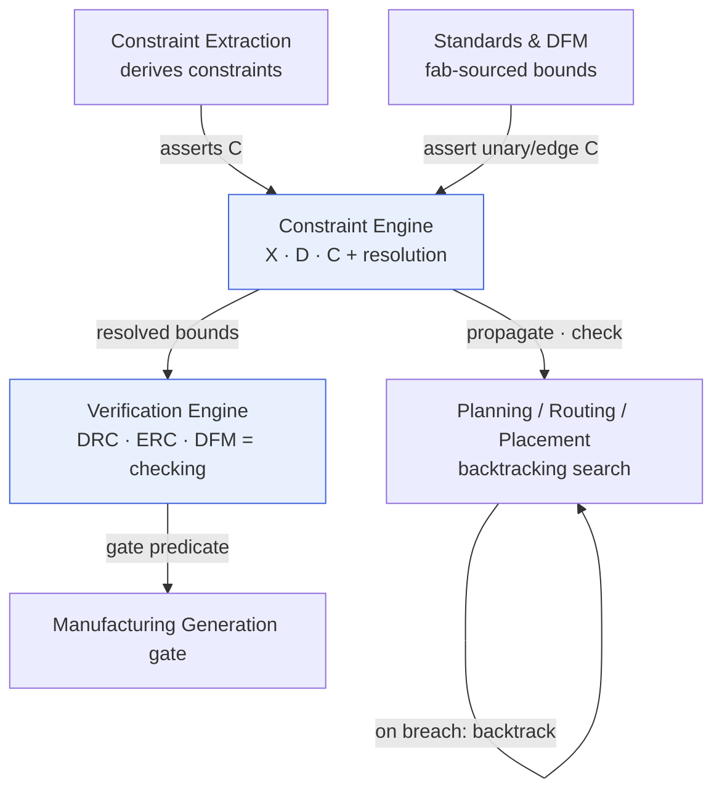

# Constraint Satisfaction

**Summary.** A *constraint satisfaction problem* (CSP) is the mathematics of deciding whether values can be assigned to a set of variables so that a body of restrictions all hold simultaneously — and, if so, finding such an assignment. This document belongs in the Engineering Science Layer because the entire EAK design-rule apparatus — DRC, ERC, DFM, and the constraint store every planning phase checks against — *is* a constraint network, even though the runtime never says so out loud. It grounds the [Constraint Engine](../../docs/engineering/constraint-engine.md) (store / resolve / check), the [Verification Engine](../../docs/engineering/verification-engine.md) (rule → violation → gate), and the search-shaped planning phases ([Routing Planning](../../docs/state-machines/routing-planning.md), [Component Placement](../../docs/state-machines/component-placement.md)). The central engineering claim it justifies: because EAK's variables range over **finite, bounded domains** and its rules reduce to **decidable comparisons of [physical quantities](../../docs/engineering/units-and-quantities.md)**, both *checking* a design and *searching* for one are decidable, terminating, and reproducible — which is the precondition for the manufacturing gate being a trustworthy, deterministic function.

---

## Core principles

### The formal object

A finite-domain CSP is a triple `⟨X, D, C⟩`:

- `X = {x₁, …, xₙ}` — a finite set of **variables**.
- `D = {D₁, …, Dₙ}` — for each variable `xᵢ`, a finite **domain** `Dᵢ` of candidate values.
- `C = {c₁, …, cₘ}` — a set of **constraints**. Each constraint `cⱼ = ⟨Sⱼ, Rⱼ⟩` has a *scope* `Sⱼ ⊆ X` (the variables it touches) and a *relation* `Rⱼ ⊆ ∏_{xᵢ∈Sⱼ} Dᵢ` (the tuples it permits).

An **assignment** `a` gives each variable a value from its domain. `a` *satisfies* `cⱼ` iff its projection onto the scope, `a|Sⱼ`, lies in `Rⱼ`. `a` is a **solution** iff it satisfies every constraint. Two decision problems must be kept rigorously apart, because EAK runs both:

| Problem | Question | Complexity | EAK incarnation |
|---------|----------|------------|-----------------|
| **Satisfaction (search / synthesis)** | Does *any* solution exist? Produce one. | NP-complete (finite domains, general) | planning a routing/placement that meets all rules |
| **Checking (verification)** | Given a *complete* assignment, is it a solution? | Polynomial — evaluate `m` predicates | DRC/ERC/DFM evaluating the realized design |

This split is the spine of the whole document: **synthesis is hard but decidable; verification is easy and decidable.** EAK assigns the hard half to planning engines and the easy half to the Verification Engine, and never confuses them.

*Figure: a single routed net as variables (width, layer, vias) bound by clearance, ampacity, impedance, and via constraints — one cell of the larger network.*

### Consistency: the local-to-global ladder

A network can be made **consistent** at increasing levels before, or instead of, full search. Consistency *prunes domains* by removing values that provably cannot participate in any solution.

- **Node consistency (1-consistency).** Every value in `Dᵢ` satisfies the *unary* constraints on `xᵢ`. A board-edge keep-out forbidding a region is a unary spatial constraint: node consistency deletes the forbidden positions from a component's domain outright.
- **Arc consistency (2-consistency, binary constraints).** A value `a ∈ Dᵢ` is arc-consistent w.r.t. a binary constraint `c_ij` iff it has a **support**: some `b ∈ Dⱼ` with `(a, b) ∈ R_ij`. The constraint is arc-consistent iff every value in `Dᵢ` and `Dⱼ` has a support; the network is arc-consistent iff all its constraints are. It is enforced by repeatedly applying `REVISE(xᵢ, xⱼ)` — delete from `Dᵢ` every value lacking a support in `Dⱼ` — until nothing changes (the classic worklist procedure runs in `O(e·d³)` for `e` constraints and domain size `d`).
- **Generalized arc consistency (GAC).** The same idea for `n`-ary constraints: `a ∈ Dᵢ` is supported iff it extends to a full tuple in `Rⱼ` using the *current* domains of the other scope variables. GAC is what a clearance constraint over three coupled tracks needs.
- **Path / k-consistency.** Path consistency (3-consistency) guarantees that any consistent pair extends to any third variable; strong `k`-consistency generalizes this. Higher consistency prunes more but costs more, so it is used selectively.

### Propagation is a fixpoint — and that is why it is order-independent

Each `REVISE` is a **monotone, contracting** operator on the lattice of domain tuples ordered by set inclusion: it only ever *removes* values, never adds them. The composition of such operators has, by the Knaster–Tarski theorem, a **unique greatest fixpoint** — the consistency closure — and the **order** in which constraints are revised does not change the final domains, only the work done to reach them (the procedure is *confluent*). 

This is not a curiosity; it is the theorem that licenses the runtime's two checking modes:

- **Batch (gate-time)** evaluation and **incremental (continuous)** evaluation must reach the **same** verdict, or live diagnostics would disagree with the manufacturing gate.
- Re-checking only the constraints whose scope touches a changed entity (the Constraint Engine's *applicability index*) is sound *precisely because* propagation is confluent: a partial re-run lands on the same fixpoint as a full run.

*Figure: the propagate → search → backtrack loop; an emptied domain is a proof of unsatisfiability, surfaced rather than patched over.*

### Search: backtracking, with propagation interleaved

Arc consistency alone is **sound but incomplete**: a network can be arc-consistent yet have no solution (the classic counterexample is 3-colouring a triangle with two colours). To *decide* satisfiability in general you must search. **Backtracking** is depth-first assignment of one variable at a time, retreating whenever a constraint is violated; on finite domains it is complete and terminating. Interleaving propagation after each assignment yields **forward checking** and **maintaining arc consistency (MAC)**, which prune the tree dramatically. Standard ordering heuristics — **minimum-remaining-values** (assign the most-constrained variable first), **degree**, and **least-constraining-value** — change the *cost* of search but never its *decidability*.

### A worked propagation: clearance and ampacity on one net

Take a single signal net with two variables and the realized geometry of its neighbours fixed. Let the width variable `x_w` have domain `D_w = {0.10, 0.15, 0.20, 0.25} mm` (the discrete fab catalogue) and the offset-from-neighbour variable `x_g` have domain `D_g = {0.12, 0.18, 0.25} mm`. Two constraints apply:

- **Ampacity** (from the net's current `I`): `x_w ≥ 0.18 mm`. As a *unary* constraint, node consistency deletes `0.10` and `0.15`, leaving `D_w = {0.20, 0.25}`.
- **Edge-coupled clearance**: the copper-to-copper gap `x_g` minus half the extra width must stay `≥ 0.20 mm`, i.e. a *binary* relation coupling `x_w` and `x_g`. `REVISE(x_g, x_w)` removes any `x_g` value with no supporting `x_w`; here `0.12` and `0.18` lose their support against the surviving widths, leaving `D_g = {0.25}`.

Propagation has narrowed two domains *without any search*, and crucially it stopped at a fixpoint with non-empty domains — the net is still satisfiable, now with one forced clearance value. Had the ampacity floor been `≥ 0.30 mm`, node consistency would have emptied `D_w` immediately: a **Conflict**, proved locally, before search ever began.

### Soundness, completeness, and why both matter

Propagation is **sound**: every value it deletes provably appears in no solution, so it never removes a legal design. It is **incomplete**: a fully arc-consistent network with all domains non-empty may still have no solution, because arc consistency reasons only pairwise. Search restores completeness. The runtime exploits both halves deliberately — cheap propagation prunes and *proves* the easy unsatisfiabilities (emptied domains → Conflicts) at edit time, while the planning phases pay for completeness with backtracking search only when propagation alone cannot decide. Confusing the two — e.g. treating an arc-consistent-but-unsearched network as "solved" — would let a board that *cannot* be routed appear feasible until late, expensive search exposes it.

### Global constraints

A **global constraint** captures a relation over an arbitrary number of variables together with a *dedicated propagator* that achieves GAC far more efficiently than the same relation decomposed into pairwise constraints. The canonical examples map straight onto PCB engineering:

- `alldifferent(x₁,…,xₖ)` — every variable distinct; GAC via bipartite matching (Régin). Decomposing it into pairwise `≠` loses pruning power. *EAK use:* unique reference designators.
- `no-overlap` / `diffn` — a set of rectangles must not intersect. *EAK use:* component courtyards in [placement](../../docs/state-machines/component-placement.md); copper-to-copper non-intersection in routing.
- `cumulative` — tasks sharing a bounded resource never exceed capacity. *EAK use:* current/thermal budgets on a shared rail or copper pour.

### Why consistency is *decidable* in this domain

General constraint theories are **not** decidable — first-order arithmetic over the integers with multiplication is undecidable (Matiyasevich). EAK escapes that ceiling on two independent grounds, and both must hold:

1. **Finite, bounded domains.** Every EAK variable ranges over a finite set: layer ∈ a finite stack-up, net class ∈ a finite catalogue, track geometry on a **manufacturing grid** (the fab's resolution makes position and width discrete and bounded), component placement on a bounded board likewise discretized. A finite product of finite domains is finite, so the search tree is finite — satisfaction is decidable (terminating and complete), if NP-hard.
2. **Decidable predicates.** Every DRC/ERC/DFM rule reduces to a *quantifier-free comparison* (`≤, ≥, =, ≠`) between [physical quantities](../../docs/engineering/units-and-quantities.md) — rationals carrying units, at finite precision. A finite conjunction of decidable comparisons is decidable. Hence **checking** a realized design is a polynomial, terminating, deterministic evaluation — never a search, never a semi-decision.

Together these make the verdict a **total computable function** of the design: the same design always yields the same violation set, which is exactly the [determinism and replay](../../docs/foundation/principles.md) guarantee the runtime is built on.

---

## Why it matters for electronics & PCB design

Design rules are not advisory taste; they are the discretized shadow of physics. A clearance rule is [Maxwell's field](../physics/maxwell-equations.md) breakdown and creepage rendered as a geometric inequality; a minimum trace width is [Ohm's-law](../electrical/ohms-law.md) ampacity and IR-drop rendered as `width ≥ f(current)`. Treating the whole rule deck as a CSP gives electronics design four things it otherwise lacks:

- **A single semantics for "the design is legal."** Legal ⇔ the realized assignment satisfies every constraint relation. No rule is special-cased; clearance, ampacity, annular ring, and creepage are all just relations in `C`.
- **A principled meaning for "not yet decidable."** A net with no track has an *unbound* variable, not a *violated* one. The CSP frame distinguishes "domain not yet narrowed to a value" from "value violates a constraint" — the runtime's `indeterminate` versus `violated`.
- **Locality of recompute.** Because the network is sparse (most constraints touch few entities), a change propagates only along the constraint graph's edges — the basis of live DRC without re-solving the board.
- **An honest notion of over-constraint.** When propagation empties a domain, *no* assignment can satisfy the rules; the correct engineering response is to relax a requirement or reformulate the model, never to invent a value. The CSP gives that situation a name (global inconsistency) and a proof (the emptied domain).

---

## Mapping to the runtime

This is the load-bearing section: each CSP notion is embodied by a concrete EAK artifact, and violating the notion would be a runtime bug.

### The Constraint Engine *is* the constraint store `C` plus resolution

The [Constraint Engine](../../docs/engineering/constraint-engine.md) holds the constraint set, computes applicability by scope, and checks subsets — exactly `⟨X, D, C⟩` with an applicability index over the scopes `Sⱼ`. Its **resolution** step (source authority → specificity → restrictiveness, yielding the *governing bound*) is the deterministic reduction of several overlapping constraints on one entity to a single effective relation — the CSP operation of *constraint conjunction / most-restrictive intersection*. Its three deterministic precedence tiers exist so this reduction is a function, not a choice; a non-deterministic resolution would break the confluence the engine relies on for incremental checking. Its `indeterminate` result is the CSP's *unbound variable* (a net without a routed [track](../../docs/foundation/engineering-domain-model.md#track--routing)); collapsing `indeterminate` into `pass` would be the runtime equivalent of declaring an unsupported value a solution — an engineering bug that ships unverified copper.

### Continuous checking *is* incremental propagation to a fixpoint

The engine's design to "re-check only the constraints affected by a change" is incremental arc/GAC propagation; its correctness rests on the fixpoint being **order-independent**. The [Verification Engine](../../docs/engineering/verification-engine.md) inherits the same property for its continuous-versus-gate-time modes: the [principles](../../docs/foundation/principles.md) require live diagnostics (computed in the engine, [shown by the UI](../../docs/foundation/principles.md)) to match the authoritative gate-time run. If the two diverged, propagation would not be confluent — a direct contradiction of the math above and a reportable defect.

### A *Conflict* is an emptied domain; the engine must refuse to fabricate a bound

The Constraint Engine raises a **Conflict** for an unsatisfiable set (e.g. an impedance target no available stack-up can meet under a thickness limit) and, by contract, *never invents a compromise bound*. That is precisely the CSP discipline: an empty domain after propagation is a **proof** of global inconsistency, and the only sound responses are reformulate or relax. The runtime surfacing the conflict to the engineer — rather than picking a value — is the engine honouring soundness over convenience.

### Verification rules are constraint *checking*, and the gate inherits decidability

DRC, ERC, and DFM are specializations of the [Verification Engine](../../docs/engineering/verification-engine.md): each supplies a rule set (a slice of `C`) and a state scope (a slice of `X`), and the engine evaluates the *complete* realized assignment — the polynomial **checking** problem, not search. The **manufacturing gate** ("open error-severity violations ⇒ cannot transition to [Manufacturing Generation](../../docs/state-machines/manufacturing-generation.md)") is therefore a pure predicate over a finite conjunction of decidable comparisons — total and computable by construction. The recently hardened **unrouted-net DRC rule** is a *completeness constraint*: it asserts every net's [connections](../../docs/foundation/engineering-domain-model.md#connection) are realized — the CSP requirement that no variable is left unbound at solution time. Without it, an `indeterminate` (unbound) net could masquerade as `pass` and slip through the gate.

### Routing and Placement *are* the satisfaction (search) half

[Routing Planning](../../docs/state-machines/routing-planning.md) is a CSP search: the variables are per-net layer, width, via, and differential-pair choices; the domains are the finite layer set, the discrete width catalogue, and the via menu; the constraints are clearance, ampacity, and impedance. Its `ValidatingRouting → PlanningRouting` loop on a "width breach / unrealized net" is **backtracking** — re-plan the offenders and re-propagate — and its being the loop-back target for *both* DRC and EMC failures is search resuming after a deeper constraint check fails. [Component Placement](../../docs/state-machines/component-placement.md) is the `no-overlap`/`diffn` global constraint over courtyards. The [Planning Engine](../../docs/engineering/planning-engine.md) is the shared search/propagation machinery these phases drive.

### The three recent increments, read as CSP operations

- **Per-net-class trace widths (increment 10).** A *parametric domain per variable group*: each net class carries its own width domain `D_class`, so the width variable of every net inherits its class's permitted values. This is the CSP modelling pattern of *domain templates by class*, replacing one global width with a finite family of class-scoped domains — tighter domains, more pruning, fewer false `indeterminate`s.
- **Board-edge keep-out, fab-sourced (increment 9).** A **unary spatial constraint** whose bound is sourced from the [DFM](../../docs/state-machines/dfm-verification.md) fabrication process rather than guessed. Node consistency deletes the forbidden edge band from every placeable/routable variable's domain up front — cheap, and it shrinks the search space before any binary propagation runs.
- **Regulator VIN/VOUT rail split (increment 11).** A **model reformulation that restores satisfiability.** A single collapsed power net carried *contradictory* voltage-domain constraints (input rail and output rail at once) — an emptied domain, an inherent Conflict. Splitting it into two variables (VIN, VOUT), each with its own consistent domain, makes the previously unsatisfiable network satisfiable. This is the textbook CSP move of *introducing variables to remove an over-constraint*, and it is why the split is a correctness fix, not cosmetics.

*Figure: extraction writes `C`, the Constraint Engine propagates/resolves, planning searches, verification checks, and the gate is the terminal decidable predicate.*

---

## Failure modes if violated

- **Treating `indeterminate` as `pass`.** Conflating an unbound variable (net with no track) with a satisfied constraint lets unverified design through the gate. The [Constraint](../../docs/engineering/constraint-engine.md) and [Verification](../../docs/engineering/verification-engine.md) engines must keep `indeterminate` first-class; the unrouted-net rule enforces completeness.
- **Order-dependent propagation.** If incremental re-checking does not converge to the same fixpoint as a full run, live diagnostics and the gate disagree — a violation of confluence and of the [reproducibility principle](../../docs/foundation/principles.md). The cure is to keep every domain operator monotone and contracting (removal-only).
- **Fabricating a bound to dodge a Conflict.** Filling an emptied domain with an invented value is unsound: it asserts a solution the constraints prove cannot exist. The engine's contract — *surface the conflict, never invent* — is the runtime obeying CSP soundness.
- **Unbounded or continuous domains.** Letting a variable range over a non-discretized continuum (un-gridded geometry, an open numeric range) breaks the finite-domain premise and forfeits the termination guarantee — search may not halt. The manufacturing grid and finite catalogues exist to preserve decidability.
- **Undecidable predicates.** A rule expressed as anything beyond a comparison of [physical quantities](../../docs/engineering/units-and-quantities.md) (e.g. an unbounded nonlinear arithmetic assertion) leaves the decidable fragment, and the gate stops being a total function. Rules must stay quantifier-free comparisons.
- **Global constraint decomposed naively.** Expressing `no-overlap` or `alldifferent` as scattered pairwise constraints loses pruning and can let an unsatisfiable placement look locally consistent, deferring the failure to expensive late search — or missing it.

---

## Related documents

- Engineering-Science siblings: [`../mathematics/graph-theory.md`](graph-theory.md) (the constraint/net graph the propagation traverses) · [`../physics/maxwell-equations.md`](../physics/maxwell-equations.md) (the field physics behind clearance/creepage bounds) · [`../electrical/ohms-law.md`](../electrical/ohms-law.md) (the ampacity/IR-drop physics behind width bounds)
- Runtime engines: [`constraint-engine`](../../docs/engineering/constraint-engine.md) · [`verification-engine`](../../docs/engineering/verification-engine.md) · [`planning-engine`](../../docs/engineering/planning-engine.md) · [`units-and-quantities`](../../docs/engineering/units-and-quantities.md) · [`standards-and-compliance`](../../docs/engineering/standards-and-compliance.md)
- Phases (state machines): [`constraint-extraction`](../../docs/state-machines/constraint-extraction.md) · [`routing-planning`](../../docs/state-machines/routing-planning.md) · [`component-placement`](../../docs/state-machines/component-placement.md) · [`drc-verification`](../../docs/state-machines/drc-verification.md) · [`erc-verification`](../../docs/state-machines/erc-verification.md) · [`dfm-verification`](../../docs/state-machines/dfm-verification.md) · [`manufacturing-generation`](../../docs/state-machines/manufacturing-generation.md)
- Foundations: [`engineering-domain-model`](../../docs/foundation/engineering-domain-model.md) (Constraint, Rule, Violation, Net, Track) · [`principles`](../../docs/foundation/principles.md) (determinism, reproducibility) · [`GLOSSARY`](../../docs/GLOSSARY.md)
