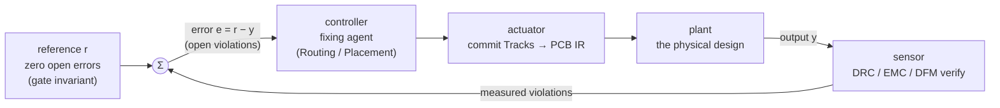
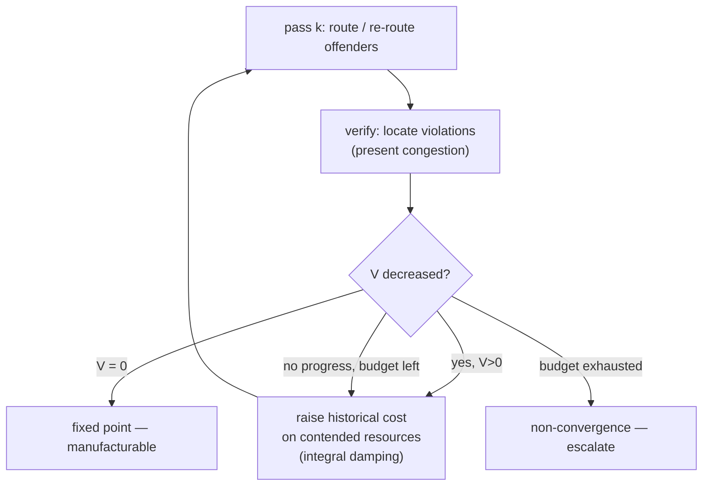
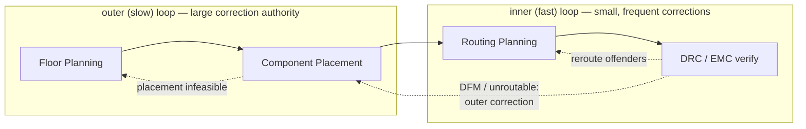

# Control Theory

> **Layer:** Engineering Science (the "why" beneath the runtime). **Domain:** Mathematics.

**Summary.** Control theory is the mathematics of systems that *act, measure, and correct* — feedback loops that drive a process toward a desired state and keep it there despite disturbance. This document belongs in the Engineering Science Layer because the EAK pipeline is not the linear "intent → manufacturing" arrow it first appears to be: it is a **closed-loop feedback system**. The verification phases ([DRC](../../docs/state-machines/drc-verification.md), [EMC](../../docs/state-machines/emc-analysis.md), [DFM](../../docs/state-machines/dfm-verification.md)) are *sensors* that measure the design's output; the [manufacturing gate](../../docs/engineering/verification-engine.md) is the *comparator* that computes the error against the reference "zero open error-severity [violations](../../docs/foundation/engineering-domain-model.md#violation)"; and the fixing phases ([Routing Planning](../../docs/state-machines/routing-planning.md), [Component Placement](../../docs/state-machines/component-placement.md)) are *controllers* that emit a corrective action — the **DRC↺Routing**, **EMC↺Routing**, and **DFM↺Placement** loop-backs the [Workflow Orchestrator](../../docs/core/workflow-orchestration.md) owns. This grounds three runtime facts the kernel silently assumes: (1) iterative refinement is a *control law*, so the same questions a control engineer asks — does it converge? does it oscillate? is it damped? — are exactly the questions that decide whether a board routes or the runtime thrashes forever; (2) rip-up-and-retry is a discrete-time iteration toward a **fixed point**, and a fixed point with an empty violation set is precisely a manufacturable design; and (3) because that fixed point is *not* guaranteed to exist or be reachable, the loop must be **bounded** and the bound must be *stated*, not silent ([P13](../../docs/foundation/principles.md)). Control theory tells the runtime when iteration is converging, when it is merely oscillating, and when to stop and ask a human.

---

## Core principles

### 1. The closed loop and its negative-feedback law

A feedback controller compares a measured output `y` to a reference (setpoint) `r`, forms the **error** `e = r − y`, and applies a control action that drives `e` toward zero. When the action *reduces* the error it is **negative feedback** — the stabilizing kind. Mapping the standard block diagram onto a verification loop-back:


*Figure: one verification loop-back drawn as a textbook negative-feedback control loop; the gate is the summing comparator that forms the error signal.*

The loop is **negative** feedback exactly when each corrective pass *removes more violations than it introduces*. If a reroute that clears one clearance error creates two new ones, the loop has, for that step, **positive** feedback — error grows — and the system is locally unstable. Stability is therefore not a given; it is a property the control structure must *engineer*.

### 2. Discrete time: the loop is an iterated map, not a continuous integrator

The EAK loop is **discrete-time**: nothing happens between verification runs; each loop-back is one *sample*. The entire inner refinement is an iterated map

```text
d_{k+1} = T(d_k)         # one refinement step
T = (route/place offenders) ∘ (verify, locate violations)
```

where `d_k` is the design state (the [PCB IR](../../docs/compiler/ir/pcb-ir.md)) after the k-th pass. A design that survives verification unchanged is a **fixed point**:

```text
T(d*) = d*    and    violations(d*) = ∅      ⇔   d* is manufacturable
```

So "the board is done" and "the iteration reached a fixed point" are the *same statement*. Everything control theory says about fixed-point iteration applies directly.

### 3. Convergence: contraction and Lyapunov (monotone-progress) arguments

Two classical guarantees tell us *when* such an iteration reaches its fixed point.

**Contraction mapping (Banach).** If `T` is a contraction on a complete metric space — there exists a Lipschitz constant `L < 1` with `dist(T(x), T(y)) ≤ L · dist(x, y)` — then `T` has a *unique* fixed point and iteration converges **geometrically**:

```text
dist(d_k, d*) ≤ L^k · dist(d_0, d*)      # error shrinks by factor L each pass
```

`L` is the **loop gain**. `L < 1` means each pass undoes a fixed fraction of the remaining error: fast, monotone, guaranteed. `L ≥ 1` permits the error to persist or grow — divergence or oscillation.

**The catch for PCB design:** routing and placement are *combinatorial and discrete*, so a literal metric contraction rarely holds. Convergence is instead argued with a **Lyapunov / potential-function** condition — the discrete analogue. Define a non-negative scalar "energy"

```text
V(d) = Σ  w(s) · (open violations of severity s)        # weighted defect potential
V(d) = 0   ⇔   d is at the manufacturable fixed point
```

The loop is guaranteed to terminate at a solution iff **every accepted step strictly decreases the potential**, `V(d_{k+1}) < V(d_k)`. A strictly decreasing, lower-bounded integer-valued potential cannot decrease forever, so it must reach `0` (success) or get *stuck* above `0` (no admissible improving move — the signal to escalate). This monotone-progress requirement is the real convergence law the runtime depends on; the contraction picture is the intuition behind it.

### 4. Rip-up-and-retry, oscillation, and damping

The canonical PCB control law is **rip-up-and-retry** (negotiated-congestion routing, PathFinder-style): route nets, *measure* the resources they over-use (the violations), *raise the cost* of contended resources, then rip up the offenders and re-route under the new cost surface. Decomposed in controller terms, the per-resource cost has two parts that behave like the two stabilizing terms of a PI controller:

| Cost term | Control analogue | Effect |
|-----------|------------------|--------|
| **present congestion** (cost of *this* pass's overuse) | proportional (P) | reacts to the current error; alone it lets two nets swap the same track forever |
| **historical congestion** (cost accumulated over *all past* passes) | integral (I) | accumulates past error; a chronically contended resource becomes monotonically more expensive until one net is forced to yield |

The historical term is the **damping**. Without it, the loop is a pure proportional controller with no memory: net A takes the track, B is ripped up and re-takes it next pass, A is ripped up... a sustained **limit cycle** (oscillation) that never reaches the fixed point even though one exists. The monotonically increasing historical penalty is a *ratchet* — it tilts the potential surface a little more against the contested resource every pass, breaking the symmetry and guaranteeing the tie is eventually decided. This is why the historical-cost term is not an optimization nicety but a **stability requirement**.


*Figure: rip-up-and-retry as a damped discrete control loop; the historical-cost ratchet is the integral term that suppresses limit-cycle oscillation.*

Two further damping levers reduce the effective loop gain `L`:

- **Localized correction (low gain).** Re-plan *only the offending nets* rather than the whole board (the [Routing Planning](../../docs/state-machines/routing-planning.md) `ValidatingRouting → PlanningRouting` "re-plan offenders" transition). Touching less of the design per pass injects less disturbance, trading speed for stability — the discrete cousin of turning down controller gain.
- **Hysteresis / no churn for ties.** Do not rip up a net that is merely *equal*-cost on an alternative; require a strict improvement. This prevents zero-progress thrashing — directly the `V_{k+1} < V_k` strictness above.

### 5. Cascade (hierarchical) control: nested fast and slow loops

When the inner loop cannot converge because the *placement itself* makes the board unroutable, no amount of rerouting helps — the feasible set is empty for that placement. The runtime resolves this with **cascade control**: a fast inner loop nested inside a slower outer loop with greater correction authority.


*Figure: cascade control — the DRC↺Routing / EMC↺Routing inner loop runs many fast passes; only when it cannot converge does control escalate to the slower DFM↺Placement (and, beyond it, Floor Planning) outer loop.*

The outer loop fires *rarely* and moves *more* (re-place, re-floorplan); the inner loop fires *often* and moves *little* (reroute a few nets). Mixing the timescales — letting every clearance nit trigger a full re-placement — would itself be an unstable design.

### 6. Bounded iteration: the watchdog that makes the loop a *total* function

Because `T` is not a provable contraction and the feasible set may be empty, **termination is not guaranteed by the mathematics**. A control system that might run forever is not a control system; it is a hang. The runtime therefore wraps every loop with a **finite iteration budget** (a maximum loop-back count) acting as a watchdog:

```text
for k in 0 .. K_max:          # K_max is a stated, finite bound
    if V(d_k) == 0: return SUCCESS(d_k)        # reached the fixed point
    d_{k+1} = T(d_k)
return ESCALATE(d_{K_max})     # non-convergence: hand to the outer loop / a human
```

Bounded iteration matters for two independent reasons:

1. **Liveness / termination.** The bound converts a *partial* function (may not return) into a *total* one (always returns success or a deliberate non-convergence outcome). The runtime must always either make progress or *stop on purpose* — never spin silently.
2. **Non-convergence detection.** Hitting `K_max` is not a failure of the bound; it is the **diagnostic signal** that the problem is over-constrained — the inner loop's fixed point with `V = 0` does not exist or is unreachable. That signal is what *triggers* the cascade escalation (Section 5) or a [human-in-the-loop](../../docs/engineering/human-in-the-loop.md) decision (relax a constraint, accept a [waiver](../../docs/engineering/verification-engine.md), or re-place). Without a bound there is no signal — just a board that never finishes.

Per [P13 — Document the Why](../../docs/foundation/principles.md), this bound is **stated, never a silent cap**: "if something is bounded, it is stated." A hidden iteration limit that quietly returns the best-so-far design would mask non-convergence as success — the most dangerous failure a verification system can have.

### 7. Determinism: the control law must be a function of recorded state

A feedback law is only reproducible if it is a deterministic function of measured state. The EAK requires the *whole loop* to replay identically ([P4 — Determinism by Default](../../docs/foundation/principles.md), ADR-0009): same project history ⇒ same iteration sequence ⇒ same fixed point. An agent may use stochastic *reasoning* to propose a corrective route, but its output is **recorded**, so on replay the loop traverses exactly the same trajectory `d_0, d_1, … , d*`. Uncontrolled randomness in the control law would make convergence — and therefore the gate result — non-deterministic, which the architecture forbids.

---

## Why it matters for electronics & PCB design

- **Routing is the original feedback problem.** Auto-routers have used negotiated-congestion (rip-up-and-retry with historical cost) for decades precisely because greedy one-shot routing leaves the last few nets unroutable; the integral-damping ratchet is what lets the hardest nets find room. A runtime that drives routing without this structure inherits the oscillation it was invented to cure.
- **Verification *is* the sensor.** A PCB's "output" — does it meet clearance, does a trace radiate, can the fab build it — is not directly observable; it is *computed* by [DRC/EMC/DFM](../../docs/engineering/verification-engine.md). The fidelity and *margin* of that measurement (see [numerical-methods](numerical-methods.md): every analysis is an approximation with an error budget) sets how trustworthy the error signal is. A noisy or biased sensor destabilizes any loop.
- **Stability has a physical cost.** Each loop-back pass is real compute and, under [supervised autonomy](../../docs/engineering/human-in-the-loop.md), real human attention. An under-damped loop that oscillates burns both. Bounded, damped iteration is what makes autonomous board design *economically* terminating, not just theoretically.
- **The feasible set can be genuinely empty.** Some placements simply cannot be routed; some constraint sets contradict (see [constraint-satisfaction](constraint-satisfaction.md)). Control theory names this honestly — no fixed point exists — and prescribes the right response: escalate authority (cascade) or relax the reference, rather than iterate into the void.

---

## Mapping to the runtime

This section is the point of the layer: which concrete EAK artifacts *are* this control system, and why violating the principle is an engineering bug.

- **The loop topology lives in the [Workflow Orchestrator](../../docs/core/workflow-orchestration.md).** Its workflow plan is literally a feedback graph: solid forward edges plus the dotted **`DRC -.-> Routing`**, **`EMC -.-> Routing`**, and **`DFM -.-> Placement`** loop-back edges. The orchestrator's documented "convergence safeguards" — *"loop-back cycles are bounded/observed so a design cannot oscillate forever silently; repeated failures escalate to the engineer"* — are Section 6's bounded-iteration watchdog and Section 5's cascade escalation, verbatim. **Bug if violated:** an unbounded or unrecorded loop-back is exactly the orchestrator's "Oscillating loop-back" failure mode; removing the bound would let a non-convergent project hang the runtime.
- **The comparator is the [Verification Engine](../../docs/engineering/verification-engine.md) gate.** "Open errors (with no valid waiver) ⇒ cannot manufacture" is the summing junction `e = r − y` with `r = ∅`. The gate is a **pure function of the violation set** — and that purity is what makes the error signal well-defined and the loop replayable. **Bug if violated:** a gate that depended on hidden state (or passed a design with open errors) would feed a corrupt error signal back into the controller, steering iteration toward a non-manufacturable fixed point.
- **The inner controller is [Routing Planning](../../docs/state-machines/routing-planning.md).** Its `ValidatingRouting → PlanningRouting` ("unrealized net / width breach → **re-plan offenders**") transition is Section 4's *localized, low-gain* correction; its re-entry on `DRCFailed` / `EMCFailed` is the loop-back closing. **Bug if violated:** re-planning the *entire* board on every minor breach (high gain) would invite oscillation; never re-planning would leave the loop open and the violation permanent.
- **The outer controller is [Component Placement](../../docs/state-machines/component-placement.md) (then [Floor Planning](../../docs/state-machines/pcb-floor-planning.md)).** The `DFM -.-> Placement` and "unroutable → loop back to placement" paths are the slow cascade loop of Section 5. **Bug if violated:** routing a board the placement makes infeasible is iterating an empty-feasible-set inner loop forever — the watchdog plus this outer edge is the only correct exit.
- **The controller is *synthesized* by the [Planning Engine](../../docs/engineering/planning-engine.md); the reference comes from the [Constraint Engine](../../docs/engineering/constraint-engine.md).** A [reasoning plan](../../docs/engineering/planning-engine.md) is the corrective action `u_k`; the resolved [constraints](../../docs/engineering/constraint-engine.md) (clearances, widths, keep-outs) *are* the setpoint the loop drives toward. See [optimization-theory](optimization-theory.md) for how that controller chooses among feasible actions.
- **Concrete reference values the inner loop tracks — the implemented increments:**
  - **Per-net-class trace widths** (Inc 10) are *setpoints*: each net class carries a required ampacity/impedance width. A width breach detected in `ValidatingRouting` or DRC is a non-zero error that the reroute controller must null out by widening or re-pathing. The per-class width is the `r` the width loop converges to.
  - **The board-edge keep-out** (Inc 9, fabrication-sourced DFM clearance) is a *hard reference boundary*. A track or part inside it is a DFM error that feeds the `DFM↺Placement` outer loop — a corrective relocation, not a reroute, because edge proximity is usually a placement decision.
  - **The regulator VIN/VOUT rail split** (Inc 11) is a *structural corrective action* in a higher loop: collapsing both regulator sides onto one net is a defect a verification finding exposes; splitting the rail is the controller move that removes it. It illustrates that not every corrective action is a reroute — some are topology edits emitted upstream.
- **The fixed point is the precondition for [Manufacturing Generation](../../docs/state-machines/manufacturing-generation.md).** The terminal phase may only run from `V(d*) = 0` — the converged, gate-clear design. **Bug if violated:** generating fab outputs from a non-fixed-point (open-error) design ships a defect; the gate-before-manufacture invariant is the loop's stopping condition made enforceable.
- **Determinism of the loop is an [ADR-0009](../../docs/decisions/0009-determinism-and-replay-strategy.md) / [P4](../../docs/foundation/principles.md) obligation.** Every pass, violation status change, and loop-back is an [Event](../../docs/core/workflow-orchestration.md); the trajectory replays exactly. **Bug if violated:** a non-deterministic control law makes the same project converge differently across runs — verification becomes irreproducible.

---

## Failure modes if violated

- **Unbounded loop (no watchdog).** A non-convergent project iterates forever; the runtime hangs instead of escalating. This is the orchestrator's "oscillating loop-back" pathology and the direct violation of Section 6.
- **Silent cap.** A hidden iteration limit that returns best-so-far as if successful masks non-convergence as a pass — a [P13](../../docs/foundation/principles.md) violation and the most dangerous outcome, because an unmanufacturable board reaches the fab.
- **Un-damped loop (proportional only).** Rip-up-and-retry without the historical-cost integral term limit-cycles: the same two nets swap the same resource indefinitely, `V` never reaching zero though a solution exists.
- **Excessive loop gain.** Re-planning the whole board per minor breach perturbs already-good regions, so each pass creates roughly as many violations as it clears (`L ≥ 1`) — apparent thrash, no monotone progress.
- **Timescale inversion.** Letting trivial inner-loop errors trigger the slow outer loop (full re-placement) couples the loops badly and destabilizes both — the cascade-separation principle of Section 5 violated.
- **Corrupt or biased sensor.** A verification check with the wrong margin (or a falsely-passing indeterminate solve) feeds a wrong error signal; the loop converges confidently to a non-manufacturable point. See the indeterminate-not-pass rule in [numerical-methods](numerical-methods.md) and the [Verification Engine](../../docs/engineering/verification-engine.md).
- **Non-deterministic control law.** Stochastic, unrecorded controller moves break replay ([P4](../../docs/foundation/principles.md)); convergence and the gate result become irreproducible across runs.
- **Iterating an empty feasible set.** Driving the inner loop on a placement that cannot be routed will never converge; without the cascade escalation edge the watchdog merely caps a hopeless search instead of correcting the real cause.

---

## Related documents

- [`mathematics/optimization-theory.md`](optimization-theory.md) — the corrective action each control step *chooses* is a step in a constrained search; convergence here is the loop wrapped around that search.
- [`mathematics/constraint-satisfaction.md`](constraint-satisfaction.md) — when the feasible set is empty, no zero-violation fixed point exists; this is the infeasibility the bounded loop must detect.
- [`mathematics/numerical-methods.md`](numerical-methods.md) — every sensor reading (thermal/SI/PI/EMC) is an approximation with an error budget; sensor fidelity sets loop trustworthiness.
- [`mathematics/graph-theory.md`](graph-theory.md) — the routing resource graph over which rip-up-and-retry negotiates congestion.
- Runtime: [`core/workflow-orchestration.md`](../../docs/core/workflow-orchestration.md) · [`engineering/verification-engine.md`](../../docs/engineering/verification-engine.md) · [`state-machines/routing-planning.md`](../../docs/state-machines/routing-planning.md) · [`state-machines/drc-verification.md`](../../docs/state-machines/drc-verification.md) · [`state-machines/emc-analysis.md`](../../docs/state-machines/emc-analysis.md) · [`state-machines/dfm-verification.md`](../../docs/state-machines/dfm-verification.md) · [`state-machines/component-placement.md`](../../docs/state-machines/component-placement.md) · [`engineering/planning-engine.md`](../../docs/engineering/planning-engine.md) · [`engineering/constraint-engine.md`](../../docs/engineering/constraint-engine.md) · [`engineering/human-in-the-loop.md`](../../docs/engineering/human-in-the-loop.md) · [`foundation/principles.md`](../../docs/foundation/principles.md)
