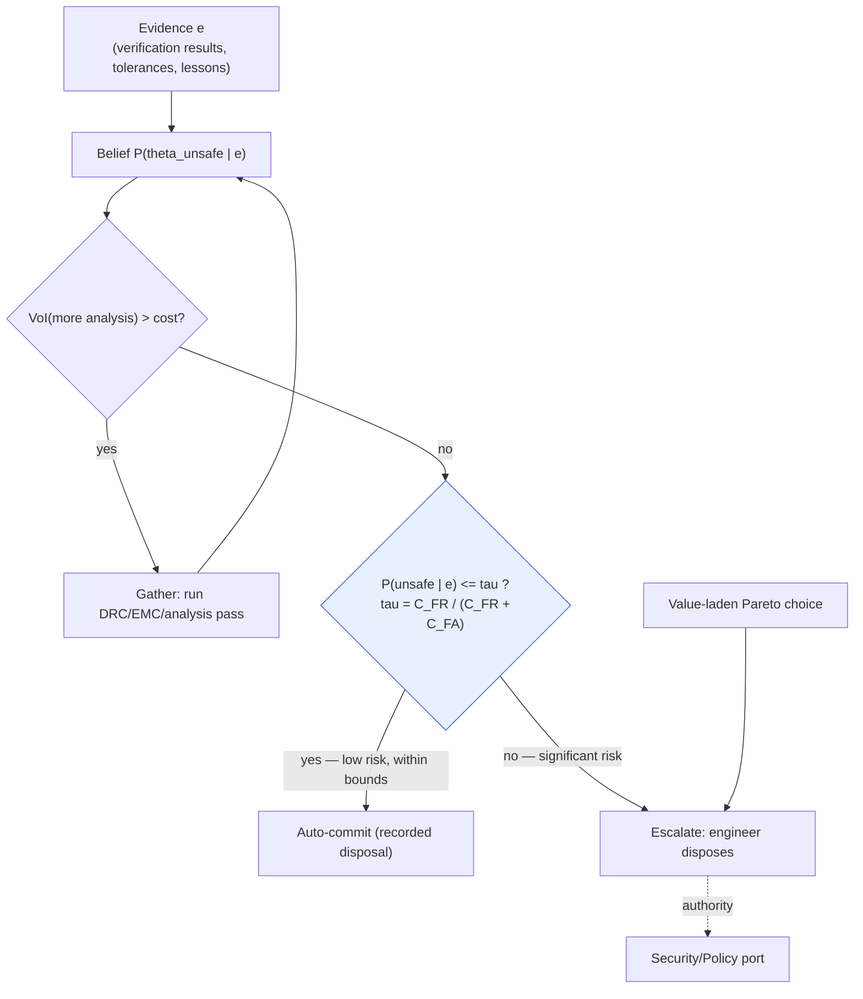
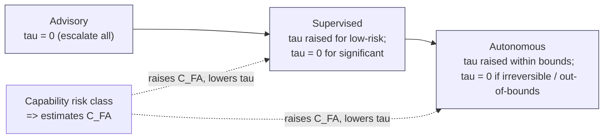

# Decision Theory

**Summary.** Every gate in the EAK runtime is a decision under uncertainty with competing objectives: should this proposed routing be auto-committed or shown to the engineer? Is this design fit to enter manufacturing? Is a known violation acceptable to waive? Decision theory is the mathematics of choosing an action when the true state of the world is unknown and outcomes carry asymmetric value — it supplies *utility*, *expected loss*, *risk thresholds*, *value of information*, and *Pareto selection*. This document belongs in the Engineering Science Layer because the runtime never says "I am minimizing expected loss," yet the [Autonomy Levels](../../docs/engineering/human-in-the-loop.md) (advisory → supervised → autonomous), the propose/dispose seam ([P10](../../docs/foundation/principles.md)), the [Verification Engine's](../../docs/engineering/verification-engine.md) error/warning/info severity, the manufacturing gate, and the [Waiver](../../docs/engineering/verification-engine.md) mechanism are all *decision rules* whose correctness is a decision-theoretic property. It grounds one runtime concept above all: **autonomy-level gating and human-in-the-loop escalation** — the rule that decides, for each proposal, whether the runtime may dispose autonomously or must escalate to a human. Where [optimization-theory](./optimization-theory.md) answers "what is the best feasible design?", decision theory answers the orthogonal question "given that the answer is uncertain and the costs are lopsided, *who decides, when, and at what risk threshold?*"

---

## Core principles

### 1. The decision problem

A decision problem is the tuple `(Θ, A, ℓ, P)`:

- **`Θ` — states of nature.** The unknown true world: the actual thermal margin of a hot part, whether two parallel tracks really couple above the EMC limit, the true supplier lead time, whether a clearance that *passed nominal* still passes under fabrication tolerance.
- **`A` — actions.** What the decider may do: `auto-commit` the proposal, `escalate` to the engineer, `gather` more evidence (run another analysis pass), `waive` a violation, `reject`.
- **`ℓ : A × Θ → ℝ` — loss** (negatively, **utility** `u = −ℓ`). The consequence of taking action `a` when the state is actually `θ`.
- **`P` — belief over `Θ`.** Ideally a *posterior* `P(θ | e)` conditioned on the evidence `e` already in hand (verification results, datasheet parameters with tolerances, prior lessons).

Three regimes are distinguished, and the runtime treats them differently:

| Regime | What is known | Normative rule |
|--------|---------------|----------------|
| **Certainty** | `θ` is known | pick `a` minimizing `ℓ(a, θ)` directly — a deterministic constraint check |
| **Risk** | `P(θ)` is known | minimize *expected* loss (§2) |
| **Uncertainty** (Knightian) | even `P` is uncertain | robust / worst-case rules (§4) |

### 2. Expected utility — the normative core

Under belief `P(θ|e)`, the **Bayes action** minimizes posterior expected loss:

```text
a* = argmin_{a ∈ A}  E_{θ ∼ P(·|e)}[ ℓ(a, θ) ]
   = argmin_{a ∈ A}  Σ_θ  ℓ(a, θ) · P(θ | e)
```

Equivalently, it maximizes **expected utility** `E[u(a, θ)]`. The von Neumann–Morgenstern theorem justifies the scalarization: any preference order over uncertain outcomes that is *complete, transitive, continuous,* and obeys *independence* is representable by a scalar utility function whose expectation the agent maximizes. This is *why* the runtime is entitled to reduce a tangle of risks and costs to one comparable number — and *why*, when those axioms do not hold (a genuinely multi-dimensional value judgement, §6), it must not.

**Risk attitude lives in the curvature of `u`.** A *concave* utility encodes risk aversion: the decider pays a premium (accepts a worse expected value) to avoid variance. Safety-critical engineering is risk-averse by construction — a small chance of a field failure outweighs a large chance of a slightly cheaper board.

### 3. Risk, cost, and the decision threshold

For a binary gate — `auto-commit` vs `escalate` — over two states (`θ₀` safe, `θ₁` unsafe), the loss matrix is asymmetric:

```text
              θ₀ (safe)      θ₁ (unsafe)
 auto-commit     0           C_FA     ← false accept: commit a bad design
 escalate      C_FR            0       ← false reject: interrupt the engineer needlessly
```

Auto-commit is the Bayes action iff its expected loss does not exceed escalation's:

```text
C_FA · P(θ₁|e)  ≤  C_FR · P(θ₀|e)
⇔  P(θ₁|e) / P(θ₀|e)  ≤  C_FR / C_FA          (posterior-odds form)
⇔  P(θ₁|e)  ≤  τ ,   with   τ = C_FR / (C_FR + C_FA)   (probability threshold)
```

This is the single most load-bearing result for the runtime: **the decision threshold `τ` is fixed by the cost ratio, not by the evidence.** Evidence moves `P(θ₁|e)`; the *bar it must clear* is a policy choice encoding how much worse a missed defect is than a false alarm. Two consequences the runtime depends on:

- As `C_FA → ∞` (a false accept is catastrophic — shipping a board with an open electrical error), `τ → 0`: the gate auto-passes **essentially never**. This is precisely the [Verification Engine](../../docs/engineering/verification-engine.md) manufacturing gate's zero-tolerance for open `error`-severity violations — a degenerate, correct decision threshold.
- As `C_FR → ∞` (escalation is ruinously expensive — alarm fatigue), `τ → 1`: the system stops asking. Useful autonomy lives strictly between these poles.

`risk = probability × consequence` is just the term `P(θ₁|e) · C_FA`; the threshold compares two such risk-weighted costs.

### 4. Uncertainty and worst-case posture

When `P` itself is unreliable — a part with no characterized tolerance, an un-modeled coupling path — expected-loss reasoning is unsound because the expectation is taken over a fabricated distribution. The robust rules apply:

```text
minimax loss:    a* = argmin_a  max_θ  ℓ(a, θ)
minimax regret:  a* = argmin_a  max_θ [ ℓ(a, θ) − min_{a'} ℓ(a', θ) ]
```

The runtime's safety-relevant margins are minimax devices: a current-derived trace width with a safety factor (see [ohms-law](../electrical/ohms-law.md)), a board-edge keep-out sized to the *worst-case* fabrication tolerance, an EMC separation chosen for the worst plausible coupling (see [maxwell-equations](../physics/maxwell-equations.md)). Each replaces "expected behavior" with "behavior under the adversarial state of nature," because the cost of being wrong is not symmetric.

### 5. Value of information — the formal basis of escalation

Escalating to a human, or running another analysis pass, *buys evidence at a cost*. Let `L₀ = min_a E[ℓ(a,θ)]` be the expected loss of acting on today's belief. Acquiring evidence source `E` lets the decision adapt to whatever `E` reveals; the post-acquisition expected loss is

```text
L_E = E_{e ∼ E} [  min_a  E[ ℓ(a, θ) | e ]  ]
VoI(E) = L₀ − L_E ≥ 0
```

`VoI ≥ 0` always — for a rational decider, more information never increases expected loss — but it is *bounded*, and may be smaller than the cost of obtaining it. The escalation rule is therefore:

```text
escalate / gather more  ⇔  VoI(E) > cost(E)
```

where `cost(E)` is engineer attention, latency, and the [Cost-budget](../../docs/engineering/human-in-the-loop.md) the autonomous action runs inside. This single inequality is what stops the runtime from either (a) silently deciding a high-stakes, easily-resolved question it should have asked, or (b) interrupting the engineer over something its own analysis would have settled cheaply.

### 6. Pareto selection is a value judgement, not a computation

When objectives genuinely compete — short wirelength **vs** low coupling, unit cost **vs** reliability margin — there is no a-priori scalar loss. The *Pareto set* (non-dominated actions; geometry and the ε-constraint method are in [optimization-theory](./optimization-theory.md)) contains many "correct" answers. Choosing one requires a preference/weight vector `w` that trades the axes off — and that vector encodes *human values*, not engineering facts. Decision theory's contribution here is a boundary, not a formula: **the runtime must not invent `w` for value-laden trade-offs; it must surface the frontier and let a human supply the utility.** This is the decision-theoretic content of [P10 — Humans Stay in Command](../../docs/foundation/principles.md).


*Figure: the gating decision — gather while information is worth more than it costs, then auto-commit only if residual risk clears the cost-ratio threshold `τ`; value-laden choices escalate unconditionally.*

---

## Why it matters for electronics & PCB design

- **Hardware costs are violently asymmetric.** A missed clearance or under-sized power trace becomes a fabricated, populated, possibly fielded board — `C_FA` is a respin, an RMA, or a safety event. A conservative margin wastes a little copper or board area — `C_FR` is small. Symmetric decision rules (threshold at 0.5) are therefore *wrong* for nearly every electronics gate; thresholds must lean hard toward catching defects.
- **Inputs are intrinsically uncertain.** Datasheet parameters carry tolerances ([units-and-quantities](../../docs/engineering/units-and-quantities.md), [P9](../../docs/foundation/principles.md)), supplier availability is stochastic, thermal and EMC behavior are estimated not measured. Treating a `3.3 V ±5 %` rail or a typical-only `R_DS(on)` as a point value is the classic decision error of mistaking uncertainty for certainty — it produces over-confident auto-passes.
- **Severity is a decision partition.** Classifying a finding as `error` / `warning` / `info` is a three-way map from evidence to gating consequence: `error` is the region of `P(θ₁|e)` so far above `τ` that the design is *blocked*; `warning` is "above the auto-commit bar but not blocking"; `info` is below. The partition only makes sense as a decision rule keyed on consequence.
- **Real designs sit on Pareto frontiers.** Decoupling-cap count vs cost, layer count vs crosstalk, footprint size vs assembly yield. Which point ships is the engineer's call; the tool's job is to *find the frontier* and *frame the trade*, not to silently pick.

---

## Mapping to the runtime

This is the point of this layer: where the theory above is literally embodied by EAK artifacts, and why breaking it is a runtime bug.

- **Autonomy levels are a decision policy over the threshold `τ`.** [human-in-the-loop](../../docs/engineering/human-in-the-loop.md) defines advisory / supervised / autonomous. Decision-theoretically, the active level *shifts `τ`*: advisory sets `τ = 0` for every design-significant action (escalate always — `C_FR` is treated as negligible relative to the cost of an unreviewed change); supervised raises `τ` for low-risk, easily-reversible actions while keeping `τ = 0` for "significant" changes, gate crossings, and waivers; autonomous raises `τ` further but still pins `τ = 0` for bound-exceeding or irreversible-by-nature actions. The level is the *policy*; the per-action [Capability](../../docs/engineering/human-in-the-loop.md) side-effect / risk class is the *consequence estimate* `C_FA`; the gate evaluates `P(θ₁|e) ≤ τ(level, capability)`. A high-impact capability forcing approval *even under autonomous* is exactly `C_FA` being large enough to drive `τ → 0` regardless of level. Hard-coding a fixed 0.5 threshold, or letting a level auto-commit an irreversible action, would be a decision bug.
- **"AI proposes, engineer disposes" is the disposal-as-decision seam.** The proposal is a [Decision](../../docs/foundation/engineering-domain-model.md#decision) with [Evidence](../../docs/foundation/engineering-domain-model.md#evidence); *disposal* (approve / reject / edit) is the act of selecting the Bayes action. For value-laden Pareto choices (§6) the human is the **utility oracle** the runtime is forbidden to impersonate. Auto-disposing such a choice violates [P10](../../docs/foundation/principles.md) and is the canonical decision-theory failure of "inventing `w`."
- **The manufacturing gate is the `C_FA → ∞` degenerate threshold.** The [Verification Engine](../../docs/engineering/verification-engine.md) invariant — *a design with open `error`-severity violations cannot enter [Manufacturing Generation](../../docs/state-machines/manufacturing-generation.md)* — is the `τ = 0` limit of §3 made deterministic. There is no expected-value argument that "buys" an open error; the loss is unbounded, so the threshold is zero. This is why the gate is a hard predicate, not a tunable score, and why [DRC](../../docs/state-machines/drc-verification.md)/[DFM](../../docs/state-machines/dfm-verification.md)/[EMC](../../docs/state-machines/emc-analysis.md) `Failed` outcomes loop back rather than proceed.
- **Waivers are recorded acceptance of residual risk.** A [Waiver](../../docs/engineering/verification-engine.md) is a decision that the residual expected loss of a *known* violation is acceptable — and the requirement that it be authorized at the right authority/[autonomy level](../../docs/engineering/human-in-the-loop.md) is the rule that **only a decider who owns the consequence may accept the risk**. An unauthorized waiver is an agent assigning itself a utility it does not own.
- **Severity = the three-way decision partition.** The Verification Engine's shared `error/warning/info` semantics and its `satisfied | violated | not-applicable | indeterminate` result are the partition of §"Why it matters." `indeterminate` (e.g. an unrouted net, feasibility unknown) is treated as *non-pass*, never auto-accepted — the decision-theoretic rule that an unknown state must be priced at its worst-case consequence under the minimax posture (§4), not optimistically.
- **Risk-derived thresholds are minimax margins (§4).** The implemented Phase-3 increments are decision rules in disguise: **per-net-class trace widths** ([routing-planning](../../docs/state-machines/routing-planning.md), [constraint-engine](../../docs/engineering/constraint-engine.md)) set width from current with a safety factor so the *worst-case* current still passes; the **fabrication-sourced board-edge keep-out** ([dfm-verification](../../docs/state-machines/dfm-verification.md)) sizes clearance to the worst-case edge tolerance; the **regulator VIN/VOUT rail split** was itself a *design decision under competing objectives* (rail integrity vs net simplicity) resolved by a multi-agent workflow — a Pareto selection that, once made, is a recorded constraint. Each margin replaces an expected value with a worst-case bound because `C_FA` dominates.
- **Recorded decisions replay; thresholds are not magic numbers.** A disposal, a chosen threshold `τ`, a selected Pareto weight `w`, and a waiver are all recorded [Events](../../docs/core/event-bus.md) backed by [Decisions](../../docs/foundation/engineering-domain-model.md#decision) with provenance ([P5](../../docs/foundation/principles.md)); given the same recorded reasoning outputs the gate re-decides identically ([P4](../../docs/foundation/principles.md)). A live, unrecorded threshold or an unseeded escalation choice would break replay — a determinism bug. [P13](../../docs/foundation/principles.md) forbids the silent cap: every threshold is a *stated* value with a rationale.
- **Learning updates the loss estimates.** Recorded rejections, waivers, and field outcomes feed the [Learning Engine](../../docs/engineering/learning-engine.md), which is Bayesian updating of the policy: an engineer overriding an auto-commit is evidence that `C_FA` for that capability class was under-estimated, lowering `τ`; repeated needless escalations raise it. The thresholds are a *learnable, recorded policy*, never frozen guesses.
- **The cost budget bounds the value-of-information loop (§5).** The [Scheduler](../../docs/core/workflow-orchestration.md) / cost-budget port caps how much analysis the runtime may run before deciding; this is the `cost(E)` term that makes `VoI(E) > cost(E)` a *finite* loop rather than an unbounded "analyze forever." A planning loop that re-analyzes without a VoI/budget stopping rule is the decision-theoretic cause of the routing/DRC loop-back oscillation called out in [optimization-theory](./optimization-theory.md).


*Figure: the autonomy dial is a monotone policy over the auto-commit threshold `τ`; per-capability consequence `C_FA` pulls `τ` back toward zero independently of the level.*

---

## Failure modes if violated

- **Symmetric loss where loss is asymmetric.** Gating at `τ = 0.5` (or any cost-blind bar) ships defects whenever `P(θ₁|e) < 0.5` despite a catastrophic `C_FA`. Fix: derive `τ` from the cost ratio; safety-critical capabilities pin `τ → 0` ([Verification Engine](../../docs/engineering/verification-engine.md) error-gate).
- **Autonomous commit of a value-laden choice.** The runtime picks a Pareto point (e.g. cost over reliability) the engineer never sanctioned — it has imposed its own utility, violating [P10](../../docs/foundation/principles.md). Fix: value-laden trade-offs escalate unconditionally; the human is the utility oracle.
- **Uncertainty treated as certainty.** Using typical-only datasheet values or nominal tolerances as point truth inflates confidence in `P(θ₀|e)` and produces over-confident auto-passes. Fix: carry tolerances as first-class [Physical Quantities](../../docs/engineering/units-and-quantities.md) and apply the minimax margin for safety-relevant bounds.
- **`indeterminate` collapsed to pass.** Pricing an unknown state (unrouted net, un-characterized part) as "safe" auto-accepts an un-evaluated risk. Fix: `indeterminate`/`not-applicable-unknown` is a non-pass at every gate; unknown states are priced at worst case.
- **Escalate-everything or escalate-nothing.** A threshold pinned at `τ = 0` for all actions (alarm fatigue → engineers rubber-stamp) or at `τ = 1` (silent over-autonomy → unsafe) both destroy the system's value. Fix: the VoI rule (§5) plus autonomy levels place `τ` between the poles per risk class.
- **Ignoring value of information.** Deciding a high-stakes question without the cheap analysis or human input that would have settled it (`VoI ≫ cost`, skipped), or analyzing/escalating endlessly when `VoI < cost`. Fix: gate the gather/escalate action on `VoI(E) > cost(E)`, bounded by the cost budget.
- **Unrecorded threshold or disposal.** A live, unlogged `τ`, weight, or approval breaks deterministic replay ([P4](../../docs/foundation/principles.md)) and provenance ([P5](../../docs/foundation/principles.md)) and constitutes a silent cap ([P13](../../docs/foundation/principles.md)). Fix: every threshold, weight, disposal, and waiver is a recorded [Decision](../../docs/foundation/engineering-domain-model.md#decision)/[Event](../../docs/core/event-bus.md) with rationale.
- **Waiver authorized below its consequence.** Accepting an `error`-severity risk at an authority that does not own the outcome is an agent assigning itself someone else's utility. Fix: waiver authority is bound to autonomy level and the [Security/Policy port](../../docs/engineering/human-in-the-loop.md); open-error waivers cannot be self-authorized autonomously.

---

## Related documents

- [optimization-theory](./optimization-theory.md) — finds the feasible Pareto frontier this document's decider *selects a point on*; ε-constraint geometry and scalarization weights.
- [constraint-satisfaction](./constraint-satisfaction.md) — the feasibility oracle (`satisfied/violated/indeterminate`) that supplies the evidence `e` the decision rule conditions on.
- [graph-theory](./graph-theory.md) — netlist/connectivity structure underlying the states of nature the gates reason about.
- [../electrical/ohms-law.md](../electrical/ohms-law.md) — why current-derived trace width with a safety factor is a minimax margin, not an average.
- [../physics/maxwell-equations.md](../physics/maxwell-equations.md) — the coupling/EMC uncertainty that makes worst-case EMC separation a minimax decision.
- Runtime: [human-in-the-loop](../../docs/engineering/human-in-the-loop.md) (autonomy levels, propose/dispose) · [verification-engine](../../docs/engineering/verification-engine.md) (severity, gate, waivers) · [constraint-engine](../../docs/engineering/constraint-engine.md) · [planning-engine](../../docs/engineering/planning-engine.md) · [learning-engine](../../docs/engineering/learning-engine.md) · [workflow-orchestration](../../docs/core/workflow-orchestration.md) (gates, cost budget) · [units-and-quantities](../../docs/engineering/units-and-quantities.md).
- State machines: [routing-planning](../../docs/state-machines/routing-planning.md) · [drc-verification](../../docs/state-machines/drc-verification.md) · [dfm-verification](../../docs/state-machines/dfm-verification.md) · [emc-analysis](../../docs/state-machines/emc-analysis.md) · [manufacturing-generation](../../docs/state-machines/manufacturing-generation.md).
- Foundation: [principles](../../docs/foundation/principles.md) (P4, P5, P10, P13) · [engineering-domain-model](../../docs/foundation/engineering-domain-model.md) (Decision, Evidence, Waiver) · [GLOSSARY](../../docs/GLOSSARY.md) · [event-bus](../../docs/core/event-bus.md).
