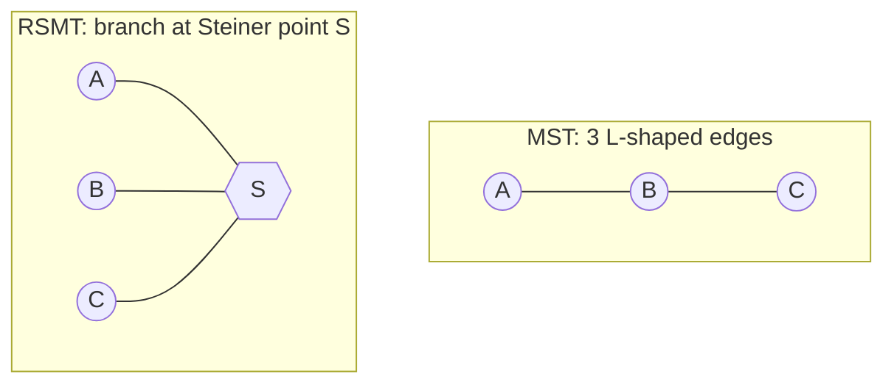
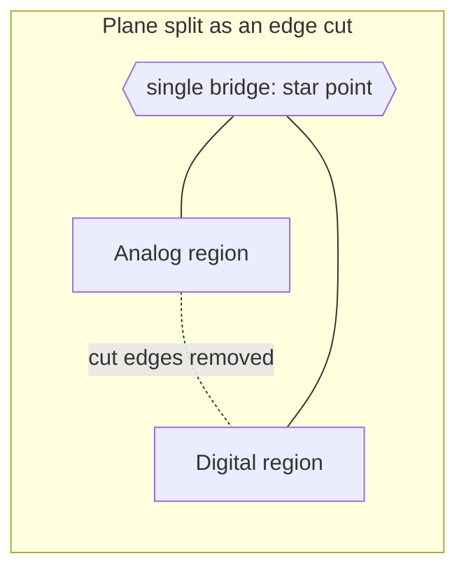

# Graph Theory

**Summary.** Graph theory is the branch of discrete mathematics that studies *vertices* (points) connected by *edges* (relations). It belongs in the Engineering Science Layer because the central objects the EAK runtime manipulates — a **netlist** and the **copper topology** that realizes it — *are* graphs, and almost every physical-design operation the runtime performs is a named graph algorithm in disguise. Connectivity is a connected-components query; "route this net with minimum copper" is a (rectilinear Steiner) minimum-tree problem; "find a path for this track" is single-source shortest path; "how many layers does this board need" is bounded below by graph thickness and solved as graph coloring; "where may a copper plane be split" is a cut-set / max-flow question. This document grounds the [PCB IR](../../docs/compiler/ir/pcb-ir.md) connectivity invariants, the [Routing Planning](../../docs/state-machines/routing-planning.md) phase, the unrouted-net rule in [DRC Verification](../../docs/state-machines/drc-verification.md), and the layer/plane reasoning behind [DFM](../../docs/state-machines/dfm-verification.md) and [EMC](../../docs/state-machines/emc-analysis.md). When the runtime asserts "every Net is realized, no shorts, no opens," it is asserting a theorem about graphs.

## Core principles

Before the formalism, a vocabulary bridge — every graph term below names an EAK domain object, so that the algorithms and the runtime speak one language (terms per [`../../docs/GLOSSARY.md`](../../docs/GLOSSARY.md) and the [domain model](../../docs/foundation/engineering-domain-model.md)):

| Graph-theory term | EAK / PCB meaning |
|-------------------|-------------------|
| Vertex | A [Pin](../../docs/foundation/engineering-domain-model.md#pin)/pad, a via, or a routing-grid cell |
| Edge | A copper segment (or a legal adjacency in the routing grid) |
| Hyperedge | A [Net](../../docs/foundation/engineering-domain-model.md#net) (equipotential class of ≥ 2 pins) |
| Connected component | One electrically continuous copper island |
| Spanning / Steiner tree | The minimal copper topology realizing a net |
| Edge weight | Length, via penalty, congestion, per-net-class width feasibility |
| Planar subgraph / coloring | What fits on one copper layer / layer assignment |
| Edge cut-set | Where a copper plane is split (analog/digital, rail domains) |

### 1. Two graphs, one design: the logical hypergraph and the physical graph

A [Net](../../docs/foundation/engineering-domain-model.md#net) is, by definition, an *electrical equivalence class of pins*: every [Pin](../../docs/foundation/engineering-domain-model.md#pin) on a net must be at the same potential. A net therefore relates *k ≥ 2* terminals at once, which is a **hyperedge**, not an ordinary edge. The logical netlist is best modeled as a **hypergraph** `H = (V, E_h)`:

- `V` = the set of terminals (pads/pins) — the vertices.
- `E_h` = the set of nets; each net `n ⊆ V` is one hyperedge spanning all its member pins.

The *physical* realization on copper is an ordinary graph `G = (V_c, E_c)`: vertices are pads, vias, and track endpoints; edges are copper segments. The runtime's job in physical design is to choose, for each hyperedge of `H`, a connected subgraph of `G` whose vertices include exactly that net's pads.

```mermaid
graph LR
  subgraph Hypergraph H (one net, 4 pins)
    P1((P1)) --- N{{net VDD}}
    P2((P2)) --- N
    P3((P3)) --- N
    P4((P4)) --- N
  end
```
*Figure: a 4-pin net is one hyperedge; it is not four pairwise wires.*

To run ordinary-graph algorithms (MST, shortest path) we must first **model** each hyperedge as edges. Two classic models:

- **Clique model:** connect all `k` pins pairwise → `k(k−1)/2` edges. Faithful to "all-to-all equipotential," but inflates edge count and over-counts wirelength.
- **Star model:** add one artificial center vertex and connect each pin to it → `k` edges. Cheap, and its optimum coincides with a *Steiner* topology.

Choosing the wrong net model produces wrong wirelength estimates and phantom topologies; the runtime must keep the hyperedge identity (the Net) separate from whatever ordinary-graph proxy an algorithm uses internally.

### 2. Connectivity and connected components — the correctness backbone

For a net `n` with pad set `S_n`, let `C(n)` be the copper-induced subgraph carrying it. The two cardinal facts are:

- **Open (under-connected):** `n` is *realized* iff all pads in `S_n` lie in **one** connected component of `C(n)`. If they fall into two or more components, the net is *open*.
- **Short (over-connected):** if two *distinct* nets `n ≠ m` share a connected copper component, they are *shorted*.

Both are decided in near-linear time by a **disjoint-set (union-find)** structure: union pads joined by a copper edge, then check that `find(p)` is identical for all `p ∈ S_n` and distinct across nets. This is `O(E·α(V))` with `α` the inverse-Ackermann function — effectively constant per operation. This single algorithm is the mathematical content of the runtime's "no opens, no shorts" guarantee.

### 3. Spanning trees and the minimum spanning tree (MST)

To connect `k` pads you need at least `k − 1` copper edges, and exactly `k − 1` edges with no cycle is a **spanning tree**. Among all spanning trees, the **minimum spanning tree** minimizes total edge weight:

```
MST(G) = argmin over spanning trees T of   Σ  w(e)
                                          e∈T
```

Computed by **Kruskal** (`O(E log E)`, union-find sort-and-add) or **Prim** (`O(E + V log V)`). With weight = Manhattan distance this gives the **rectilinear MST (RMST)**, the standard first-order estimate of a net's routed length. A looser, even cheaper proxy used during placement is **half-perimeter wirelength (HPWL)** — the perimeter/2 of the net's bounding box — which lower-bounds the RMST. These estimates drive placement quality long before any track exists.

### 4. Steiner trees — the true routing-length model

A spanning tree may only branch *at pads*. Real copper may branch *anywhere*, at an added junction called a **Steiner point**. Allowing extra vertices yields the **Steiner minimal tree (SMT)** — strictly shorter than or equal to the MST. On a PCB the relevant metric is rectilinear (Manhattan), giving the **rectilinear Steiner minimal tree (RSMT)**, the correct model of minimum copper for a multi-pin net.

Key facts the runtime must respect:

- **NP-hardness.** Computing the RSMT is NP-hard (Garey & Johnson). Production routers therefore use heuristics and bounds, not exact solvers, for large nets.
- **Hanan grid.** There is always an optimal RSMT whose Steiner points lie on the **Hanan grid** — the intersections of horizontal and vertical lines drawn through the terminals. This collapses an infinite search to a finite `O(k²)` candidate set.
- **Steiner ratio (how good is an MST?).** In the rectilinear metric, `L(MST) / L(SMT) ≤ 3/2` (Hwang's theorem). So a cheap RMST is never worse than 1.5× the optimum — the justification for using RMST/HPWL as fast surrogates. (The Euclidean analogue is the conjectured `2/√3 ≈ 1.155` Gilbert–Pollak ratio.)


*Figure: a Steiner point S can shorten total copper versus a pad-only spanning tree.*

A small worked case makes the saving concrete. Take three pads at `A = (0, 0)`, `B = (2, 0)`, `C = (1, 2)` in the rectilinear metric. The RMST chains them as `A–B` (length 2) plus `B–C` (length |1−2| + |2−0| = 3), total **5**. Adding a Steiner point at `S = (1, 0)` gives `A–S` (1) + `S–B` (1) + `S–C` (length 0 + 2 = 2), total **4** — a 20 % copper reduction from one well-placed junction, and `S` sits on the Hanan grid as the theory predicts. Scaled across thousands of nets, this is the difference between a routable and an unroutable board.

### 5. Shortest path — the per-track routing primitive

Routing one connection between two terminals over an obstacle field is **single-source shortest path** on a *routing grid graph*: grid cells (or a sparse "connection graph") are vertices; legal adjacencies are edges; forbidden regions (other copper, keep-outs, board edge) are removed vertices.

- **Lee's maze router** is breadth-first search: it is **complete** (finds a path iff one exists) and returns a minimum-cost path, at `O(V)` cost in time and memory.
- **Dijkstra** generalizes this to non-negative edge weights, letting the runtime price a via, a layer change, or congestion.
- **A\*** with an *admissible* heuristic (Manhattan distance never over-estimates on a rectilinear grid) returns the same optimal path while expanding far fewer cells.

Edge weights are where engineering meets the graph: `w(e)` encodes via penalty, layer preference, per-net-class width feasibility, and dynamic **congestion** so that early nets do not starve later ones. Net ordering matters because the graph is shared and mutated as nets are committed.

Because greedy single-net routing can paint itself into a corner (an early net blocks a later one), routers iterate: **rip-up-and-reroute** removes committed copper and re-runs shortest path under updated weights, and **negotiated-congestion** routing (the PathFinder scheme) lets nets share an over-used resource at first, then raises that resource's edge cost each round until contention resolves. Both are repeated shortest-path searches over a re-weighted graph — deterministic given the weights, so the runtime can replay them exactly. The number of rounds is bounded; if congestion will not clear, the graph is telling the runtime the board is unroutable at the current layer count or placement (§6), which is the `PlanningRouting → Failed` and loop-back evidence the [Routing Planning](../../docs/state-machines/routing-planning.md) machine acts on.

### 6. Planarity, graph thickness, and layer assignment via coloring

A single copper layer can host a set of tracks without crossings **iff** that set forms a **planar** graph. By Kuratowski's theorem a graph is planar iff it contains no subdivision of `K₅` or `K₃,₃`; Euler's formula `v − e + f = 2` gives the density bound `e ≤ 3v − 6` for simple planar graphs. Two consequences for PCBs:

- **How many layers are unavoidable?** The minimum number of planar subgraphs into which the edge set can be partitioned is the **thickness** `θ(G)`. The signal-layer count of a board is bounded below by `θ` of its routing graph — a hard, geometry-independent fact that feeds layer-count/cost trade-offs.
- **Layer assignment is graph coloring.** Build a **conflict graph** whose vertices are track segments and whose edges join segments that would cross or overlap if placed on the same layer. A proper vertex coloring assigns segments to layers so that no conflicting pair shares a layer; the **chromatic number** is the minimum layer count for that conflict model. In the channel/track special case the conflict graph is an **interval graph**, whose chromatic number equals its maximum clique = the local **track density**, and is colorable optimally in polynomial time by the left-edge algorithm. **Via minimization** is then the dual objective: each layer change spends a via, so the router trades crossings (more layers) against vias (more drilling).

The classical two-layer board has a precise graph signature: a single-via-free two-layer routing exists iff the graph admits a **2-page book embedding** (vertices on a line, edges split into two half-planes with no same-page crossing), which holds exactly for sub-Hamiltonian planar graphs. When that fails, the irreducible cost is the **crossing number** `cr(G)` — the minimum number of edge crossings over all drawings — and every unavoidable crossing must be resolved by either a via (a layer change) or an added layer. These bounds give [DFM Verification](../../docs/state-machines/dfm-verification.md) an objective, geometry-independent basis for "this net set cannot be two layers": it is not a heuristic but a theorem about `θ(G)` and `cr(G)`.

### 7. Cut-sets for plane splits — partitioning a conductor correctly

A copper pour (a power or ground plane) is a single connected region — one vertex set with dense internal adjacency. **Splitting** a plane (e.g. separating analog and digital ground, or two regulator output domains) is choosing an **edge cut**: a set of edges whose removal disconnects the graph into the intended partitions. The governing theorems are the **max-flow / min-cut theorem** (the maximum current-like flow between two regions equals the minimum cut separating them) and **Menger's theorem** (the maximum number of edge-disjoint paths between two nodes equals the size of the minimum edge cut between them).

The engineering payload: a plane is also the **return-current** path for the signals routed over it. High-frequency return current hugs the trace directly beneath it (least loop inductance). A cut/slot in the plane that a signal trace crosses forces the return current to detour around the cut, exploding the current-loop area — a radiated-emissions and signal-integrity failure. In graph terms, a routed signal must never cross an edge of a plane's cut-set. The cut-set therefore is not merely a layout choice; it is a constraint the runtime must enforce against routing.


*Figure: a controlled split leaves one bridge (star point); signal traces may not cross the cut.*

## Why it matters for electronics & PCB design

- **Connectivity is the most basic electrical truth.** A board that is logically correct but physically open or shorted is non-functional; components/union-find is the only sound way to verify it at scale.
- **Wirelength governs everything downstream.** MST/Steiner length predicts routability, propagation delay, IR drop ([Ohm's law](../electrical/ohms-law.md)), and copper area; minimizing it is the objective placement and routing share.
- **Layer count is cost.** Thickness/coloring bounds tell the runtime when two layers cannot suffice, directly driving the DFM cost model and stack-up.
- **Plane integrity is EMC.** Cut-set reasoning ties directly to return-current loop area and hence to radiated emissions and crosstalk — the field-theory consequences detailed under [Maxwell's equations](../physics/maxwell-equations.md).

## Mapping to the runtime

This is the section that makes the theory load-bearing. Each principle above is embodied by a concrete runtime artifact.

- **Hypergraph identity ↔ Net carry-through.** [PCB IR](../../docs/compiler/ir/pcb-ir.md) **Invariant 1 ("Net carry-through")** states every Net in the [Schematic IR](../../docs/compiler/ir/schematic-ir.md) appears in the PCB IR, "none dropped, none invented." That is precisely "the hyperedge set `E_h` is preserved under the [lowering transformation](../../docs/compiler/transformations.md)." A lowering that merged or dropped a hyperedge would be a graph-theoretic bug visible as a missing or fused net.

- **Components/union-find ↔ Routing fidelity + the unrouted-net DRC rule.** [PCB IR](../../docs/compiler/ir/pcb-ir.md) **Invariant 2 ("Routing fidelity")** — the union of a Net's [Tracks](../../docs/foundation/engineering-domain-model.md#track--routing) realizes *exactly* its [Connections](../../docs/foundation/engineering-domain-model.md#connection), "no shorts, no opens" — is the connected-components theorem of §2. The [Routing Planning](../../docs/state-machines/routing-planning.md) machine enforces it in state `ValidatingRouting` ("every Net's Connections are realized — no more, no less"), and [DRC Verification](../../docs/state-machines/drc-verification.md) re-checks it through the **unrouted-net rule** (the hardening increment that added an unrouted-net DRC rule). An open net is "more than one component"; a short is "two nets, one component." If union-find logic were wrong, DRC would pass shorted or open boards — a safety-critical runtime defect.

- **Shortest path / Steiner search ↔ Planning Engine in `PlanningRouting`.** When [Routing Planning](../../docs/state-machines/routing-planning.md) enters `PlanningRouting`, the [Routing Agent](../../docs/state-machines/routing-planning.md) drives the [Planning Engine](../../docs/engineering/planning-engine.md) to produce track geometry. The deterministic core of that is §4–§5: a Steiner topology per net, then per-connection shortest path on the routing grid. The reasoning engine may *order* and *bias* nets, but the path search itself is deterministic graph search so the result replays identically.

- **Edge weights ↔ per-net-class trace widths.** The runtime's **per-net-class trace widths** (Phase-3 increment 10) are exactly the weighting of the routing graph in §5: a net class sets the minimum width, which removes grid vertices too narrow to host it and prices the remaining edges. A power net and a signal net traverse the *same* grid but see *different* feasible edge sets. Ignoring net-class weighting would route a high-current rail on a hair-thin path — a thermal/IR-drop bug.

- **Cut-set / distinct-vertex hygiene ↔ the regulator VIN/VOUT rail split.** The Phase-3 increment that **split the collapsed power rail (regulator VIN/VOUT)** is a graph correctness fix: a regulator's input and output are *two different nets at two different potentials* and must be **two vertices/hyperedges**, never one collapsed node. Collapsing them is the §1 modeling error (treating distinct equipotential classes as one), and it would let the router fuse VIN and VOUT — a short that defeats the regulator. Downstream, separating the output **plane** into its own domain is the cut-set construction of §7.

- **Vertex deletion ↔ board-edge keep-out / DFM edge clearance.** The fabrication-sourced **board-edge clearance keep-out** (increment 9) is implemented, graph-theoretically, as deleting the near-edge grid vertices from the routing graph before shortest-path search, so no path can be found there. The [DFM Verification](../../docs/state-machines/dfm-verification.md) phase and the [Manufacturing Generation](../../docs/state-machines/manufacturing-generation.md) gate then confirm no copper occupies the forbidden region. This is the same "remove forbidden vertices" operation as routing around any obstacle (§5).

- **Coloring/thickness ↔ layer assignment, DFM cost, and the stack-up.** Layer assignment inside [Routing Planning](../../docs/state-machines/routing-planning.md) and the layer count carried by the [PCB IR](../../docs/compiler/ir/pcb-ir.md) [Board / Layer Stack](../../docs/foundation/engineering-domain-model.md#board--layer-stack) are the coloring/thickness results of §6; the lower bound `θ(G)` is what justifies a [DFM](../../docs/state-machines/dfm-verification.md) recommendation to add layers when two cannot be colored conflict-free.

- **Clearance adjacency ↔ Constraint Engine.** The [Constraint Engine](../../docs/engineering/constraint-engine.md) stores clearance/impedance/keep-out [Constraints](../../docs/foundation/engineering-domain-model.md#constraint); each is a rule about which graph vertices may be adjacent or co-layer. DRC short/clearance violations are exactly forbidden adjacencies materializing in `G`.

- **The workflow plan is itself a graph.** Separately from the netlist, the [Workflow Orchestrator](../../docs/core/workflow-orchestration.md) owns a **DAG of [Phases](../../docs/GLOSSARY.md#phase)** with the DRC→Routing and EMC→Routing loop-backs of [Routing Planning](../../docs/state-machines/routing-planning.md). Reachability, topological order, and cycle handling there are the same graph primitives applied to the *process* rather than the *design*.

Across all of these, the [Verification Engine](../../docs/engineering/verification-engine.md) is where graph predicates (connected? disjoint? cut crossed? colorable?) are evaluated as machine-checkable rules, and the [Engineering Domain Model](../../docs/foundation/engineering-domain-model.md) is where the vertices and hyperedges (Pin, Net, Track) are defined canonically.

## Failure modes if violated

- **Wrong net model (clique vs star vs hyperedge).** Treating a `k`-pin net as independent pairwise wires inflates wirelength estimates, can hallucinate shorts, and corrupts placement scoring. The runtime must keep Net identity distinct from any pairwise proxy.
- **Faulty components check.** A union-find bug reports false opens (blocking a correct board) or, worse, false "all connected" verdicts that pass a shorted or open board through the [Manufacturing gate](../../docs/state-machines/manufacturing-generation.md) — a defective shipped design.
- **Skipping Steiner points.** Pad-only spanning trees over-spend copper (up to 1.5× by Hwang's bound), worsening density, delay, and routability — and may make an otherwise routable board fail.
- **Ignoring planarity/thickness.** Asking a router to color an unroutable layer count produces endless DRC/EMC loop-backs into [Routing Planning](../../docs/state-machines/routing-planning.md) and, ultimately, an `unroutable → Failed` board, when the real fix was adding a layer.
- **Crossing a plane cut-set.** A signal routed across a split plane forces a large return-current loop — radiated-emissions and integrity failures caught (if at all) only at [EMC Analysis](../../docs/state-machines/emc-analysis.md), late and expensively.
- **Collapsing distinct nets to one vertex.** Merging VIN/VOUT (or any two nets sharing a name/region) is a short by construction; the regulator-rail-split increment exists precisely to prevent this class of graph-modeling bug.

## Related documents

- [`../../docs/compiler/ir/pcb-ir.md`](../../docs/compiler/ir/pcb-ir.md) — Net carry-through and routing-fidelity invariants this theory formalizes.
- [`../../docs/state-machines/routing-planning.md`](../../docs/state-machines/routing-planning.md) — the phase that runs the shortest-path/Steiner machinery.
- [`../../docs/state-machines/drc-verification.md`](../../docs/state-machines/drc-verification.md) · [`../../docs/state-machines/dfm-verification.md`](../../docs/state-machines/dfm-verification.md) · [`../../docs/state-machines/emc-analysis.md`](../../docs/state-machines/emc-analysis.md) — connectivity, layer, and plane-split checks.
- [`../../docs/engineering/planning-engine.md`](../../docs/engineering/planning-engine.md) · [`../../docs/engineering/constraint-engine.md`](../../docs/engineering/constraint-engine.md) · [`../../docs/engineering/verification-engine.md`](../../docs/engineering/verification-engine.md) — engines that evaluate graph predicates.
- [`../../docs/compiler/transformations.md`](../../docs/compiler/transformations.md) — the lowerings under which hyperedges are preserved.
- [`../../docs/foundation/engineering-domain-model.md`](../../docs/foundation/engineering-domain-model.md) · [`../../docs/GLOSSARY.md`](../../docs/GLOSSARY.md) — canonical Net/Pin/Track vocabulary.
- Sibling Engineering-Science docs: [`../electrical/ohms-law.md`](../electrical/ohms-law.md) (IR drop along a path's resistance), [`../physics/maxwell-equations.md`](../physics/maxwell-equations.md) (return current and plane-split EMC), and the discrete-optimization neighbors [`search-algorithms.md`](search-algorithms.md) (why RSMT/routing are NP-hard) and [`optimization-theory.md`](optimization-theory.md) (the min-cut/flow formulations).
