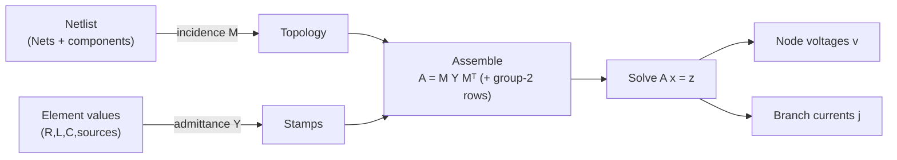

# Linear Algebra

**Summary.** Linear algebra is the mathematics of vectors, matrices, and the linear maps between them — the study of systems of simultaneous linear equations and the structure that makes them solvable, stable, and fast. It belongs in the Engineering Science Layer because *the matrix is the data structure behind circuit and field analysis*: Kirchhoff's laws over a netlist become a sparse linear system; the steady state of an analog network is the solution of `Gv = i`; the natural frequencies that produce resonance and ringing are the eigenvalues of that same system; and every footprint placed, mirrored, or rotated on a board is an affine matrix acting on coordinates. This document grounds the runtime concepts that quietly assume linear algebra works: the [Engineering Analysis](../../docs/state-machines/engineering-analysis.md) budgets, the analysis-flavoured checks behind the [Verification Engine](../../docs/engineering/verification-engine.md) ([EMC](../../docs/state-machines/emc-analysis.md)), the geometric transforms of [Component Placement](../../docs/state-machines/component-placement.md), and the determinism guarantee that the *same* matrix must always yield the *same* answer.

---

## Core principles

### 1. Modified Nodal Analysis: the circuit as a matrix

A circuit is a [graph](graph-theory.md): [Nets](../../docs/foundation/engineering-domain-model.md#net) are nodes, components are edges. **Kirchhoff's Current Law (KCL)** — the sum of currents into every node is zero — is a *linear* constraint, so the entire DC/AC operating point of a linear network is a linear system. **Nodal Analysis** chooses one node as reference (ground, node 0) and solves for the remaining node voltages `v`:

```
G v = i
```

where `G` is the `(n-1)×(n-1)` node-conductance matrix, `v` the vector of unknown node voltages, and `i` the vector of independent source currents injected at each node. `G` is built by **stamping**: each resistor of conductance `g = 1/R` between nodes `a` and `b` adds `+g` to `G[a,a]` and `G[b,b]` and `-g` to `G[a,b]` and `G[b,a]`. This is [Ohm's law](../electrical/ohms-law.md) `i = g·Δv` written as a matrix.

Plain nodal analysis cannot represent elements whose current is not a simple function of node voltage — ideal **voltage sources**, **inductors**, and **current-controlled** elements. **Modified Nodal Analysis (MNA)** fixes this by *augmenting* the unknown vector with those branch currents and adding the constitutive equations as extra rows:

```
| G  B | | v |   | i_s |
|      | |   | = |     |
| C  D | | j |   | e_s |
```

- `G` (size `n×n`) — the conductance stamps from passive admittances (group-1 elements).
- `B`, `C` — incidence patterns (`±1`, sometimes gains) coupling the extra branch currents `j` of group-2 elements (voltage sources, inductors, ideal op-amps) to the node equations.
- `D` — couplings among the group-2 branches themselves.
- `i_s` — independent current injections; `e_s` — independent source voltages.

The combined block matrix `A = [[G,B],[C,D]]` is the **MNA matrix**; solving `A x = z` yields *all* node voltages and the awkward branch currents at once. Equivalently, using the reduced **incidence matrix** `M` (nodes × branches, `+1`/`−1` for each branch's endpoints) and the diagonal branch-admittance matrix `Y`, the passive part is the congruence product

```
G = M Y Mᵀ
```

which is exactly why the matrix is sparse, symmetric for reciprocal passives, and structurally a function of the *topology* — the same incidence structure [graph theory](graph-theory.md) describes.


*Figure: a netlist lowers to an MNA matrix; topology supplies structure, element values supply the numbers, and one linear solve yields the operating point.*

For **AC / small-signal** analysis the admittances become complex and frequency-dependent: a capacitor stamps `sC` and an inductor `1/(sL)` with `s = jω`. The matrix becomes `A(s) = G + sC` (a matrix *pencil*), and `A(s) x = z` is solved per frequency point. This is the bridge from a static solve to dynamics and resonance (§3).

### 2. Sparse linear systems and their solvers

Real boards have thousands of nets but each component touches only a handful, so `A` is **sparse** — almost all entries are zero. Exploiting sparsity is not an optimization, it is the difference between feasible and infeasible: dense Gaussian elimination on `n` unknowns costs `O(n³)` time and `O(n²)` memory, while a well-ordered sparse factorization of a circuit matrix is often near-linear.

**Direct solvers** factor `A = LU` (or `LDLᵀ` / Cholesky `LLᵀ` when `A` is symmetric positive-definite, as a passive resistive network's `G` is) and then solve by forward/back substitution. Two facts govern correctness and speed:

- **Fill-in & ordering.** Elimination creates new nonzeros ("fill") where none existed. The amount of fill depends entirely on the *elimination order*. Heuristics — **approximate minimum degree (AMD)**, **nested dissection** — reorder rows/columns to minimize fill before factoring. The order changes cost by orders of magnitude but *not* the answer.
- **Pivoting & conditioning.** Numerical stability requires pivoting (row/column swaps to avoid dividing by a tiny pivot). The **condition number** `κ(A) = ‖A‖·‖A⁻¹‖` bounds how much input error (component tolerances, rounding) is amplified in the solution: a relative perturbation `ε` can grow to `κ(A)·ε`. A near-singular `A` (`κ → ∞`) means an ill-posed circuit — e.g. a node with no DC path to ground, or a loop of ideal voltage sources.

**Iterative solvers** — Conjugate Gradient (CG) for SPD systems, GMRES/BiCGStab for general ones — never form `L`/`U`; they refine an approximate `x` using only matrix-vector products. They shine on very large field-discretization matrices (see [Maxwell's equations](../physics/maxwell-equations.md) and finite-element/finite-difference fields) but converge only as fast as the spectrum allows, so they require **preconditioning** `M⁻¹A x = M⁻¹z` with `M ≈ A` to cluster the eigenvalues.

```
Solve strategy
  A symmetric positive-definite (passive DC)  → Cholesky / CG
  A symmetric indefinite (MNA with sources)   → LDLᵀ with pivoting
  A general / complex (AC, controlled sources) → LU / GMRES
  A huge & from a field mesh                   → preconditioned CG/GMRES
```

The non-negotiable property for the runtime: a chosen solver and ordering must be **deterministic** — same matrix, same answer, bit-for-bit — because reproducibility is a kernel guarantee (`P4`), not a nicety.

### 3. Eigen-analysis for resonance

Dynamics turn a circuit into a system of ODEs. In descriptor (state-space) form, MNA with reactive elements gives

```
C ẋ(t) + G x(t) = b(t)
```

The unforced behavior (`b = 0`) is governed by the **generalized eigenvalue problem**

```
det(G + sC) = 0     ⇔     G φ = −s C φ
```

Each eigenvalue `s = σ + jω` is a **pole / natural mode**; its eigenvector `φ` is the mode shape (how that oscillation distributes across nodes). The eigenvalues are exactly the resonances:

- **Imaginary part `ω`** — the resonant (ringing) frequency. The canonical LC tank gives `ω₀ = 1/√(LC)`, the imaginary eigenvalue of a 2×2 `[L,C]` pencil. A power-distribution net's parasitic `L` with a decoupling `C` resonates the same way.
- **Real part `σ`** — the damping. `σ < 0` ⇒ decaying (stable); `σ > 0` ⇒ growing (an oscillator or an instability); `σ = 0` ⇒ a sustained, undamped resonance.
- **Quality factor `Q = ω₀/(2|σ|)`** — how sharp and how long-ringing the resonance is. High `Q` plus an excitation near `ω₀` is the mechanism behind EMI peaks, supply ringing, and signal overshoot.

So "where will this board ring, and how badly?" is literally "what are the eigenvalues of `(G, C)`, and what are their `Q`s?". For symmetric SPD pencils the spectrum is real and well-conditioned; the **Rayleigh quotient** `λ = (φᵀGφ)/(φᵀCφ)` bounds individual modes without a full decomposition — cheap enough for a fast, deterministic resonance proxy.

### 4. Coordinate transforms: geometry is also a matrix

Everything physical on the board is a vector of coordinates acted on by a matrix. Placing, rotating, mirroring, and panelizing footprints are **affine transforms** expressed in **homogeneous coordinates** so that translation, too, becomes matrix multiplication:

```
| x' |   | cosθ·s  -sinθ·s   tx | | x |
| y' | = | sinθ·s   cosθ·s   ty | | y |
| 1  |   |   0        0       1 | | 1 |
```

- **Rotation** `θ` — orienting a [Component/Footprint](../../docs/foundation/engineering-domain-model.md#footprint); an orthogonal matrix (`RᵀR = I`, `det = +1`) that preserves distances and angles.
- **Translation** `(tx, ty)` — placement of a part's origin in board coordinates.
- **Scale** `s` — unit conversions between the design's internal units (see [units & quantities](../../docs/engineering/units-and-quantities.md)); on a rigid PCB `s = 1`.
- **Reflection** (`det = −1`) — **mirroring a part to the bottom copper layer**. This is the geometric meaning of "flip to back": a coordinate reflection composed with a layer remap. Getting the determinant sign wrong silently mirrors a part that should not be flipped — a class of bug that only a correct transform prevents.

Transforms **compose** by matrix multiplication, and the order matters because matrix multiplication does not commute: `rotate-then-translate ≠ translate-then-rotate`. A footprint's pad in world coordinates is `T_board · T_place · T_pad · p_local`. Because affine transforms are invertible (the inverse matrix exists for `det ≠ 0`), board coordinates can always be mapped back to component-local coordinates for editing — the round-trip the IDE relies on.

---

## Why it matters for electronics & PCB design

- **It is the engine of analog truth.** DC bias, AC transfer functions, supply-rail drops, and load-line operating points are all `Ax = z`. There is no analog "simulation" that is not, underneath, a linear solve (or a sequence of them, for nonlinear devices linearized at each Newton step).
- **Resonance is an eigen-phenomenon, not a guess.** Decoupling effectiveness, PDN anti-resonance, crystal/oscillator behavior, and signal-integrity ringing are spectra of `(G, C)`. Treating them as eigenvalues makes them computable and comparable instead of folkloric.
- **Sparsity makes it feasible.** A board with thousands of nets is only solvable in human time because `A` is sparse and ordered well. The mathematics directly sets what size of design the runtime can analyze.
- **Conditioning is a design smell.** An ill-conditioned `A` usually means a real electrical defect — a floating node, no DC return path, redundant ideal sources — so the *numerics* surface *engineering* errors (the same defects [ERC](../../docs/state-machines/erc-verification.md) hunts for structurally).
- **Geometry must be exact.** Placement, mirroring, rotation, and panelization are affine matrices; a transform error is a manufacturing error (a part on the wrong layer, a footprint rotated 180°), caught only by getting the linear algebra right.

---

## Mapping to the runtime

This layer grounds concrete EAK runtime artifacts. Each mapping names the embodying engine/IR/state-machine and why violating the principle would be a runtime bug.

- **Engineering budgets are linear systems.** [Engineering Analysis](../../docs/state-machines/engineering-analysis.md) lowers [Requirement IR](../../docs/compiler/ir/requirement-ir.md) into [Engineering IR](../../docs/compiler/ir/engineering-ir.md) with power/thermal/area budgets that must be *internally consistent* (its `ValidatingAnalysis` state). Budget consistency is a system of linear conservation equations (current in = current out, allocated ≤ available); if assembled or solved inconsistently the phase would pass an over-allocated architecture — exactly the "budget inconsistency" recoverable failure that machine guards.
- **The regulator VIN/VOUT rail split is a node-separation correctness fact.** Increment 11 split a collapsed power rail into distinct regulator input/output nodes. In MNA terms, merging `VIN` and `VOUT` into one node is *deleting a row/column* of `A` — it short-circuits the regulator and silently changes the conductance graph and every downstream voltage. Keeping them as separate nodes is the linear-algebra invariant that makes the [PCB IR](../../docs/compiler/ir/pcb-ir.md) and any rail analysis correct; collapsing them is precisely a circuit-matrix bug.
- **Per-net-class trace widths are stamps with the right admittance.** Increment 10's per-net-class widths set each [Track's](../../docs/foundation/engineering-domain-model.md#track--routing) cross-section, hence its resistance `R = ρ·L/(w·t)` and its conductance stamp in `G`. A power net stamped with a signal-net width would under-state IR drop and over-state efficiency — the matrix would lie. The net-class → width → admittance chain is where [Ohm's law](../electrical/ohms-law.md) enters the matrix during [Routing Planning](../../docs/state-machines/routing-planning.md).
- **EMC resonance proxy is eigen-reasoning.** The shipped `EmcAnalysisMachine` ([EMC Analysis](../../docs/state-machines/emc-analysis.md)) flags an *electrically-long* [Track](../../docs/foundation/engineering-domain-model.md#track--routing) (length > `c/(10·f)`) as an efficient radiator. That threshold is a closed-form stand-in for the full eigen-analysis of §3: a structure becomes resonant when its dimension approaches a wavelength, i.e. when `(G, C)` has a mode at the operating frequency. Treating it as a deterministic rule over the [Verification Engine](../../docs/engineering/verification-engine.md) keeps the analysis reproducible (`P4`) instead of calling a stochastic solver.
- **Placement and the board-edge keep-out are affine geometry.** [Component Placement](../../docs/state-machines/component-placement.md) and the DFM **board-edge keep-out** (increment 9) operate on footprint coordinates produced by the affine transforms of §4. Mirroring to bottom copper is a reflection (`det = −1`); a sign error puts a part on the wrong layer, and the edge keep-out — a clearance test in transformed board coordinates — would test the wrong polygon. The [DRC](../../docs/state-machines/drc-verification.md) / [DFM](../../docs/state-machines/dfm-verification.md) clearance rules depend on these transforms being exact and invertible.
- **Net realization is incidence-matrix completeness.** [Routing Planning's](../../docs/state-machines/routing-planning.md) invariant — the union of Tracks for a Net realizes *exactly* that Net's [Connections](../../docs/foundation/engineering-domain-model.md#connection), no more, no less — is the statement that the routed copper's incidence structure equals the schematic [Net's](../../docs/foundation/engineering-domain-model.md#net) incidence structure. An extra/missing edge is an off-by-one in the incidence matrix `M`, which the unrouted-net DRC rule (increment 7) catches.
- **Determinism of the solve is a kernel guarantee.** Because the [Verification Engine](../../docs/engineering/verification-engine.md) and all analyses must replay bit-identically (`P4`), any linear solve, ordering, or eigen-routine the runtime relies on must be deterministic. A solver whose pivot/ordering choice varied per run would make a [Violation](../../docs/foundation/engineering-domain-model.md#violation) appear and disappear across replays — a direct breach of the determinism principle in [`principles.md`](../../docs/foundation/principles.md).
- **Units enter the matrix as scale transforms.** [Units & quantities](../../docs/engineering/units-and-quantities.md) defines the dimensioned values that become matrix entries; mixing units is a hidden diagonal scaling of `A` that corrupts the solution. The Engineering Science contract is that every stamp is in coherent SI before assembly.

---

## Failure modes if violated

- **Singular / ill-conditioned matrix treated as solved.** A floating node, an ideal-source loop, or a missing DC return makes `A` singular (`κ → ∞`). Silently returning the garbage from a near-singular solve would pass a broken circuit. Correct behavior: detect singularity, surface it as an indeterminate result — the same "indeterminate ⇒ not passable" discipline the [Verification Engine](../../docs/engineering/verification-engine.md) already enforces (never a false pass).
- **Node collapse / merge errors.** Merging two nets that must stay distinct (the inverse of the VIN/VOUT split) deletes equations from `A` and changes every voltage downstream — a wrong answer that *looks* fine. This is why net identity is a guarded invariant, not an incidental detail.
- **Wrong stamp value.** A trace stamped with the wrong width/length/material gives the wrong admittance; IR-drop, thermal, and efficiency budgets are then quietly off. Mitigated by sourcing every stamp from typed, dimensioned [units](../../docs/engineering/units-and-quantities.md) and per-net-class widths.
- **Non-deterministic solve/ordering.** A solver whose result depends on thread scheduling or fill-reducing randomness breaks replay (`P4`); the *same* design would produce *different* diagnostics on re-run, destroying auditability.
- **Eigenvalue mis-read.** Ignoring a low-damping (`σ ≈ 0`, high-`Q`) mode near an operating frequency misses a resonance; mislabeling a `σ > 0` mode as stable misses an oscillation/instability. Either is a real, shippable EMC/SI defect.
- **Transform composition / determinant errors.** Composing affine transforms in the wrong order, or a `det`-sign slip, mirrors or rotates a footprint incorrectly — a part on the wrong layer or orientation that becomes a fabricated, unfixable board.
- **Dense solve on a sparse problem.** Forgetting sparsity turns an `O(n)`-ish analysis into `O(n³)`, making realistic boards unanalyzable — a performance failure that degrades into skipped analysis, i.e. a silent loss of verification coverage.

---

## Related documents

- [`mathematics/graph-theory.md`](graph-theory.md) — the netlist-as-graph, incidence/Laplacian matrices, and connectivity that give `A` its sparsity and structure.
- [`physics/maxwell-equations.md`](../physics/maxwell-equations.md) — field problems whose discretization yields the large sparse systems and eigenproblems solved here.
- [`electrical/ohms-law.md`](../electrical/ohms-law.md) — the constitutive `i = g·v` relation that becomes every conductance stamp.
- [`../../docs/state-machines/engineering-analysis.md`](../../docs/state-machines/engineering-analysis.md) — budgets as consistent linear systems.
- [`../../docs/state-machines/routing-planning.md`](../../docs/state-machines/routing-planning.md) · [`../../docs/state-machines/emc-analysis.md`](../../docs/state-machines/emc-analysis.md) — net realization (incidence completeness) and the resonance proxy.
- [`../../docs/engineering/verification-engine.md`](../../docs/engineering/verification-engine.md) — deterministic, replayable evaluation that any solver feeding it must respect.
- [`../../docs/engineering/units-and-quantities.md`](../../docs/engineering/units-and-quantities.md) — dimensioned values that populate the matrices.
- [`../../docs/compiler/ir/pcb-ir.md`](../../docs/compiler/ir/pcb-ir.md) · [`../../docs/compiler/ir/engineering-ir.md`](../../docs/compiler/ir/engineering-ir.md) — the IRs whose entities the matrices are built from.
- [`../../docs/foundation/principles.md`](../../docs/foundation/principles.md) — `P4` determinism, the constraint every numeric routine inherits.
- [`../../docs/GLOSSARY.md`](../../docs/GLOSSARY.md) — canonical terms (Net, Track, Connection, IR).
