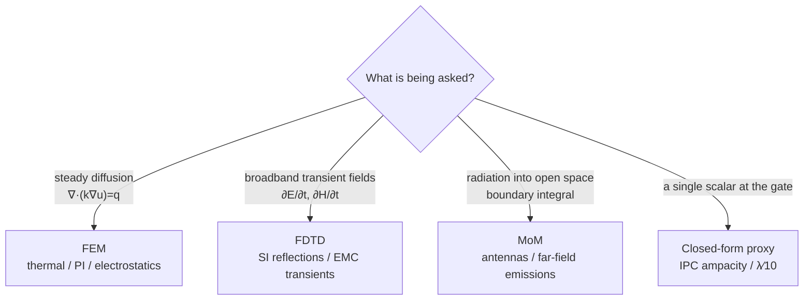
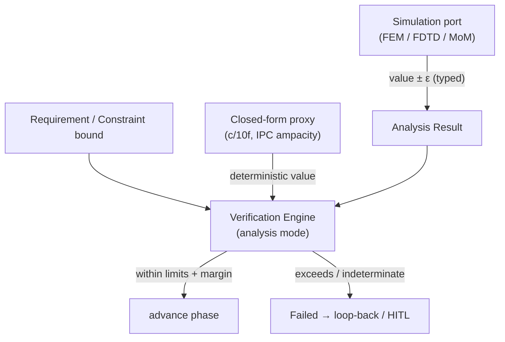

# Numerical Methods

> **Layer:** Engineering Science (the "why" beneath the runtime). **Domain:** Mathematics.

**Summary.** Numerical methods are the family of algorithms that turn the *continuous* physics of a PCB — Maxwell's fields, heat diffusion, nonlinear device curves — into *finite* arithmetic a computer can actually evaluate. The governing laws of electronics are differential and integral equations with no closed-form solution on a real board geometry; to get a number for "what is the temperature at this via?" or "how much does this trace radiate at 2.4 GHz?" the continuous problem must be **discretized** (chopped into finitely many unknowns), **solved** (with a linear/nonlinear solver or a time-stepping scheme), and **interpreted** back into engineering quantities. This document grounds three runtime facts the kernel silently assumes: (1) every analysis the EAK reaches for through the [Simulation port](../../docs/core/contracts.md) — thermal, signal-integrity (SI), power-integrity (PI), electromagnetic compatibility (EMC) — is the *output of a numerical method*, not an oracle; (2) every such output is therefore an **approximation with a quantifiable error budget**, which is *why* the [Verification Engine](../../docs/engineering/verification-engine.md) compares results against limits *with margins* and treats a missing or unstable solve as **indeterminate, never as a pass**; and (3) the same machinery — root-finding, interpolation, closed-form first-order proxies — underlies even the deterministic, no-simulator checks the runtime ships today, such as the EMC antenna-length rule and the per-net-class ampacity width. In short: this is the discipline that makes "a numeric result carries a tolerance" a theorem rather than a slogan, and it tells the runtime exactly when a computed answer may be trusted.

---

## Core principles

### 1. Discretization: from a PDE to a finite system

Continuous physics lives in infinite-dimensional function spaces. A numerical method replaces the unknown field `u(x)` (temperature, potential, current density) by a finite vector of degrees of freedom (DOF) and the differential operator by a matrix. The three workhorse discretizations for board-level physics differ in *what* they discretize.


*Figure: the universal numerical pipeline — discretize, assemble, solve, interpret, and bound the error. The last box is what makes the output a [Physical Quantity](../../docs/engineering/units-and-quantities.md), not a bare number.*

**FEM — Finite Element Method (thermal, PI, electrostatics, structural).** The domain is meshed into elements (triangles/tetrahedra); the field is approximated as `u(x) ≈ Σ uⱼ φⱼ(x)` using local basis functions `φⱼ`. Multiplying the PDE by a test function and integrating (the **weak form**) turns a second-order differential equation into an algebraic system. For steady heat conduction `−∇·(k∇T) = q`:

```
weak form:   ∫_Ω k ∇φᵢ · ∇T dΩ = ∫_Ω φᵢ q dΩ   for all i
assembled:   K T = f          (K = sparse "stiffness" matrix, SPD for diffusion)
```

`K` is large but **sparse** (each DOF couples only to mesh neighbours), so it is solved by sparse direct factorization or Krylov iteration (e.g. conjugate gradient for the SPD case). FEM handles arbitrary geometry and inhomogeneous materials (copper vs. FR-4 dielectric) well, which is why it dominates **thermal** and **power-integrity** analysis.

**FDTD — Finite-Difference Time-Domain (full-wave SI/EMC).** Maxwell's two curl equations are discretized in *both* space and time on a staggered **Yee grid** (E-field components on cell edges, H-field on cell faces) and marched forward with a **leapfrog** explicit update:

```
∂E/∂t = (1/ε)(∇×H − J)        ∂H/∂t = −(1/μ) ∇×E
Yee update (1-D sketch):
  Eⁿ⁺¹(i)  = Eⁿ(i)  − (Δt/εΔx)·[ Hⁿ⁺½(i+½) − Hⁿ⁺½(i−½) ]
  Hⁿ⁺½(i+½)= Hⁿ⁻½(i+½) − (Δt/μΔx)·[ Eⁿ(i+1) − Eⁿ(i) ]
```

FDTD is matrix-free and naturally broadband (one run, many frequencies via an FFT), making it the standard for **transient SI** (reflections, crosstalk) and **radiated EMC**. Its price is the time-step stability limit (CFL, below) and the need to truncate the open domain with absorbing boundaries (PML).

**MoM — Method of Moments (antennas, radiated emissions, PDN resonance).** Instead of meshing all of space, MoM meshes only the *conductors* and solves a **boundary integral equation** for the surface current `J`, using the free-space Green's function `G` to carry the field to the observation point:

```
∫_S  G(r, r') J(r') dS'  =  E_inc(r)        ⇒        Z I = V
```

The system matrix `Z` is **dense** (every current element couples to every other through `G`) but *small* (only conductor DOF), the opposite trade-off from FDTD. MoM is the method of choice when a structure radiates into open space — exactly the regime the EMC antenna-length heuristic is a cheap proxy for.

| Method | Discretizes | Matrix | Best for | Cost driver |
|--------|-------------|--------|----------|-------------|
| FEM | volume mesh | sparse | thermal, PI, static fields, inhomogeneous media | #DOF, conditioning |
| FDTD | space + time grid | none (explicit) | broadband SI, transient EMC | CFL time-step, grid cells |
| MoM | conductor surfaces | dense | radiation, antennas, far-field EMC | #conductor DOF² |

The choice is dictated by the *type* of the governing equation and the geometry, not by preference:


*Figure: method selection follows the mathematics of the question — diffusion → FEM, transient waves → FDTD, radiation → MoM, gate-time scalar → a conservative closed form.*

**Solving the assembled system.** Sparse FEM/PI systems are rarely inverted directly at scale; they are solved by **Krylov iterative methods** (conjugate gradient for the symmetric-positive-definite diffusion case, GMRES for the general case), whose convergence rate is governed by the condition number `κ(A)`. A **preconditioner** `M ≈ A⁻¹` transforms `Ax=b` into the better-conditioned `M⁻¹Ax = M⁻¹b`, often turning an intractable solve into a fast one. This matters to the runtime indirectly: iterative solvers stop at a chosen **residual tolerance**, which is the "iteration error" term of §3 and a contributor to the result's reported `ε`.

### 2. Time-stepping and stability — the CFL condition

Explicit time-marching (FDTD, transient thermal) is only **stable** if the time step is small enough that numerical information does not propagate faster than the physics. This is the **Courant–Friedrichs–Lewy (CFL)** condition. For FDTD with wave speed `c`:

```
Courant number  S = c·Δt · sqrt(1/Δx² + 1/Δy² + 1/Δz²)   ≤ 1
⇒  Δt ≤ 1 / ( c · sqrt(1/Δx² + 1/Δy² + 1/Δz²) )
```

Violate it and the solution does not merely lose accuracy — it **blows up exponentially** (amplitudes double every few steps until they overflow). Stability and accuracy are *distinct* properties: a scheme can be stable yet inaccurate (over-damped) or accurate per step yet unstable. **Implicit** schemes (backward Euler, Crank–Nicolson) are unconditionally stable — no CFL ceiling — but require a linear solve every step, trading the explicit method's cheap-but-bounded step for an expensive-but-unbounded one. The runtime never sees these steps directly, but it *does* inherit their consequence: a solver that returns `NaN`/divergence (a CFL violation in the external tool) must be surfaced as **indeterminate**, not silently clamped to a "pass."

### 3. Convergence and error — why the answer is an interval

Every numerical result carries error from four independent sources, which sum into the total uncertainty:

| Source | Origin | Shrinks with |
|--------|--------|--------------|
| **Model error** | the physics model itself (lumped vs. distributed; lossless vs. lossy) | a better model, not a finer mesh |
| **Discretization (truncation) error** | finite mesh/step replacing the continuum | refining `h` → 0, at order `O(hᵖ)` |
| **Iteration error** | stopping an iterative solver at a finite residual | tighter convergence tolerance |
| **Round-off error** | finite floating-point precision | grows as the mesh refines |

A method is **order-`p` accurate** if its global discretization error scales as `O(hᵖ)` (h = mesh size / time step): halving `h` cuts a 2nd-order error by 4×. This is testable: **mesh refinement studies** and **Richardson extrapolation** estimate the error by comparing solutions at two resolutions:

```
error ≈ ( u(h) − u(2h) ) / ( 2ᵖ − 1 )
```

Crucially, refining `h` reduces discretization error but *increases* total round-off (more operations) and cost — so there is an **error floor** no mesh can beat, and beyond an optimal `h` the answer gets *worse*. The conditioning of the linear system bounds how round-off is amplified:

```
‖δx‖/‖x‖  ≤  κ(A) · ‖δb‖/‖b‖        κ(A) = ‖A‖·‖A⁻¹‖  (condition number)
```

An ill-conditioned `A` (κ ≫ 1, common for fine SI meshes or near-resonant PDNs) magnifies tiny input perturbations into large output errors. **The engineering consequence is unavoidable: a numerical result is fundamentally an interval `[value − ε, value + ε]`, and ε is part of the answer.** This is the mathematical root of the runtime's typed tolerance.

### 4. Root-finding and interpolation — the everyday numerics

Not every analysis is a PDE. Two smaller-scale methods appear constantly.

**Root-finding** solves `f(x) = 0` — the DC operating point of a nonlinear circuit, a thermal equilibrium, the trace width that meets a target temperature rise.

```
Newton–Raphson:   xₙ₊₁ = xₙ − f(xₙ)/f′(xₙ)      quadratic convergence (error squares each step) — needs f′ and a good guess
Bisection:        halve [a,b] keeping the sign change   linear convergence — slow but guaranteed if f is continuous & brackets a root
```

Newton is fast but can diverge from a poor seed or a zero derivative; bisection is bullet-proof but slow. Production solvers hybridize (e.g. Brent's method) to get guaranteed convergence at near-Newton speed — and they **report non-convergence** rather than returning a stale iterate, which is the behaviour the runtime depends on.

**Interpolation** reconstructs a continuous function from sampled points — S-parameter tables, capacitor derating curves (effective C vs. DC bias), IPC ampacity charts. Linear interpolation is `O(h²)` accurate; **cubic splines** give `O(h⁴)` with continuous curvature, important when a *derivative* (slew rate, impedance slope) is read off the curve. Over-fitting with a high-degree single polynomial triggers **Runge's phenomenon** (wild oscillation between samples), which is exactly why piecewise splines, not global polynomials, are the right tool — a non-obvious choice with a concrete failure if ignored.

### 5. Why a numeric result carries a tolerance — the theorem

The four error sources of §3 do not cancel; they combine. Writing the true field value `u*` and the computed value `û`, the total uncertainty is bounded by the sum of the parts:

```
| u* − û |  ≤  ε_model  +  ε_discretization(hᵖ)  +  ε_iteration(residual)  +  ε_roundoff(κ, eps_machine)
```

Each term is *irreducible to zero*: refining `h` shrinks the second term but grows the fourth, a better model shrinks the first but not the rest, and machine precision floors the last. Therefore **no numerical method returns a point — it returns the interval `[û − ε, û + ε]`**, and reporting `û` without `ε` is not a simplification but a category error: it discards the only information that says whether the answer is usable. This is the formal justification for the runtime treating every solver output as a tolerance-bearing [Physical Quantity](../../docs/engineering/units-and-quantities.md) and for gating on *margin* rather than nominal value.

---

## Why it matters for electronics & PCB design

- **There is no closed form for a real board.** Trace geometry, the FR-4 dielectric stack, ground-plane cut-outs, and via stitching make every field/thermal question a numerical one. The accuracy of *every* SI/PI/thermal/EMC verdict is therefore the accuracy of a numerical method, and an engineer who treats a solver output as exact will under-design margins.
- **Mesh and step choices are engineering decisions.** Too coarse a mesh misses a hot-spot or a resonance; too fine wastes hours and invites round-off. The CFL ceiling couples spatial resolution to time-step (and thus runtime), so SI sign-off has an intrinsic cost-vs-confidence trade.
- **Tolerances stack with component tolerances.** A `±5 %` resistor evaluated by a solver with `±8 %` discretization error yields a *combined* worst case the design must survive. Numerical error is not separate from physical tolerance; it adds to it.
- **First-order proxies are still numerics.** A closed-form ampacity formula (IPC-2221) or the `c/(10f)` electrically-long threshold is a *zeroth/first-order numerical model* — fast, deterministic, conservative. Knowing its error class is what justifies using it *instead of* a full solve for a gate check, and knowing when it is *too* crude (the velocity-factor refinement noted in EMC) is the same judgement.

See [`../physics/maxwell-equations.md`](../physics/maxwell-equations.md) and [`../physics/electromagnetics.md`](../physics/electromagnetics.md) for the laws being discretized, [`../physics/thermal-physics.md`](../physics/thermal-physics.md) for the heat equation FEM solves, and [`../electrical/ohms-law.md`](../electrical/ohms-law.md) / [`../electrical/signal-integrity.md`](../electrical/signal-integrity.md) for the lumped models these methods supersede when distributed effects dominate.

---

## Mapping to the runtime

This is the load-bearing section: where the mathematics above becomes a constraint on EAK's implemented behaviour. Each principle binds to a specific runtime artifact, and violating it would be a genuine engineering bug.

**1. The Simulation port is a numerical-method boundary.** All FEM/FDTD/MoM solves enter the runtime through the [Simulation port](../../docs/core/contracts.md). The kernel never *computes* fields; it *requests* a numerical solve and **interprets the typed result**. The contract therefore must carry not just a value but its error/confidence — because, per §3, the value alone is meaningless. The [Engineering Analysis](../../docs/state-machines/engineering-analysis.md) machine (thermal/SI/PI) and [EMC Analysis](../../docs/state-machines/emc-analysis.md) (Phase 13) are the two state machines that drive these solves; both produce [Analysis Results](../../docs/engineering/verification-engine.md) (interpreted datasets with margin + confidence), *not* bare numbers — a direct encoding of "a numeric result is an interval."

**2. Tolerance-typed outputs realize the error budget.** §3 says every result is `value ± ε`. The runtime's [Units & Physical Quantities](../../docs/engineering/units-and-quantities.md) type system (P9) is the mechanism: a solver output is normalized into a `Physical Quantity` whose **tolerance** absorbs the discretization + round-off + iteration error. The [Verification Engine](../../docs/engineering/verification-engine.md) then performs **tolerance-aware comparison near a bound** — a `78 °C ±6 °C` junction temperature against an `≤ 80 °C` limit is *not* unconditionally passing. If numerical tolerance were dropped, the engine would pass designs that fail at worst case: a verification bug.

**3. Indeterminate-not-pass is the CFL/convergence safety net.** §2–§4 establish that solvers fail loudly (divergence, non-convergence, unavailable tool). The runtime mirrors this exactly: the [Verification Engine](../../docs/engineering/verification-engine.md) treats an indeterminate analysis as *not passable*, and the [EMC Analysis](../../docs/state-machines/emc-analysis.md) machine routes `RunningAnalysis → Failed` via `EMCIndeterminate` when "simulation unavailable / indeterminate," so the design is **never falsely passed on a missing or unstable solve**. A CFL blow-up that returned garbage which the gate accepted would be precisely the failure this rule exists to prevent.

**4. Determinism over a non-deterministic-feeling process.** Floating-point solves are sensitive to operation order and seeds, yet [determinism & replay](../../docs/core/determinism-and-reproducibility.md) (ADR-0009) requires identical results on re-run. The runtime reconciles this by recording the *result* of the external solve as an immutable fact: `RunningAnalysis` is **non-resumable and re-run on crash**, and replay consumes the recorded [Analysis Result](../../docs/state-machines/emc-analysis.md), not a fresh solve. The numerical method's lack of bit-reproducibility is thus quarantined behind the port, satisfying [P4](../../docs/foundation/principles.md).

**5. Closed-form proxies are the shipped numerical models.** The implemented deterministic subset uses first-order numerics in place of full solvers, and the math here is what justifies them:
   - **EMC antenna-length rule** ([EMC Analysis](../../docs/state-machines/emc-analysis.md), increment 6): the electrically-long threshold `λ/10 = c/(10·f)` is a §4-style closed-form proxy for the MoM radiation integral — conservative (free-space `c`, no velocity factor), deterministic, and silent when no frequency is stated rather than guessing. Its documented `√εeff` refinement is exactly a model-error reduction in the §3 taxonomy.
   - **Per-net-class trace widths** ([Routing Planning](../../docs/state-machines/routing-planning.md), increment 10): the minimum width that carries a net's current without excess temperature rise is a closed-form ampacity evaluation (an IPC-2221 root-find of `width` vs. `ΔT`). Using the conservative formula instead of a thermal FEM solve at the gate is a deliberate error-class choice.
   - **Regulator VIN/VOUT rail split** (increment 11): splitting the collapsed power rail so each segment carries its own current is what makes those per-segment width/thermal numerics correct — feed a numerical width formula the wrong current and it returns a precisely-wrong (under-sized) trace. The split is the input-correctness precondition for the numeric method.

**6. Constraints are the bounds numeric results are tested against.** The [Constraint Engine](../../docs/engineering/constraint-engine.md) stores typed bounds (max temperature, target impedance, clearance); the numerical result flows in and is compared with tolerance. A solver answer with *no* error bound would make this comparison dishonest — the bound check is only sound because the numeric input is an interval.


*Figure: numerical results (full solve or closed-form proxy) meet the constraint bound inside the Verification Engine, which gates on margin and refuses to pass an indeterminate solve.*

---

## Failure modes if violated

- **Trusting a solver as exact (dropped error budget).** Comparing a bare nominal against a hard limit passes designs that fail at worst case. *Runtime guard:* tolerance-typed [Analysis Results](../../docs/engineering/units-and-quantities.md) + margin-aware gating in the [Verification Engine](../../docs/engineering/verification-engine.md). Removing the tolerance is a silent-truncation defect ([P13](../../docs/foundation/principles.md)).
- **Accepting a divergent / non-converged solve.** A CFL violation or an under-resolved mesh yields `NaN` or a meaningless number; treating it as data corrupts every downstream decision. *Guard:* indeterminate-not-pass — `EMCIndeterminate` / analysis-unavailable routes to `Failed`, never to the manufacturing gate.
- **Mesh/step too coarse (model under-resolved).** Misses a thermal hot-spot or a resonance entirely, returning a confidently-wrong "pass." *Guard:* this is a model-quality boundary the [Simulation port](../../docs/core/contracts.md) and human-in-the-loop disposition must own; the runtime records confidence so a low-confidence result is surfaced, not auto-accepted.
- **Wrong inputs to a correct formula.** A perfectly accurate ampacity equation fed the *collapsed* rail current under-sizes the trace — the regulator VIN/VOUT split (increment 11) exists to prevent exactly this. Correct numerics on wrong inputs is still a wrong, dangerous answer.
- **Over-fitting an interpolant (Runge's phenomenon).** Reading a derating or S-parameter value from a high-degree global polynomial oscillates between samples and reports false values; splines avoid it. A subtle but real source of wrong typed parameters.
- **Ignoring conditioning.** An ill-conditioned PDN/SI system amplifies round-off into large errors that masquerade as physics; without a residual/condition check the result looks plausible and is wrong.

---

## Related documents

**Engineering Science (siblings).** [`../physics/maxwell-equations.md`](../physics/maxwell-equations.md) · [`../physics/electromagnetics.md`](../physics/electromagnetics.md) · [`../physics/thermal-physics.md`](../physics/thermal-physics.md) · [`../electrical/ohms-law.md`](../electrical/ohms-law.md) · [`../electrical/signal-integrity.md`](../electrical/signal-integrity.md) · [`../mathematics/linear-algebra.md`](../mathematics/linear-algebra.md) · [`../mathematics/probability-and-statistics.md`](../mathematics/probability-and-statistics.md)

**Runtime anchors.** [`../../docs/core/contracts.md`](../../docs/core/contracts.md) (Simulation port) · [`../../docs/state-machines/engineering-analysis.md`](../../docs/state-machines/engineering-analysis.md) · [`../../docs/state-machines/emc-analysis.md`](../../docs/state-machines/emc-analysis.md) · [`../../docs/state-machines/routing-planning.md`](../../docs/state-machines/routing-planning.md) · [`../../docs/engineering/verification-engine.md`](../../docs/engineering/verification-engine.md) · [`../../docs/engineering/constraint-engine.md`](../../docs/engineering/constraint-engine.md) · [`../../docs/engineering/units-and-quantities.md`](../../docs/engineering/units-and-quantities.md) · [`../../docs/core/determinism-and-reproducibility.md`](../../docs/core/determinism-and-reproducibility.md) · [`../../docs/foundation/principles.md`](../../docs/foundation/principles.md) · [`../../docs/GLOSSARY.md`](../../docs/GLOSSARY.md)
