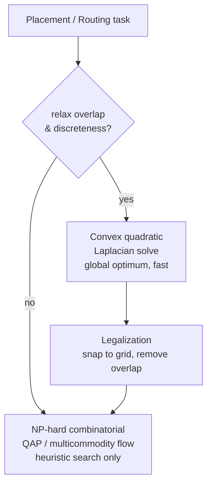
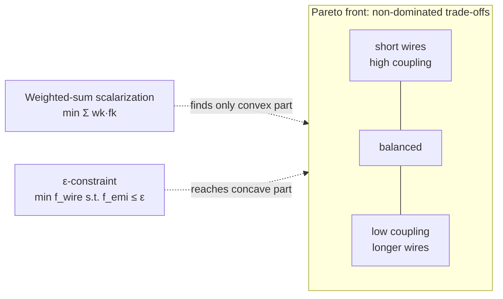
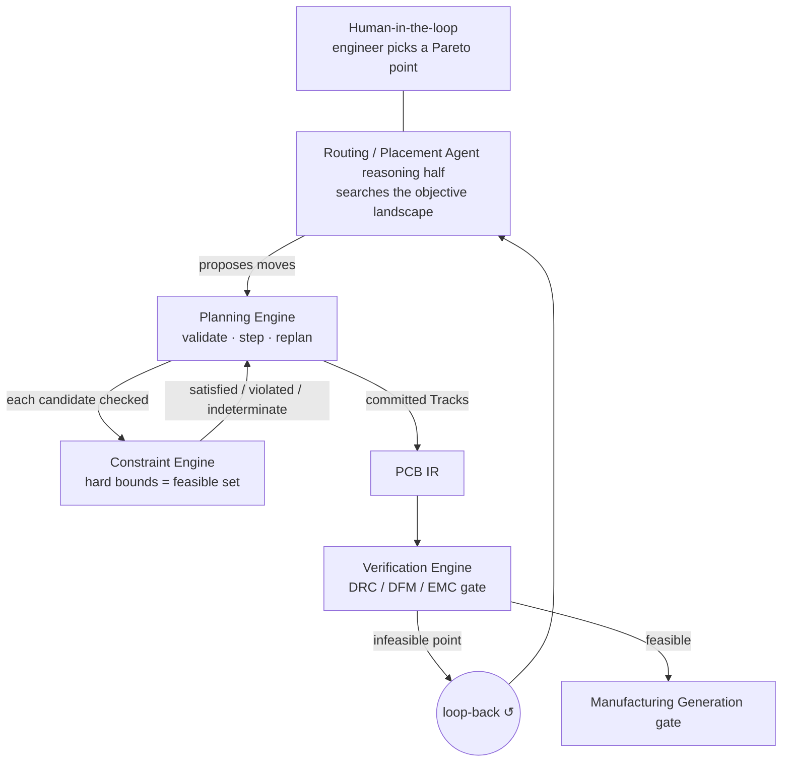

# Optimization Theory

**Summary.** Placement and routing — the two hardest phases the runtime drives — are *mathematical optimization problems*: choose values for decision variables (where each component sits, which layer and grid path each net takes) so as to minimize an objective (wirelength, congestion, thermal stress, EMI coupling) subject to constraints (clearances, current-carrying width, keep-outs, layer rules). This document belongs in the Engineering Science Layer because the EAK runtime never *states* that it is optimizing — yet every placement move, every reroute, and every Pareto trade-off an engineer approves is a step in a search over a constrained objective landscape. It grounds three runtime concepts at once: the **reasoning plan** an agent proposes inside a phase ([planning-engine](../../docs/engineering/planning-engine.md)), the **constraint** that bounds the feasible set ([constraint-engine](../../docs/engineering/constraint-engine.md)), and the **verification gate** that rejects infeasible points ([verification-engine](../../docs/engineering/verification-engine.md)). Getting the optimization *structure* right — which terms are objectives versus which are hard bounds, which method suits a combinatorial versus a convex sub-problem, how multiple objectives are reconciled — is the difference between a board that routes and a runtime that thrashes forever in the DRC loop-back.

---

## Core principles

### 1. The canonical form

Every placement/routing task reduces to the standard constrained program:

```text
minimize    f(x)            # objective (cost we want small)
subject to  g_i(x) ≤ 0      # inequality constraints (hard bounds)
            h_j(x) = 0      # equality constraints (e.g. net must be realized)
            x ∈ X           # domain (discrete grid, allowed layers, …)
```

- **Decision variables `x`.** Placement: component coordinates `(x_c, y_c)`, orientation, layer (top/bottom). Routing: for each net, an ordered set of track segments, vias, and a layer per segment.
- **Objective `f`.** A scalar "badness" — defined in §2.
- **Constraints `g, h`.** The machine-checkable bounds the [Constraint Engine](../../docs/engineering/constraint-engine.md) holds: clearance ≥ class minimum, trace width ≥ current-derived minimum, copper outside the board-edge keep-out, every [Connection](../../docs/foundation/engineering-domain-model.md#connection) realized exactly once.

The load-bearing modelling decision is **which real-world desire becomes a term in `f` and which becomes a constraint in `g`/`h`** — see §6. That choice is not cosmetic; it changes which solutions are even *reachable*.

### 2. Objective functions

| Objective | Formal model | Why it is shaped this way |
|-----------|--------------|---------------------------|
| **Wirelength** | Half-perimeter (HPWL) per net `n`: `L(n) = (max_i x_i − min_i x_i) + (max_i y_i − min_i y_i)` over its pins; total `L = Σ_n L(n)`. | HPWL is the standard cheap proxy for routed length; it is exact for 2- and 3-pin nets and a tight lower bound otherwise. Minimizing it shortens nets, cutting resistance, inductance, and delay (see [ohms-law](../electrical/ohms-law.md)). |
| **Congestion** | Per routing grid-cell (`g-cell`) overflow `o(c) = max(0, demand(c) − capacity(c))`; objective `Σ_c o(c)` or `max_c o(c)`. | Routing resources are finite per layer; demand exceeding supply is what makes a board *unroutable*. Congestion is the proxy that predicts routing failure before it happens. |
| **Thermal** | Spreading/peak temperature from a discretized heat model; minimize `max_node ΔT` or a soft `Σ ReLU(T − T_limit)`. | Power devices need copper area and separation; crowding hot parts raises junction temperature toward the absolute-max rating held as a constraint. |
| **EMI / coupling** | Mutual-coupling proxy: `Σ (over aggressor/victim pairs) κ · (parallel-run length) / (separation)`; loop-area penalty for return paths. | First-order capacitive/inductive coupling grows with parallel length and shrinks with spacing; loop area sets radiated emissions (see [maxwell-equations](../physics/maxwell-equations.md)). |

These are **commensurable only after scalarization** (§5): wirelength is in millimetres, ΔT in kelvin, congestion is dimensionless overflow. Summing them requires unit-bearing weights — a [Physical Quantity](../../docs/engineering/units-and-quantities.md) discipline, not free parameters.

A subtle but important property: **HPWL is convex but non-smooth** (a max/min of linear functions is piecewise-linear). Analytic placers recover differentiability with the **log-sum-exp** smoothing

```text
L_x(n) ≈ γ · [ ln Σ_i exp(x_i/γ)  +  ln Σ_i exp(−x_i/γ) ]   →  (max_i x_i − min_i x_i)  as γ → 0⁺
```

so a gradient method can be used; `γ` trades smoothing for fidelity.

### 3. Combinatorial vs convex structure

The problem is **two-natured**, and conflating the two natures is a classic failure:

- **Convex sub-structure.** With pins fixed and *overlap ignored*, quadratic wirelength `Σ_(i,j) w_ij·‖p_i − p_j‖²` is a convex quadratic; its minimizer is the solution of a sparse linear system built from the weighted **graph Laplacian** `L` of the netlist (`L·x = b_x`). This is exactly why force-directed / analytic placement is fast and globally optimal *for the relaxed problem*.
- **Combinatorial hardness.** The moment you add the real requirements — non-overlap, discrete layers, integral via counts, routing as edge-disjoint paths sharing finite grid capacity — the problem becomes **NP-hard**. Placement with non-overlap is a Quadratic Assignment Problem (QAP); global routing with layer assignment is integer multicommodity flow; both are NP-hard, so no method guarantees the optimum in polynomial time. Single-net shortest path *is* polynomial (Lee/maze, Dijkstra, A\*), but the *coupling* of nets through shared resources is what bites.


*The two natures: a convex relaxation gives a cheap global guide, then legalization re-enters the combinatorial regime.*

### 4. Methods, and when each applies

| Method | Where it fits | Mechanism |
|--------|---------------|-----------|
| **Force-directed / analytic** | Placement global stage | Treat nets as springs; equilibrium `F = −∇U = 0` of `U = ½ Σ w_ij d_ij²` is the Laplacian solve. Add a density/spreading force to push overlap apart. |
| **Gradient / quasi-Newton** | Smoothed analytic placement | `x_{t+1} = x_t − η ∇f̃(x_t)` on the log-sum-exp wirelength plus a density penalty; converges to a local minimum of a non-convex surface. |
| **Simulated annealing (SA)** | Detailed placement, escaping local minima | Propose a move (swap/shift/rotate); accept if `ΔC ≤ 0`, else accept with probability `exp(−ΔC/T)`. Cool `T_{k+1} = α·T_k` (`0<α<1`). The Metropolis rule lets it climb out of local minima early and behave greedily as `T → 0`. |
| **Maze / A\* shortest path** | Per-net detailed routing | Min-cost path on the grid graph; cost = length + via penalty + congestion history (rip-up-and-reroute reuses this with penalized history). |
| **ILP / min-cost flow** | Global routing, layer assignment | Exact on small instances; LP-relaxed + rounded on large ones. |

```text
# Metropolis acceptance — the heart of simulated annealing
accept(Δcost, T):
    if Δcost <= 0:   return True            # always take improvements
    else:            return rand() < exp(-Δcost / T)   # sometimes take worse, less so as T falls
```

The cooling schedule is the whole art: cool too fast and SA freezes in a poor local minimum (an unroutable placement); cool too slow and the phase blows its [cost budget](../../docs/engineering/planning-engine.md). Either way the *acceptance rule must be deterministically reproducible* (§ Failure modes).

### 5. Multi-objective Pareto trade-offs

There is rarely one objective. We have a vector `f(x) = (f_wire, f_cong, f_thermal, f_emi)` and no universal "best": shortening a net may worsen coupling. The right notion is **Pareto dominance**:

> `x` dominates `y` iff `f_k(x) ≤ f_k(y)` for all `k` and `<` for at least one `k`.

The **Pareto front** is the set of non-dominated designs — each is a legitimate trade-off; choosing *among* them is a value judgement, not a computation.


*Two scalarizations of a multi-objective problem; weighted-sum misses concave regions that ε-constraint can reach.*

Two scalarizations matter to the runtime:

- **Weighted sum:** `min Σ_k w_k f_k`. Simple, but provably **cannot reach points on a non-convex (concave) region of the Pareto front** no matter the weights. Relying on it alone silently hides valid designs.
- **ε-constraint:** optimize one objective, convert the rest to **hard bounds** `f_k ≤ ε_k`. This *can* recover the whole front, and — crucially — it is how the runtime already behaves: EMI/thermal/clearance limits enter as constraints while wirelength/congestion are minimized. The choice between scalarizations is therefore the same choice as §6.

### 6. Constraints as penalties vs hard bounds

The single most consequential modelling decision.

- **Hard bound (feasibility):** `g(x) ≤ 0` defines the *feasible set*; an infeasible point is simply **not a solution**, regardless of how good its objective looks. Safety clearance, current-derived minimum width, board-edge keep-out, "every net realized" are hard bounds.
- **Soft penalty (objective term):** add `μ · ReLU(g(x))²` (exterior penalty) to `f`. The optimizer *may* violate it if the objective gain outweighs the penalty. Congestion, aesthetic spreading, and "prefer shorter" are soft.

```text
# Penalty (soft): violations are tradeable
f_soft(x) = f(x) + Σ_i μ_i · max(0, g_i(x))²

# Hard bound (feasibility): violations are forbidden, not priced
feasible(x)  ⇔  g_i(x) ≤ 0  for all i      # a violated g_i means "not a candidate at all"
```

A penalty with finite `μ` will, at some objective gradient, *sell* the constraint. That is correct for congestion and catastrophic for clearance. **Hard bounds must be enforced as feasibility, never as a finite price.** In EAK terms this is exactly the [Constraint Engine](../../docs/engineering/constraint-engine.md) severity model: `error` = hard bound that gates manufacturing, `warning`/`info` = soft term the optimizer may weigh. Mislabelling one as the other is an engineering bug, not a preference.

The two forms are not unrelated — they are dual views. The **Lagrangian** `ℒ(x, λ) = f(x) + Σ_i λ_i g_i(x)` ties a multiplier `λ_i ≥ 0` to each hard bound; the penalty method is the special case where `λ_i` is replaced by a *fixed* schedule `μ_i`, while exact constraint enforcement corresponds to the **KKT** condition `λ_i · g_i(x) = 0` (complementary slackness: a constraint either binds, `g_i = 0`, or has zero price, `λ_i = 0`). The practical consequence: a penalty is a constraint whose price was frozen too early. The runtime therefore keeps the distinction explicit rather than picking one finite `μ` — feasibility (the Constraint Engine) and pricing (the agent's objective) are separated, which is what lets the same congestion term be *soft during planning* and *binding after a DRC loop-back*.

---

## Why it matters for electronics & PCB design

- **Wirelength is not vanity.** Length sets trace resistance and inductance ([ohms-law](../electrical/ohms-law.md)); minimizing it lowers IR-drop, voltage error, and propagation delay. The recent split of the collapsed power rail into separate regulator **VIN/VOUT** nets is precisely an objective change: it lets the optimizer model two current paths with distinct widths and lengths instead of one fictitious low-impedance node, so the wirelength/current-density objective stops lying.
- **Congestion predicts the unroutable board.** Overflow `o(c) > 0` on any layer is the analytic signal that detailed routing will fail; catching it as an objective during planning avoids discovering it only at DRC.
- **EMI and thermal are geometry problems.** Coupling scales with parallel length over separation and with loop area ([maxwell-equations](../physics/maxwell-equations.md)); junction temperature with copper area. Both are objective/constraint terms over the *same* placement variables — which is why they trade off against wirelength and produce a genuine Pareto front rather than one right answer.
- **Per-net-class trace widths are constraints, not objectives.** A power class' minimum width is a hard bound derived from current; the optimizer routes *within* it, never *against* it. Treating width as merely "preferably wide" would let it shrink a power trace to win wirelength — a fusing hazard.

---

## Mapping to the runtime

This is the point of this document: the theory above is silently embodied by named EAK artifacts. Violating the theory is a concrete runtime bug.


*How the optimization loop is realized: agent search, deterministic plan/constraint checking, verification as the feasibility gate, human as the trade-off selector.*

- **Objective search lives in the agent's reasoning half; the optimum is never invented by an engine.** The [Planning Engine](../../docs/engineering/planning-engine.md) represents the move sequence as a *reasoning plan*, validates each step against permitted capabilities, and steps/replans **deterministically** — it does not run a stochastic optimizer itself ([P3](../../docs/foundation/principles.md)). The SA/gradient search that proposes placements/routes is the [Routing Agent](../../docs/state-machines/routing-planning.md)/[Placement Agent](../../docs/state-machines/pcb-floor-planning.md) reasoning, and its outputs are *recorded* so replay reproduces the same trajectory ([P4](../../docs/foundation/principles.md)). A live, unseeded optimizer would break replay — see Failure modes.
- **Hard bounds = the Constraint Engine; penalties are not constraints.** §6 maps directly onto the [Constraint Engine](../../docs/engineering/constraint-engine.md): clearances, per-net-class widths, the fabrication-sourced board-edge keep-out, and "every [Connection](../../docs/foundation/engineering-domain-model.md#connection) realized" are `error`-severity hard bounds with most-restrictive-wins resolution; a soft spreading/congestion preference is *not* asserted as a constraint. The engine's `satisfied | violated | not-applicable | indeterminate` result is the feasibility oracle the search consults; `indeterminate` (e.g. an unrouted net) is treated as "not yet feasible," never as a pass.
- **The verification gate is the feasibility boundary.** [DRC](../../docs/state-machines/drc-verification.md), [DFM](../../docs/state-machines/dfm-verification.md), and [EMC](../../docs/state-machines/emc-analysis.md) verification, through the [Verification Engine](../../docs/engineering/verification-engine.md), reject any committed design that leaves the feasible set. Their `Failed` outcomes loop back into [Routing Planning (Phase 10)](../../docs/state-machines/routing-planning.md) — i.e. the optimizer re-enters with a *tightened* feasible set (a soft congestion concern has effectively become a hard bound after a DRC violation). [Manufacturing Generation](../../docs/state-machines/manufacturing-generation.md) is the terminal global gate that only a fully feasible point may pass.
- **Placement phases are the placement program.** [PCB Floor Planning (Phase 8)](../../docs/state-machines/pcb-floor-planning.md) and [Component Placement (Phase 9)](../../docs/state-machines/component-placement.md) minimize wirelength/congestion/thermal objectives over coordinate variables subject to region, courtyard, and keep-out constraints — the §3 convex-relax-then-legalize pattern, enriching the [PCB IR](../../docs/compiler/ir/pcb-ir.md) with `Tracks` downstream.
- **The engineer selects the Pareto point.** Choosing *which* trade-off (short wires vs low coupling) is a value judgement the runtime must not make autonomously. The `AwaitingApproval` state and [Human-in-the-loop](../../docs/engineering/human-in-the-loop.md) autonomy levels are exactly the mechanism for presenting a candidate on the front and letting the engineer accept or request a different weighting ([P10](../../docs/foundation/principles.md), [P13](../../docs/foundation/principles.md)).
- **Objective weights are a learnable, recorded policy.** The scalarization weights `w_k` and `ε_k` bounds are tunable; the [Learning Engine](../../docs/engineering/learning-engine.md) may adjust them from recorded lessons, but they must be *recorded values* so a replay re-optimizes identically. Weights are not magic numbers — they are unit-bearing per the [Units & Quantities](../../docs/engineering/units-and-quantities.md) discipline, since the scalarized sum must be dimensionally meaningful.

---

## Failure modes if violated

- **Hard bound modelled as a finite penalty.** The optimizer "sells" a safety clearance or shrinks a power trace below its current-derived width to win wirelength, producing a high-scoring but DRC-violating board. Fix: clearances/widths/keep-outs are `error`-severity hard bounds enforced as feasibility ([Constraint Engine](../../docs/engineering/constraint-engine.md)), never priced into `f`.
- **Weighted-sum-only multi-objective.** Valid designs on a concave region of the Pareto front become unreachable; the runtime confidently presents a worse trade-off as "optimal." Fix: use ε-constraint (the runtime's native hard-bound form) to reach the full front.
- **Non-deterministic search.** An unseeded SA RNG or a live, unrecorded optimizer means the same inputs yield different boards, breaking replay and provenance ([P4](../../docs/foundation/principles.md)). Fix: the agent's reasoning outputs (moves, accept/reject decisions, seed) are recorded [Events](../../docs/engineering/planning-engine.md); the [Planning Engine](../../docs/engineering/planning-engine.md) steps deterministically over them.
- **Premature convergence / bad cooling.** Too-fast annealing or a gradient step that lands in a poor local minimum yields an unroutable placement → `Failed`, forcing an expensive loop back to placement. Fix: cooling schedule and restart policy are part of the recorded plan, bounded by the cost budget.
- **Loop-back oscillation (no monotone progress).** If a reroute fixes net A while re-breaking net B and vice-versa, the DRC/EMC↺Routing loop never converges; the [replan budget exhausts](../../docs/engineering/planning-engine.md) and the phase escalates. This is the optimization-theoretic symptom of treating coupled congestion as ignorable until verification — congestion must be an *objective during planning*, not a surprise at the gate.
- **Dimensional unsoundness in scalarization.** Summing millimetres of wirelength with kelvin of ΔT without unit-bearing weights yields a meaningless gradient and an arbitrary "optimum." Fix: weights carry units / normalize per [Units & Quantities](../../docs/engineering/units-and-quantities.md) ([P9](../../docs/foundation/principles.md)).
- **`indeterminate` collapsed to pass.** An unrouted net (no track yet) is feasibility-unknown; counting it as satisfied lets an incomplete design slip toward [Manufacturing Generation](../../docs/state-machines/manufacturing-generation.md). Fix: `indeterminate` is a first-class non-pass at every gate.

---

## Related documents

- [graph-theory](./graph-theory.md) — netlists as graphs, the Laplacian behind force-directed placement, shortest-path routing.
- [../physics/maxwell-equations.md](../physics/maxwell-equations.md) — the field basis of the EMI/coupling and loop-area objectives.
- [../electrical/ohms-law.md](../electrical/ohms-law.md) — why wirelength and trace width map to resistance, IR-drop, and the current-derived width constraint.
- Runtime: [planning-engine](../../docs/engineering/planning-engine.md) · [constraint-engine](../../docs/engineering/constraint-engine.md) · [verification-engine](../../docs/engineering/verification-engine.md) · [learning-engine](../../docs/engineering/learning-engine.md) · [human-in-the-loop](../../docs/engineering/human-in-the-loop.md) · [units-and-quantities](../../docs/engineering/units-and-quantities.md)
- State machines: [pcb-floor-planning](../../docs/state-machines/pcb-floor-planning.md) · [component-placement](../../docs/state-machines/component-placement.md) · [routing-planning](../../docs/state-machines/routing-planning.md) · [drc-verification](../../docs/state-machines/drc-verification.md) · [dfm-verification](../../docs/state-machines/dfm-verification.md) · [emc-analysis](../../docs/state-machines/emc-analysis.md) · [manufacturing-generation](../../docs/state-machines/manufacturing-generation.md)
- Foundation: [engineering-domain-model](../../docs/foundation/engineering-domain-model.md) · [principles](../../docs/foundation/principles.md) · [GLOSSARY](../../docs/GLOSSARY.md) · [PCB IR](../../docs/compiler/ir/pcb-ir.md)
