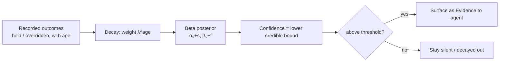
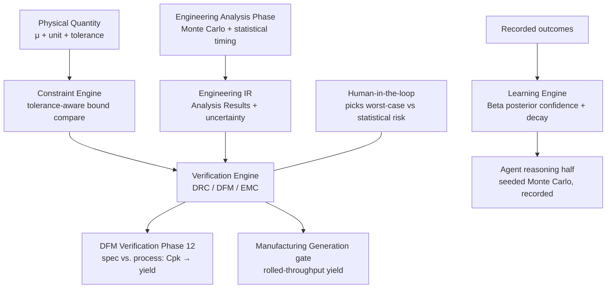

# Probability & Statistics

**Summary.** Every physical value the runtime touches is uncertain: a "10 kΩ" resistor is `10 kΩ ±1 %`, an etched trace is its drawn width minus a process-dependent random bias, a propagation delay is a distribution, not a number. This document is the theory of how that uncertainty *propagates* through a design and *aggregates* into a single number a business cares about — **yield**, the fraction of manufactured boards that work and ship. It belongs in the Engineering Science Layer because the EAK runtime never announces that it is doing statistics, yet it makes statistical decisions constantly: a tolerance-aware comparison near a bound ([units-and-quantities](../../docs/engineering/units-and-quantities.md)), a DFM manufacturability check that is really a process-capability question ([dfm-verification](../../docs/state-machines/dfm-verification.md)), and a [Learning Engine](../../docs/engineering/learning-engine.md) "confidence" that is a posterior over a lesson's success rate. It grounds three runtime concepts: **tolerance propagation** (worst-case vs. statistical — the open choice in [units-and-quantities §9](../../docs/engineering/units-and-quantities.md)), **DFM yield reasoning** (a spec limit against a process distribution), and **learning-engine confidence** (a curated estimate from recorded outcomes, with decay). Choosing the right statistical model — which distribution, whether to add tolerances linearly or in quadrature, how many Monte-Carlo samples buy how much certainty — is the difference between a runtime that over-designs every board into uselessness and one that ships at a known, defensible yield.

---

## Core principles

### 1. Parameters are random variables; tolerance is their spread

A component parameter `X` is modelled as a random variable with a **nominal** (mean) `μ`, a **standard deviation** `σ`, and a **distribution** describing how mass is spread:

| Distribution | Shape | When it is the right model |
|--------------|-------|----------------------------|
| **Uniform** on `[μ−T, μ+T]` | flat | A tolerance band with *no* central tendency — e.g. a sorted/binned part where any value in-band is equally likely. Worst case for spread; `σ = T/√3`. |
| **Normal** `N(μ, σ²)` | bell | A parameter driven by many small independent effects (Central Limit Theorem). The default for an *unsorted* process output. A `±T` spec usually means `T = kσ` for some `k` (commonly `k=3`). |
| **Truncated normal** | bell with hard cut at `±T` | A normal process after **100 % screening** removes out-of-spec parts — realistic for tested components. |
| **Triangular** | peaked | A conservative stand-in for a normal when only `(min, typical, max)` are known from a datasheet. |

The **Central Limit Theorem (CLT)** is why the normal model recurs: a sum of many independent random contributions tends to a normal regardless of the individual shapes. It is also a trap — it does *not* license assuming normality for a small number of dominant, possibly correlated, sources (§2, §6).

```text
mean      μ   = E[X]
variance  σ²  = E[(X − μ)²]
tolerance T   (half-band);   if T = k·σ then σ = T/k   (k = 3 is the common convention)
uniform band [μ−T, μ+T]:  σ = T/√3 ≈ 0.577·T
```

### 2. Worst-case vs. statistical (RSS) propagation

Given an output `y = f(x_1, …, x_n)` of `n` toleranced inputs, first-order propagation linearizes around nominal:

```text
Δy ≈ Σ_i  (∂f/∂x_i)·Δx_i          # sensitivity Sᵢ = ∂f/∂x_i, evaluated at nominal
```

Two ways to combine the input half-tolerances `T_i` into an output half-tolerance `T_y` — the **single most consequential statistical modelling choice in the runtime**:

```text
# Worst-case (WCA): every input simultaneously at its worst extreme
T_y,WC  = Σ_i |S_i|·T_i

# Root-sum-square (RSS / statistical): inputs vary independently
T_y,RSS = sqrt( Σ_i (S_i·T_i)² )      # valid iff the T_i are independent and at the same k·σ
```

- **Worst-case** guarantees **100 % yield by construction** but is pessimistic: the probability that *all* `n` inputs hit their worst extreme *and* in the worst direction is astronomically small for large `n`. It over-designs — demanding tighter (costlier) parts than reality requires.
- **RSS** predicts the *typical* spread. Because variances add for independent variables, `T_y,RSS ≤ T_y,WC` always (often by `√n`), so RSS permits looser, cheaper parts — at the price of a small, *quantified* out-of-spec fraction. RSS is exact only when `f` is near-linear over the band and the inputs are independent; correlation or strong nonlinearity breaks it (use Monte Carlo, §3).

This is precisely the *worst-case vs. statistical* tolerance-propagation method left open in [units-and-quantities §9](../../docs/engineering/units-and-quantities.md). The two are not interchangeable defaults: a **safety** bound (a maximum junction temperature, an absolute-max voltage) must be checked worst-case; a **yield/cost** target may legitimately use RSS.

```mermaid
flowchart TD
  IN[Toleranced inputs xᵢ ± Tᵢ] --> SENS[Sensitivities Sᵢ = ∂f/∂xᵢ at nominal]
  SENS --> WC[Worst-case: Σ|Sᵢ|·Tᵢ\n100% yield, over-design]
  SENS --> RSS[RSS: √Σ(Sᵢ·Tᵢ)²\ntypical spread, quantified risk]
  IN --> MC[Monte Carlo\nnonlinear + correlated]
  WC --> PICK{safety bound?}
  RSS --> PICK
  MC --> PICK
  PICK -->|yes| HARD[check worst-case]
  PICK -->|no| SOFT[check statistical / yield]
```
*Three propagation methods feeding one decision: safety bounds take worst-case, yield/cost bounds may take RSS or Monte Carlo.*

### 3. Monte Carlo tolerance analysis

When `f` is nonlinear, discontinuous (a comparator, a binning decision), or its inputs are correlated, linear RSS lies. **Monte Carlo** samples each input from its distribution, evaluates the *true* `f`, and estimates yield empirically:

```text
for trial = 1..N:
    draw xᵢ ~ distribution(xᵢ)              # using a RECORDED seed (see Mapping)
    yʲ = f(x₁,…,xₙ)
    passʲ = 1 if yʲ ∈ spec else 0
ŷ = (1/N) Σ passʲ                            # estimated yield (a fraction)
```

The estimator's error is governed by the binomial variance of a proportion `p`:

```text
Var(ŷ) = p(1−p)/N         standard error  SE = sqrt(p(1−p)/N)
95% CI ≈ ŷ ± 1.96·SE      →  error shrinks as O(N^(−1/2)), INDEPENDENT of dimension n
```

The dimension-independence is the whole reason Monte Carlo beats grid sampling for many-parameter boards: a 40-parameter analog stage costs the same per-trial-accuracy as a 4-parameter one. The cost is samples: resolving a 99 % yield to `±0.1 %` needs `N ≈ 1.96²·(0.99·0.01)/0.001² ≈ 3.8×10⁴` trials. **Variance-reduction** (Latin-hypercube sampling, importance sampling toward the failing tail) buys the same confidence with fewer trials and matters when each evaluation is an expensive simulation. Monte Carlo is honest about uncertainty in a way closed forms are not — but only if the **seed is recorded**, or the "estimate" is irreproducible noise (see [Failure modes](#failure-modes-if-violated)).

### 4. Process capability — Cp, Cpk, and six-sigma

Manufacturing turns a *specification* (a min trace width, an annular-ring minimum, a placement tolerance) into a **yield question**: how does the spec window `[LSL, USL]` compare to the fab process's own distribution `N(μ, σ)`?

```text
Cp  = (USL − LSL) / (6σ)                              # potential capability (assumes centered)
Cpk = min( (USL − μ), (μ − LSL) ) / (3σ)             # actual capability (penalizes off-center μ)
```

`Cp` asks "is the process *tight enough* to fit the window?"; `Cpk` also asks "is it *centered* in the window?". `Cpk ≤ Cp` always, with equality only when perfectly centered. The capability index maps directly to a defect rate:

| Process | Cpk (centered) | One-sided defect rate | Note |
|---------|----------------|------------------------|------|
| ±3σ | 1.00 | ≈ 1350 ppm | barely capable; common minimum |
| ±4σ | 1.33 | ≈ 32 ppm | typical "capable" target |
| ±5σ | 1.67 | ≈ 0.29 ppm | tight |
| **±6σ ("six-sigma")** | **2.00** | ≈ 1 ppb centered; **3.4 ppm** with a 1.5σ long-term mean shift | the six-sigma standard |

The famous **3.4 DPMO** (defects per million opportunities) figure assumes the process mean drifts `1.5σ` over the long run, so a nominally `6σ` window behaves like `4.5σ` in production. The lesson for DFM: a manufacturability rule is not pass/fail in the abstract — its *margin* over the process spread is what sets yield, and a rule that sits at `Cpk ≈ 1` will scrap one board in ~740 on that feature alone.

### 5. Yield aggregates multiplicatively

A board is not one opportunity; it is thousands (every joint, via, trace segment, drill). For independent features with per-feature yields `Y_i`:

```text
First-pass yield  Y = Π_i Y_i = Π_i (1 − p_i) ≈ exp(−Σ_i p_i)   for small p_i
```

This product is unforgiving. A board with 2000 solder joints each at a "good" `Y_i = 0.9999` (100 ppm defect) yields only `0.9999^2000 ≈ 0.819` — **one board in five fails** on joints alone, before any other feature. This multiplicative law is *why* electronics manufacturing chases six-sigma per feature: only single-digit-ppm feature defect rates survive aggregation over a large board. **Rolled-throughput yield** generalizes this across process steps, and is the number a manufacturing cost model ultimately needs.

### 6. Statistical timing

Timing is a sum-of-random-variables problem. A path delay `D` is the sum of stage delays `d_i`, each a random variable over process/voltage/temperature:

```text
D = Σ_i d_i        μ_D = Σ_i μ_i        σ_D² = Σ_i σ_i² + 2·Σ_{i<j} cov(d_i, d_j)
slack = T_required − D
timing yield = P(slack ≥ 0) = Φ( (T_required − μ_D) / σ_D )      # Φ = standard normal CDF
```

**Static** timing sums worst-case stage delays — correct but pessimistic, because it assumes every stage is simultaneously slow (the §2 worst-case problem again). **Statistical** static timing analysis (SSTA) propagates the *distributions*, recognizing that independent stage variations partially cancel (`σ_D` grows like `√n`, not `n`). The subtlety is the **max over many paths**: the slowest path is the max of several delay random variables, and the max of normals is *not* normal and has a mean above any individual mean — so naive per-path Gaussians under-state the chip-level worst path. **Correlation** (a global process corner shifts all stages together) is the dominant term and must not be dropped. For EAK, "delay" is the length/impedance-derived propagation of a [Net](../../docs/foundation/engineering-domain-model.md#net), checked against setup/hold-style timing constraints.

### 7. Confidence as a posterior — the learning-engine basis

The [Learning Engine](../../docs/engineering/learning-engine.md) tracks, for each lesson, how often it **held** vs. was **overridden**, and turns that into a *confidence*. The correct, deterministic model is **Beta–Binomial** conjugacy. Treat each application of a lesson as a Bernoulli trial (held = success). With a prior `Beta(α₀, β₀)` and observed `s` successes and `f` overrides:

```text
posterior      Beta(α₀ + s, β₀ + f)
point estimate mean = (α₀ + s) / (α₀ + β₀ + s + f)        # never 1.0 from a finite sample
uncertainty    a credible interval from the Beta CDF; report the LOWER bound as "confidence"
```

Reporting a **lower credible bound** (or the frequentist **Wilson score interval**) rather than the raw success ratio is what keeps a lesson that held "3 of 3 times" from masquerading as certain — its lower bound is modest because `N` is small. **Decay** is exponential forgetting: weight an outcome of age `t` by `λ^t` (`0<λ<1`), so stale evidence discounts smoothly toward the prior; this is just discounting the counts `s, f` before forming the posterior. Because every term is computed from **recorded outcomes** with a fixed prior and `λ`, the confidence is reproducible on replay ([P4](../../docs/foundation/principles.md)) — exactly the "confidence derived deterministically from recorded outcomes" the Learning Engine promises.


*A lesson's confidence is a decayed Beta posterior over its hold-rate; only lessons whose lower bound clears a threshold are surfaced.*

---

## Why it matters for electronics & PCB design

- **Tolerance decides whether a "passing" design actually passes.** A divider built from `±1 %` resistors does not output its nominal voltage; its output spread (RSS or worst-case) must clear the reference window. A check against the *nominal* value alone is the classic "passes on paper, fails at worst case" defect ([units-and-quantities §5](../../docs/engineering/units-and-quantities.md), [ohms-law](../electrical/ohms-law.md)).
- **DFM is process capability in disguise.** "Minimum trace/space," "minimum annular ring," "solder-mask sliver" — each is a spec limit `LSL` against the fab's etch/registration/print distribution. A rule sitting at `Cpk ≈ 1` is not "manufacturable"; it is a one-in-hundreds scrap source. Design margin is `Cpk`, and `Cpk` is yield.
- **Large boards punish mediocre per-feature yield.** The multiplicative law (§5) means a thousand-joint board needs single-ppm feature defect rates to ship economically. This is the quantitative reason DFM rules carry margin rather than sitting exactly on the process edge.
- **Statistical thinking prevents both over- and under-design.** Pure worst-case over-specifies every part and inflates BOM cost; pure nominal under-specifies and scraps boards. The runtime needs *both* models and must apply each where it belongs — worst-case for safety, statistical for cost/yield.
- **Per-net-class widths and the regulator VIN/VOUT split are tolerance-aware.** A current-derived minimum width must hold at the worst-case copper thickness and etch bias, not nominal; splitting the collapsed power rail into distinct VIN/VOUT nets lets each carry its own current distribution and width margin instead of one averaged fiction.

---

## Mapping to the runtime

This is the point of the document: the statistics above are silently embodied by named EAK artifacts, and getting the statistical model wrong is a concrete runtime bug.


*Where tolerance, yield, and confidence live in the runtime: a typed quantity carries spread, the Engineering Analysis phase quantifies it, the verification gates judge it, and the Learning Engine scores its own track record.*

- **Tolerance is a first-class field of every Physical Quantity.** [units-and-quantities](../../docs/engineering/units-and-quantities.md) makes `magnitude + unit + tolerance` one value, and §5 there states that tolerance must flow through derived quantities and comparisons. *This document is the theory it defers to.* The open ADR — "default tolerance-propagation method (worst-case vs. statistical) and whether it is configurable per check" — is decided by §2 here: safety bounds worst-case, yield/cost bounds RSS/Monte-Carlo. A [Constraint Engine](../../docs/engineering/constraint-engine.md) comparison near a bound must use the worst-case *or* statistical interval per that policy; comparing nominals is the bug.
- **DFM Verification is a process-capability gate.** [DFM Verification (Phase 12)](../../docs/state-machines/dfm-verification.md) checks acid traps, slivers, spacing, and annular rings against fab-process limits. Each is a `Cpk` question (§4): the rule's margin over the fab distribution sets per-feature yield, and the §5 product over all features sets board yield. A DFM rule placed exactly on the process edge (`Cpk≈1`) is mis-calibrated — manufacturable in name, low-yield in fact. The `indeterminate` outcome (unknown fab limit) is correctly treated as *not passable*, never silently passed.
- **Monte Carlo and statistical timing live in Engineering Analysis.** The [Engineering Analysis phase](../../docs/state-machines/engineering-analysis.md) is where §3 (Monte-Carlo tolerance yield) and §6 (statistical timing) run, writing typed uncertainty into the [Engineering IR](../../docs/compiler/ir/engineering-ir.md) as [Analysis Results](../../docs/foundation/engineering-domain-model.md#analysis-result) the verification gates consult.
- **Manufacturing Generation is the rolled-throughput-yield gate.** [Manufacturing Generation](../../docs/state-machines/manufacturing-generation.md) is the terminal global gate; the §5 multiplicative yield over features (and panelization) is the quantity a [Manufacturing IR](../../docs/compiler/ir/manufacturing-ir.md) cost/yield model ultimately reports. A board may be DRC-clean yet economically unmanufacturable if its aggregate yield is too low — a statistical fact the gate must surface.
- **Learning-engine confidence is a Beta posterior.** §7 *is* the deterministic confidence the [Learning Engine](../../docs/engineering/learning-engine.md) computes: hold/override counts → decayed Beta posterior → lower-bound confidence, with stale lessons decaying toward the prior. The engine "contains no stochastic reasoning of its own" — Beta–Binomial updating is arithmetic over recorded outcomes, fully reproducible ([P3](../../docs/foundation/principles.md), [P4](../../docs/foundation/principles.md)). Surfacing a lesson on a raw 3/3 ratio instead of its lower bound would be the over-fitting failure the engine explicitly guards against.
- **Stochastic sampling is reasoning-side, but its seed is recorded.** Any Monte-Carlo draw the agent's reasoning half performs is non-deterministic *content*; the runtime keeps replay intact by recording the **seed** as an [Event](../../docs/engineering/planning-engine.md), so the same sampling reproduces ([P3](../../docs/foundation/principles.md) boundary, [P4](../../docs/foundation/principles.md) replay). An unseeded estimator is a determinism bug, not a modelling choice.
- **The engineer owns the risk appetite.** Whether a given check accepts a statistical (some-scrap) yield target or demands worst-case (zero-scrap) margin is a value judgement, not a computation — surfaced through [Human-in-the-loop](../../docs/engineering/human-in-the-loop.md) autonomy levels and waiver disposition, exactly as a DFM waiver records "we accept this yield at this scope" ([P10](../../docs/foundation/principles.md)).

---

## Failure modes if violated

- **Nominal-only comparison.** Checking a value against a bound using its nominal, ignoring tolerance, passes designs that fail at the band edge. Fix: tolerance-aware (worst-case *or* statistical) comparison in the [Constraint Engine](../../docs/engineering/constraint-engine.md), per [units-and-quantities](../../docs/engineering/units-and-quantities.md).
- **Worst-case where statistical belongs (and vice-versa).** Worst-case on a yield/cost target over-specifies the BOM into needless expense; statistical (RSS) on a *safety* bound under-protects and can ship an unsafe board. Fix: the §2 split — safety worst-case, yield/cost statistical — encoded as a per-check policy, with the engineer disposing of the risk.
- **RSS applied to correlated or nonlinear systems.** Quadrature assumes independence and near-linearity; common-cause variation (one process corner moving all parts) or a sharp nonlinearity makes RSS optimistic and the predicted yield a fiction. Fix: Monte Carlo (§3) when correlation or nonlinearity is present.
- **Unseeded / unrecorded Monte Carlo.** A yield "estimate" that changes every run breaks replay and provenance ([P4](../../docs/foundation/principles.md)); two runs of the same design disagree. Fix: record the seed and `N` as Events; report the confidence interval, not a bare point.
- **DFM rule with no capability margin.** A manufacturability limit set exactly on the process edge (`Cpk≈1`) is reported "manufacturable" yet scraps boards at hundreds of ppm. Fix: rules carry a margin sized to a target `Cpk`; the [DFM phase](../../docs/state-machines/dfm-verification.md) reasons about margin, not just pass/fail.
- **Ignoring the multiplicative yield law.** Judging features in isolation hides that a large board's aggregate yield is the *product* of thousands of "fine" feature yields. Fix: roll up per-feature yields at [Manufacturing Generation](../../docs/state-machines/manufacturing-generation.md) and gate on the aggregate.
- **Per-path Gaussian timing without the max correction.** Treating the slowest path as a single normal under-states the chip-level worst delay; correlated corners ignored makes it worse. Fix: SSTA (§6) — propagate distributions, model the max-of-paths and global correlation.
- **Over-confident lessons.** Reporting a lesson's raw success ratio (`3/3 = 1.0`) instead of a lower credible bound mis-applies thin experience broadly — the Learning Engine's named over-fitting failure. Fix: Beta lower bound plus decay (§7); the engineer always disposes ([P10](../../docs/foundation/principles.md)).

---

## Related documents

- [optimization-theory](./optimization-theory.md) — Monte Carlo as sampling search; objective weights that this layer's yield estimates inform.
- [numerical-methods](./numerical-methods.md) — Monte-Carlo integration error, convergence, and the numerics behind sensitivity `∂f/∂x` computation.
- [linear-algebra](./linear-algebra.md) — covariance matrices, the quadratic form behind RSS, and correlation in statistical timing.
- [constraint-satisfaction](./constraint-satisfaction.md) — tolerance bands as the feasible windows a constraint must respect.
- [../electrical/ohms-law.md](../electrical/ohms-law.md) — why a toleranced resistor divider's output spread, not its nominal, is what a check must clear.
- Runtime: [units-and-quantities](../../docs/engineering/units-and-quantities.md) · [constraint-engine](../../docs/engineering/constraint-engine.md) · [verification-engine](../../docs/engineering/verification-engine.md) · [learning-engine](../../docs/engineering/learning-engine.md) · [human-in-the-loop](../../docs/engineering/human-in-the-loop.md) · [standards-and-compliance](../../docs/engineering/standards-and-compliance.md)
- State machines: [dfm-verification](../../docs/state-machines/dfm-verification.md) · [drc-verification](../../docs/state-machines/drc-verification.md) · [engineering-analysis](../../docs/state-machines/engineering-analysis.md) · [manufacturing-generation](../../docs/state-machines/manufacturing-generation.md)
- IR & foundation: [engineering-ir](../../docs/compiler/ir/engineering-ir.md) · [manufacturing-ir](../../docs/compiler/ir/manufacturing-ir.md) · [engineering-domain-model](../../docs/foundation/engineering-domain-model.md) · [principles](../../docs/foundation/principles.md) · [GLOSSARY](../../docs/GLOSSARY.md)
