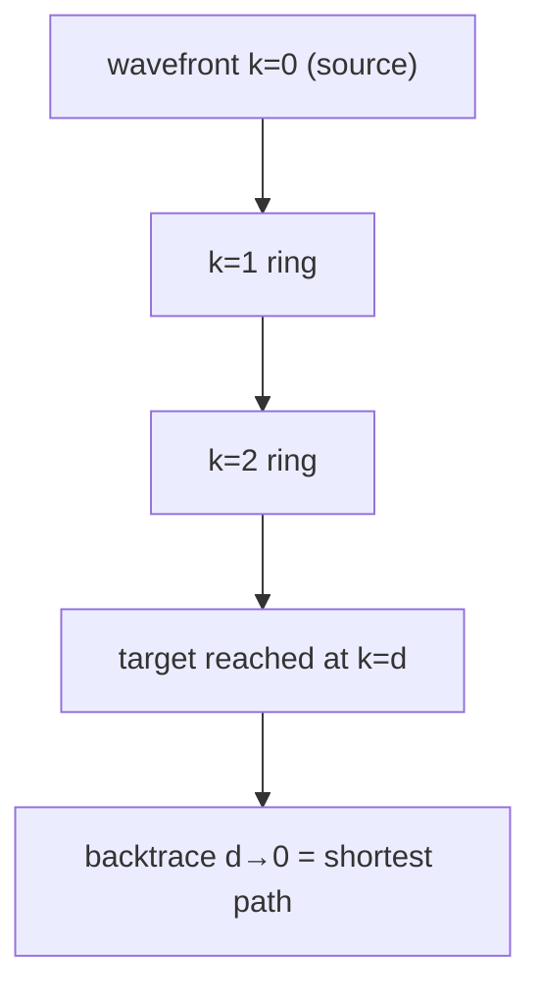
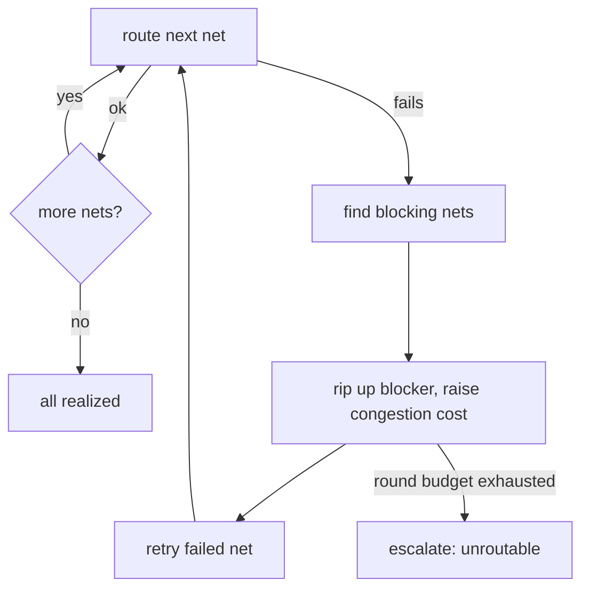

# Search Algorithms

**Summary.** A search algorithm explores a *state space* — a graph of partial or complete design configurations — looking for one that satisfies a goal at acceptable cost. This document belongs in the Engineering Science Layer because the two hardest phases the EAK runtime drives, [Component Placement](../../docs/state-machines/component-placement.md) and [Routing Planning](../../docs/state-machines/routing-planning.md), are *search problems wearing engineering clothes*: "find a copper path from pad A to pad B that avoids every obstacle" is single-source shortest path on a grid graph (Lee/maze routing, A\*); "seat these components to minimise wirelength without overlap" is combinatorial search (branch-and-bound, beam search); and "this net will not route, so undo a competitor and try again" is backtracking search (rip-up-and-retry). The runtime never announces "I am now searching," yet every `Proposing*` state proposes a point in a search space, every `Validating*` state is a goal/feasibility test, and every DRC/EMC/DFM loop-back is the outer search backtracking. This document grounds the *completeness* guarantees the runtime silently relies on (an unrouted net is a search that failed, not a board that is unroutable) and the *admissibility* conditions that make a heuristic safe to trust. It is the algorithmic complement to [optimization-theory.md](optimization-theory.md) (what we minimise) and [graph-theory.md](graph-theory.md) (the graph we search over).

---

## Core principles

### 1. The state-space model

Every search problem is five things ([`GLOSSARY.md`](../../docs/GLOSSARY.md) vocabulary in brackets):

- **States** — configurations of the design. For routing, a state is a routing-grid cell already reached; for placement, a partial assignment of [Components](../../docs/foundation/engineering-domain-model.md#component) to positions.
- **Successor function** — the legal moves out of a state (step to an adjacent free grid cell; place the next component in an allowed pose).
- **Goal test** — predicate that recognises a solution (the target pad is reached; all components seated with no courtyard overlap). In EAK this predicate is the [Constraint Engine](../../docs/engineering/constraint-engine.md) feasibility check run in a `Validating*` state.
- **Path cost** `g(n)` — accumulated cost to reach state `n` (track length, via count, congestion, thermal penalty).
- **Frontier** — the set of generated-but-unexpanded states; the order we pull from it *is* the algorithm.

```text
search(start, goal_test, successors, cost):
    frontier ← {start}            # ordering of frontier defines the algorithm
    explored ← {}
    while frontier not empty:
        n ← frontier.pop()        # FIFO=BFS, priority=Dijkstra/A*, top-k=beam
        if goal_test(n): return reconstruct_path(n)
        explored.add(n)
        for s in successors(n):
            if s not in explored: frontier.add(s, key=...)
    return FAILURE                 # exhausted ⇒ provably no solution (if complete)
```
*Listing: one skeleton; the frontier discipline (FIFO, priority, bounded top-k) selects BFS, Dijkstra, A\*, or beam search.*

Two properties classify every algorithm and are the whole point of this layer:

- **Completeness** — if a solution exists, the algorithm finds one (or reports failure only when none exists).
- **Optimality (admissibility of the result)** — the solution returned has minimum cost.

The runtime treats a `FAILURE` return as ground truth ("board unroutable" → `Failed`). That treatment is **only valid if the search is complete.** An incomplete search that returns `FAILURE` is making a false claim, which is the central failure mode catalogued below.

### 2. Maze / Lee routing — breadth-first wavefront on a grid

Lee's algorithm models a routing layer as a uniform grid of cells; each cell is *free* or *blocked*. Blocked cells encode obstacles: existing copper, pads of other nets, vias, [keep-outs](../../docs/state-machines/dfm-verification.md), and — critically — the **clearance-inflated** footprint of every obstacle and the **board-edge keep-out**, because a track centre-line that is legal must still leave half-a-width plus clearance to anything it passes. The free cells form a graph `G=(V,E)`; routing one two-pin connection is shortest path from source cell to target cell in `G`.

Lee expands a **breadth-first wavefront**: label the source `0`, all free neighbours `1`, their unlabelled free neighbours `2`, and so on, until the target is labelled, then **backtrace** down the strictly decreasing labels to recover the path.


*Figure: Lee's wavefront grows one ring per step; first contact with the target is provably a minimum-length path.*

- **Completeness:** total — it explores the whole connected free region before giving up.
- **Optimality:** on a unit-cost grid the first time the target is dequeued, its distance label is the true minimum (a BFS theorem).
- **Cost:** time and memory are `O(|V|)` ≈ rows × columns × layers — Lee's weakness. Wavefront-shaping variants (search biased toward the target) and line-probe methods cut the constant but not the worst case.

When edges carry **non-unit weights** — a via costs more than a straight step, a congested region is penalised, a 45° step costs `√2` — breadth-first ordering is wrong and the frontier must be a **priority queue keyed by `g(n)`**. That is **Dijkstra's algorithm**: still complete and optimal, now over weighted copper. Per-net-class via penalties and the higher effective cost of a wide power trace enter here as edge weights (see [graph-theory.md](graph-theory.md) for the weighted grid graph).

### 3. A\* and admissible heuristics

Dijkstra expands cells in every direction equally; it wastes effort exploring away from the target. **A\*** repairs this by ordering the frontier on

```text
f(n) = g(n) + h(n)
```

where `g(n)` is the known cost-so-far and `h(n)` is a **heuristic estimate** of the remaining cost from `n` to the goal. The heuristic focuses the search down the productive corridor without abandoning the cost accounting.

Two conditions on `h` carry the guarantees:

- **Admissibility:** `h(n) ≤ h*(n)` for all `n`, where `h*` is the true optimal remaining cost. *An admissible heuristic never over-estimates.* Under admissibility, tree-search A\* returns an **optimal** path.
- **Consistency (monotonicity):** `h(n) ≤ c(n, n') + h(n')` for every successor `n'`. Consistency implies admissibility and additionally guarantees that **once a node is expanded its optimal cost is settled** — no re-expansion, so graph-search A\* stays efficient.

For a 4-connected routing grid the **Manhattan distance** `h = |Δrow| + |Δcol|` (scaled by the unit step cost, plus a lower-bound via cost when the target is on another layer) is both admissible and consistent — it is exactly the cost of an *unobstructed* path, which can only be ≤ the real, obstacle-dodging cost. For 8-connected grids the octile distance plays the same role. This is why A\* is the workhorse of grid routing: it is **as fast as the heuristic is informed, yet provably optimal as long as the heuristic stays a lower bound.**

**Weighted (bounded-suboptimal) A\*** inflates the heuristic, `f = g + w·h` with `w > 1`. It expands far fewer nodes — valuable on a dense board — at the price of a guarantee that the returned path costs at most `w ×` the optimum. The bound is *known and finite*; this is a controlled trade, not a gamble. Greedy best-first search is the extreme `g`-dropped case (`f = h`): very fast, but **neither optimal nor complete on a large graph** — acceptable only as a first probe whose result is re-validated.

```text
Algorithm        Complete   Optimal           Frontier            Memory
---------------------------------------------------------------------------
BFS / Lee        yes        yes (unit cost)    FIFO                O(|V|)
Dijkstra         yes        yes (weighted)     min-heap on g       O(|V|)
A* (admissible)  yes        yes                min-heap on g+h     O(|V|) worst
Weighted A* (w)  yes        ≤ w·optimum        min-heap on g+w·h   « A*
Greedy best-1st  no*        no                 min-heap on h       small
Beam (width k)   no         no                 top-k per layer     O(k·depth)
```
*Table: the completeness/optimality/cost trade-off the runtime must choose among per situation. (\*greedy is complete only on finite graphs with cycle checking, never optimal.)*

### 4. Branch-and-bound for placement (combinatorial search)

Placement has no smooth grid path to walk; it is a discrete assignment of poses to components — a tree where each level fixes one more component. Exhaustive enumeration is factorial and hopeless. **Branch-and-bound (B&B)** makes it tractable:

- **Branch:** at each tree node, fork on the next decision (which pose for the next component).
- **Bound:** compute a **lower bound** on the best achievable cost of *any* completion of this partial assignment (e.g. the half-perimeter wirelength already committed plus an optimistic estimate of the rest).
- **Prune:** if a node's lower bound is `≥` the cost of the best complete solution found so far (the *incumbent*), discard the whole subtree — it cannot beat what we have.

B&B is **complete and optimal** *provided the bound is a true lower bound* (the same admissibility idea as A\*: never over-estimate the optimistic case). Tighter bounds prune more and run faster; an invalid bound that ever exceeds the real optimum will prune the optimum away and silently return a worse answer — a correctness bug, not a speed regression.

### 5. Beam search — bounded-memory placement

When even B&B's surviving tree is too large, **beam search** trades completeness for a hard memory bound. At each level it generates successors but keeps only the **best `k`** by an evaluation heuristic (the *beam width* `k`); the rest are dropped permanently.

- **Memory:** `O(k · depth)` — flat and predictable, which is what a bounded runtime budget needs.
- **Completeness/optimality:** *neither.* If the optimal placement passes through a node ranked `k+1` at any level, it is lost forever. A wider beam recovers more of the search at linear cost; `k = ∞` degenerates to full breadth-first.

Beam search is the natural model for the [Placement Agent](../../docs/state-machines/component-placement.md) proposing and refining a handful of candidate layouts rather than enumerating all of them, and for any phase whose [reasoning plan](../../docs/engineering/planning-engine.md) keeps a small set of live alternatives.

### 6. Rip-up-and-retry as search

Nets are not independent: routing net A may occupy the only corridor net B needed. Routing nets **one at a time** (sequential routing) is therefore a *greedy* search over the space of net orderings, and greedy order is often wrong — a later net finds its region fenced off and returns `FAILURE` even though a global solution exists. The fix is **backtracking**:

1. Route nets in some order; when a net fails, identify the already-routed nets **blocking** it.
2. **Rip up** one or more blockers (undo their copper), route the failed net through the freed space, then **retry** the ripped nets — possibly displacing yet others.
3. To prevent thrashing, raise the **cost** of contested cells each round so nets *negotiate* away from congestion instead of trading the same corridor forever (iterative congestion-cost search). Bound the number of rounds.


*Figure: rip-up-and-retry is backtracking search over net assignments, with a bounded round budget so termination is guaranteed.*

This is structurally identical to conflict-directed backtracking in [constraint-satisfaction.md](constraint-satisfaction.md): a failed net is a conflict, rip-up is the un-assignment, and rising congestion cost is the no-good that steers the next attempt. Without rip-up, sequential routing is *incomplete* — and an incomplete router that reports "unroutable" is lying to the orchestrator.

### 7. Completeness vs. heuristic trade-offs (the engineering decision)

The recurring decision is *how much guarantee to buy*:

- **Complete + optimal** (Lee, Dijkstra, admissible A\*, valid B&B) — trustworthy `FAILURE`, best-cost result, highest expansion count. Use where a wrong "unroutable" is expensive and the graph is bounded.
- **Bounded-suboptimal** (weighted A\*, `w` known) — finite, named quality loss for large speed-ups. Use on dense boards where optimal is unaffordable but a quality *bound* is still required.
- **Incomplete** (greedy, beam) — fast and memory-flat, but a `FAILURE` (or a dropped candidate) proves nothing. Only safe **behind a completeness backstop**: an independent check that recovers from a missed solution.

EAK's architecture supplies exactly that backstop. The fast/incomplete search runs inside a phase; an *independent* verification gate (DRC's unrouted-net rule, the `ValidatingRouting` net-realization invariant) re-asserts completeness from scratch, and the [Workflow Orchestrator](../../docs/core/workflow-orchestration.md) supplies the outer backtracking via loop-back. Speed inside, guarantees outside.

---

## Why it matters for electronics & PCB design

- **A track is a path; a board is a search result.** Copper that connects the right pads while dodging every clearance, keep-out, and competitor net is precisely the output of a shortest-path search on the free-cell graph. The quality of that search shows up physically: extra length and vias degrade signal integrity and add resistance ([ohm's law / IR-drop reasoning](optimization-theory.md)).
- **"Unroutable" is a claim that must be earned.** Declaring a board unroutable and looping back to placement is expensive (it discards an entire routing phase). Only a *complete* search may make that claim; an incomplete one triggers needless placement churn.
- **Heuristics decide whether the runtime terminates.** A well-chosen admissible heuristic turns a board that Dijkstra would grind on into a fast A\* solve. A poorly chosen (inadmissible) one yields longer copper or false failures. The choice is an engineering decision with measurable physical consequences.
- **Placement search bounds everything downstream.** A beam that is too narrow seats components such that no router can win; the cost of a bad placement search is paid in the routing and DRC loops, not in placement.

---

## Mapping to the runtime

This section is the point of the layer: each principle names a concrete EAK artifact it grounds.

- **Routing Planning is grid search.** [`routing-planning.md`](../../docs/state-machines/routing-planning.md): the `PlanningRouting` state proposes [Tracks](../../docs/foundation/engineering-domain-model.md#track--routing) — i.e. it runs the path search of §2–§3 over the free-cell grid for each net. `ValidatingRouting` enforces the invariant that "every Net's [Connections](../../docs/foundation/engineering-domain-model.md#connection) are realized — no more, no less," which is **exactly the completeness goal-test of §1**. The transition `PlanningRouting → Failed (board unroutable)` is the search returning `FAILURE`; per §6 it is sound only because rip-up-and-retry makes the inner search complete enough and the outer loop-backs cover the rest.
- **Component Placement is combinatorial search.** [`component-placement.md`](../../docs/state-machines/component-placement.md): `ProposingPlacement` is one node in the B&B/beam tree of §4–§5; `ValidatingPlacement` ("courtyards do not overlap; placements stay inside their region; keep-out and thermal constraints hold") is the feasibility goal-test; `ProposingPlacement → Failed (infeasible)` is search exhaustion. The `locked` flag on a [Placement](../../docs/foundation/engineering-domain-model.md#placement) **fixes a variable**, pruning the search tree exactly as B&B does.
- **The reasoning plan *is* a bounded search.** [`planning-engine.md`](../../docs/engineering/planning-engine.md): a plan is a small DAG of steps the agent searches over, and **deterministic replanning bounded by a retry/replan budget is rip-up-and-retry with a round limit** (§6). Budget exhaustion → `Escalated` is the search terminating without a solution. The engine validating a plan before it runs is the feasibility pruning of §4.
- **The Constraint Engine is the goal/feasibility oracle.** [`constraint-engine.md`](../../docs/engineering/constraint-engine.md): every successor a search generates is admitted only if it passes constraint checks; the engine is the `goal_test`/pruning predicate of §1 and §4. A [Constraint](../../docs/foundation/engineering-domain-model.md#constraint) violation is how a search node is rejected.
- **Per-net-class trace widths reshape the search graph.** A wider required width consumes more clearance, so **fewer grid cells are traversable** for that net — width is not a post-hoc check but a parameter of the successor function and of edge cost (§2). The router must search the *width-correct* graph; searching the nominal graph and widening afterward produces paths that DRC later rejects.
- **The board-edge keep-out is blocked cells.** The DFM-sourced edge-clearance keep-out marks a band of grid cells as `blocked` before the wavefront/A\* ever expands (§2). If the search ignored it, it would return "optimal" paths that violate the edge clearance — a guaranteed [DFM](../../docs/state-machines/dfm-verification.md) loop-back. Encoding the keep-out *into the graph* makes every searched path legal by construction.
- **The regulator VIN/VOUT rail split changes the search instance.** Splitting one collapsed power rail into distinct VIN and VOUT nets turns one routing target into **two hyperedges that must each be realized** at their (wide) net-class width. Net ordering and rip-up interplay between them (§6) now matters; the search must satisfy both, and `ValidatingRouting` confirms both are realized.
- **DRC's unrouted-net rule is the completeness backstop.** [`drc-verification.md`](../../docs/state-machines/drc-verification.md): an independent rule that flags any net the router failed to realize. Per §6 this is the *external* completeness guarantee that lets the inner router use fast, possibly incomplete heuristics safely — defence in depth against a search that silently dropped a net.
- **DRC/EMC/DFM loop-backs are the outer backtracking search.** [`workflow-orchestration.md`](../../docs/core/workflow-orchestration.md): the phase DAG with loop-backs from [DRC](../../docs/state-machines/drc-verification.md)/[EMC](../../docs/state-machines/emc-analysis.md) to Routing, and [DFM](../../docs/state-machines/dfm-verification.md) to Placement, is itself a search with backtracking — each loop-back un-does a phase and re-searches with new no-goods, exactly mirroring rip-up at the project scale. The [verification gates](../../docs/engineering/verification-engine.md) are its goal tests.
- **Autonomy and budgets bound the search.** [`human-in-the-loop.md`](../../docs/engineering/human-in-the-loop.md): the retry/replan and cost budgets that bound rip-up rounds and beam width are what guarantee **termination** — without them §6 can loop forever (see Failure modes).

---

## Failure modes if violated

- **Inadmissible heuristic → wrong copper or false failure.** If `h(n) > h*(n)` (§3), A\* can return a non-shortest path — longer traces, more vias, worse impedance and IR-drop — or skip the corridor that held the only solution and declare a routable net unroutable. The fix is a provable lower bound (Manhattan/octile + minimum via cost).
- **Invalid B&B bound → silently suboptimal placement.** A bound that ever exceeds the true optimum (§4) prunes the optimum away; the runtime commits a worse layout believing it optimal. This is a correctness bug masquerading as a faster run.
- **Beam too narrow → unroutable-by-construction layout.** A small `k` (§5) can drop the only placement any router could finish; the failure surfaces three phases later as relentless DRC loop-backs, far from its cause.
- **Sequential routing without rip-up → lying `FAILURE`.** An incomplete router (§6) reports "unroutable," the orchestrator loops back to placement and re-searches a board that was routable all along — wasted work and possible non-convergence.
- **Unbounded rip-up / replanning → non-termination.** Without a round/budget cap (§6, [planning-engine](../../docs/engineering/planning-engine.md)) and rising congestion cost, nets trade the same corridor forever; the phase never completes. EAK's bounded budget and `Escalated` outcome exist precisely to forbid this.
- **Searching the wrong graph → loop-back storm.** If width, clearance, keep-out, or the board-edge band are *not* baked into the traversable-cell set (§2), the search optimises against a fiction; every "valid" path is later rejected by DRC/DFM, and the project oscillates between phases without progress.
- **Trusting an incomplete search's `FAILURE` as ground truth.** Treating greedy/beam exhaustion as proof of infeasibility (§1, §7) without the DRC/verification backstop lets a missed solution become a permanent, wrong `Failed`.

---

## Related documents

- [`graph-theory.md`](graph-theory.md) — the netlist/copper graphs these algorithms search; shortest path, spanning/Steiner trees, the weighted routing grid.
- [`optimization-theory.md`](optimization-theory.md) — the objective being minimised (wirelength, congestion, vias); B&B and beam as constrained-optimisation methods.
- [`constraint-satisfaction.md`](constraint-satisfaction.md) — feasibility pruning, conflict-directed backtracking; rip-up as no-good learning.
- [`computational-geometry.md`](computational-geometry.md) — how clearance, keep-outs, and footprints become the blocked cells and free region the search runs over.
- [`numerical-methods.md`](numerical-methods.md) — continuous relaxations and convergence bounds used alongside discrete search.
- Runtime: [`routing-planning.md`](../../docs/state-machines/routing-planning.md) · [`component-placement.md`](../../docs/state-machines/component-placement.md) · [`planning-engine.md`](../../docs/engineering/planning-engine.md) · [`constraint-engine.md`](../../docs/engineering/constraint-engine.md) · [`verification-engine.md`](../../docs/engineering/verification-engine.md) · [`drc-verification.md`](../../docs/state-machines/drc-verification.md) · [`workflow-orchestration.md`](../../docs/core/workflow-orchestration.md) · [`pcb-ir.md`](../../docs/compiler/ir/pcb-ir.md) · [`GLOSSARY.md`](../../docs/GLOSSARY.md) · [`principles.md`](../../docs/foundation/principles.md)
