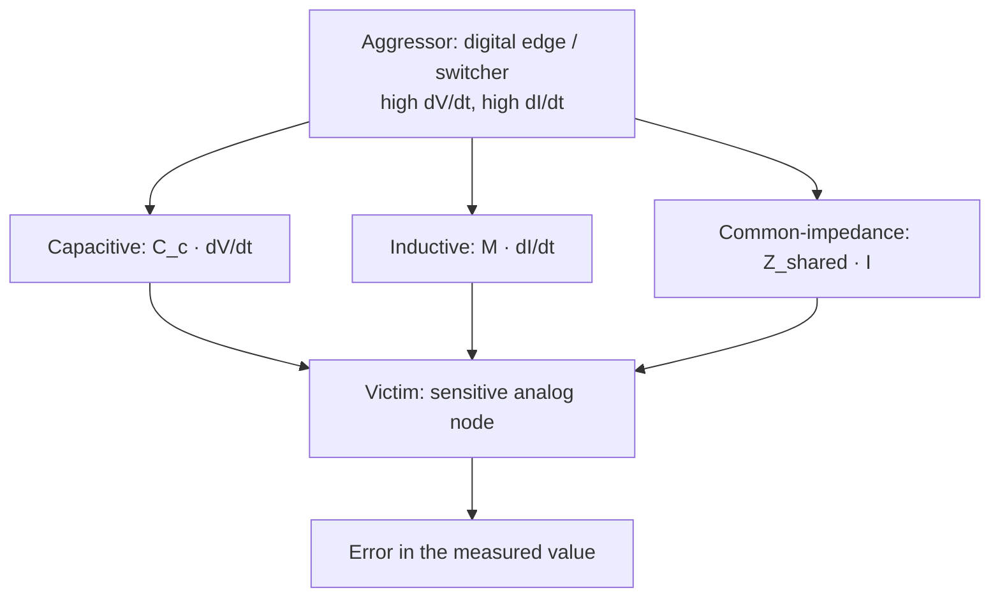
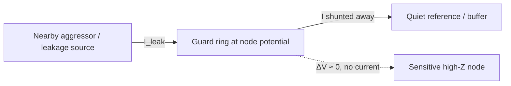
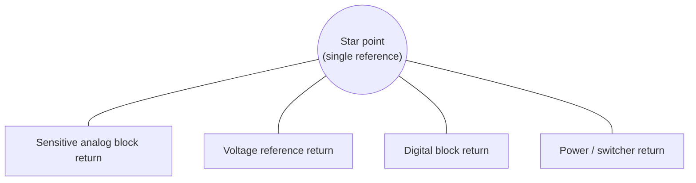
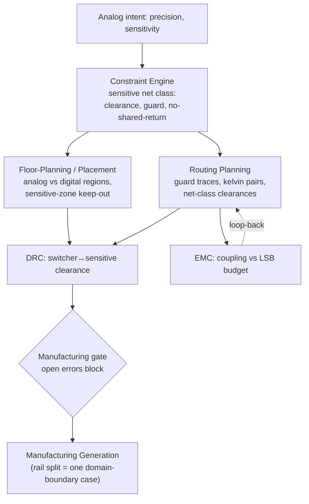

# Analog & Mixed-Signal Layout

**Summary.** Analog and mixed-signal layout is the discipline of arranging copper so that a *microvolt-scale* signal survives a journey across a board that also carries volt-scale digital edges and amp-scale switching currents. It belongs in the Engineering Science Layer because the runtime treats every [Net](../../docs/foundation/engineering-domain-model.md#net) as a logically perfect, noiseless conductor — a name connecting [Pins](../../docs/foundation/engineering-domain-model.md#pin) — yet physics says each net is a real conductor that *radiates*, *picks up*, and *shares return impedance* with its neighbours, and for a sensitive analog node those parasitics are the entire signal. The lumped [Schematic IR](../../docs/compiler/ir/schematic-ir.md) shows one ideal `AGND` node with zero impedance and a reference voltage with zero noise; this document dismantles that fiction for the analog domain specifically. It states the physics of the four coupling mechanisms, the guarding/shielding/Kelvin/partitioning techniques that defeat each, and the single-point grounding law — then maps every result to the EAK artifact that must embody it: the per-net-class constraints in the [Constraint Engine](../../docs/engineering/constraint-engine.md), [net-class trace widths and clearances](../../docs/state-machines/routing-planning.md) in [Routing Planning](../../docs/state-machines/routing-planning.md), keep-out and partition decisions in [Component Placement](../../docs/state-machines/component-placement.md) and [PCB Floor Planning](../../docs/state-machines/pcb-floor-planning.md), the [regulator VIN/VOUT rail split](../../docs/state-machines/manufacturing-generation.md), and the clearance/coupling rules of [DRC](../../docs/state-machines/drc-verification.md) and [EMC Analysis](../../docs/state-machines/emc-analysis.md).

---

## Core principles

### The microvolt budget — why analog layout is a different problem

The reason analog layout is hard is arithmetic. A 24-bit converter referenced to 5 V has a least-significant bit of

```text
LSB = V_ref / 2^N = 5 V / 2^24 ≈ 298 nV
```

so any coupled disturbance above a few hundred nanovolts is *visible in the data*. Even the conductors themselves contribute noise floors the digital domain never notices:

```text
Johnson–Nyquist (thermal) noise:   v_n = √(4 · k_B · T · R · Δf)
   1 kΩ at 300 K over 1 MHz  →  v_n ≈ 4 µV RMS
Thermocouple EMF (dissimilar metals): ~ 1–40 µV per °C of gradient across a junction
1/f (flicker) noise:               grows as 1/f toward DC — dominates precision DC paths
```

The consequence: an analog net is not "routed or not," it is *budgeted*. Every coupling path must be driven below the LSB, and the layout — not the schematic — is where that budget is spent or blown. This is the precise sense in which the runtime's [Units & Quantities](../../docs/engineering/units-and-quantities.md) discipline matters: a "trace" carrying 298 nV LSBs and a "trace" carrying a 3.3 V clock are the same [Track](../../docs/foundation/engineering-domain-model.md#track--routing) type to the geometry engine but live in incompatible noise regimes, and only a typed constraint can tell them apart.

### The four coupling mechanisms

Noise reaches a sensitive node by exactly four routes. Each has a governing equation, and each technique below targets one of them.

```text
1. Capacitive (electric-field):  I_c = C_c · dV/dt        → V_noise = I_c · Z_node
2. Inductive  (magnetic-field):  V_m = M · dI/dt          (M = mutual inductance ∝ shared loop area)
3. Common-impedance (conductive): V_err = Z_shared · I_other  (two currents sharing a return)
4. Radiated  (far-field):        E ∝ A · f² · I           (small-loop antenna; see ground-plane.md)
```


*Figure: the three near-field paths by which a noisy aggressor corrupts a sensitive victim; layout technique is chosen by which path dominates.*

The decisive amplifier is **node impedance**. Capacitive pickup produces `V_noise = Z_node · C_c · dV/dt`, so a high-impedance node (an op-amp input, a sensor with megohm source impedance, a sample-and-hold) converts a tiny coupled current into a large error voltage. *High-impedance sensitive nodes are the first thing layout must protect, because they amplify the very coupling they receive.*

### Sensitive-node isolation — distance, area, and orthogonality

Capacitive coupling falls with separation; inductive coupling falls with the *shared loop area* between aggressor and victim. The cheapest defences are geometric and require no extra copper:

- **Separation.** Coupling capacitance between two parallel traces falls roughly as `C_c ∝ ε·L / ln(s/w)` — increasing edge-to-edge spacing `s` is the first-order knob. A sensitive net carries a *clearance-to-aggressor* requirement that is far larger than its DRC electrical-clearance minimum.
- **Minimised parallel run length.** Both `C_c` and `M` scale with the coupled length `L`; crossing an aggressor at 90° instead of running beside it collapses `L` toward zero.
- **Loop-area minimisation.** Route the sensitive signal directly over its reference plane so its own return images beneath it (see [Ground Planes](ground-plane.md)); a small victim loop has small `M` and small pickup `V = M·dI/dt`.

### Guarding — nulling leakage by equalising potential

Surface leakage and capacitive pickup both flow from a *potential difference* across a parasitic path. A **guard ring** is a conductor completely surrounding the sensitive node and *driven to the same potential as that node*, so the potential difference — and therefore the leakage and coupling current — is forced to zero:

```text
Leakage without guard:  I_leak = ΔV / R_surface   (ΔV between node and nearby rail/contaminant)
With guard at node potential:  ΔV_(node→guard) = 0  ⇒  I_leak = 0
```

The guard intercepts the leakage *before* it reaches the node: any stray current now flows from the aggressor into the low-impedance guard, not into the high-impedance victim. Two flavours:

- **Passive guard** — the ring is tied to a quiet reference (analog ground) near the node. It shunts pickup to ground and breaks surface-leakage paths to nearby high-voltage rails.
- **Active (driven) guard** — the ring is driven by a low-impedance buffer that *follows* the node voltage (e.g. an op-amp's inverting input guarded by a copy of its non-inverting reference). Because the guard tracks the node, the dielectric and air gap between them see ~0 V, so their parasitic capacitance is effectively removed from the node — bootstrapping away the input capacitance.


*Figure: a guard ring intercepts leakage and pickup and shunts it to a quiet reference, leaving the protected node at near-zero potential difference to its surroundings.*

### Shielding — interposing a grounded conductor

Where guarding equalises potential, **shielding** interposes a grounded conductor between aggressor and victim so the aggressor's field terminates on the shield instead of the node. On a PCB this is a ground trace flanking a sensitive run (a coplanar guard trace), a ground pour over/under it, or stitched guard fences. Key rules from [electromagnetics](../physics/electromagnetics.md):

- A shield only works if it is **referenced** — a floating shield couples capacitively and can make matters worse. Ground it, ideally at one end for a low-frequency trace to avoid a shield ground loop, or continuously (with stitching vias) for an RF trace.
- Electric-field (capacitive) shielding needs only a thin grounded conductor. Magnetic-field shielding is harder: at low frequency it requires high-permeability material or, on a PCB, *loop-area control* rather than a barrier — you fight inductive coupling by shrinking `M`, not by interposing copper.

### Kelvin (4-wire) sensing — separating force from sense

Any current `I` through a conductor of resistance `R_lead` develops `I·R_lead` of error voltage. For a 2-wire measurement of a small resistance or a current-shunt, that lead/contact drop is indistinguishable from the quantity being measured:

```text
2-wire:  V_measured = V_true + I·(R_lead_+ + R_lead_−)   ← lead & contact resistance corrupts the reading
```

**Kelvin sensing** runs *four* conductors to the element: two **force** leads carry the current, and two **sense** leads tap the voltage *directly at the element terminals* and route to a high-impedance measurement input. Because the sense path carries essentially no current (`I_sense → 0`), it develops no IR drop:

```text
4-wire:  V_sense = V_true + I_sense·R_sense ≈ V_true     (I_sense ≈ 0)
```

```mermaid
flowchart LR
  SRC["Current source / driver"] -->|FORCE+| RP["R_shunt / R_sense element"]
  RP -->|FORCE−| RTN["Return"]
  RP -->|SENSE+ (≈0 current)| ADC["High-Z measurement input"]
  RP -->|SENSE− (≈0 current)| ADC
```
*Figure: 4-wire Kelvin connection — force leads carry the current and dump their IR drop outside the measurement; sense leads tap the true terminal voltage at zero current.*

The layout obligation: the sense traces must connect *at the device's Kelvin terminals* (the geometric point where the force current splits), route as a tight differential pair away from the force-current path, and never share copper with the force leads before the element. This is a **placement and routing topology constraint**, not merely a netlist connection — two pins on the same `Net` is not the same as a correct Kelvin junction.

### Single-point analog ground — defeating common-impedance coupling

Common-impedance coupling (`V_err = Z_shared · I_other`) is the dominant analog killer: when a sensitive return current and a noisy return current share a length of ground conductor, the noisy current modulates the reference the sensitive circuit measures against. The cure is topological — give each circuit its *own* path to a common reference point so no two unrelated currents share impedance:

```text
Star (single-point) ground:  every block's return runs to ONE node (the "star").
   I_analog and I_digital meet only at the star, where Z_shared → 0 by construction.
   ⇒ noisy return current never flows through the analog reference conductor.
```


*Figure: star grounding — independent returns converge at one node, so no aggressor current shares impedance with the analog reference.*

Single-point grounding is correct while the structure is *electrically short* — when conductor lengths are well under a wavelength so the whole star behaves as one node (see [transmission lines](../electrical/transmission-lines.md) and the [EMC electrically-long check](../../docs/state-machines/emc-analysis.md)). At high frequency the inductance of the star legs dominates and a *plane* (multipoint) ground wins. Mixed-signal boards therefore use a hybrid: a solid plane for low-impedance high-frequency return, with single-point *current steering* enforced by where the noisy and quiet circuits sit and where their currents are allowed to merge.

### Partitioning analog and digital — placement decides the return path

Because return current at signal frequencies hugs the trace (see [Ground Planes](ground-plane.md)), you control where digital return current flows by controlling *where the digital components sit and route*. The partitioning law:

- **Floor-plan the board into an analog region and a digital region**, each over its own area of an otherwise-continuous reference plane, with the mixed-signal device (ADC/DAC) straddling the boundary so its analog pins face analog and its digital pins face digital.
- **Do not cut the plane** under the converter unless the datasheet demands it; a continuous plane with *disciplined placement* keeps digital return current inside the digital region by construction, which is quieter than a split plane bridged at one point. A split is a deliberate exception with a single defined bridge, never a default.
- **Never let a sensitive trace cross a region boundary or a plane split** — the return current cannot follow and the loop balloons (the same antenna/inductor/crosstalk failure documented for slots in [Ground Planes](ground-plane.md)).

### Keeping switching away from references

A voltage reference is the analog system's "sea level"; noise on it appears as noise on every measurement. Switching nodes — regulator switch pins, clock lines, the high-`dV/dt` and high-`dI/dt` aggressors — must be physically and topologically distant from references and high-impedance nodes:

- **Distance + orthogonality** between any switch node and the reference, its bypass capacitor, and its sense traces, because `V_pickup = Z_node · C_c · dV/dt` and switchers maximise `dV/dt`.
- **The reference's own return** joins the star/quiet ground, never the switcher's return path — common-impedance again.
- **A switching power input must not share copper with the analog rail it feeds.** Separating the unregulated/noisy input from the regulated/quiet output is exactly the [regulator VIN/VOUT rail split](../../docs/state-machines/manufacturing-generation.md) the runtime already performs; in the analog domain the same split generalises to *every* boundary between a noisy and a quiet domain (see [Power Distribution](power-distribution.md) and [Power Integrity](../electrical/power-integrity.md)).

---

## Why it matters for electronics & PCB design

A board can pass every connectivity and clearance check and still be useless because its analog channel reads noise. None of these failures are visible in the netlist — they are *geometric and topological* properties invisible to a lumped schematic:

- A precision ADC loses 4–6 bits of effective resolution because its reference shares ground impedance with a digital bus — the schematic shows both tied to one perfect `GND`.
- A current shunt reads several percent high because it was connected 2-wire and the layout buried `I·R_contact` in the reading; a Kelvin connection would have removed it.
- A high-impedance sensor front-end drifts microvolts with humidity because no guard ring intercepts surface leakage from a nearby 12 V rail.
- A switching regulator's 2 MHz ripple appears on a sensor output 30 mm away because the sensitive trace ran parallel to the switch node for 10 mm.

These are the highest-value problems an AI-native runtime can prevent, because they are *systematic and rule-expressible*: the physics says exactly which net must be far from which, which must be guarded, and which return must not be shared. That is precisely the kind of invariant the EAK [Constraint Engine](../../docs/engineering/constraint-engine.md) and [Verification Engine](../../docs/engineering/verification-engine.md) exist to carry and enforce.

---

## Mapping to the runtime

This theory is not advisory; it is the justification for concrete runtime artifacts. Each principle below names the EAK engine, IR field, state machine, or rule that must embody it — and why violating it is an engineering bug in the runtime, not merely a stylistic lapse.

- **Net classes carry the analog discipline ([Constraint Engine](../../docs/engineering/constraint-engine.md), [PCB IR](../../docs/compiler/ir/pcb-ir.md)).** The runtime already implements [per-net-class trace widths](../../docs/state-machines/routing-planning.md) (increment 10). The microvolt budget demands the same mechanism carry *more than width*: a `sensitive`/`analog` net class must additionally carry a **clearance-to-aggressor**, a **guard requirement**, and a **shared-return prohibition**. These are [Constraints](../../docs/foundation/engineering-domain-model.md#constraint) the [Constraint Engine](../../docs/engineering/constraint-engine.md) resolves and the [Routing Agent](../../docs/state-machines/routing-planning.md) honours. If the runtime collapses analog and digital nets into one class, the LSB-scale net inherits digital-scale spacing and the design is silently wrong — a bug that no connectivity check catches.
- **Single-point/partition topology is a placement & floor-plan invariant ([Component Placement](../../docs/state-machines/component-placement.md), [PCB Floor Planning](../../docs/state-machines/pcb-floor-planning.md)).** Where the digital region ends and the analog region begins decides where return current flows. The floor-planning phase must allocate disjoint regions and place the mixed-signal device straddling the boundary; placing a switcher inside the analog region is an invariant violation, not a preference. This is the analog generalisation of the existing [board-edge keep-out](../../docs/state-machines/dfm-verification.md) (increment 9): a *sensitive-zone keep-out* that excludes switching nodes from a radius around references and high-impedance nodes.
- **The rail split is the runtime's first instance of "separate noisy from quiet" ([Manufacturing Generation](../../docs/state-machines/manufacturing-generation.md)).** The [regulator VIN/VOUT split](../../docs/state-machines/manufacturing-generation.md) (increment 11) already encodes "do not let the unregulated input share copper with the regulated output." Single-point analog grounding and switcher-isolation are the *same principle* applied to references and returns; the runtime should treat the rail split as one case of a general domain-boundary constraint, so the analog cases ride the proven mechanism rather than a parallel one.
- **Clearance and coupling become Verification rules ([DRC](../../docs/state-machines/drc-verification.md), [EMC Analysis](../../docs/state-machines/emc-analysis.md)).** The [Verification Engine](../../docs/engineering/verification-engine.md)'s generic Rule → [Violation](../../docs/foundation/engineering-domain-model.md#violation) → [Waiver](../../docs/foundation/engineering-domain-model.md#waiver) lifecycle is the natural home for: a DRC rule "*sensitive net N maintains ≥ clearance C from any switching net*", and an EMC analysis "*parallel run length and loop area between aggressor and victim keep coupled noise below the LSB budget*." A breach is an **error-severity** [Violation](../../docs/foundation/engineering-domain-model.md#violation) that blocks the [manufacturing gate](../../docs/core/workflow-orchestration.md) unless explicitly waived with provenance — exactly the discipline the engine already enforces for [DRC](../../docs/state-machines/drc-verification.md). EMC produces an [Analysis Result](../../docs/foundation/engineering-domain-model.md#analysis-result), and its failures loop back to [Routing Planning](../../docs/state-machines/routing-planning.md) like any other.
- **Kelvin topology is a connection-shape constraint, not a net membership ([Schematic IR](../../docs/compiler/ir/schematic-ir.md) → [Constraint Extraction](../../docs/state-machines/constraint-extraction.md)).** "Sense and force are the same net" is true and misleading: the runtime must extract from intent a *topology* constraint — sense taps at the Kelvin terminal, carries ~0 current, routes away from the force path. The [Constraint Extraction](../../docs/state-machines/constraint-extraction.md) phase is where that becomes a machine-checkable rule; a router that satisfies connectivity but joins sense to force upstream of the element produces a measurement bug the netlist declares correct.
- **The microvolt budget needs real [units](../../docs/engineering/units-and-quantities.md).** Distinguishing a 298 nV LSB net from a 3.3 V logic net requires the typed-quantity discipline of [Units & Quantities](../../docs/engineering/units-and-quantities.md); without it the runtime cannot even represent why one [Track](../../docs/foundation/engineering-domain-model.md#track--routing) needs guarding and another does not.


*Figure: analog intent flows into net-class constraints, then into placement and routing, and is enforced by DRC/EMC before the manufacturing gate — the same pipeline the runtime already runs, specialised for microvolt signals.*

The throughline: the runtime already has the *mechanisms* — net classes, keep-outs, the rail split, the DRC/EMC/gate lifecycle. The Engineering Science Layer supplies the *physics that parameterises them* so an analog design is correct by construction rather than by reviewer luck ([P7](../../docs/foundation/principles.md): mechanism vs. instance; [P11](../../docs/foundation/principles.md): the runtime computes what the UI shows).

---

## Failure modes if violated

- **Shared analog/digital ground impedance.** Digital return current flows through the analog reference conductor; `V_err = Z_shared · I_digital` rides on every measurement. Manifests as digital-correlated noise in the data. *Runtime guard:* single-point/partition constraint + a DRC/EMC rule that forbids a shared low-impedance return between the two net classes.
- **Sensitive trace crosses a plane split or region boundary.** Return current detours, loop area balloons, the gap radiates as a slot antenna and couples to neighbours — emissions can rise 20 dB (see [Ground Planes](ground-plane.md)). *Runtime guard:* the existing "no track over plane split" DRC rule, extended so a sensitive net's crossing is error-severity.
- **Missing guard on a high-impedance node.** Surface leakage from a nearby high-voltage rail injects `I_leak = ΔV/R_surface` into a megohm node, producing microvolt-to-millivolt drift with humidity and contamination. *Runtime guard:* a net-class guard requirement that the [Routing Agent](../../docs/state-machines/routing-planning.md) must realise as a ring/fence, checked in verification.
- **2-wire instead of Kelvin.** Lead and contact resistance (`I·R_lead`) corrupts a low-level reading by an amount the schematic cannot show. *Runtime guard:* a Kelvin topology constraint extracted in [Constraint Extraction](../../docs/state-machines/constraint-extraction.md) and checked for sense-at-terminal, sense-carries-no-current routing.
- **Switcher adjacent to a reference.** High-`dV/dt` capacitive pickup (`Z_node · C_c · dV/dt`) modulates the reference; ripple appears on every channel. *Runtime guard:* sensitive-zone keep-out (a parameterised [board-edge keep-out](../../docs/state-machines/dfm-verification.md) sibling) + minimum switcher-to-reference clearance as an error-severity rule.
- **Noisy input sharing copper with a quiet rail.** The unfiltered input's ripple conducts straight into the regulated analog supply. *Runtime guard:* the [VIN/VOUT rail split](../../docs/state-machines/manufacturing-generation.md), recognised as one instance of the general noisy/quiet domain-boundary invariant.

In every case the violation is invisible to connectivity and clearance-only checks but *expressible* as a typed [Constraint](../../docs/foundation/engineering-domain-model.md#constraint) and a [Verification](../../docs/engineering/verification-engine.md) [Rule](../../docs/foundation/engineering-domain-model.md#rule). A runtime that ships a board breaching one of these has produced a connectivity-correct, physically-wrong design — precisely the failure the Engineering Science Layer exists to make impossible.

---

## Related documents

**Engineering Science siblings:** [`pcb/ground-plane.md`](ground-plane.md) (return current, splits, stitching) · [`pcb/power-distribution.md`](power-distribution.md) (rail separation, decoupling) · [`pcb/routing.md`](routing.md) · [`pcb/placement.md`](placement.md) · [`electrical/signal-integrity.md`](../electrical/signal-integrity.md) (knee frequency, crosstalk) · [`electrical/power-integrity.md`](../electrical/power-integrity.md) · [`electrical/kirchhoff-laws.md`](../electrical/kirchhoff-laws.md) (return-current law) · [`electrical/ohms-law.md`](../electrical/ohms-law.md) (IR drop) · [`electrical/transmission-lines.md`](../electrical/transmission-lines.md) (electrically-short vs -long) · [`physics/electromagnetics.md`](../physics/electromagnetics.md) (shielding, coupling) · [`physics/maxwell-equations.md`](../physics/maxwell-equations.md) · [`physics/rf-physics.md`](../physics/rf-physics.md) · [`mathematics/constraint-satisfaction.md`](../mathematics/constraint-satisfaction.md).

**Runtime anchors:** [`engineering/constraint-engine.md`](../../docs/engineering/constraint-engine.md) · [`engineering/verification-engine.md`](../../docs/engineering/verification-engine.md) · [`engineering/units-and-quantities.md`](../../docs/engineering/units-and-quantities.md) · [`compiler/ir/pcb-ir.md`](../../docs/compiler/ir/pcb-ir.md) · [`compiler/ir/schematic-ir.md`](../../docs/compiler/ir/schematic-ir.md) · [`state-machines/pcb-floor-planning.md`](../../docs/state-machines/pcb-floor-planning.md) · [`state-machines/component-placement.md`](../../docs/state-machines/component-placement.md) · [`state-machines/routing-planning.md`](../../docs/state-machines/routing-planning.md) · [`state-machines/drc-verification.md`](../../docs/state-machines/drc-verification.md) · [`state-machines/emc-analysis.md`](../../docs/state-machines/emc-analysis.md) · [`state-machines/constraint-extraction.md`](../../docs/state-machines/constraint-extraction.md) · [`state-machines/manufacturing-generation.md`](../../docs/state-machines/manufacturing-generation.md) · [`foundation/engineering-domain-model.md`](../../docs/foundation/engineering-domain-model.md) · [`foundation/principles.md`](../../docs/foundation/principles.md) · [`GLOSSARY.md`](../../docs/GLOSSARY.md).
