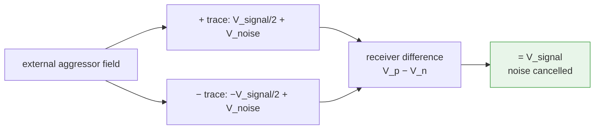
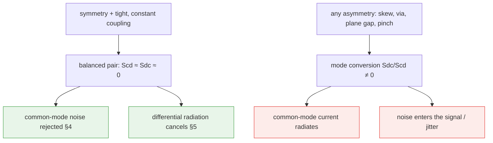

# Differential Pairs

**Summary.** A differential pair is two coupled conductors that carry one logical signal as the *difference* of their two voltages, `V_diff = V_p − V_n`, while any voltage they share, `V_cm = (V_p + V_n)/2`, is ignored by the receiver. This document belongs in the Engineering Science Layer because the runtime's [Routing Planning](../../docs/state-machines/routing-planning.md) phase, the [PCB IR](../../docs/compiler/ir/pcb-ir.md)'s *differential-pair partner* field, and the impedance/skew [Constraints](../../docs/foundation/engineering-domain-model.md#constraint) it routes against all silently assume a body of theory the runtime never states: that two traces become one electrical object only when they are *tightly coupled* and *symmetric*; that such a pair has **four** characteristic impedances (odd, even, differential, common), not one; that a pair rejects external noise only to the degree it stays *balanced*; and that the connectivity check — both halves reach their pads — sees none of this. A pair that is merely *connected* can still have the wrong differential impedance, be skewed, radiate, and fail on the bench. This document grounds the differential half of routing correctness: the physics that converts the abstract "this is a diff pair" annotation into the layout rules the runtime must enforce. It is the matched-routing companion to [routing.md](routing.md) §8, and rests on the field theory in [transmission-lines.md](../electrical/transmission-lines.md), [maxwell-equations.md](../physics/maxwell-equations.md) and [signal-integrity.md](../electrical/signal-integrity.md).

---

## Core principles

### 1. Differential signaling — the signal is a difference, not a level

A single-ended net encodes its bit in a voltage *referenced to ground*; whatever noise the ground or the trace picks up is added directly to the signal. A differential pair encodes the bit in the *difference* between two conductors and discards the *common* part:

```text
V_diff = V_p − V_n            # the differential (odd) mode — carries the bit
V_cm   = (V_p + V_n) / 2      # the common  (even) mode — should carry nothing
```
*Listing: any pair of node voltages decomposes uniquely into a differential and a common-mode component; the receiver amplifies the first and rejects the second.*

The receiver is a *difference* amplifier, so its output depends only on `V_diff`. The entire value of differential signaling — noise immunity, low emissions, tolerance of ground offset — follows from one condition: **noise and ground shifts must appear in `V_cm`, not in `V_diff`.** Everything in this document is, ultimately, a rule for keeping that condition true.

### 2. Coupling — what makes two traces *one* object

Two traces routed near each other are electromagnetically **coupled**: each one's field reaches the other through mutual capacitance `C_m` and mutual inductance `L_m`. Coupling is the mechanism that lets the pair share a fate — a disturbance that hits one trace also hits the other — and it is quantified by a coupling coefficient (roughly `k_C = C_m / (C + C_m)` capacitively, with a dual for inductance). Two regimes matter:

- **Tightly coupled** (spacing `s` comparable to or smaller than the dielectric height `h`): the two traces' fields overlap strongly. The pair behaves as a genuine two-conductor system; external fields couple almost equally into both traces, so they tend to disturb `V_cm` and *cancel in* `V_diff`. Density is high and the pair tracks itself well.
- **Loosely coupled** (`s ≫ h`): each trace is nearly an independent single-ended line referenced to the plane; coupling is weak. The pair is more tolerant of spacing variation but couples noise less symmetrically and radiates more.

Tight coupling is therefore not an aesthetic choice — it is the property that makes the common-mode-rejection argument (§4) hold and the radiation-cancellation argument (§5) work. It is also why the two traces of a pair must be routed *together*, at *constant* spacing: the spacing **is** the coupling, and the coupling **is** the impedance.

### 3. The four impedances — odd, even, differential, common

A coupled pair does not have a single characteristic impedance. Drive it in its two natural modes and you measure two different values:

```text
Z_odd   : impedance of one trace when the pair is driven differentially (V_p = −V_n)
Z_even  : impedance of one trace when the pair is driven in common      (V_p =  V_n)

Z_diff  = 2 · Z_odd      # impedance seen across the pair by the differential signal
Z_cm    = Z_even / 2     # impedance the common-mode current sees to the reference
```
*Listing: the pair's terminating and matching behaviour is set by `Z_diff` (for the signal) and `Z_cm` (for noise/return), each derived from a per-trace mode impedance.*

The physics of why they differ: in the **odd** mode the two traces carry equal-and-opposite voltages, so the mutual capacitance `C_m` is fully active (the field lines run *between* the traces) and the mutual inductance subtracts — this *lowers* the per-trace impedance, so `Z_odd < Z_0` of the isolated trace. In the **even** mode the traces are at the same potential, `C_m` carries no current (no field between equal potentials) and the mutual inductance adds — `Z_even > Z_0`. Tighter coupling pushes `Z_odd` down and `Z_even` up; the *gap* between them is a direct measure of coupling. Consequences the runtime must respect:

- **`Z_diff` is a geometry target, not a free parameter.** It is fixed by trace width `w`, pair spacing `s`, dielectric height `h` and permittivity `ε_r` (microstrip vs stripline), exactly as single-ended `Z_0` is — see [transmission-lines.md](../electrical/transmission-lines.md). Hitting a 90 Ω or 100 Ω `Z_diff` is a coupled-line field-solver result, and a [Constraint](../../docs/foundation/engineering-domain-model.md#constraint) the router must meet within a tolerance band.
- **Spacing changes `Z_diff`.** Because `Z_odd` depends on `s`, *any* variation in pair spacing — a pinch around a via, a splay around an obstacle — is a local impedance discontinuity. This is why constant spacing is a hard layout rule, not a guideline.
- **`Z_cm` governs the common-mode return.** Common-mode current does not cancel; it returns through the reference plane and is the thing that radiates (§5). Common-mode termination is matched to `Z_cm`, not `Z_diff`.

### 4. Common-mode rejection — why pairs beat noise

Suppose an external aggressor (a nearby clock, a plane bounce, a connector's ground shift) couples a voltage into the pair. If the pair is symmetric and tightly coupled, it couples *almost equally* into both traces:

```text
V_p = V_signal/2 + V_noise          # noise adds to the +  trace
V_n = −V_signal/2 + V_noise         # the same noise adds to the −  trace
-----------------------------------------------------------------
V_diff = V_p − V_n = V_signal       # noise cancels exactly in the difference
V_cm   = (V_p + V_n)/2 = V_noise    # noise lands entirely in the common mode
```
*Listing: equal (common-mode) noise cancels in the receiver's difference; this is the entire noise-immunity argument, and it holds only to the degree the two traces see the same noise.*

The receiver's ability to reject this is the **common-mode rejection ratio (CMRR)** — the ratio of differential gain to common-mode gain. But no receiver's CMRR can fix noise that has already been *converted* into the differential mode by an *asymmetry* in the routing (§6). The PCB's job is to keep the noise common-mode so the receiver can reject it. Tolerance of a static ground offset between transmitter and receiver is the same argument: a DC `V_cm` shift is invisible to `V_diff`, which is why differential links survive ground-potential differences that would corrupt a single-ended net.


*Figure: equal-and-opposite signal plus equal (common) noise — the receiver's subtraction keeps the signal and cancels the noise, provided the two traces saw the same noise.*

### 5. Why pairs *emit* less — radiation cancellation

Common-mode rejection is the *receive* side; the *transmit* side is the dual. The differential currents in the two traces are equal and opposite, `I_p = −I_n`. Two anti-parallel currents separated by the small spacing `s` form a tiny current loop whose far-field radiation **cancels** to first order — the residual is proportional to `s/λ`, so a *tightly* coupled pair (small `s`) is a poor antenna. The return current is likewise mostly carried by the partner trace, not the distant plane, so the radiating loop area is small (the [Maxwell](../physics/maxwell-equations.md)/[EMC](../../docs/state-machines/emc-analysis.md) return-path argument applied to a pair).

The corollary is the danger: **common-mode current radiates efficiently.** `I_cm = (I_p + I_n)/2` flows in the *same* direction in both traces, returns through the plane over a large loop, and behaves like a monopole over ground — the dominant radiated-emissions mechanism on high-speed boards. A perfectly balanced pair has `I_cm = 0`. Therefore *every microvolt of differential-to-common conversion caused by asymmetry (§6) becomes a radiating common-mode current.* Emissions are not a property of the signal; they are a property of the *imbalance*.

### 6. Symmetry and mode conversion — the master principle

Modes 3–5 all assumed the pair is **balanced**: the two traces are electrically identical mirror images. Any asymmetry — unequal length, an unmatched via, a one-sided bend, a reference-plane gap under one trace but not the other, unequal coupling to a neighbour — couples the two modes together and **converts** energy between them:

```text
Sdd21 : differential in  → differential out   (wanted: the signal)
Scc21 : common      in  → common      out     (noise passing through)
Scd21 : common      in  → differential out    (noise injected into the signal — hurts immunity)
Sdc21 : differential in → common      out     (signal converted to radiating common mode — hurts emissions)
```
*Listing: the mixed-mode S-parameters. A perfectly symmetric pair has `Scd = Sdc = 0`; every asymmetry makes them non-zero, breaking both noise rejection (§4) and emission cancellation (§5).*

Mode conversion is the single quantity that unifies this document: **skew, spacing variation, asymmetric vias, asymmetric references, and unequal lengths are all just sources of `Sdc`/`Scd`.** This is why "route the two traces symmetrically" is not a tidiness preference but the governing physical law — symmetry is the condition that keeps the cross-mode terms zero.

### 7. Intra-pair skew — the dominant offender

The most common and most damaging asymmetry is a **length (delay) mismatch** between the two traces. A physical length difference `ΔL` becomes a timing skew:

```text
v   = c / √ε_eff                 # on-board propagation velocity
Δt  = ΔL / v                     # skew from a length mismatch ΔL
```
*Listing: for typical FR-4, `√ε_eff` ≈ 1.9–2.1, so `v` ≈ 145–160 mm/ns and the delay is ≈ 6–7 ps per millimetre of mismatch — see [transmission-lines.md](../electrical/transmission-lines.md).*

Skew shifts one trace's edge relative to the other. During the skew window the pair is momentarily *not* equal-and-opposite — one trace has switched and the other has not — so the pair carries a transient common-mode current. That is `Sdc` made concrete: skew converts a clean differential edge into a common-mode pulse that radiates (§5) and eats into timing margin (jitter at the receiver). The skew budget is set by the signaling rate: a fraction of the unit interval (UI) or of the edge rise time. Inverting the relation gives the length-match tolerance the router must hold:

```text
ΔL_max = v · Δt_budget           # e.g. a 5 ps budget on FR-4 ⇒ ΔL_max ≈ 0.7–0.8 mm
```

This is enforced by **length tuning**: deliberately lengthening the *shorter* trace with a serpentine ("accordion") segment until the two match within tolerance. Tuning is placed near the source of the mismatch (e.g. right after a corner or a pin-swap), and the serpentine's own spacing must stay loose enough not to couple to itself.

### 8. Layout rules and the physics each one defends

Every differential-pair layout rule is a defence of one of the principles above. Stated as rule → physics it defends:

| Layout rule | Physics it defends |
|-------------|--------------------|
| Route the two traces **together at constant spacing** | spacing *is* the coupling, so it *is* `Z_diff` (§3); a pinch is an impedance discontinuity |
| **Tight coupling** (small `s` relative to `h`) where density/immunity demand | maximizes common-mode tracking (§4) and minimizes the radiating loop (§5) |
| **Length-match** within `ΔL_max`; tune the short trace | bounds intra-pair skew `Δt` and the `Sdc` it produces (§6, §7) |
| Keep the pair **symmetric**: mirror bends, equal via counts/positions | zeroes the mode-conversion terms `Scd`/`Sdc` (§6) |
| **Miter or arc** corners; turn *both* traces together | a single-trace corner lengthens the outer trace → skew; symmetric turns keep `ΔL` ≈ 0 (§7) |
| Maintain a **continuous reference plane** under *both* traces | a plane gap under one trace breaks symmetry and opens the return loop ([Maxwell](../physics/maxwell-equations.md), §5–6) |
| **Match vias in pairs** (same layer transition, symmetric placement, with return/stitching vias) | an unmatched via is an asymmetric discontinuity and a return-path break (§6) |
| **Symmetric break-out** from the connector/IC and matched in-pin delay | asymmetry at the endpoints converts modes before the pair even forms |
| Keep **clearance to other nets** ≥ a few × `s` (isolation) | preserves *uniform* external coupling so foreign noise stays common-mode (§4) |
| Avoid **stubs / unterminated branches** on either trace | a stub is an asymmetric resonant discontinuity (one-trace `Sdc`) |


*Figure: balance is the hinge — symmetry buys both noise rejection and low emissions; any asymmetry converts modes and forfeits both at once.*

---

## Why it matters for electronics & PCB design

- **A connected pair can be a broken pair.** Both traces reaching their pads says nothing about `Z_diff`, skew, or symmetry. A pair routed at the wrong spacing is impedance-mismatched and reflects; a pair with 2 mm of length mismatch radiates and jitters — and a per-net connectivity check sees neither. Differential correctness lives entirely in properties connectivity cannot observe.
- **Almost every fast interface is differential.** USB, PCIe, SATA, HDMI, Ethernet, MIPI, LVDS and DDR strobes are differential precisely for the noise-immunity and low-emission reasons above. Getting pairs wrong is getting the board's high-speed I/O wrong.
- **Emissions are imbalance.** Boards fail radiated-emissions compliance not because the differential signal radiates but because asymmetry converted some of it to common mode (§5–6). Diff-pair symmetry is a direct, physics-grounded lever on EMC pass/fail.
- **Immunity is imbalance, too.** A pair survives a noisy environment only while it stays balanced; the same asymmetries that raise emissions also let external noise leak into the signal (`Scd`). One discipline — symmetry — buys both.
- **`Z_diff` ties layout to the layer stack.** Because `Z_diff` depends on `h` and `ε_r`, the pair's geometry is meaningless without the stack-up; differential routing is one of the tightest couplings between [floor planning](../../docs/state-machines/pcb-floor-planning.md) and [routing](../../docs/state-machines/routing-planning.md) in the whole flow.

---

## Mapping to the runtime

This section is the point of the layer: each principle names a concrete EAK artifact it grounds, and why violating it would be an engineering bug.

- **The `differential-pair partner` field makes a pair one object (§1–3).** [`pcb-ir.md`](../../docs/compiler/ir/pcb-ir.md) *specifies* a *differential-pair partner* on each [Track](../../docs/foundation/engineering-domain-model.md#track--routing). This is the spec's representation of "these two [Nets](../../docs/foundation/engineering-domain-model.md#net) are one electrical object" — it is what *will* let [Routing Planning](../../docs/state-machines/routing-planning.md) route them together at fixed spacing (so `Z_diff` is held) and let verification treat the pair as a unit. *Implementation gap:* the current `eak/` domain `Track` (a single straight segment with `net`, `layer`, `width`, and endpoints) carries no pair partner yet, so this binding is spec-defined, not-yet-realized. **Bug if violated:** routing the two halves as independent nets keeps them *connected* but destroys the coupling, the impedance, and the skew match — a correctness failure no per-net check can see, exactly the case [routing.md](routing.md) §8 calls out.
- **`PlanningRouting`'s "differential-pair handling" is §2 and §8 in code.** [`routing-planning.md`](../../docs/state-machines/routing-planning.md): `LoadingPlacedBoard` reads "stack-up, and routing constraints (clearance, impedance, current)" and `PlanningRouting` lists "differential-pair handling" as first-class work. The stack-up it reads (from [floor planning](../../docs/state-machines/pcb-floor-planning.md)) supplies the `h`, `ε_r` that `Z_diff` depends on (§3). **Bug if violated:** proposing a pair geometry without the stack-up's height/permittivity computes an impedance against a fiction; the pair routes "clean" and misses `Z_diff` at fabrication.
- **The differential-impedance target is a typed [Constraint](../../docs/foundation/engineering-domain-model.md#constraint) (§3).** The [Constraint Engine](../../docs/engineering/constraint-engine.md) holds `Z_diff ∈ [Z_tgt·(1−ε), Z_tgt·(1+ε)]` as an *impedance-type* bound over the pair's scope, with the band as a [Physical Quantity](../../docs/engineering/units-and-quantities.md) tolerance. Resolution (most-specific-wins) lets a per-pair target override a net-class default. **Bug if violated:** a router that ignores the impedance constraint and optimizes only wirelength returns copper the constraint then rejects — a guaranteed loop-back, the [routing.md](routing.md) "searching a fiction" failure specialized to pairs.
- **Intra-pair skew is a length-match Constraint, *specified* as a typed bound (§7).** The skew budget `Δt_budget` *is specified to* become a length-tolerance [Constraint](../../docs/foundation/engineering-domain-model.md#constraint) `|L_p − L_n| ≤ ΔL_max`, a [Physical Quantity](../../docs/engineering/units-and-quantities.md) length comparison the [Constraint Engine](../../docs/engineering/constraint-engine.md) *would* evaluate incrementally as the pair is routed, with serpentine tuning as the router's repair. *Implementation gap:* nothing in `eak/` computes `|L_p − L_n|` today — there is no pair partner to difference — so this bound is future scope, not yet a shipped check. **Bug if violated:** skipping the skew bound lets a length-mismatched pair commit — `Sdc` rises, the pair radiates and jitters, and the defect surfaces only at EMC, the most expensive place to find it.
- **Per-net-class trace widths are the hook for the pair's `w`/`s` geometry (§3, §8).** The Phase-3 per-net-class width feature makes trace width a *parameter of the routing search graph* — today a fixed constant per class (0.50 mm power/ground, 0.25 mm signal), not impedance-derived. A differential net class's width — and, with it, the spacing that sets `Z_diff` — *will* ride that same mechanism, so the pair's `Z_diff` target *would* be satisfied *by construction* when the router searches the width-and-spacing-correct graph. *Implementation gap:* `NetClass` is `{Power, Ground, Signal}` with no differential / controlled-impedance class and no `Z_diff` field, so the diff-pair width/spacing parameterization is spec-defined, not-yet-realized scope. **Bug if violated:** routing a nominal graph and re-spacing afterward changes `Z_diff` and pinches coupling, producing a pair DRC/EMC then rejects.
- **The continuous-reference requirement couples pairs to the stack and keep-outs (§5–6, §8).** A pair is correct only over an unbroken reference plane; the [Maxwell](../physics/maxwell-equations.md) return-path argument is the same one [routing.md](routing.md) §3 makes for layer assignment. The DFM-sourced **board-edge keep-out** (Phase-3 increment 9) matters doubly here: a pair crowded against the edge loses reference symmetry on the outer trace, converting modes (§6). The keep-out removes that region from the search so every pair path stays edge-legal and reference-backed by construction. **Bug if violated:** a pair routed over a plane split or against the edge stays connected but breaks symmetry — invisible to connectivity, caught only downstream.
- **EMC analysis is where imbalance is paid for (§5–7).** [`emc-analysis.md`](../../docs/state-machines/emc-analysis.md) loops back to [Routing Planning](../../docs/state-machines/routing-planning.md) on failure because "emissions/coupling are routing-dominated" — and for pairs the emission *is* the mode conversion of §5–6. The shipped deterministic subset (the `emc-antenna-length` rule over an electrically-long [Track](../../docs/foundation/engineering-domain-model.md#track--routing)) is a first-order proxy; the full mixed-mode/skew analysis (`Sdc`, common-mode current) is the documented-target [Simulation port](../../docs/engineering/verification-engine.md) path, deferred like Datasheet Intelligence. The intra-pair skew *constraint*, however, is *specified* as a length bound (above) that needs no simulation — though, per the gap noted above, the current implementation carries no pair partner and computes no `|L_p − L_n|`, so it is not yet a shipped check. **Bug if violated:** treating differential radiation as harmless ignores that the radiator is the *converted common mode*; the skew/symmetry constraints are what keep that conversion near zero.
- **The net-class concept that splits VIN/VOUT also names diff pairs (§1–3).** The regulator VIN/VOUT rail split (Phase-3 increment 11) established that distinct electrical roles must be distinct [Nets](../../docs/foundation/engineering-domain-model.md#net) with their own net-class targets — the same machinery that lets a differential pair be its own net class with a `Z_diff` target and a skew bound, rather than two anonymous signal nets. **Bug if violated:** collapsing a pair's two nets (or failing to class them) erases the very identity the impedance and skew constraints attach to.
- **DRC and `ValidatingRouting` are the connectivity backstop, not the correctness check.** [`drc-verification.md`](../../docs/state-machines/drc-verification.md)'s unrouted-net rule (Phase-3 increment 7) and [`routing-planning.md`](../../docs/state-machines/routing-planning.md)'s `ValidatingRouting` confirm *both* halves are realized — the [routing.md](routing.md) §1 *connected* clause. They do **not** certify `Z_diff`, skew, or symmetry; those are the added correctness clauses this document supplies. **Bug if violated:** treating "both traces routed" as "pair done" is the diff-pair instance of the connectivity fallacy the whole architecture is built to prevent.
- **Bounded loop-backs terminate the tuning loop.** The [Planning Engine](../../docs/engineering/planning-engine.md) caps the re-route/re-tune rounds when an impedance or skew constraint forces an [orchestrator](../../docs/core/workflow-orchestration.md) loop-back, so serpentine tuning and re-spacing converge or earn an honest `Failed` rather than oscillating.

---

## Failure modes if violated

- **"Both traces connected ⇒ pair done" (§1 ignored).** Connectivity passes; `Z_diff`, skew and symmetry are unchecked. The board reflects, radiates and jitters on the bench while every netlist check is green — the diff-pair connectivity fallacy.
- **Variable spacing (§2–3 ignored).** Pinching the pair around obstacles changes `Z_odd`, so `Z_diff` wanders trace-by-trace; the link sees a string of impedance discontinuities and the eye closes, even though the *average* impedance looks right.
- **Wrong coupling/geometry for the stack (§3).** Computing `Z_diff` against the wrong `h`/`ε_r`, or routing a tight-coupled target loosely (or vice-versa), misses the impedance band and forces an [EMC](../../docs/state-machines/emc-analysis.md)/loop-back after fabrication-relevant geometry is already committed.
- **Unmatched length (§7).** Skew beyond `ΔL_max` converts differential energy to common mode every edge: radiated-emissions failure plus receiver jitter. The defect is invisible to connectivity and only appears in compliance/SI test — the costliest place to find it.
- **Asymmetric routing (§6).** One-sided bends, mismatched vias, a plane gap under a single trace: each is a non-zero `Sdc`/`Scd`. Noise leaks into the signal (immunity lost) *and* the signal leaks into the common mode (emissions gained) — both penalties from one asymmetry.
- **Broken/shared reference (§5–6).** Routing a pair over a plane split or against an un-kept board edge opens the return loop and unbalances the traces; the pair becomes an efficient common-mode antenna while still reading as "connected."
- **Treating the pair as two nets (runtime).** Without the `differential-pair partner` binding and a diff net class, the router has no object to attach `Z_diff` or the skew bound to; the constraints have nothing to govern and the pair degrades to two independent, uncoordinated single-ended nets.

---

## Related documents

- [`routing.md`](routing.md) — matched routing (§8) in the general routing-correctness model; the parent treatment this document specializes.
- [`transmission-lines.md`](../electrical/transmission-lines.md) — characteristic impedance, propagation velocity `v = c/√ε_eff`, and the coupled-line theory behind `Z_odd`/`Z_even`/`Z_diff`.
- [`signal-integrity.md`](../electrical/signal-integrity.md) — reflections, eye diagrams, jitter, and termination matched to `Z_diff`/`Z_cm`.
- [`maxwell-equations.md`](../physics/maxwell-equations.md) · [`electromagnetics.md`](../physics/electromagnetics.md) · [`rf-physics.md`](../physics/rf-physics.md) — coupling, return current, radiation cancellation and the field basis of common-mode emission.
- [`ohms-law.md`](../electrical/ohms-law.md) — the per-trace width/current/IR-drop floor that differential geometry sits on top of.
- [`constraint-satisfaction.md`](../mathematics/constraint-satisfaction.md) — impedance and skew bounds as constraints; tuning/re-spacing as constraint repair.
- Runtime: [`routing-planning.md`](../../docs/state-machines/routing-planning.md) · [`pcb-ir.md`](../../docs/compiler/ir/pcb-ir.md) · [`pcb-floor-planning.md`](../../docs/state-machines/pcb-floor-planning.md) · [`emc-analysis.md`](../../docs/state-machines/emc-analysis.md) · [`drc-verification.md`](../../docs/state-machines/drc-verification.md) · [`constraint-engine.md`](../../docs/engineering/constraint-engine.md) · [`units-and-quantities.md`](../../docs/engineering/units-and-quantities.md) · [`verification-engine.md`](../../docs/engineering/verification-engine.md) · [`planning-engine.md`](../../docs/engineering/planning-engine.md) · [`workflow-orchestration.md`](../../docs/core/workflow-orchestration.md) · [`engineering-domain-model.md`](../../docs/foundation/engineering-domain-model.md) · [`GLOSSARY.md`](../../docs/GLOSSARY.md)
- Compliance: [`compliance-report.md`](../compliance/compliance-report.md) — the architecture-vs-implementation audit (findings PCB-3, PCB-5) that flags this document's spec-defined-but-not-yet-implemented claims — the differential-pair partner, the `Z_diff`/skew constraints, and a differential net class — as documented gaps.
