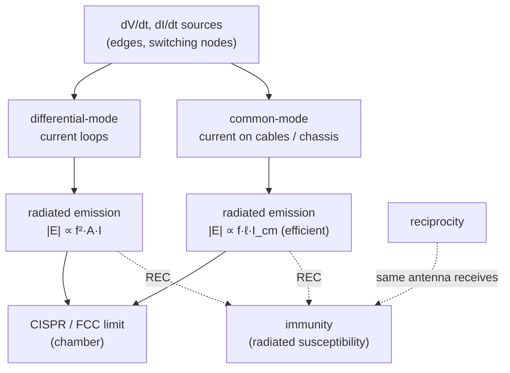
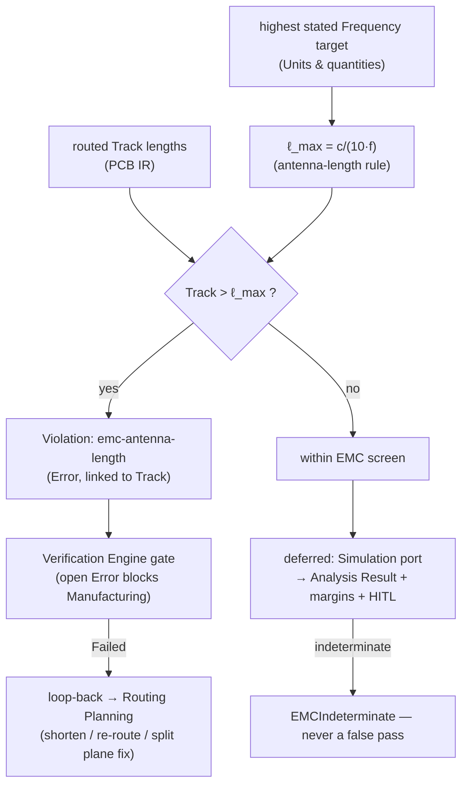

# EMI / EMC

**Summary.** *Electromagnetic interference* (EMI) is unwanted electromagnetic energy a circuit emits or absorbs; *electromagnetic compatibility* (EMC) is the engineering property of a product that neither emits enough to disturb its neighbours (**emissions**) nor malfunctions in the presence of normal electromagnetic disturbance (**immunity**). Both reduce to one fact: **any conductor carrying a time-varying current is an antenna, and any conductor in a time-varying field is a receiving antenna — and by reciprocity it is the *same* antenna in both roles.** A PCB has no parts labelled "antenna," yet every trace loop, every cable, and every slot in a plane is one. This document belongs in the Engineering Science Layer because the EAK runtime's [EMC Analysis](../../docs/state-machines/emc-analysis.md) phase ships a single deterministic rule — `EmcAntennaLengthRule` / `emc-antenna-length`, which flags a routed track longer than one tenth of a wavelength at the highest stated frequency — and that rule is meaningless without the antenna, loop-area, and common-mode physics that say *why* an electrically-long conductor radiates. It grounds that rule, the [Verification Engine](../../docs/engineering/verification-engine.md) gate it feeds, the loop-back to [Routing Planning](../../docs/state-machines/routing-planning.md), and the honest gap between a board that passes every design-time check and one that survives a compliance chamber. It is the principled answer to "which conductor will radiate, how much, at what frequency, and what does the runtime owe the design before it claims EMC?"

---

## Core principles

### Emissions and immunity are one geometry (reciprocity)

The [reciprocity theorem](../physics/maxwell-equations.md) for antennas states that a structure's transmitting pattern and gain equal its receiving pattern and gain at the same frequency. The practical corollary is decisive for design: **a good emitter is a good receptor.** The loop that radiates differential-mode noise out also couples external fields in; the slot that leaks shielding also admits interference; the resonant cable that fails an emissions limit is the same cable that fails radiated immunity. Therefore **almost every layout action that reduces emissions also improves immunity**, and EAK needs only one body of antenna theory to reason about both directions. EMC is not two problems; it is one geometry examined from two sides.


*Figure: the two emission mechanisms and the reciprocity link that makes emission and immunity the same antenna problem. Viewpoint: the radiating board.*

### Every conductor is an antenna — the dipole / antenna-length rule

Radiation efficiency is governed by electrical length, the conductor's physical length `ℓ` measured in wavelengths `λ = c/f`. For a structure short compared to `λ`, the **radiation resistance** of a short dipole is

```text
R_rad = 20·π²·(ℓ/λ)²        [Ω]   (short dipole, ℓ ≪ λ)
λ = c / f                          (c = 3×10⁸ m/s in free space)
```

Radiated power into a fixed current scales as `R_rad`, i.e. as `(ℓ/λ)²`: **doubling the electrical length quadruples the radiated power (+6 dB).** Efficiency climbs steeply as `ℓ` approaches a resonant fraction of `λ`, where the structure stops being a short dipole and becomes a tuned one:

| Electrical length | Behaviour | Status |
|---|---|---|
| `ℓ < λ/20` | weak short-dipole radiator, `R_rad` tiny | generally safe |
| `ℓ ≈ λ/10` | radiation no longer negligible | **electrically long** — EAK threshold |
| `ℓ ≈ λ/4` | quarter-wave monopole over a plane, near resonance | efficient radiator |
| `ℓ ≈ λ/2` | half-wave dipole, resonance | peak radiator |

The runtime adopts `ℓ ≥ λ/10`, i.e. the closed-form threshold `ℓ_max = c/(10·f)`, as its "electrically long" boundary. Worked: at `f = 300 MHz`, `λ = 1 m`, so any conductor longer than **100 mm** is flagged; at `1 GHz`, `λ = 300 mm`, the limit drops to **30 mm**. Using free-space `c` is the *lenient* choice — on a PCB the wave travels slower by the velocity factor `1/√ε_eff ≈ 0.5`, so the true on-board `λ` (and the true limit) is roughly half this; the free-space form can only *under*-flag, never falsely accuse, which is the safe direction for a screening rule. The same arithmetic explains the field's most common surprise: a **1 m I/O cable** is a quarter-wave monopole at `f = c/(4·1 m) ≈ 75 MHz`, squarely inside the regulated band — which is why cables, not traces, dominate real emissions (below).

### The two emission mechanisms: loop (differential) and cable (common-mode)

Two antennas coexist on every board, with radically different efficiency.

**Differential-mode (DM)** radiation comes from the signal-return current loop — a small magnetic-dipole antenna. The standard free-space estimate (see [return path](return-path.md) for its derivation from loop geometry) is

```text
|E|_DM ≈ 1.32×10⁻¹⁴ · ( f² · A_loop · I ) / r      [V/m]
  A_loop = enclosed loop area (m²), I = loop current (A), r = distance (m)
```

linear in loop area, **quadratic in frequency**. Halving the loop is −6 dB for free; this is the lever [return path](return-path.md), [per-net-class trace widths](../../docs/state-machines/routing-planning.md), and stack-up discipline pull.

**Common-mode (CM)** radiation comes from in-phase current `I_cm` flowing *out along an attached cable or chassis* and returning through stray capacitance — an electric-dipole / monopole antenna of length `ℓ`:

```text
|E|_CM ≈ 1.26×10⁻⁶ · ( f · ℓ · I_cm ) / r          [V/m]
```

Compare the two prefactors: `1.26×10⁻⁶` versus `1.32×10⁻¹⁴`. **A common-mode antenna is ~10⁸ times more efficient per unit current than a typical board loop.** A few **microamps** of `I_cm` on a cable radiate as hard as **milliamps** of DM loop current. This single ratio is why most real EMC failures are common-mode, why they involve cables, and why suppressing `I_cm` (the source of which is the ground-bounce / return-path break in [return path](return-path.md), §"loop area, inductance, and radiation") is the highest-leverage emissions action.

### Spectrum is set by edges, not clocks — the knee frequency

A digital signal's emission spectrum is not set by its clock rate but by its **edge rate**. The spectral envelope of a trapezoidal edge rolls off slowly until the **knee frequency**

```text
f_knee ≈ 0.35 / t_r        (t_r = 10–90 % rise/fall time)
```

above which it falls faster. Harmonics with meaningful energy extend up to `f_knee`. A 10 MHz clock with a 1 ns edge has `f_knee ≈ 350 MHz` and radiates strongly *hundreds of MHz above its fundamental*. The design consequence: **the frequency that matters for EMC is the knee, not the clock** — the fastest edge anywhere on the board sets the relevant `λ` for the antenna-length rule. Slowing an edge that does not need to be fast is a free, broadband emissions reduction (and the root reason series termination and controlled slew help EMC, not only signal integrity).

### Filtering and ferrites — moving energy out of band or into heat

Filtering attacks the *source current* before it reaches an antenna. Three families matter.

- **Ferrite bead.** A lossy inductor whose impedance `Z(f) = R(f) + jX(f)` is inductive at low `f` and **resistive (dissipative)** above its crossover, where it converts high-frequency common-mode energy to heat rather than reflecting it. Specified by impedance at a test frequency (e.g. "600 Ω @ 100 MHz"). It is a *band-stop* element for noise, ideally transparent at the signal's own frequency — choosing a bead whose loss peak sits at the noise band, not the signal band, is the whole skill.
- **Common-mode choke.** Two windings on one core, wound so the **differential (signal) flux cancels** (low impedance to the wanted signal) while the **common-mode flux adds** (high impedance to `I_cm`). It is the canonical cable-emission cure: it throttles the common-mode antenna current without touching the differential signal.
- **LC / π / T filters and decoupling.** A reactive filter attenuates above its cutoff `f_c = 1/(2π√(LC))`. Decoupling capacitors are filters too, but bounded by their parasitic inductance `L_esl`: a capacitor is only capacitive below its self-resonant frequency `f_SRF = 1/(2π√(L_esl·C))`; above `f_SRF` it is inductive and stops decoupling. EMC filtering is therefore an impedance-vs-frequency problem, not a "bigger capacitor" problem (see [power integrity](../electrical/power-integrity.md)).

### Shielding and apertures — and why the largest slot wins

A conductive enclosure (a Faraday cage) reduces field penetration by **shielding effectiveness** `SE`, in dB, the sum of reflection, absorption, and a multiple-reflection correction:

```text
SE(dB) = R + A + B
A = 8.69 · (t / δ)                 absorption loss; t = wall thickness
δ = 1 / √(π·f·μ·σ)                 skin depth  (≈ 6.5 µm in copper @ 100 MHz)
```

Reflection loss `R` dominates at low frequency (especially for electric fields); absorption `A` dominates at high frequency, where even a thin wall is many skin depths. A *solid* shield is almost always more than adequate. **The shield's effectiveness is destroyed by its apertures**, and what governs leakage is the **largest linear slot dimension, not the hole area**. A long thin seam leaks like a slot antenna; for a slot of length `L`,

```text
SE_aperture ≈ 20·log₁₀( λ / (2·L) )      ⇒  SE → 0 dB  when  L → λ/2
```

At `L = λ/2` the slot is resonant and the shield is transparent there. Two hundred small ventilation holes leak far less than one long seam of the same total area. This is why shield design is seam-and-gasket design, why connector cutouts and lid joints are the failure points, and why the slot physics below is the *same* physics as a plane split inside the board.

### Slot antennas from plane splits (Babinet)

By **Babinet's principle**, a slot cut in a conducting sheet is the electromagnetic complement of a metal dipole of the same dimensions: **a slot radiates.** A gap, moat, split, or long void in a PCB reference plane is therefore an antenna, resonant when its length reaches a half wavelength:

```text
f_res ≈ c / (2·L)        (L = slot length; plane split, seam, or connector cutout)
```

A 50 mm plane split resonates near 3 GHz; a 150 mm one near 1 GHz. The slot is *driven* whenever a signal's return current is forced to detour around it (the return-path break of [return path](return-path.md), §"cost of crossing a split") — the displaced return current is the feed, and the slot is the antenna. This unifies three things the runtime treats separately: a shield seam, a board-edge truncation, and an internal plane split are **one mechanism** — a resonant slot fed by displaced current.

---

## Why it matters for electronics & PCB design

EMC is the discipline where a design that is electrically correct, timing-clean, and DRC-clean still **fails to ship**, because regulatory emissions limits (CISPR 32 / FCC Part 15 for emissions, IEC 61000-4-x for immunity) are pass/fail gates enforced by law and by customers. The cost asymmetry is brutal and one-directional:

- **Decided at layout, paid in the chamber.** Loop area, antenna length, plane integrity, and slot lengths are *fixed* the moment routing is committed. A chamber failure discovered at the end forces a board respin — weeks and a tooling charge — because no amount of downstream filtering or shielding cheaply recovers what the geometry gave away. The `f²` and `(ℓ/λ)²` laws mean a modest geometric mistake is a large dB penalty.
- **Cables and common-mode dominate, and they are mostly *not on the board*.** The single most likely emitter is common-mode current on an I/O or power cable, radiating via the `1.26×10⁻⁶` prefactor. The board's job is to **not generate `I_cm`** (keep returns continuous, filter at connectors, choke cables) because once it is on a cable, the antenna is a metre long and outside the designer's control.
- **It is invisible to connectivity.** A netlist, an ERC pass, and a connectivity-complete board say nothing about loop area, edge proximity, plane slots, or cable resonance. EMC defects live in *spatial* relationships the schematic never expresses — exactly the gap the Engineering Science Layer exists to close.

The honest engineering position is that **design-time EMC reduces the probability and severity of chamber surprises but cannot prove their absence** on the board alone, because the dominant antennas (cables, enclosure seams) and the full 3-D field problem are not fully visible until the system is assembled and measured. That gap is a first-class fact the runtime must represent, not paper over.

---

## Mapping to the runtime

This theory grounds concrete EAK artifacts. In each case a violation is an engineering bug in the runtime: a design the kernel marks valid that the chamber would reject, and that no connectivity or clearance check can catch.

- **The antenna-length rule → [EMC Analysis](../../docs/state-machines/emc-analysis.md) (`EmcAnalysisMachine`, Phase 13).** The shipped `EmcAntennaLengthRule` (`emc-antenna-length`, in `eak-phases`) is the *direct, deterministic* embodiment of the dipole/antenna-length rule above: a routed `Track` longer than `ℓ_max = c/(10·f)` at the design's **highest stated operating/emission frequency** is an efficient radiator and is raised as a blocking **Error**. The frequency is read from the largest `Frequency`-dimensioned [requirement target](../../docs/engineering/units-and-quantities.md) — a *different* dimension from the trace-width rule's length floor, so the two rules never contend — and the rule is **silent rather than guessing** when no frequency is stated. The free-space `c` makes it the lenient screen justified in §"antenna-length rule" (a velocity-factor / `√ε_eff` refinement only *tightens* the limit). Without the antenna physics here, this threshold is an unexplained magic number; with it, the rule is the runtime's cheapest, most defensible proxy for "this conductor will radiate."
- **Rule → Violation → gate → loop-back → [Verification Engine](../../docs/engineering/verification-engine.md).** The antenna-length finding becomes a first-class [Violation](../../docs/foundation/engineering-domain-model.md#violation) linked to the implicated `Track` (`Violation → Track → Net → … → Requirement → Intent`), deduplicated by rule + subjects (idempotent re-verification), scoped to its own rule via per-phase gating (`count_open_blocking`) so a stale DRC/DFM finding does not fail EMC on a loop-back. An open Error blocks the transition to [Manufacturing Generation](../../docs/state-machines/manufacturing-generation.md) — the runtime's enforcement that **a board predicted to radiate cannot be released to fabrication unless explicitly [waived](../../docs/engineering/verification-engine.md)**. The `Failed` terminal loops back to [Routing Planning](../../docs/state-machines/routing-planning.md), because antenna length, loop area, and slot length are *routing-decided*; emissions are repaired by re-routing, not by re-checking.
- **Loop area and the return half → [return path](return-path.md), [per-net-class trace widths](../../docs/state-machines/routing-planning.md) (increment 10), [PCB IR](../../docs/compiler/ir/pcb-ir.md) stack-up.** The `|E|_DM ∝ f²·A·I` law makes the per-net-class width assignment and the trace-to-reference adjacency in the PCB IR *EMC artifacts*, not only impedance artifacts: a controlled width over a continuous nearby plane is what keeps `A_loop` small. The companion reference-continuity rule (the natural mate of DRC's `drc-unrouted-net`) is what stops a return-path break from manufacturing the common-mode source the chamber will find.
- **Slot antennas → [board-edge keep-out](../../docs/state-machines/routing-planning.md) (increment 9) and plane-split modelling in the [PCB IR](../../docs/compiler/ir/pcb-ir.md).** The `f_res = c/(2L)` slot law makes the fabrication-sourced edge keep-out an EMC control (the board edge is a truncation slot fed by edge-crowded return current), and it tells a future reference-continuity check *which* plane gaps to flag: any split whose length approaches `λ/2` at the knee frequency is a resonant aperture. The PCB IR must record plane voids/splits as typed geometry for this to be checkable at all.
- **Filtering / ferrites / chokes → [Constraint Engine](../../docs/engineering/constraint-engine.md), [Component Library](../../docs/engineering/component-library.md), and the [regulator VIN/VOUT rail split](../../docs/state-machines/routing-planning.md) (increment 11).** "Place a common-mode choke / ferrite at every I/O and power connector," "filter before the conductor leaves the board," and "do not share a return between a switching node and a quiet rail" are machine-checkable [Constraints](../../docs/GLOSSARY.md#constraint). The VIN/VOUT split is the power-domain instance: separating the switcher's noisy input loop from the regulated output denies a shared path that would otherwise inject supply noise that later radiates. Filter *components* and their `Z(f)` / `f_SRF` behaviour live as parameterised parts in the [Component Library](../../docs/engineering/component-library.md).
- **Regulatory limits → [Standards & compliance](../../docs/engineering/standards-and-compliance.md).** The "EMC limits" the analysis compares against (CISPR 32 class A/B, FCC Part 15, and the IEC 61000-4-x immunity suite) are standards-sourced limit curves, not constants baked into a rule — keeping the limit a [Quantity](../../docs/engineering/units-and-quantities.md) tied to a named standard is what makes a margin auditable.
- **The chamber gap → the deferred [Simulation port](../../docs/state-machines/emc-analysis.md) path.** EMC is documented as **analysis, not pass/fail** for a reason rooted in §"chamber surprises": the full target reaches an external EMC/SI/PI solver via the Simulation port, returns an [Analysis Result](../../docs/foundation/engineering-domain-model.md#analysis-result) with margins and confidence, and routes margin exceedances to a [human-in-the-loop](../../docs/engineering/human-in-the-loop.md) disposition (accept / [waive](../../docs/engineering/verification-engine.md) / re-route). Critically, if the simulator is unavailable the phase goes to `Failed` via `EMCIndeterminate` — **the design is never falsely passed on missing analysis.** The shipped antenna-length rule is the deterministic *subset* of this target; representing the rest as deferred-but-specified is the runtime telling the truth about what board-level checks can and cannot prove.


*Figure: how a stated frequency, the PCB IR track geometry, and the antenna-length threshold produce a gating violation and a routing loop-back, with the deferred external-simulation path that handles the chamber gap.*

A violation here is an engineering bug in the strict sense: the kernel can emit a connectivity-complete, DRC-clean, width-correct board carrying a 200 mm trace clocked with a 300 ps edge, or a 150 mm analog/digital plane moat — *valid by every check the runtime runs today* and a near-certain radiated-emissions failure. Encoding the antenna, loop, and slot physics is what lets the deterministic kernel be right about a thing the schematic never said.

---

## Failure modes if violated

- **Routing an electrically-long conductor.** A trace approaching `λ/4`–`λ/2` at the knee frequency is a tuned antenna; the `(ℓ/λ)²` law makes the penalty steep. This is exactly what `emc-antenna-length` exists to catch; a runtime with no frequency context (silent rule) or no length model cannot.
- **Generating common-mode current.** A broken return, a ground-bounce node, or an unfiltered connector injects `I_cm` onto a cable. Via the `1.26×10⁻⁶` prefactor, microamps fail limits that tolerate milliamps of loop current — and the antenna (the cable) is off-board and uncontrollable after the fact.
- **Ignoring edge rate.** Designing to the clock frequency and over-driving slew puts strong harmonics up to `f_knee` hundreds of MHz away, radiating in band. The fastest edge, not the clock, sets the EMC-relevant `λ`.
- **Cutting a resonant slot.** A plane split, board-edge truncation, or shield seam of length near `λ/2` is a transparent slot antenna (Babinet). Connectivity is perfect; the aperture is wide open at `f_res = c/2L`.
- **Trusting a holey shield.** Treating shielding effectiveness as a wall property while leaving a long seam: the largest linear slot, not the metal, sets the leakage, and a resonant seam zeroes `SE` there.
- **Mis-tuned filtering.** A ferrite whose loss band misses the noise band, or a decoupling cap used above its `f_SRF` (where it is inductive), filters nothing — EMC filtering is an impedance-vs-frequency match, not a parts count.
- **Claiming EMC from board checks alone.** Reporting a "pass" when only the deterministic antenna-length subset ran — when cables, enclosure, and the full field problem are unmodelled — is the cardinal sin. The runtime's `EMCIndeterminate`/never-false-pass policy is the structural guard against it.

Each failure is the same root error: **treating a conductor as wiring rather than as the antenna it physically is.** The Engineering Science Layer exists so the runtime's antenna-length rule, loop-area and reference-continuity reasoning, slot/edge controls, filter constraints, and the indeterminate-not-pass policy are understood as consequences of antenna and field physics — not as optional EMC etiquette discovered, expensively, in a chamber.

---

## Related documents

- [Return path](return-path.md) — where the return current flows, the origin of loop area and of the common-mode `I_cm` source; the layout-side companion to this emissions view.
- [Ground plane](ground-plane.md) — plane integrity, splits, and stitching; the conductor whose continuity decides loop area and slot resonance.
- [Power distribution](power-distribution.md) — decoupling, plane resonance, and the regulator rail split that keeps switching noise off radiating conductors.
- [Signal integrity](../electrical/signal-integrity.md) — the knee frequency and edge-rate control that set the EMC-relevant spectrum; reflections that worsen ringing and emission.
- [Transmission lines](../electrical/transmission-lines.md) — the electrically-long boundary `ℓ ≳ λ/10` and `Z₀` that select which nets warrant scrutiny.
- [Power integrity](../electrical/power-integrity.md) — capacitor self-resonance and the impedance-vs-frequency view behind decoupling and filtering.
- [Maxwell's equations](../physics/maxwell-equations.md) — the field axioms behind radiation, reciprocity, Babinet's principle, and the radiation laws.
- [Electromagnetics](../physics/electromagnetics.md) — radiation resistance, skin depth, and shielding effectiveness derivations.
- [RF physics](../physics/rf-physics.md) — antenna resonance, slot antennas, and high-frequency behaviour at and beyond the knee.
- Runtime anchors: [EMC Analysis](../../docs/state-machines/emc-analysis.md) · [Routing Planning](../../docs/state-machines/routing-planning.md) · [Verification Engine](../../docs/engineering/verification-engine.md) · [Constraint Engine](../../docs/engineering/constraint-engine.md) · [PCB IR](../../docs/compiler/ir/pcb-ir.md) · [Manufacturing IR](../../docs/compiler/ir/manufacturing-ir.md) · [Standards & compliance](../../docs/engineering/standards-and-compliance.md) · [Units & quantities](../../docs/engineering/units-and-quantities.md) · [Component Library](../../docs/engineering/component-library.md) · [Human-in-the-loop](../../docs/engineering/human-in-the-loop.md) · [Engineering Domain Model](../../docs/foundation/engineering-domain-model.md) · [GLOSSARY](../../docs/GLOSSARY.md).
