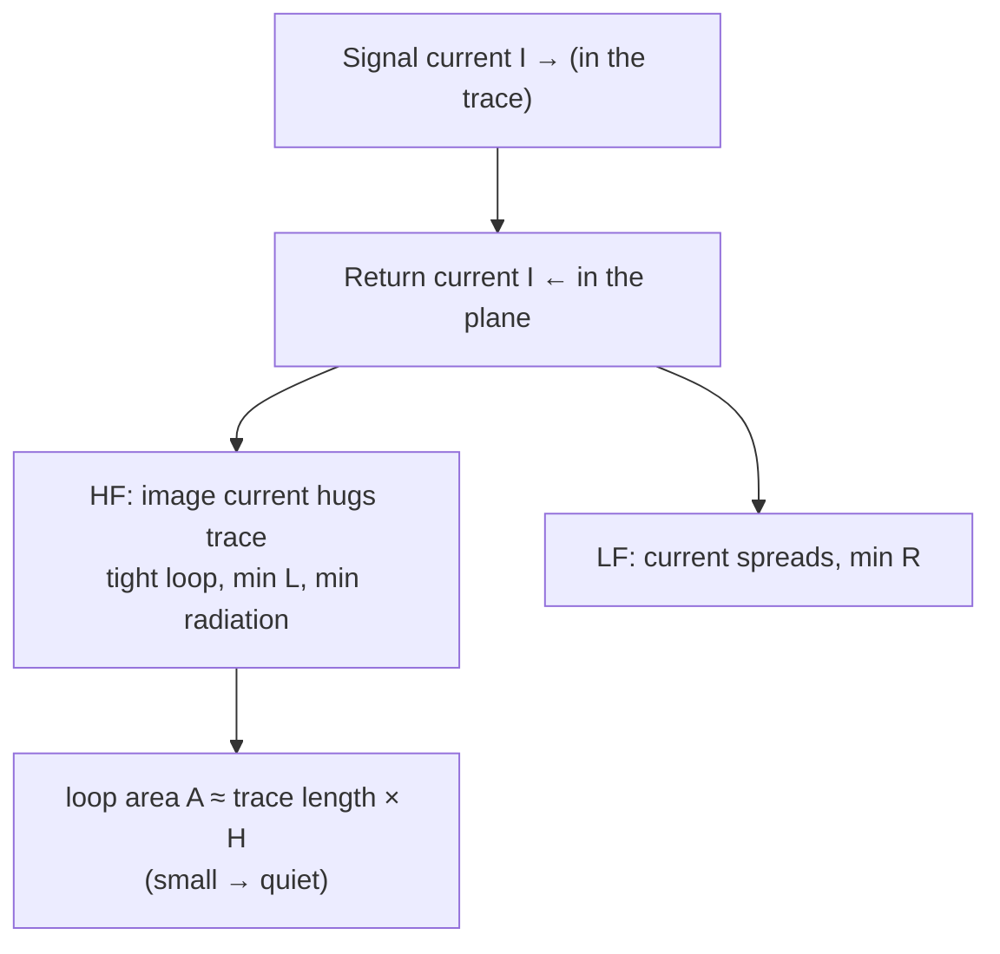
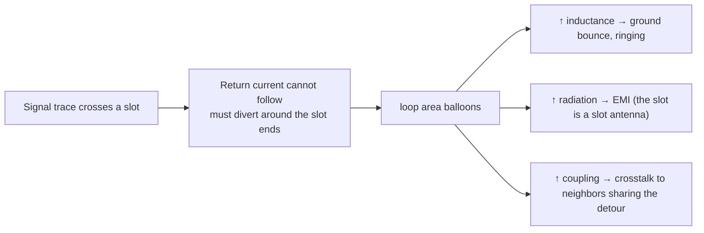
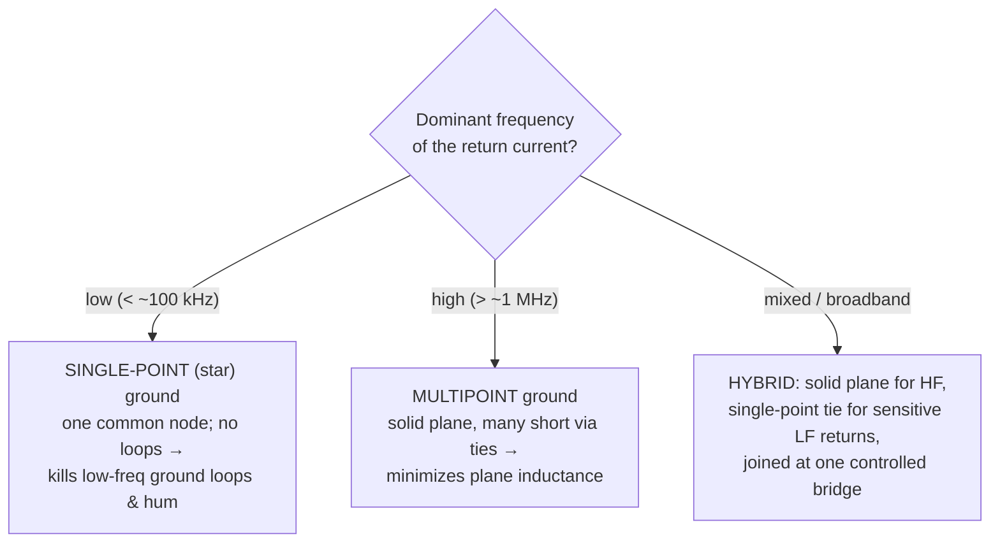

# Ground Planes

**Summary.** A ground plane is a solid, continuous sheet of copper on a dedicated layer that serves as the shared *return conductor* and *voltage reference* for every signal on the board. It belongs in the Engineering Science Layer because the runtime's physical-design phases silently assume that current which a [Net](../../docs/foundation/engineering-domain-model.md#net) delivers *comes back* along a low-impedance path, and that the `Z₀` of a routed [Track](../../docs/foundation/engineering-domain-model.md#track--routing) has a stable plane to be referenced to — yet the lumped [Schematic IR](../../docs/compiler/ir/schematic-ir.md) shows ground as a single ideal node with zero impedance, which is exactly the fiction this document dismantles. The plane is not wiring; it is the most important "component" on the board, because it is the one conductor that *every other net depends on*. This document states the physics of return current (where it actually flows and why), the quantified cost of splits and slots, the role of stitching vias in maintaining reference continuity across layer changes, and the single-point-versus-multipoint grounding decision — then maps each result to the EAK engine, IR field, or verification rule that embodies it (or, where the doc flags a gap below, is specified to embody it): the spec-defined [PCB IR](../../docs/compiler/ir/pcb-ir.md) stack-up and copper pour, [layer assignment in Routing Planning](../../docs/state-machines/routing-planning.md), the [board-edge keep-out](../../docs/state-machines/dfm-verification.md), the [regulator VIN/VOUT rail split](../../docs/state-machines/manufacturing-generation.md), and the [EMC electrically-long check](../../docs/state-machines/emc-analysis.md).

---

## Core principles

### Current returns — the return path is not optional

[Kirchhoff's current law](../electrical/kirchhoff-laws.md) is absolute: every electron that leaves a driver must return to it. A signal "trace" is only half a circuit; the other half is the return conductor, and on a modern board that conductor is the ground plane. The defining question of plane design is therefore not "is the signal routed?" but "where does its return current flow, and how big a loop does the round trip enclose?" — because that loop area governs inductance, radiation, and crosstalk simultaneously.

### Where return current actually flows — frequency decides

Return current does not flow uniformly through the plane. It distributes to minimize the *total impedance* `Z = R + jωL` of the return path, and which term dominates depends on frequency:

```text
Low frequency  (ωL ≪ R):  current minimizes RESISTANCE  → spreads wide, takes the
                          geometrically shortest/widest path (least copper resistance).
High frequency (ωL ≫ R):  current minimizes INDUCTANCE   → hugs the plane directly
                          beneath the signal trace (least loop area = least L).

Crossover frequency:  f_x = R_path / (2π · L_path)        (typically ~ 1–100 kHz)
```

Above a few hundred kilohertz — i.e. for essentially every digital edge, whose content lives at the [knee frequency](../electrical/signal-integrity.md) `f_knee ≈ 0.5/t_r` — the return current concentrates in a narrow band *directly under the trace*. This is the **image current** (or mirror current): the plane behaves as if it carried a reflected copy of the signal current, hugging the trace to make the signal-and-return loop as tight as physics allows. The lateral distribution is a Lorentzian set by the dielectric height `H` between trace and plane:

```text
J(x) = (I₀ / π·H) · 1 / (1 + (x/H)²)          x = lateral offset from trace centerline

≈ 80 % of the return current flows within ±3·H of the trace.
```


*Figure: the return current's two regimes; at signal frequencies it images directly beneath the trace, making the loop area — and therefore inductance, emission, and coupling — minimal.*

The engineering consequence is decisive: **the return path is a real, locatable thing**, and a solid plane lets it form automatically under every trace with no router effort. The plane's value is that it offers the minimum-inductance return *everywhere*, so the loop closes itself.

### Why loop area is the master quantity

A continuous plane minimizes the signal/return loop, and loop area controls the three quantities that decide whether a board works:

```text
Loop inductance:     L_loop ≈ μ₀ · (A / ℓ)              A = loop area, ℓ = length
Radiated emission:   E ∝ A · f² · I                    (small loop antenna; ∝ area)
Crosstalk / pickup:  V_induced = M · dI/dt,  M ∝ A      (mutual inductance ∝ shared loop)
Ground bounce:       V = L_loop · dI/dt                 (return inductance × edge rate)
```

Every term is proportional to loop area (or to the inductance it sets). The solid plane is the single design choice that drives `A` toward its physical floor (`A ≈ trace-length × dielectric-height`) for *all* nets at once. This is why "add a ground plane" is the highest-leverage move in noisy-board debugging: it does not fix one net, it collapses the return loop of every net.

### The cost of splits, slots, and gaps

Cut the plane and the return current can no longer image under the trace — it must detour around the discontinuity, and the detour *is* the damage:


*Figure: one slot, three failure modes — a plane split converts a clean return into a large-loop antenna, an inductor, and a crosstalk aggressor at once.*

Three quantified facts the runtime must respect:

1. **A slot is an antenna.** A gap in the plane spanned by a trace forms a *slot antenna*; the diverted return current drives it. Emissions can rise by 20 dB or more versus the same trace over solid copper — frequently the difference between passing and failing a radiated-emissions limit.
2. **The detour adds inductance.** The added return inductance is roughly proportional to the detour length divided by its width; a long, narrow neck around a slot end can add tens of nanohenries, multiplying ground bounce `V = L·dI/dt` on fast edges.
3. **Splits couple nets that share the detour.** Two traces forced through the same plane neck now share return inductance and crosstalk, even if they are far apart in routing — a non-local failure that no clearance rule catches.

The corollary: **a signal trace must never cross a plane split.** If a board *requires* split planes (e.g. isolating analog and digital returns, or separating a noisy power return), signals that must cross the boundary do so only at a single deliberate bridge where the planes are joined, so the return current has a defined path. A floating copper pour island that is not tied to the reference is worse than no copper — it is a resonant, capacitively-coupled patch.

### Stitching vias and reference continuity across layer changes

When a trace changes layers through a signal via, its reference plane may change too — and the return current must *transfer between planes* at that point. What happens next depends on the two planes:

```text
Case A — same net (GND → GND):   place a GROUND stitching via adjacent to the signal via.
         Return current hops plane-to-plane through the stitch; loop stays tight.

Case B — different nets (GND → PWR, i.e. reference changes from a ground to a power plane):
         the return cannot flow through copper between two different nets. It must couple
         through the interplane capacitance, or through a STITCHING CAPACITOR placed at the
         via. Without one, the return makes a large detour → the same split-plane penalty.
```

A **stitching via** is a via whose sole job is to connect two same-net plane regions (or a plane to a pour) so that current — return current, or heat — can pass between them. Stitching vias serve several roles, all reducible to "keep the reference continuous and the loop tight":

- **Return-transfer stitching** — beside every layer-changing signal via that also changes reference plane (Case A), giving the return a low-inductance hop.
- **Plane-bonding stitching** — a field of vias tying multiple ground layers into one equipotential reference, lowering plane impedance and suppressing inter-plane resonances.
- **Edge / perimeter stitching** — a guard ring of ground vias around the board perimeter that shorts the plane edges together, containing fields and reducing edge-fired radiation (the *board edge* is itself a radiating discontinuity — see the keep-out mapping below).

The governing rule of every layer change is **reference continuity**: a return current must have a defined, low-inductance path to follow the signal across the layer transition. A via that changes reference plane *without* a nearby stitch (via or capacitor) is a return-path discontinuity — electrically the same defect as crossing a slot.

### Single-point versus multipoint grounding

How grounds *connect to each other* is a frequency-driven decision, and getting it wrong is a classic, expensive mistake:


*Figure: the grounding-topology decision; single-point below, multipoint above, hybrid for mixed-signal boards.*

The physics behind the split:

- **Single-point (star) grounding** routes every return to one common node, so no two returns share a conductor and there are no ground *loops* to pick up magnetic flux or carry circulating mains-frequency current. It is correct at low frequency. At high frequency it fails: the long radial connections have inductance `ωL` that dwarfs any resistance, so the "single point" is no longer a single potential — and the long stubs radiate.
- **Multipoint grounding** ties everything to a solid plane with many short vias. The plane's low inductance keeps the whole reference at nearly one potential up to high frequency. It is the only correct choice for digital and RF returns. Its risk — low-frequency ground loops through the plane — is real but usually negligible because the plane's resistance is tiny.
- **Hybrid grounding** uses a solid plane for HF integrity while breaking a sensitive low-frequency return (e.g. a precision-analog return) out to a single-point tie, joining the two domains at exactly one controlled bridge. This is the principled version of the analog/digital plane split: *one* bridge, never a signal crossing an uncontrolled gap.

The unifying rule: **let the dominant frequency choose the topology, and never let a high-speed return current cross an isolation gap.**

### The plane as the most important "component"

A solid reference plane simultaneously is:

| Role | What it provides |
|------|------------------|
| **Return conductor** | The image-current path for every net; minimum loop area board-wide. |
| **Impedance reference** | The plane that makes a trace's `Z₀` a defined function of geometry ([transmission lines](../electrical/transmission-lines.md)). |
| **Shield** | An interposed plane decouples layers, blocking field coupling between signals above and below it. |
| **Heat spreader** | A large copper area conducts heat laterally away from hot parts ([thermal physics](../physics/thermal-physics.md)). |
| **PDN element** | With an adjacent power plane it forms a parallel-plate capacitor and the low-inductance return for decoupling. |

No other copper feature on the board is referenced by every net. That is the precise sense in which the plane outranks any IC: remove a component and one function fails; corrupt the plane and *every* net's return, reference, and shielding degrade together. A board is, to first order, a ground plane with some signals decorating it.

---

## Why it matters for electronics & PCB design

The schematic shows ground as a single node — one symbol, zero impedance, infinitely many connections. That abstraction is a deliberate lie that holds only at DC and low frequency, and the plane is where the lie is paid for. Every defect above is invisible in the [Schematic IR](../../docs/compiler/ir/schematic-ir.md) and in pure connectivity checking: a board can have every net connected, pass a topological [ERC](../../docs/state-machines/erc-verification.md), pass a clearance-only [DRC](../../docs/state-machines/drc-verification.md), and still fail in the lab because its return currents enclose huge loops, its plane is sliced into resonant islands, or its high-speed nets cross splits. The cost is the canonical "the schematic is right and the board doesn't work" failure: failed EMC scans, corrupted high-speed reads, analog noise floors ten times worse than the datasheet promises. What makes the plane *tractable* for a runtime is that its governing quantities — loop area, return inductance, the `±3H` image band, the slot detour length, the stitching-via spacing — are all computable from geometry the [PCB IR](../../docs/compiler/ir/pcb-ir.md) is *specified* to own (though, per the stack-up gap noted in *Mapping to the runtime*, the implemented IR does not yet carry the dielectric height, plane/pour, or vias these particular quantities require). Ground integrity is not expert folklore; it is a set of geometric invariants on copper, which is exactly what an engineering runtime can encode as constraints and verify as rules.

---

## Mapping to the runtime

This is the layer's point: every plane principle above must be the *reason* behind a specific EAK artifact, and violating it must be an engineering bug in the runtime, not merely in a user's design.

- **The plane is a first-class IR object, not just routing.** The SPEC's [PCB IR](../../docs/compiler/ir/pcb-ir.md) *defines* a typed **layer stack-up** — copper and dielectric layers, thicknesses, materials, and dielectric constants as typed [Physical Quantities](../../docs/engineering/units-and-quantities.md) — produced in [PCB Floor Planning](../../docs/state-machines/pcb-floor-planning.md). **Gap — not yet implemented (see the [compliance report](../compliance/compliance-report.md)):** the current `eak/` `Board` is `{ id, width, height, layers: u32 }`, an outline plus a layer *count* only, and the lowered `PcbIr.board` is that same reduced `Board` cloned — so neither yet carries per-layer height, dielectric constant (ε_r/Dk/Df), copper weight, material, or plane/signal role, and no `Plane`/`Pour` entity exists. The engineering-science requirement this document grounds is that a *reference plane layer* and its **copper pour** (the realized plane fill) will become explicit IR objects bound to a [Net](../../docs/foundation/engineering-domain-model.md#net) (the ground net), not an afterthought. If a layer is declared "signal" with no adjacent reference plane in the stack, every `Z₀` on it is undefined — a stack-up that the [Constraint Engine](../../docs/engineering/constraint-engine.md) should reject during `ValidatingFloorPlan`, because it makes controlled impedance unrealizable downstream.

- **Reference continuity → a layer-assignment invariant for Routing Planning.** `PlanningRouting` ([Routing Planning](../../docs/state-machines/routing-planning.md)) assigns each [Track](../../docs/foundation/engineering-domain-model.md#track--routing) to a layer; the deepest plane rule — *every signal has a continuous reference plane and an unbroken return path* — is an invariant that assignment must respect. A route that crosses a plane split, or changes reference layer through a via without an adjacent same-net stitching via, violates the image-current/loop-area principle. Encoding "signal crosses a plane discontinuity" and "reference-changing via lacks a return stitch" as [Verification Engine](../../docs/engineering/verification-engine.md) rules is the natural plane-integrity check, dual to the existing unrouted-net DRC rule — but no such reference-continuity rule is implemented yet (only the unrouted-net rule ships today): both *would* assert that a net is not merely *drawn* but *electrically complete* — and a return path is half of every net.

- **Loop area / electrically-long → the EMC antenna rule.** [EMC Analysis](../../docs/state-machines/emc-analysis.md) ships `EmcAntennaLengthRule` (`emc-antenna-length`): a [Track](../../docs/foundation/engineering-domain-model.md#track--routing) longer than `c / (10·f)` (the `λ/10` boundary) is a blocking [Violation](../../docs/foundation/engineering-domain-model.md#violation). That rule scores the *signal* length, but the emission it proxies is driven by **loop area**, which the return path sets. A long trace over a solid plane (tight loop) radiates far less than a short trace over a split (huge loop). The principled extension this document grounds is that the antenna check must eventually see the return path, not only the forward conductor — and the documented [leniency](../../docs/state-machines/emc-analysis.md) of using stated `f` instead of `f_knee` compounds with ignoring loop area: both make the rule under-count radiators.

- **Board-edge fields → the DFM board-edge keep-out.** The [DFM Verification](../../docs/state-machines/dfm-verification.md) **board-edge keep-out** (fab-sourced, increment 9) holds copper back from the board outline. Its first-order purpose is manufacturability (routing/breakout damage), but the same keep-out is where *edge stitching* and plane pull-back live: an exposed plane edge fires fields outward (the *edge-radiation* effect), and a perimeter ground-via fence inside that keep-out contains them. The runtime fact is that the edge keep-out is the natural carrier for the plane-edge treatment, so the manufacturing and EMC purposes of the same geometric constraint coincide rather than conflict.

- **Ground bounce / PDN → the regulator VIN/VOUT rail split.** Ground bounce is `V = L_return · dI/dt`; modeling and bounding it requires the power *and its return* to be distinct, representable nets with their own decoupling and plane structure. The shipped **regulator VIN/VOUT rail split** (increment 11) — splitting a previously collapsed rail so a regulator's `VIN` and `VOUT` are separate [Nets](../../docs/foundation/engineering-domain-model.md#net) — is the structural precondition for power-plane and PDN reasoning: a collapsed rail makes the power-plane/ground-plane capacitor, its return, and its decoupling un-representable, so ground bounce is invisible *by construction*. The plane principle is the "why" under that split: a power net and a ground net are the two plates of the PDN, and they must be distinct objects for the return path to exist in the model at all.

- **Single-point vs multipoint → a grounding-topology constraint, not a default.** Whether the ground net is realized as one solid multipoint plane, a star, or a hybrid is a [Constraint](../../docs/foundation/engineering-domain-model.md#constraint) the [Constraint Engine](../../docs/engineering/constraint-engine.md) should carry per ground domain, chosen by the dominant return frequency of the nets in that domain. The runtime bug to prevent is a global "tie all grounds together" or "star everything" default applied without regard to frequency: the former adds high-frequency loops to sensitive analog returns; the latter adds inductive stubs to fast digital returns. The topology must be a recorded [Decision](../../docs/foundation/engineering-domain-model.md#decision), not an implicit constant.

- **Plane integrity must survive IR lowering.** The plane's existence, its net binding, and its continuity are properties the [transformations](../../docs/compiler/transformations.md) between IRs must preserve. A lowering pass that emits the [Manufacturing IR](../../docs/compiler/ir/manufacturing-ir.md) and drops or fractures the pour, or loses the stitching vias, silently destroys the return path the upstream phases reasoned about — a transformation-invariant violation as serious as dropping an impedance constraint.

If Routing assigns a layer with no reference plane, every `Z₀` is undefined though clearance "passes"; if a route crosses a split, the board radiates though every net is connected; if the rail stays collapsed, the PDN is unmodelable; if a lowering drops the pour, the fab builds a board whose returns no upstream phase ever checked. The runtime's job is to make ground integrity *checkable*, and these mappings are where it must.

---

## Failure modes if violated

- **Signal trace crosses a plane split (the cardinal sin).** Return current detours around the slot; loop area balloons; the board fails radiated emissions (the slot antenna), rings on fast edges (added return inductance), and couples crosstalk to every net sharing the detour. One layout error, three failure modes — and none is caught by a clearance-only DRC.
- **No reference plane under a high-speed layer.** `Z₀` is undefined; the trace is an uncontrolled-impedance line; reflections and ringing are unbounded. Controlled impedance is unrealizable, yet every connectivity check passes.
- **Layer-change via with no return stitch.** The return current can't follow the signal across the layer transition, so it makes a large detour — electrically identical to crossing a slot, but produced by an innocent-looking via. The highest-frequency nets suffer most.
- **Floating / unconnected copper pour.** A pour island not tied to the reference net is a resonant, capacitively-coupled antenna — worse than bare laminate. Pours must be stitched to the plane they belong to.
- **Collapsed power rail (the pre-increment-11 bug).** `VIN` and `VOUT` share a net; the power-plane/ground-plane PDN capacitor and its return are un-representable; ground bounce is invisible until silicon misbehaves. The rail split is the structural fix this principle requires.
- **Wrong grounding topology for the frequency.** A single-point star on fast digital returns adds inductive stubs that radiate; a global multipoint tie on a precision-analog return adds a hum-pickup loop. The topology must follow the dominant return frequency, not a global default.
- **Plane fractured by IR lowering.** The Manufacturing IR emits a pour the upstream phases never sanctioned; the fabricated board's return path differs from the verified one. A transformation invariant silently broken.

---

## Related documents

- [`electrical/kirchhoff-laws.md`](../electrical/kirchhoff-laws.md) — current continuity (KCL): the law that makes the return path mandatory.
- [`electrical/signal-integrity.md`](../electrical/signal-integrity.md) — the knee frequency, ground bounce, and reference-continuity budget the plane underwrites.
- [`electrical/transmission-lines.md`](../electrical/transmission-lines.md) — why `Z₀` needs a reference plane; the distributed model the plane completes.
- [`physics/electromagnetics.md`](../physics/electromagnetics.md) — image currents, loop radiation, and field coupling, from first principles.
- [`physics/maxwell-equations.md`](../physics/maxwell-equations.md) — the source of propagation, radiation, and the displacement current that closes the loop through interplane capacitance.
- [`physics/thermal-physics.md`](../physics/thermal-physics.md) — the plane as lateral heat spreader.
- [`electrical/ohms-law.md`](../electrical/ohms-law.md) — plane resistance and the DC half of the return path.
- Runtime: [PCB IR](../../docs/compiler/ir/pcb-ir.md) · [PCB Floor Planning](../../docs/state-machines/pcb-floor-planning.md) · [Routing Planning](../../docs/state-machines/routing-planning.md) · [DRC](../../docs/state-machines/drc-verification.md) · [DFM](../../docs/state-machines/dfm-verification.md) · [EMC Analysis](../../docs/state-machines/emc-analysis.md) · [Manufacturing Generation](../../docs/state-machines/manufacturing-generation.md) · [Constraint Engine](../../docs/engineering/constraint-engine.md) · [Verification Engine](../../docs/engineering/verification-engine.md) · [Units & Quantities](../../docs/engineering/units-and-quantities.md).
