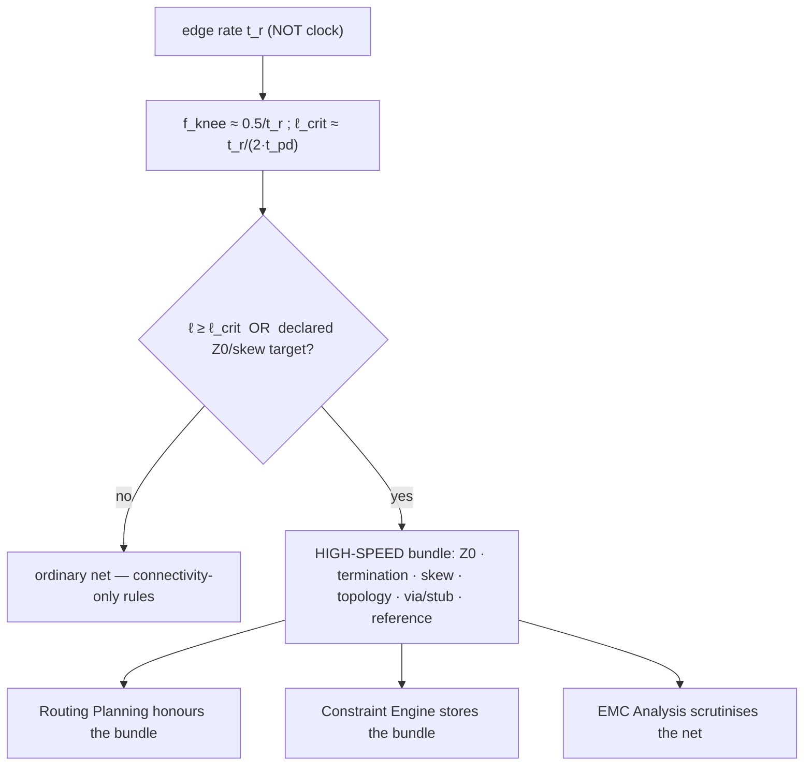
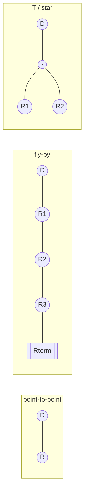
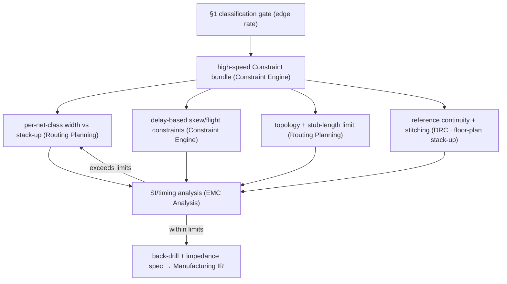

# High-Speed Design

**Summary.** High-speed design is the discipline that makes a [Net](../../docs/foundation/engineering-domain-model.md#net)'s *timing* and *waveform fidelity* a first-class layout objective rather than an afterthought — it is what turns "connect these pins" into "deliver this edge, intact, at this instant." It is the integration layer that sits on top of two more primitive theories: [transmission lines](../electrical/transmission-lines.md) (when copper becomes a distributed `Z_0`/`t_pd` structure) and [signal integrity](../electrical/signal-integrity.md) (whether the received waveform still reads as the intended logic value). This document adds the *timing-driven* viewpoint those two leave implicit: flight-time budgets that decide whether a bus closes timing, length/skew matching expressed in delay, the via-stub and back-drilling cost of vertical transitions, the topology choice (daisy-chain, star, fly-by, T) that fixes a net's reflection signature, the reference handoff that keeps the return current continuous across layer changes, and — upstream of all of it — the single classification gate that decides *when an edge makes a net "high-speed" at all.* It belongs in the Engineering Science Layer because the EAK runtime length-matches buses, restricts topology, budgets vias, and back-drills stubs *as if* it had a timing and SI model, while the only invariant it states for a routed net is that it realizes its schematic net (connectivity). This document is the timing-and-fidelity "why" behind the high-speed constraint bundle that [Routing Planning](../../docs/state-machines/routing-planning.md), the [Constraint Engine](../../docs/engineering/constraint-engine.md), [EMC Analysis](../../docs/state-machines/emc-analysis.md), and [Manufacturing Generation](../../docs/state-machines/manufacturing-generation.md) silently enforce.

---

## Core principles

### 1. The classification gate — when an edge makes a net "high-speed"

A net is "high-speed" not because of its clock rate but because of its **edge rate**. The spectral content of a digital edge of rise time `t_r` is significant up to the **knee frequency** `f_knee ≈ 0.5 / t_r` (usable bandwidth `≈ 0.35 / t_r`); the clock is irrelevant to that number. The two equivalent triggers — derived in full in [transmission lines](../electrical/transmission-lines.md) and [signal integrity](../electrical/signal-integrity.md) — are:

```text
Frequency view :  electrically long when  ℓ ≥ λ/10 ,  λ = v / f_knee
Time view      :  electrically long when  2·T_d ≥ t_r ,  T_d = ℓ · t_pd
Critical length:  ℓ_crit ≈ t_r / (2 · t_pd)      (one-way flight ≈ ¼ of t_r)
```

A 10 MHz bus with 300 ps edges is a transmission-line problem to roughly `f_knee ≈ 1.6 GHz` — a counter-intuitive but load-bearing fact. **The gate is a decision, not a measurement:** crossing `ℓ_crit` (or carrying a declared impedance/timing target) *promotes* a [Net](../../docs/foundation/engineering-domain-model.md#net) from an ordinary connection into the **high-speed constraint bundle** — controlled `Z_0`, termination, delay-based length/skew match, a topology restriction, a via/stub limit, mandatory reference continuity, and back-drill candidacy. Everything below is what that promotion *means*.


*Figure: the gate that promotes a net into the high-speed constraint bundle, keyed on edge rate rather than clock rate.*

### 2. Flight-time budgets — timing is a conserved quantity

On an electrically-long net the propagation delay is no longer negligible; it is a *line item in the timing budget*. **Flight time** `t_flight` is the interval from the launch reference at the driver to the instant the receiver input crosses its threshold *and stays* — it is the one-way line delay `T_d = ℓ·t_pd` **plus** any *settling* delay the waveform needs to ring down past the threshold:

```text
t_flight = T_d + t_settle          ( t_settle > 0 for under-terminated / multidrop nets )
```

The crucial consequence is that **topology and termination enter the timing budget through `t_settle`**, not just the SI budget — a poorly terminated bus is slower, not merely noisier. Two budget forms dominate PCB practice.

```text
Common-clock (system-synchronous), launch FF → capture FF on a shared clock:
  setup:  t_co(max) + t_flight(max) + t_setup + t_skew(clk) + t_jitter  ≤  t_period
  hold :  t_co(min) + t_flight(min)                                     ≥  t_hold + t_skew(clk)

Source-synchronous (clock forwarded with the data, e.g. a strobe):
  common flight cancels; what remains is data-vs-strobe skew at the receiver
  margin = (t_UI / 2) − ( t_skew(data,strobe) + t_jitter + t_RX_setup )

Serial / embedded-clock (UI-based, clock recovered by a CDR):
  the unit interval t_UI is the whole budget; jitter + ISI + skew must fit inside the eye
```

Three engineering rules fall out. (a) **Both corners matter:** setup is bounded by the *slow/long* corner, hold by the *fast/short* corner — a net can pass setup and fail hold, so min-delay is a real constraint, not a safety margin. (b) **Source-synchronous trades absolute delay for matching:** common flight cancels, so the controlled quantity becomes data-to-strobe *skew*, which is why source-synchronous buses tolerate long traces but demand tight matching. (c) **Settling delay couples §2 to §4/§5:** the topology and termination you choose set `t_settle`, hence `t_flight(max)`, hence whether the path closes timing.

### 3. Length and skew matching — match delay, allocate a budget

When several signals must arrive coincident, the controlled quantity is **flight-time skew**, not physical length. Because `t_pd` differs by layer (microstrip ≈ 6.0 ps/mm, stripline ≈ 6.9 ps/mm on FR-4 — see [transmission lines](../electrical/transmission-lines.md)), matching equal *lengths* across a microstrip↔stripline transition still ships skew. **Matching is by delay:**

```text
Skew between two nets :  Δt = | T_d1 − T_d2 | = | ℓ1·t_pd1 − ℓ2·t_pd2 |
Length-match window   :  Δℓ_max = skew_budget / t_pd     (per layer, per t_pd)
```

Skew is a *budget to be allocated across nested groups*, tightest at the innermost level:

| Matching level | Typical budget source | What mismatch does |
|---|---|---|
| **Intra-pair** (P vs N of a differential pair) | small fraction of `t_UI` (often a few ps) | converts differential → common mode: emissions + immunity loss ([signal integrity](../electrical/signal-integrity.md), [EMC](../../docs/state-machines/emc-analysis.md)) |
| **Intra-byte-lane** (data bits vs their strobe) | source-synchronous setup/hold window | erodes the data-valid window directly |
| **Inter-lane / whole-bus** (lane to lane) | looser, deskewed by the controller | bounded by training/deskew range |

Two physical subtleties the runtime must respect. **Tuning** (serpentine/accordion) adds the deficit length to the short member, but its segments must hold a minimum spacing (commonly `≥ 3·h` to the reference, or `≥ 4×` trace width between turns) or the trace couples to itself and the added copper no longer behaves as clean line. **Fiber-weave skew** is delay mismatch with *no* length mismatch: a trace over a glass bundle and a trace over a resin gap see different local `ε_r`, hence different `t_pd` — mitigated by zig-zag routing or weave-aware angles, and a reason the delay model, not the length model, is authoritative.

### 4. Topology — the branch structure fixes the reflection signature

How a net's pins are connected — its *branch structure* — determines its characteristic-impedance profile and therefore its reflections and settling. Each topology trades SI quality against routing/timing simplicity.

| Topology | Structure | SI behaviour | Where it fits |
|---|---|---|---|
| **Point-to-point** | one driver → one receiver | single uniform `Z_0`, clean end-termination, lowest `t_settle` | fastest serial links, critical clocks |
| **Daisy-chain (multidrop)** | one trunk threading each load in series | each tap is a stub; works only if stubs ≪ `t_r` and loads are light | moderate-speed buses |
| **Star** | central node branching to N loads | the junction parallels N lines → `Z_0/N` impedance drop → reflection at the hub | low-speed fan-out, balanced loads |
| **T / branch** | symmetric split at a midpoint | matched-length branches equalise arrival; the branch point is still a discontinuity | DDR2-class address/command |
| **Fly-by** | trunk passes each load with *minimal* stub, far-end terminated | fewest reflections, highest usable rate; introduces a deliberate per-load skew | DDR3/4 address/command/clock |

The **fly-by vs. T** contrast is the canonical lesson: T-topology equalises *arrival time* by construction but degrades at high speed because the branch point reflects; fly-by sacrifices equal arrival (each chip sees the signal later down the trunk) for far cleaner SI, then *recovers timing in the controller* via per-bit/per-byte **write-leveling deskew**. High-speed design routinely **moves a skew problem into the time domain to win an SI problem in the space domain** — a trade the runtime can only make if topology is an explicit, constrained choice. A stub of length `ℓ_stub` is tolerable only while its round trip is short against the edge: `2·ℓ_stub·t_pd ≪ t_r`.


*Figure: three branch structures — point-to-point (one Z_0), fly-by (short stubs, far-end terminated), and T/star (a reflecting junction); each is a distinct correctness object.*

### 5. Reference handoff — the return current must change planes too

A high-speed signal and its return current form one loop; the return flows in the reference plane *directly beneath* the trace (see [ground plane](ground-plane.md) and [Maxwell's equations](../physics/maxwell-equations.md)). When a signal via changes layers, **the return current must change reference planes as well** — and how cleanly it can do so depends on the planes involved:

- **Same reference net (GND→GND).** A nearby **stitching via** (ground-to-ground) gives the return a low-inductance path beside the signal via. Place it within a few millimetres; its loop inductance directly sets the discontinuity.
- **Different reference net (GND→PWR, or PWR1→PWR2).** The return cannot follow through copper; it must cross the **plane-to-plane capacitance** or a **stitching capacitor**, a far higher-impedance path that enlarges the loop, spikes inductance, raises crosstalk, and radiates. This handoff is the hidden discontinuity behind many "the layout is connected but it fails EMC" results.

The design rules are therefore: prefer layer transitions that keep the **same reference net**; place a return/stitching via beside *every* high-speed signal via that changes reference; and never let a controlled net cross a plane split, slot, or void (an impedance break and a forced return detour, treated in [ground plane](ground-plane.md)). Reference handoff is where §1's "high-speed" promotion meets the physical [Board / Layer Stack](../../docs/foundation/engineering-domain-model.md#board--layer-stack) decided in [floor planning](../../docs/state-machines/pcb-floor-planning.md).

### 6. Via stubs and back-drilling — the vertical transition has a cost

A plated through-hole via is drilled through the whole board even when the signal only uses part of it. The **unused barrel** below the exit layer is an open-circuited transmission-line **stub** of length `ℓ_stub`. An open stub presents a low impedance (a near-short) to the through signal at its **quarter-wave resonance**:

```text
Stub quarter-wave resonance:  f_res ≈ c / ( 4 · ℓ_stub · √ε_r )
Design rule:  keep f_res well above f_knee  ⇒  ℓ_stub ≪ c / (4 · f_knee · √ε_r)
```

At `f_res` the stub sucks energy out of the through path, carving a deep notch in the channel's insertion loss and collapsing the eye. The mitigations, in order of cost:

- **Layer choice** — route the net so its needed span uses most of the barrel, leaving little stub (a routing/floor-plan decision).
- **Blind/buried vias** — vias that only span the needed layers, so no stub exists (a stack-up/fabrication cost).
- **Back-drilling (controlled-depth drilling)** — after plating, a larger drill removes the unused barrel down to a controlled depth, shortening `ℓ_stub` and pushing `f_res` above the band of interest. This is a **manufacturing operation** with its own tolerance, and it must be *specified*: which vias, target residual stub (or drill depth), and tolerance.

Back-drilling is the clearest case where a high-speed decision must **survive lowering into the [Manufacturing IR](../../docs/compiler/ir/manufacturing-ir.md)**: the intent "this via's stub is electrically dangerous" is meaningless to the fabricator unless it becomes a concrete controlled-depth drill instruction. Dropping it silently re-creates the resonant stub the design removed.

---

## Why it matters for electronics & PCB design

- **A timing-clean schematic can be a timing-broken board.** Flight time and settling are real terms in the setup/hold equation (§2). A bus that closes timing on gate delays alone can still fail once copper delay and reflection settling are added — and that failure is invisible to any connectivity check.
- **Skew is a budget, and budgets are spent silently.** Unmatched delay (§3) erodes setup/hold and, intra-pair, manufactures common-mode current. The damage is intermittent and temperature-dependent, the worst kind to debug on the bench.
- **Topology is a correctness decision, not a drawing style.** The same netlist routed point-to-point, daisy-chained, or fly-by (§4) has different reflections, different settling, and different timing — so topology must be *chosen and constrained*, not whatever the autorouter happens to produce.
- **Vertical transitions are not free.** Reference handoffs (§5) and via stubs (§6) are the discontinuities that dominate multi-gigabit channels; back-drilling and stitching exist because Maxwell does not let a signal change layers without consequence.
- **High speed is where every upstream abstraction is cashed out.** "A net is just a connection" survives until §1 promotes it; thereafter the net owes impedance, delay, topology, reference, and stub discipline simultaneously, integrating [transmission-line](../electrical/transmission-lines.md) and [SI](../electrical/signal-integrity.md) theory into one constraint object.

---

## Mapping to the runtime

Each principle grounds a concrete EAK artifact; violating it would be an engineering bug — a design the kernel marks valid that copper will not honour.

- **The classification gate → [EMC Analysis](../../docs/state-machines/emc-analysis.md) electrically-long check + the [Constraint Engine](../../docs/engineering/constraint-engine.md) bundle.** The `ℓ_crit = t_r/(2·t_pd)` test (and any declared `Z_0`/skew target) is what decides a [Net](../../docs/foundation/engineering-domain-model.md#net) is high-speed and therefore which [Constraints](../../docs/GLOSSARY.md#constraint) attach to it. The test must read the **edge rate**, not the clock. **Bug if violated:** testing against clock frequency under-classifies a slow-clock/fast-edge net, so Routing skips the termination, matching, and reference discipline it required — a board that passes every check and rings on the bench.
- **Flight-time and skew constraints → the [Constraint Engine](../../docs/engineering/constraint-engine.md), expressed as [delay quantities](../../docs/engineering/units-and-quantities.md).** "Match this byte lane to ±5 ps" and "this path's flight time ≤ X" are machine-checkable constraints; they must be stored in **delay**, not raw length, so a microstrip↔stripline transition does not silently inject skew (§3). [Routing Planning](../../docs/state-machines/routing-planning.md) consumes them when proposing tracks; `ValidatingRouting` pre-checks them before commit. **Bug if violated:** a length-only match constraint claims to remove skew while shipping it in exactly the high-speed cases that matter.
- **Per-net-class trace widths → [Routing Planning](../../docs/state-machines/routing-planning.md) (increment 10), as the `Z_0` half of the bundle.** A controlled-impedance net class is a transmission-line declaration; width is chosen against the **assigned layer and stack-up** so the trace hits `Z_0` (derivation in [transmission lines](../electrical/transmission-lines.md)). A correct `Z_0` is the precondition for low `t_settle` in §2 and for termination to work in §4. **Bug if violated:** a geometry-blind width yields the wrong `Z_0`, so `Γ ≠ 0`, settling grows, and flight time blows the timing budget.
- **Differential-pair partner field → [PCB IR](../../docs/compiler/ir/pcb-ir.md) + [Routing Planning](../../docs/state-machines/routing-planning.md).** The PCB IR records a differential-pair partner per [Track](../../docs/foundation/engineering-domain-model.md#track--routing), and `PlanningRouting` lists "differential-pair handling" as first-class work, so the router holds the pair at fixed spacing over a continuous reference and [EMC](../../docs/state-machines/emc-analysis.md) checks intra-pair skew (§3). **Bug if violated:** routing the two halves independently keeps them *connected* while destroying coupled `Z_diff` and intra-pair skew — common-mode emission invisible to any per-net connectivity check.
- **Topology as a constraint → [Constraint Engine](../../docs/engineering/constraint-engine.md) + [Planning Engine](../../docs/engineering/planning-engine.md).** Daisy-chain vs. star vs. fly-by vs. T (§4) is a constraint on the net's branch structure and stub-length budget that [Routing Planning](../../docs/state-machines/routing-planning.md) must honour, not infer. **Bug if violated:** an unconstrained router fans a fly-by net into a star, parallels the branch impedances, and manufactures reflections the timing budget never accounted for.
- **Reference handoff & stitching → [DRC Verification](../../docs/state-machines/drc-verification.md) + [floor planning](../../docs/state-machines/pcb-floor-planning.md) stack-up.** Reference continuity across a via, prohibition on crossing plane splits, and the **board-edge keep-out** (increment 9, where the plane and field truncate) are physical-design expressions of "do not break the return path" (§5; see [ground plane](ground-plane.md)). The stack-up that decides which planes are adjacent is set in floor planning. **Bug if violated:** a high-speed via that changes reference net with no stitching path opens the return loop — a clean-looking layout that fails EMC and adds uncosted flight-time settling.
- **Via stub limit & back-drilling → [Manufacturing IR](../../docs/compiler/ir/manufacturing-ir.md) via [Manufacturing Generation](../../docs/state-machines/manufacturing-generation.md).** The stub-resonance rule (§6) makes "back-drill these vias to this residual stub" a real fabrication instruction that must lower into the Manufacturing IR alongside the controlled-impedance stack-up note. The terminal manufacturing phase and its global gate are where this intent either survives or is silently lost. **Bug if violated:** a board fabricated without the back-drill spec keeps the resonant stub the design removed — a manufacturing-stage SI regression behind a green DRC.
- **Regulator VIN/VOUT rail split → [Routing Planning](../../docs/state-machines/routing-planning.md) (increment 11), as the PI analogue.** Keeping a regulator's input and output as distinct [Nets](../../docs/foundation/engineering-domain-model.md#net) with distinct routing denies input ripple a shared distributed return path into the regulated output — the [power-integrity](../electrical/power-integrity.md) sibling of impedance discipline. **Bug if violated:** a collapsed rail routes VIN and VOUT as one node, a coupling path no connectivity check on the merged net could see.
- **DRC/EMC loop-backs → [Routing Planning](../../docs/state-machines/routing-planning.md) as the loop-back target.** When [EMC](../../docs/state-machines/emc-analysis.md) SI analysis finds excess reflection/skew or DRC finds a broken reference, the `Failed` outcome loops back here to re-route or re-terminate the offending high-speed nets (the routing doc's rip-up-and-retry at project scale). The [Verification Engine](../../docs/engineering/verification-engine.md) gates are the goal tests; the [Planning Engine](../../docs/engineering/planning-engine.md) bounds the retry budget so the loop terminates.


*Figure: the high-speed bundle flows from the classification gate through routing geometry, into SI/timing analysis, and out as a fabrication specification — the loop closing back on Routing Planning.*

---

## Failure modes if violated

- **Gauging "fast" by the clock (§1).** A slow-clock, fast-edge net is under-classified, skips the high-speed bundle, and rings, overshoots, or double-clocks — and the runtime never knew it needed an impedance or skew target at all.
- **Budgeting only gate delay (§2).** Omitting flight time and settling from setup/hold makes a board that closes timing in the schematic and misses it in copper; ignoring the *min*-delay (hold) corner ships a hold violation that no amount of slowing the clock fixes.
- **Matching length instead of delay (§3).** Equal-length microstrip and stripline traces have different `t_pd`; a length-only match across a layer change ships the very skew it claimed to remove, worst exactly on high-speed buses.
- **Unconstrained topology (§4).** Letting the router pick the branch structure converts a fly-by net into a star or leaves a long mid-bus stub, manufacturing reflections and settling the timing budget never anticipated.
- **Breaking the reference at a via (§5).** A high-speed signal via that changes reference net with no stitching via/cap opens the return loop — perfect forward connectivity, a discontinuous line, and an emission source the connectivity check structurally cannot see.
- **Leaving the stub in (§6).** An un-back-drilled through-via leaves a quarter-wave open stub whose resonance notches the channel; or the back-drill intent fails to reach the [Manufacturing IR](../../docs/compiler/ir/manufacturing-ir.md) and the fabricated board regresses behind a green verification.
- **Self-coupled tuning (§3).** Serpentine turns packed below the minimum spacing couple the trace to itself; the "matched" length no longer behaves as clean line, so the skew correction is itself a discontinuity.

Each failure is the same root error catalogued in [transmission lines](../electrical/transmission-lines.md) and [signal integrity](../electrical/signal-integrity.md): a model used past its domain of validity — here, treating an electrically-long, edge-fast net as an ordinary connection. The Engineering Science Layer exists so the runtime's flight-time, skew, topology, reference, and back-drill rules are understood as consequences of timing and field physics, not as arbitrary routing conventions.

---

## Related documents

- [Transmission lines](../electrical/transmission-lines.md) — the distributed `Z_0`/`t_pd` model, reflections, termination, and microstrip-vs-stripline `t_pd` this document budgets and times.
- [Signal integrity](../electrical/signal-integrity.md) — knee frequency, ISI, crosstalk, jitter, and the eye diagram into which the skew and stub budgets here are spent.
- [Ground plane](ground-plane.md) — return-current physics, plane splits, and stitching vias underlying the reference-handoff principle (§5).
- [Power integrity](../electrical/power-integrity.md) — the PDN view that makes the regulator VIN/VOUT rail split the power-domain analogue of impedance discipline.
- [Routing](routing.md) — the topology-before-geometry, via-as-debt, and rip-up-and-retry routing theory that high-speed constraints reshape.
- [Maxwell's equations](../physics/maxwell-equations.md) · [RF physics](../physics/rf-physics.md) — the field axioms behind return paths, via discontinuities, and stub resonance.
- [Materials science](../physics/materials-science.md) — `ε_r`, loss tangent, and fiber-weave inhomogeneity behind `t_pd`, channel loss, and weave skew.
- Runtime anchors: [Routing Planning](../../docs/state-machines/routing-planning.md) · [EMC Analysis](../../docs/state-machines/emc-analysis.md) · [DRC Verification](../../docs/state-machines/drc-verification.md) · [Manufacturing Generation](../../docs/state-machines/manufacturing-generation.md) · [PCB Floor Planning](../../docs/state-machines/pcb-floor-planning.md) · [PCB IR](../../docs/compiler/ir/pcb-ir.md) · [Manufacturing IR](../../docs/compiler/ir/manufacturing-ir.md) · [Constraint Engine](../../docs/engineering/constraint-engine.md) · [Planning Engine](../../docs/engineering/planning-engine.md) · [Verification Engine](../../docs/engineering/verification-engine.md) · [Units & quantities](../../docs/engineering/units-and-quantities.md) · [Engineering Domain Model](../../docs/foundation/engineering-domain-model.md) · [GLOSSARY](../../docs/GLOSSARY.md).
