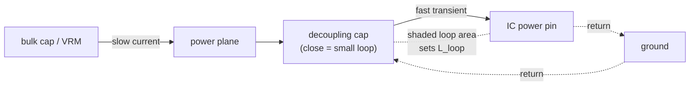
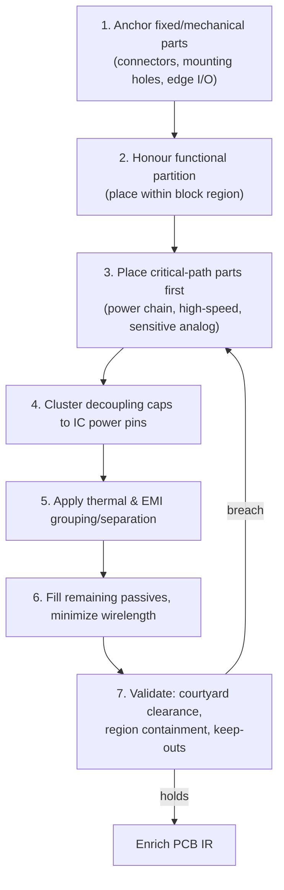

# Component Placement

**Summary.** Component placement is the assignment of a position `(x, y)`, a rotation, and a board side to every physical component, subject to the board outline, mechanical anchors, and functional grouping. It is the single most consequential PCB decision: routability, signal integrity (SI), power integrity (PI), thermal behaviour, and manufacturability are all *largely determined* before a single track is drawn — routing only realizes (or fails to realize) the connectivity that placement made possible. This document belongs in the Engineering Science Layer because the runtime's **Phase 9, [Component Placement](../../docs/state-machines/component-placement.md)**, mints `Placement` entities and enriches the [PCB IR](../../docs/compiler/ir/pcb-ir.md) deterministically, but the *why* — the laws relating placement geometry to electrical and thermal outcomes, and the order in which decisions must be made — lives here. It grounds the placement state machine, the [Placement Agent's](../../docs/agents/placement-agent.md) reasoning half, and the downstream loop-back from [DFM Verification](../../docs/state-machines/dfm-verification.md), which returns to *this* phase precisely because manufacturability defects are usually placement-rooted.

## Core principles

### 1. Placement determines routability: wirelength and Rent's rule

The dominant first-order objective is **total wirelength**, because routing resource (track length, vias, layers) scales with it and congestion is where wirelength concentrates. The standard cheap, monotonic proxy is **half-perimeter wirelength (HPWL)** per net, summed over nets:

```text
HPWL(net) = (x_max − x_min) + (y_max − y_min)     over all pins on the net
W_total   = Σ_nets  w(net) · HPWL(net)            w = net weight (priority/criticality)
```

HPWL is exact for 2- and 3-pin nets and a tight lower bound on the rectilinear Steiner tree for larger nets, so minimizing `W_total` minimizes the routing demand a placement imposes. The structural reason wirelength is *reducible* by good placement — and explodes under bad placement — is **Rent's rule**, the empirical power law relating the number of external terminals `T` of a sub-block to the number of internal gates `G`:

```text
T = k · G^p          0.5 ≲ p ≲ 0.75 for digital logic;  k ≈ pins-per-gate
```

A region with a low Rent exponent `p` is *internally cohesive*: most connections stay inside it, so the inter-region wiring that placement must route across the board is small. This is the mathematical justification for **functional partitioning** — grouping a sub-circuit's parts so that high-connectivity clusters are co-located and only the genuinely external nets cross block boundaries. See [graph theory](../mathematics/graph-theory.md) (the netlist is a hypergraph) and [optimization theory](../mathematics/optimization-theory.md).

The weight `w(net)` is the lever for **critical-path-first** placement. Not all nets are equal: a high-speed differential pair, an analog feedback line, or a power-chain net carries far more electrical consequence than a generic pull-up. Encoding criticality as weight makes the wirelength optimum *prioritize* the nets that matter:

```text
w(net) = w_base · (1 + κ_timing·urgency + κ_SI·sensitivity + κ_power·current)
```

Because the optimizer minimizes `Σ w·HPWL`, a large `w` forces a critical net to be short *first*, and the lower-weight nets accommodate it. The engineering rule that follows is the heart of order-of-operations principle 8: **place the parts on the highest-weight (most critical) nets before the rest, and let non-critical fill yield to them** — never the reverse, because a critical net lengthened by an already-frozen field of passives cannot be recovered without a rip-up.

### 2. Functional partitioning by min-cut

Partitioning seeks a grouping of components into blocks that minimizes the weighted **cut** — the connections crossing between blocks — which is exactly the inter-region wiring of principle 1:

```text
minimize  cut(B₁,…,B_k) = Σ_{nets spanning ≥2 blocks} w(net)
subject to  area(B_i) ≤ region_capacity(B_i)        (balance / fit)
```

This is the classical Kernighan–Lin / Fiduccia–Mattheyses min-cut formulation on the netlist hypergraph. In EAK this partitioning is performed one phase earlier, by **[PCB Floor Planning](../../docs/state-machines/pcb-floor-planning.md) (Phase 8)**, which allocates board regions to [Functional Blocks](../../docs/foundation/engineering-domain-model.md#functional-block); Component Placement then places parts *within* their block's region. Partitioning before detailed placement is not optional — it makes the placement search tractable (divide-and-conquer) and it is what gives each net its locality.

### 3. Quadratic / force-directed model

Within a region, analytic placement treats each net as springs and minimizes squared distance — a convex problem with a unique optimum that anchors the search:

```text
minimize  Φ(x,y) = Σ_{(i,j)} c_ij · [ (x_i − x_j)² + (y_i − y_j)² ]
```

The gradient `∂Φ/∂x_i = 0` is a system of linear equations (a weighted Laplacian; see [linear algebra](../mathematics/linear-algebra.md)). The physical reading is **Hooke's law**: each connection pulls connected parts together with force proportional to displacement and weight `c_ij`. Squared distance (vs. linear) makes the system linear and forbids any single net from being stretched arbitrarily far — the optimum spreads strain. Fixed parts (connectors, mounting holes) enter as boundary conditions, which is why anchoring (principle 6) must precede this step.

### 4. Decoupling-capacitor proximity is a loop-inductance law

A decoupling capacitor only decouples if the current loop from the IC power pin → cap → ground pin is *small*, because that loop's parasitic inductance is set by its area:

```text
L_loop ≈ μ₀ · (loop_area) / w        (partial-inductance scaling; area ∝ placement distance)
Z(ω)   = R_esr + jωL_loop + 1/(jωC)  → above self-resonance the cap looks inductive
```

The power-delivery network (PDN) must hold rail impedance below a **target impedance** across the spectrum the IC excites:

```text
Z_target = ΔV_allowed / ΔI_transient
```

Because `Z(ω) ≥ ωL_loop` at high frequency, every millimetre of extra distance between cap and IC pin *raises the noise floor the cap can suppress*. This is a hard placement law, not a guideline: a perfectly chosen capacitance value placed far away fails to meet `Z_target` at the frequencies that matter. The corollary order-of-operations rule is **place high-frequency/small decoupling caps adjacent to their IC power pins, before bulk caps and before generic passives.**


*Figure: the decoupling current loop — its enclosed area (set by cap-to-pin placement) is the parasitic inductance that caps the transient performance of the rail.*

A worked illustration: for `ΔV_allowed = 50 mV` on a core rail drawing a `2 A` transient, `Z_target = 25 mΩ`. At `f = 100 MHz` the inductive impedance alone is `Z = 2πf·L_loop`; meeting `25 mΩ` requires `L_loop ≲ 40 pH`, which corresponds to a sub-millimetre cap-to-pin loop. Doubling the placement distance roughly doubles `L_loop` and blows the budget — the same capacitor, the same value, fails purely on geometry. See [ohm's law](../electrical/ohms-law.md), [circuit theory](../electrical/circuit-theory.md), and [RF physics](../physics/rf-physics.md).

### 5. Thermal-aware grouping: superposition of thermal fields

Each dissipating part raises its own junction temperature and heats its neighbours. To first order, junction temperature is Ohm's-law-analogous over thermal resistance, and the ambient term is a *superposition* of every nearby source's contribution:

```text
T_j(part) = T_ambient + P·θ_JA(part) + Σ_{others} P_o · θ_coupling(distance)
```

`θ_coupling` falls with separation (roughly with spreading distance in the copper/board), so **clustering hot parts multiplies temperature rise**, while spreading them lets the board act as a heat-spreader. The placement rule is therefore two-sided: separate the few high-power dissipators (regulators, power ICs) to avoid additive hot-spots, but keep thermally *coupled* pairs (e.g. a sense resistor and the converter it regulates) intentionally close where the design intends thermal tracking.

A worked illustration: a regulator dissipating `P = 1 W` with `θ_JA = 60 °C/W` in a `25 °C` ambient already sits at `T_j ≈ 85 °C` in isolation. Place a second `1 W` part one courtyard away contributing `θ_coupling ≈ 15 °C/W` and the first rises to `≈ 100 °C` — a `15 °C` penalty bought purely by proximity, often the difference between margin and an absolute-maximum breach. The lesson is that thermal budget is *spent by placement geometry* before any heatsink or copper-pour decision. See [thermal physics](../physics/thermal-physics.md).

### 6. Connector and mechanical anchoring first (least-freedom-first)

Connectors, mounting holes, and any part with an enclosure or panel constraint have (near) zero positional freedom — their location is dictated by mechanics, not by the netlist. A core constraint-satisfaction principle ([constraint satisfaction](../mathematics/constraint-satisfaction.md)) is **assign the most-constrained variables first**: anchoring fixed parts before the free interior collapses the search space and prevents late, expensive rip-ups. Edge connectors additionally pin where signals *enter* the board, which sets the natural flow direction for the whole layout (input → processing → output). In EAK these anchors persist with a `locked` flag and are held fixed across a DFM loop-back (see [Mapping](#mapping-to-the-runtime)).

### 7. EMI-aware separation: crosstalk and loop area

Aggressor–victim coupling between two adjacent nets scales with their mutual capacitance/inductance, both of which grow as separation shrinks:

```text
crosstalk ∝ C_mutual, L_mutual ~ 1 / separation        (near-field, first order)
E_radiated ∝ f² · A_loop · I                            (loop area is set by placement+return path)
```

Two placement consequences follow: (a) keep high-`dv/dt` or high-`di/dt` aggressors (clocks, switching nodes) physically away from sensitive victims (analog, high-impedance, reset); (b) place parts so that each signal's return-current loop area is small, since radiated emission grows as `f²·A`. Switching regulators are the canonical case — their hot loop (input cap → switch → diode/FET → output) must be compact and isolated. See [electromagnetics](../physics/electromagnetics.md) and [Maxwell's equations](../physics/maxwell-equations.md).

### 8. Objectives and the order of operations

Placement is a **multi-objective, lexicographically prioritized** optimization, not a single weighted sum — some objectives are hard constraints (mechanical fit, courtyard non-overlap) that gate others (wirelength). The defensible order, derived from principles 1–7, is:


*Figure: the order of operations — most-constrained and highest-consequence decisions first; free, low-consequence fill last.*

The ordering principle is **least freedom and highest consequence first**: a misplaced connector or under-decoupled IC cannot be cheaply fixed later, whereas a stray passive can. Reversing the order (filling passives first, then trying to fit the power chain and decoupling into what remains) is the classic cause of unroutable, thermally hot, noisy boards.

The decision variables at each step are not only position `(x, y)` but also **rotation** and **board side**, and both interact with the principles above:

- *Rotation* sets pin orientation. Rotating a part so its power pins face its decoupling cap shortens the loop of principle 4; rotating an IC so its bus pins face the connector they serve shortens the critical nets of principle 1. Rotation is a cheap way to cut wirelength without moving anything.
- *Board side* (top/bottom) is a placement degree of freedom that doubles usable area and lets decoupling caps sit *directly under* an IC's power pins on the opposite side — often the shortest possible loop. It also separates aggressors from victims by the stack-up's ground reference (principle 7). The trade-off is double-sided assembly cost, which is why side selection is itself a DFM-aware decision and a reason DFM loops back to placement.

## Why it matters for electronics & PCB design

- **Routability is set here, not in routing.** Because `W_total` and congestion are fixed by placement (principles 1–2), a router can only *find* routes that placement left feasible. An unroutable board is almost always an un-placeable placement.
- **SI/PI cannot be recovered downstream.** Decoupling-loop inductance (principle 4) and crosstalk separation (principle 7) are geometric; no track width or copper pour fixes a capacitor placed 10 mm from its pin or a clock run beside a reset line.
- **Thermal headroom is a placement budget.** Junction-temperature superposition (principle 5) means clustering decides whether parts stay within their absolute-maximum ratings — a reliability and safety property, not a stylistic one.
- **Manufacturability is geometric.** Courtyard overlaps, edge clearances, and assembly access are placement facts; this is why DFM failures loop back to placement rather than to routing or fabrication.

## Mapping to the runtime

This theory grounds **Phase 9, [Component Placement](../../docs/state-machines/component-placement.md)**, and is consumed across the surrounding phases:

- **The placement state machine embodies principles 1–8.** In `ProposingPlacement` the [Placement Agent](../../docs/agents/placement-agent.md) chooses `(x, y)`, rotation, and side; `ValidatingPlacement` invokes the [Constraint Engine](../../docs/engineering/constraint-engine.md) to check that *courtyards do not overlap, placements stay inside their region, and keep-out/thermal constraints hold* — the hard-constraint gate of principle 8. The implemented deterministic placer lays each component as a class-sized **courtyard** square (connector `9 mm`, regulator/IC `6 mm`, passive `3 mm`) along a fixed-pitch row; that pitch-and-margin is a reproducible (`P4`) stand-in for the wirelength/clustering optimum this document specifies, and the courtyard-edge metric is exactly the clearance quantity the validator enforces.

- **Functional partitioning is [PCB Floor Planning](../../docs/state-machines/pcb-floor-planning.md) (Phase 8).** The min-cut grouping of principle 2 is realized when floor planning allocates [Board](../../docs/foundation/engineering-domain-model.md#board--layer-stack) regions to [Functional Blocks](../../docs/foundation/engineering-domain-model.md#functional-block) and lowers [Schematic IR → PCB IR](../../docs/compiler/transformations.md). Placement then operates *inside* those regions; region containment is a checked constraint.

- **Anchoring and the `locked` flag (principle 6).** `Placement` entities carry a `locked` flag persisted in [Engineering State](../../docs/core/shared-state-model.md). On a [DFM](../../docs/state-machines/dfm-verification.md) loop-back the machine *edits* placement while **locked components stay fixed** — the runtime realization of "anchor most-constrained parts first and do not disturb them."

- **The DFM → Placement loop-back is principle 8's gate made executable.** [DFM Verification](../../docs/state-machines/dfm-verification.md) (Phase 12) routes its `Failed` terminal back to Component Placement because manufacturability defects (courtyard collisions, edge encroachment, assembly access) are placement-rooted. The **board-edge keep-out** (Phase 3 increment 9, fabrication-sourced) is the concrete DFM rule that catches an edge-hugging courtyard; the off-board / edge-hugging courtyard is detected and returned here for re-placement, not patched downstream.

- **Placement feasibility bounds routing's per-net-class widths.** [Routing Planning](../../docs/state-machines/routing-planning.md) reads the enriched PCB IR and applies **per-net-class trace widths** (Phase 3 increment 10). Wide power/high-current classes need physical corridor area; if placement did not leave room (principle 1), routing reports an `Unroutable board` `Failed` and loops back to Placement or Floor Planning. Placement is therefore the upstream determinant of whether a net class's width budget can be honoured.

- **The regulator VIN/VOUT rail split (increment 11) is decoupling/loop discipline made structural.** Splitting the collapsed power rail into distinct `VIN` and `VOUT` nets at the regulator (Phase 3 increment 11) only pays off if the regulator's input and output decoupling caps are placed against the correct pins per principle 4 and its switching loop is compact per principle 7. Placement supplies the geometry that makes the split electrically meaningful; an arbitrary placement would leave the two rails sharing a noisy loop despite the net-level split.

- **Units are first-class.** Placement coordinates and courtyards are typed [Physical Quantities](../../docs/engineering/units-and-quantities.md) (`mm`); thermal and PDN budgets that drive grouping are quantities with tolerance, consistent with [units & quantities](../../docs/engineering/units-and-quantities.md).

**Why a violation here is a runtime bug, not a preference.** If the runtime placed a decoupling cap far from its IC, clustered all dissipators, or filled passives before anchoring connectors, it would emit a `PCBIREnriched` IR that *looks* valid (no courtyard overlap) yet is electrically and thermally unsound — a defect the deterministic constraint checks alone cannot see. These principles define the objective the [Placement Agent's](../../docs/agents/placement-agent.md) reasoning half must optimize and the invariants the [Constraint Engine](../../docs/engineering/constraint-engine.md) must encode so that a "passing" placement is also a *good* one.

## Failure modes if violated

| Principle violated | Symptom in the design | Runtime manifestation |
|---|---|---|
| 1–2 Wirelength / partition | Congestion, crossings, unroutable board | [Routing Planning](../../docs/state-machines/routing-planning.md) `Failed` → loop-back to Placement/Floor Planning |
| 3 Anchored boundary conditions | Interior collapses onto fixed parts; late rip-up | Repeated `ValidationFailed` re-proposals; non-convergence |
| 4 Decoupling proximity | PDN impedance spike, rail noise, brown-outs/instability | Passes geometric DRC but fails SI/PI intent — silent unless modeled in EMC analysis |
| 5 Thermal clustering | Hot-spots, junction temp over absolute-max, reliability loss | Thermal/keep-out constraint breach in `ValidatingPlacement` |
| 6 Anchoring last | Connector won't meet enclosure; cable strain | Mechanical-constraint conflict → floor-plan `Failed` or DFM loop-back |
| 7 EMI separation | Crosstalk, radiated-emission failure, large switching loop | [EMC Analysis](../../docs/state-machines/emc-analysis.md) findings; DRC/DFM edge issues |
| 8 Wrong operation order | Power chain/decoupling can't fit the leftover space | Cascading re-proposals; `Failed` (infeasible within regions) |

The common thread: several of these failures (4, 7) **pass the deterministic geometric checks** yet leave a board that does not work. That is exactly why placement is an Engineering Science concern — the runtime's checkable constraints are necessary but not sufficient; the objective ordering above is what makes a geometrically valid placement also a correct one.

## Related documents

- Runtime — [Component Placement state machine](../../docs/state-machines/component-placement.md) · [PCB Floor Planning](../../docs/state-machines/pcb-floor-planning.md) · [Routing Planning](../../docs/state-machines/routing-planning.md) · [DFM Verification](../../docs/state-machines/dfm-verification.md) · [EMC Analysis](../../docs/state-machines/emc-analysis.md)
- Runtime artifacts — [PCB IR](../../docs/compiler/ir/pcb-ir.md) · [Transformations](../../docs/compiler/transformations.md) · [Constraint Engine](../../docs/engineering/constraint-engine.md) · [Verification Engine](../../docs/engineering/verification-engine.md) · [Units & quantities](../../docs/engineering/units-and-quantities.md) · [Domain model](../../docs/foundation/engineering-domain-model.md) · [Principles](../../docs/foundation/principles.md)
- Engineering Science siblings — [optimization theory](../mathematics/optimization-theory.md) · [graph theory](../mathematics/graph-theory.md) · [computational geometry](../mathematics/computational-geometry.md) · [constraint satisfaction](../mathematics/constraint-satisfaction.md) · [linear algebra](../mathematics/linear-algebra.md) · [thermal physics](../physics/thermal-physics.md) · [electromagnetics](../physics/electromagnetics.md) · [RF physics](../physics/rf-physics.md) · [Maxwell's equations](../physics/maxwell-equations.md) · [ohm's law](../electrical/ohms-law.md) · [circuit theory](../electrical/circuit-theory.md)
