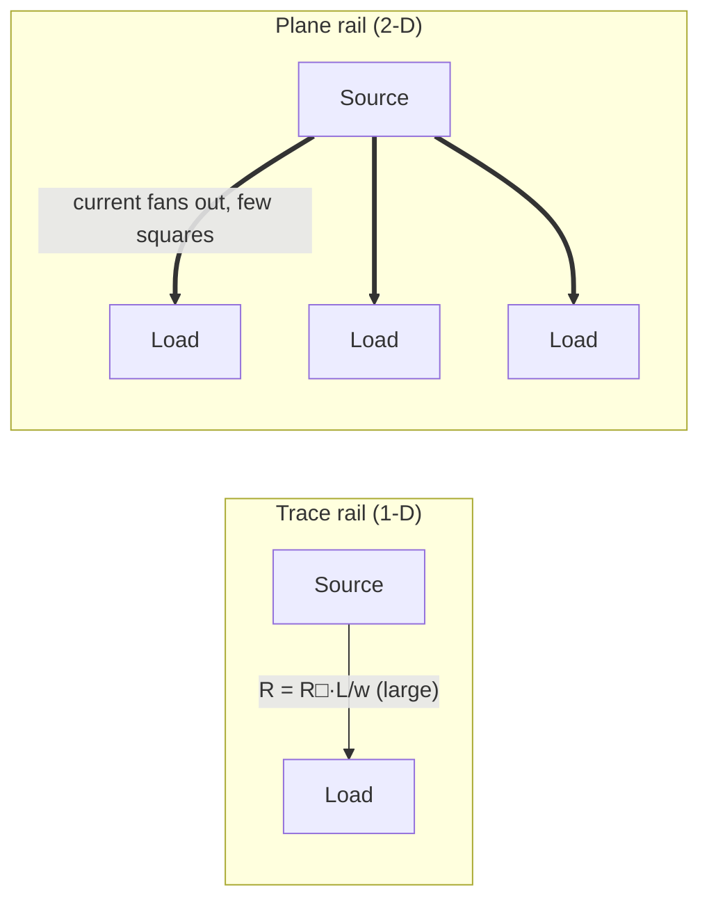
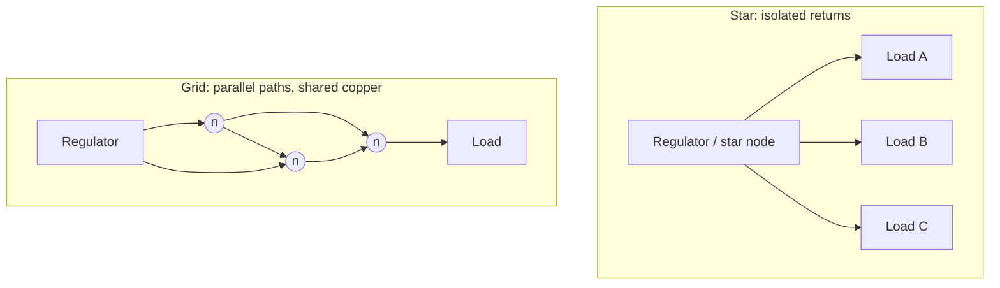
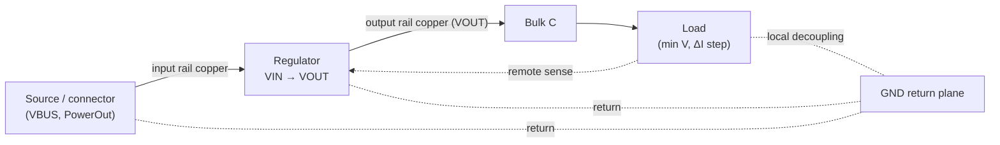

# Power Distribution

**Summary.** Power distribution is the engineering of the copper *network* that carries current from a source, through one or more regulators, to every load — while keeping the voltage each load actually sees inside a bounded **IR-drop** budget and keeping every conductor below its thermal **ampacity** limit. Where [Ohm's Law & Power](../electrical/ohms-law.md) sizes a *single* conductor (`R = ρL/(wt)`, `ΔV = I·R`, `ΔT = I²R·θ`), this document is one level up: it is about the *topology* of the conductors — planes versus traces, star versus grid, the full regulator-to-load path, and the copper-weight trade-off that ties it all together. It belongs in the Engineering Science Layer because the runtime never routes "a wire": it realizes a [Net](../../docs/foundation/engineering-domain-model.md#net) of a given [class](../../docs/state-machines/routing-planning.md) as physical [Track / Routing](../../docs/foundation/engineering-domain-model.md#track--routing) on a [Board / Layer Stack](../../docs/foundation/engineering-domain-model.md#board--layer-stack) of a given copper weight, and that physical realization *is* the power-delivery network (PDN). This grounds the per-net-class trace widths and the regulator VIN/VOUT rail split of Phase-3, the `drc-trace-width` process floor, and the board-edge copper keep-out: each is a topology decision about how current is delivered. When the runtime says "this net is routed," it is asserting that a current path exists with adequate copper and an acceptable IR drop — a power-distribution claim.

## Core principles

### 0. Vocabulary and scope boundary

Every quantity below is a typed [Physical Quantity](../../docs/engineering/units-and-quantities.md); the per-conductor algebra (`R = ρL/(wt)`, sheet resistance `R_□ = ρ/t`, copper-weight → thickness table, the `α` temperature coefficient, and the IPC-2152/2221 ampacity models) is established in [Ohm's Law & Power](../electrical/ohms-law.md) and **not repeated here**. This document uses those results and reasons about the *arrangement* of copper.

| Term | Meaning in power distribution |
|------|------------------------------|
| PDN | Power-delivery network: the complete source → rail → load current path, plus its return |
| Rail | A net at a defined supply potential (e.g. `VBUS`, `VOUT`, `GND`) realized as copper |
| Plane | A large continuous copper area (often a whole layer) serving as a low-impedance rail or return |
| Pour / fill | Copper poured to fill free area on a signal layer, used as a partial plane |
| Star (single-point) | Topology where each load connects to the source by its own dedicated path |
| Grid / mesh | Topology where rails interconnect, giving each load multiple parallel paths |
| Target impedance | The AC ceiling `Z_target = ΔV_allowed / ΔI_step` the PDN must stay under across frequency |
| Remote / Kelvin sense | Feeding the regulator's feedback from the load, not the regulator pin, to cancel path IR drop |

### 1. The PDN is a resistive (and reactive) network, not a node

A schematic draws a rail as one equipotential node; the physical board makes it a **distributed resistive network**. Each load draws `I_load`; that current sums back through shared copper toward the source, and every shared segment develops `I·R`. So the voltage at load *k* is the source voltage minus the IR drop along the *worst shared path* to it:

```
V_k = V_source − Σ (I_j · R_segment)   over every segment carrying load k's current
```

The design goal is `V_source − V_k ≤ budget` for every load *k* simultaneously (typically 1–3 % of `V_rail`; see [Ohm's Law §4](../electrical/ohms-law.md)). Two levers reduce the drop: **lower `R`** (more/thicker/wider copper — the plane-vs-trace and copper-weight decisions) and **reduce shared `R`** (give loads independent paths — the star-vs-grid decision). Power distribution is the joint optimization of those two levers under a manufacturability floor.

At AC the same network is reactive: a load's *transient* current step `ΔI` sees the PDN's impedance `Z(f)`, and the rail must satisfy `Z(f) ≤ Z_target = ΔV_allowed/ΔI` across the band the load excites. Decoupling capacitors are the high-frequency arm of the PDN, planes the mid-band arm, the regulator the DC/low-frequency arm. The full AC treatment lives in [signal integrity](../electrical/signal-integrity.md) and [electromagnetics](../physics/electromagnetics.md); here the DC IR-drop network is the floor on which that impedance sits.

### 2. Planes vs traces

A **trace** is a 1-D conductor: its resistance is `R_□ · (L/w)` and its current path is forced. A **plane** is a 2-D conductor: current spreads in two dimensions, so its effective resistance between two points is far lower than any trace of the same footprint, and its return path can follow the signal above it (minimizing loop area — the central [electromagnetics](../physics/electromagnetics.md) argument). Key facts a distributor reasons with:

- **Sheet resistance still rules.** A plane's point-to-point DC resistance scales with `R_□` times the number of *squares* along the current's spreading path, but because current fans out, the square count is small — a 1 oz plane between two well-separated pads is often a few mΩ versus tens-to-hundreds of mΩ for a trace.
- **Constriction (spreading) resistance dominates near a via or pad.** Where current funnels into a single via or pad on a plane, the local resistance is set by that constriction, not the bulk plane. Multiple parallel vias ("via stitching") divide this constriction resistance and the associated current density.
- **Current density, not just total current, is the plane limit.** A plane carries huge total current, but a narrow neck (a slot, an antipad gap, a row of vias) concentrates current density and heats locally — the plane's ampacity is set at its *narrowest constriction*.
- **A pour is a partial plane.** Copper poured around signal routing gives a cheap return/heat-spread surface but is only as good as its continuity; a pour broken into islands by traces provides neither low IR drop nor a clean return.

The engineering rule of thumb: **high-current rails and all returns want planes (or wide pours); only low-current rails are acceptable as traces.** This is exactly why net *class* (power/ground vs signal), not net identity, is the right granularity for the copper decision.


*Figure: a trace forces one resistive path; a plane spreads current in two dimensions, giving every load a low-resistance, shared low-impedance rail.*

### 3. Star vs grid topology

Given the copper, how should rails be *connected*? Two archetypes bound the design space:

- **Star (single-point) distribution.** Every load gets its own path back to a single common node (the regulator output or a star-ground point). Because no two loads share copper, **no load's return current develops IR drop in another load's path** — there is no common-impedance coupling ([Ohm's Law §4](../electrical/ohms-law.md), the DC face of the coupling in [electromagnetics §9](../physics/electromagnetics.md)). Star is the correct topology for **mixed-signal grounds** (keep noisy digital return current out of the analog reference) and for **separating power domains**. Its cost: long individual paths (more total IR drop per load) and no redundancy.
- **Grid / mesh distribution.** Rails interconnect so each load sees *multiple parallel paths* to the source. Parallel resistances reduce the effective `R_path` (lower IR drop) and average current density, and a plane is the limiting case of a perfect grid. Its cost: shared copper means shared `I·R`, so one load's transient *does* move another's reference — common-impedance coupling is reintroduced. Grid is the correct topology for **dense digital power**, where low impedance and many decoupling tie-points matter more than reference isolation.

The practical resolution is hybrid: **grid/plane within a domain, star between domains.** Power is delivered as planes/grids inside each voltage domain; the domains meet at a single deliberate point (the regulator, or a single ground stitch) so that inter-domain return current cannot couple. The runtime expresses the "single deliberate point" structurally as the regulator's VIN/VOUT rail split (§ *Mapping*).


*Figure: star gives each load an isolated return (no shared `I·R`); grid gives parallel paths (lower IR drop, but shared copper re-couples references).*

### 4. Rail sizing from current

Sizing a rail is binding two independently-derived widths and then a floor, exactly as assembled in [Ohm's Law §7](../electrical/ohms-law.md): the **ampacity width** (cross-section that keeps `ΔT` under budget at the rail's worst-case current, per IPC-2152) and the **IR-drop width** (`w ≥ ρ·L·I/(t·ΔV_budget)`), with `width = max(ampacity, IR-drop)` then clamped to the fabricator's process floor. The *distribution* additions to that per-conductor rule are:

- **Parallel paths divide the requirement.** Two vias, two layers, or a grid split the current, so each conductor sizes for its share. A plane is the limit of "infinitely many parallel paths."
- **Vias are part of the rail.** A via has its own resistance and its own ampacity (set by its barrel plating, not the trace it joins). A rail that drops onto another layer through a single via is only as strong as that via; high-current layer transitions need via arrays.
- **Worst-case current is cumulative toward the source.** The trunk nearest the source carries the *sum* of all downstream loads, so a star or tree rail is widest at the root and may taper toward the leaves — the opposite of sizing every segment for one load.
- **The return needs the same budget as the feed.** Return copper carries the identical current; an under-sized or interrupted return develops the same IR drop (ground bounce) as an under-sized feed. Sizing the rail but not the return is a half-finished PDN.

**Worked example (topology changes the answer).** A 3.3 V rail feeds three 1 A loads down a 60 mm run on 1 oz copper (`R_□ ≈ 0.5 mΩ/□`, [Ohm's Law §2](../electrical/ohms-law.md)), budget 1 % ≈ 33 mV. As a single 0.5 mm **trace trunk**, the segment nearest the source carries 3 A over `L/w = 120` squares → `R ≈ 60 mΩ`, so its drop is already `3 A × 60 mΩ = 180 mV` — over 5× the budget; the trace is both over its IR budget and near its ampacity. Delivering the same power on a **plane/grid**, the three loads' currents fan out over a few effective squares (say 4) → `R ≈ 2 mΩ`, and the worst-load drop falls to a few mV. Same copper weight, same loads: the topology (§2/§3), not the width alone, is what brings the rail inside budget. This is the quantitative reason the runtime must eventually realize high-current rails as planes, not merely as a wider class default.

### 5. Copper-weight trade-offs

Copper weight (oz/ft² → thickness `t`) is the single stack-up parameter that scales the whole PDN, and it is a genuine trade-off, not a free win:

| Heavier copper (e.g. 2 oz vs 1 oz) | Consequence |
|------------------------------------|-------------|
| Halves sheet resistance `R_□ = ρ/t` | Lower IR drop and lower self-heating for the same geometry |
| Raises ampacity (larger `A = w·t`) | A given width carries more current at the same `ΔT` |
| Worsens etch resolution | Thick copper needs wider **minimum width and clearance** (etch undercut) — fewer fine signals |
| Increases cost and weight | Heavier laminate, longer etch, higher board cost |
| Changes impedance geometry | Trace cross-section shift moves controlled-impedance targets |

The decision is therefore *coupled to routing density*: thick copper buys a strong PDN at the price of coarser features, so high-current/low-density power boards favour heavy copper (or dedicated thick power layers in an asymmetric stack-up), while dense digital boards keep thinner outer copper and deliver power on internal planes instead. Because copper weight sets `t`, it is what makes both `R` and ampacity computable — dropping it from the [PCB IR](../../docs/compiler/ir/pcb-ir.md) stack-up makes the PDN unanalyzable (§ *Mapping*).

### 6. The regulator-to-load path

The regulator is the active node of the PDN, and the copper on *both* sides of it is part of distribution:

- **Input and output are different rails.** The input rail (`VBUS`) and output rail (`VOUT`) are at different potentials, carry different currents, and must have **independent copper and independent return domains**. Collapsing them onto one conductor means their currents share `R`, so the input ripple and the output transient couple through the shared `I·R` — and a single net driven by both the source and the regulator output is also an electrical-rules defect (two drivers / a short). Separating them is both a power-integrity fix and an [ERC](../../docs/state-machines/erc-verification.md) fix; the runtime does this as the VIN/VOUT rail split (§ *Mapping*).
- **Decoupling is the AC end of the rail.** Bulk capacitance at the regulator output supplies low-frequency transients; local decoupling at each load supplies high-frequency ones with minimal loop inductance. They are PDN elements, not afterthoughts: they hold `Z(f)` under `Z_target` (§1) between the regulator's bandwidth and the load's switching edge.
- **Feedback senses where regulation is wanted.** A regulator holds *its sense point* constant; if that point is the regulator pin, the load still droops by the feed's IR drop. **Remote (Kelvin) sense** moves the sense point to the load so the loop compensates the path drop — a topology choice that trades a sense pair for a tighter rail at the load.
- **The load defines the budget.** The allowable `ΔV` and `ΔI` come from the load's datasheet (min supply voltage, transient step). Power distribution is sizing copper and topology *backwards from the load's tolerance*, which is why the load's current/voltage limits enter as [Constraints](../../docs/foundation/engineering-domain-model.md#constraint).


*Figure: the regulator splits the PDN into two rails (`VBUS` in, `VOUT` out) over a shared return plane; decoupling and optional remote sense bound the load's IR drop and transient impedance.*

## Why it matters for electronics & PCB design

- **A rail is a network, not a node.** The schematic's single power node hides a resistive web; the board *is* the PDN, and IR drop is decided in copper topology, not in firmware.
- **Topology trades coupling against droop.** Star isolates references but lengthens paths; grid lowers droop but shares `I·R`. Choosing wrongly either browns out a load or injects another's noise into its reference.
- **Planes are the cheapest impedance you can buy.** Two dimensions of copper beat any trace for IR drop, return integrity, and heat spreading — which is why returns and high-current rails belong on planes.
- **Layer transitions are rail elements.** A high-current rail that drops to another layer through a single via is throttled by that via's resistance and ampacity; the via array, not the trace, is the real bottleneck.
- **Copper weight is a system knob with a routing cost.** Heavier copper strengthens the PDN but coarsens features; the choice is coupled to routing density and impedance, not made in isolation.
- **The regulator path is two rails plus a return.** Input and output must not share copper; decoupling and sense point set where the rail is actually held — get this wrong and the regulator regulates the wrong place.

## Mapping to the runtime

This is the load-bearing section: each principle is embodied by a concrete EAK artifact, and violating the principle would be an engineering bug in the runtime.

- **Plane-vs-trace by class ↔ per-net-class trace widths (Phase-3, Routing Planning).** [`eak/crates/eak-phases/src/routing_planning.rs`](../../eak/crates/eak-phases/src/routing_planning.rs) assigns each [Track](../../docs/foundation/engineering-domain-model.md#track--routing) a width by [`NetClass`](../../docs/state-machines/routing-planning.md) via `class_width_mm`: `Power` and `Ground` at 0.50 mm, `Signal` at 0.25 mm, carried as a typed `PhysicalQuantity` in millimetres. The `match` is total (no wildcard) so adding a class is a compile error — a guard that every class makes an explicit copper decision. The *ordering* it encodes (power/ground strictly wider than signal, asserted in the crate's own tests) is precisely §2/§4: power and ground are ampacity/IR-drop-bound and must carry more copper; signals are not. A runtime that gave a power rail the signal width would commit the §4 sizing error in code. The honest scope boundary: these are constant defaults, not yet current-and-`ΔT`-derived widths or true plane pours — the IPC-2152 computation of §4 and the plane realization of §2 are the reasoning-driven refinements that would replace the constant.

- **Star-between-domains ↔ the regulator VIN/VOUT rail split (Phase-3 increment 11).** [`eak/crates/eak-phases/src/schematic_planning.rs`](../../eak/crates/eak-phases/src/schematic_planning.rs) splits a regulator's input and output into two distinct single-driver rails — the input rail `VBUS` (connector `PowerOut` + regulator `VIN`) and the output rail `VOUT` (regulator `VOUT` + every non-regulator load) — instead of one collapsed net. This is §3's "single deliberate point between domains" and §6's "input and output are different rails" made structural: distinct nets at distinct potentials cannot share copper, so one rail's `I·R` cannot couple onto the other. The rails are committed in a fixed order (`VBUS → VOUT → GND`, only if non-empty) so the `fresh_id` sequence and replay stay deterministic. The same split keeps [ERC](../../docs/state-machines/erc-verification.md) clean (two single-driver rails, no multiple-driver/short defect) — so the power-distribution fix and the electrical-rules fix are one and the same.

- **Process floor ↔ the `drc-trace-width` rule, and copper-weight feasibility.** [DRC Verification](../../docs/state-machines/drc-verification.md) carries `DrcTraceWidthRule` (id `drc-trace-width`) in [`eak/crates/eak-engines/src/lib.rs`](../../eak/crates/eak-engines/src/lib.rs): it flags any track finer than the fabrication process floor (slot 0 of the [Fabrication](../../docs/engineering/standards-and-compliance.md)-category Length targets) and stays silent when no floor is stated rather than guessing. This is the manufacturability clamp under the physically-derived widths of §4, and it is exactly where §5's copper-weight trade-off bites: heavier copper raises the minimum manufacturable width, so the process floor is the runtime's contact point with the etch-resolution cost of thick copper.

- **Return/plane integrity at the edge ↔ the DFM copper keep-out (increment 9).** Also in [`eak/crates/eak-engines/src/lib.rs`](../../eak/crates/eak-engines/src/lib.rs), the DFM rule that "every [`Track`]'s copper must keep at least the fabrication keep-out band from the board edge" (shared with the placement keep-out via `resolve_edge_keepout_si`, so both always agree) protects the PDN's copper — feed and return — from being nicked during depanelization. A plane or wide power pour that ran to the edge would lose continuity exactly where §2 says continuity is the whole value of a plane; the keep-out is the runtime defending plane/return integrity.

- **Load budgets ↔ the Constraint Engine.** [Constraint Extraction](../../docs/state-machines/constraint-extraction.md) derives typed `voltage/current limit` [Constraints](../../docs/foundation/engineering-domain-model.md#constraint) with [Physical-Quantity](../../docs/engineering/units-and-quantities.md) bounds, held by the [Constraint Engine](../../docs/engineering/constraint-engine.md). A current-limit constraint *is* an ampacity/rail-sizing budget; a voltage-limit/IR-drop target *is* the §1 droop budget. This is where §6's "budget comes from the load" becomes machine-checkable, and the [Verification Engine](../../docs/engineering/verification-engine.md) is where an over-budget IR drop becomes a pass/fail margin or a recorded [Waiver](../../docs/engineering/human-in-the-loop.md) under the Autonomy Level.

- **Copper weight ↔ the PCB IR stack-up.** §4 and §5 need `t`, the copper thickness; the [PCB IR](../../docs/compiler/ir/pcb-ir.md) [Board / Layer Stack](../../docs/foundation/engineering-domain-model.md#board--layer-stack) carries the copper weight that fixes `t` (and `R_□`) as a typed quantity. A [lowering](../../docs/compiler/transformations.md) that dropped copper weight would make IR drop and ampacity uncomputable — a power-integrity bug at the IR level. The realized width lives on the `Track` (routing).

- **Topology realization ↔ the Planning Engine, gated by Manufacturing.** The [Planning Engine](../../docs/engineering/planning-engine.md) is where the [Routing Agent](../../docs/state-machines/routing-planning.md) chooses the actual copper paths (the §3 star-vs-grid decision in the small), and [Routing Planning](../../docs/state-machines/routing-planning.md)'s `ValidatingRouting` does a width/clearance pre-check. The [Manufacturing Generation](../../docs/state-machines/manufacturing-generation.md) global gate is the cross-phase all-clear that no released board carries an un-waived width/clearance violation — the final guarantee that the delivered PDN is both routable and manufacturable.

## Failure modes if violated

- **Treating the rail as a node.** Ignore §1 and the distributed `I·R` is invisible until silicon browns out — an IR-drop defect with no schematic cause, because the schematic *has* no resistance.
- **A trace where a plane was needed.** Route a high-current rail or a return as a thin trace (§2) and IR drop and self-heating climb together; a broken pour gives a return path with neither low resistance nor low loop area.
- **Wrong topology for the domain.** Use a shared grid for a mixed-signal ground (§3) and digital return current shifts the analog reference; use long star legs for dense digital power and every load droops under transients.
- **Sizing one segment, not the trunk.** Size every rail segment for one load and ignore §4's cumulative current toward the source — the trunk overheats and sags while the leaves are over-built.
- **Heavy copper without the feature cost.** Pick 2 oz copper for the PDN (§5) but route fine signals on the same layer — the etch can't hold the clearance, and DRC/DFM rejects the board (or the fab silently widens it).
- **Collapsing the regulator rails.** Merge `VBUS` and `VOUT` (§6) and the input and output couple through shared `I·R` — the exact defect the rail-split increment prevents, and an ERC multiple-driver violation besides.
- **Regulating the wrong point.** Sense at the regulator pin, not the load (§6), and the loop holds the pin steady while the load droops by the full feed IR drop.
- **Single-via high-current transitions.** Drop a power rail to another layer through one via (§4) and that via's resistance and ampacity, not the wide trace, set the rail's real limit — a hidden constriction that overheats first.

## Related documents

- [`../electrical/ohms-law.md`](../electrical/ohms-law.md) — the per-conductor DC algebra (`R = ρL/(wt)`, IR drop, ampacity, copper-weight table) this document arranges into a network; read first.
- [`../electrical/kirchhoff-laws.md`](../electrical/kirchhoff-laws.md) · [`../electrical/circuit-theory.md`](../electrical/circuit-theory.md) — KCL/KVL over the PDN: current sums toward the source, drops sum along each path.
- [`../electrical/signal-integrity.md`](../electrical/signal-integrity.md) — the AC arm: PDN target impedance, decoupling, and the transient `Z(f) ≤ Z_target` budget that sits on top of this DC floor.
- [`../physics/electromagnetics.md`](../physics/electromagnetics.md) · [`../physics/maxwell-equations.md`](../physics/maxwell-equations.md) — return-current loops, plane impedance, and common-impedance coupling (the AC face of §3's shared `I·R`).
- [`../physics/thermal-physics.md`](../physics/thermal-physics.md) — the `ΔT = I²R·θ` heat-removal that turns ampacity into a temperature-rise budget and makes planes heat-spreaders.
- [`../mathematics/graph-theory.md`](../mathematics/graph-theory.md) — nets, return paths, and the cut-set view of a rail and its return as a connected subgraph.
- [`../../docs/state-machines/routing-planning.md`](../../docs/state-machines/routing-planning.md) — assigns per-net-class widths and pre-checks width; where rail sizing and topology are realized.
- [`../../docs/state-machines/schematic-planning.md`](../../docs/state-machines/schematic-planning.md) · [`../../docs/state-machines/erc-verification.md`](../../docs/state-machines/erc-verification.md) — the regulator VIN/VOUT rail split and the single-driver-rail rule it enables.
- [`../../docs/state-machines/drc-verification.md`](../../docs/state-machines/drc-verification.md) · [`../../docs/state-machines/dfm-verification.md`](../../docs/state-machines/dfm-verification.md) — the `drc-trace-width` process floor and the board-edge copper keep-out protecting plane/return continuity.
- [`../../docs/engineering/constraint-engine.md`](../../docs/engineering/constraint-engine.md) · [`../../docs/engineering/verification-engine.md`](../../docs/engineering/verification-engine.md) — where current/voltage limits become machine-checkable rail budgets and margins.
- [`../../docs/compiler/ir/pcb-ir.md`](../../docs/compiler/ir/pcb-ir.md) · [`../../docs/foundation/engineering-domain-model.md`](../../docs/foundation/engineering-domain-model.md) — the stack-up (copper weight) and Track/Net entities the PDN lives on.
- [`../../docs/engineering/units-and-quantities.md`](../../docs/engineering/units-and-quantities.md) · [`../../docs/engineering/standards-and-compliance.md`](../../docs/engineering/standards-and-compliance.md) — the typed V/A/W/Ω quantities and the IPC ampacity/feature standards.
