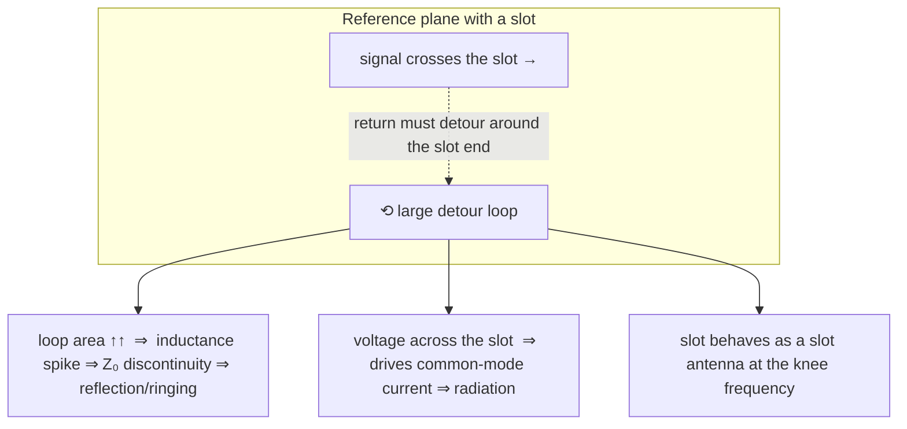
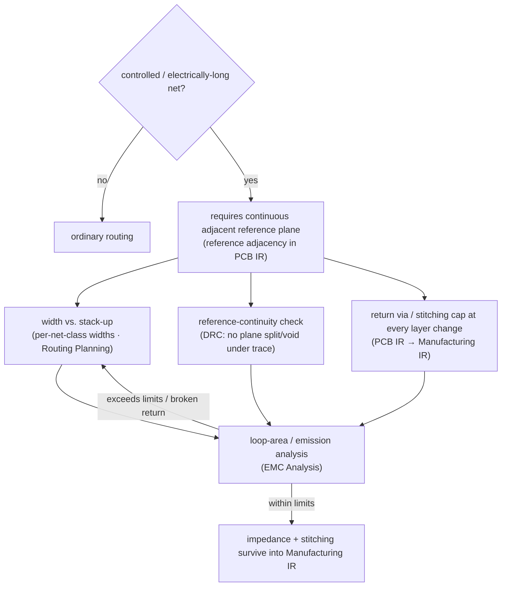

# Return Path

**Summary.** Every signal current flows in a closed loop: the current a driver pushes down a trace must return to that same driver, and the conductor it returns on — almost always the nearest reference plane — is the *return path*. The single most consequential, and most violated, fact of physical PCB design is that **at the speeds digital edges actually contain, the return current does not take the path of least resistance; it takes the path of least impedance**, which means it crowds into the copper directly beneath the signal trace to minimize the loop's enclosed area and inductance. This document belongs in the Engineering Science Layer because the EAK runtime routes a [Net](../../docs/foundation/engineering-domain-model.md#net) as if it were a single forward conductor — the [Schematic IR](../../docs/compiler/ir/schematic-ir.md) names the signal but never names its return — yet impedance, timing, and emissions are all decided by *where the return current goes*, a thing no connectivity check can see. The theory here grounds the runtime's reference-plane continuity rules, the [board-edge keep-out](../../docs/state-machines/routing-planning.md), [per-net-class trace widths](../../docs/state-machines/routing-planning.md), stitching-via/cap placement, the [regulator VIN/VOUT rail split](../../docs/state-machines/routing-planning.md), and the loop-area physics that [EMC Analysis](../../docs/state-machines/emc-analysis.md) ultimately checks. It is the principled answer to "where does the current come back, and what does it cost to break that path?"

---

## Core principles

### A signal is a loop, not an arrow

By [Kirchhoff's current law](../electrical/kirchhoff-laws.md) charge is conserved at every node, so current cannot accumulate: whatever leaves a driver's output pin must return to its supply/ground pin through an unbroken conductive loop. There is no such thing as a one-way signal. The forward current `I` on the trace is matched, instant for instant, by an equal and opposite return current `−I` somewhere in the copper. On a modern board that "somewhere" is the **reference plane** — a ground or power plane on an adjacent layer — and the loop is the thin slot of dielectric between the trace and that plane.


*Figure: the complete signal loop — forward current on the trace, return current in the adjacent plane. The loop, not the trace, is the circuit.*

The runtime models the arrow (the trace realizing the net) and is silent about the return half of the loop. That silence is exactly where return-path bugs hide.

### Least resistance versus least impedance

*Where* the return current flows in the plane is frequency-dependent, and the distinction is the heart of this document. The impedance of any return route is `Z = R + jωL`. Two regimes follow.

- **Low frequency (resistance-dominated, `ωL ≪ R`).** The return current spreads out broadly across the plane to take the path of least **resistance** — a wide, fan-shaped distribution that minimizes `∫ J²ρ dV`. It does *not* care about loop area.
- **High frequency (inductance-dominated, `ωL ≫ R`).** The return current collapses into a narrow band directly under the signal trace to take the path of least **impedance** — which, because the resistive term is now negligible, means the path of least **inductance**, i.e. the path that minimizes the loop's enclosed area and hence the stored magnetic energy `∫ B²/2μ₀ dV`.

The crossover happens where `ωL ≈ R` for the plane. For ordinary copper planes this is low — typically between roughly a kilohertz and a few hundred kilohertz depending on plane geometry — so for **essentially every digital edge and every RF signal a board carries, the return current is fully concentrated beneath the trace.** The intuition "ground is ground, current finds its way back" is a DC intuition; it is wrong by the time signals matter. This is why the principle is stated as *least impedance, not least resistance*.

### Where the high-frequency return current actually flows

Once inductance dominates, the return-current density in a solid plane beneath a microstrip of height `h` above the plane follows a **Lorentzian** profile, centered under the trace:

```text
J_r(D) = −( I / (π·h) ) · 1 / ( 1 + (D/h)² )      [A per unit width]

  D = lateral distance from directly under the trace centerline
  h = trace height above the reference plane
  I = signal current
```

The fraction of the total return current flowing within `±D₀` of the centerline is `(2/π)·arctan(D₀/h)`. Two consequences are worth memorizing:

- About **80 %** of the return current flows within `±3h` of the trace, and ~95 % within `±10h`. The return path is *narrow* and *tracks the trace* — it bends where the trace bends.
- The concentration is set by `h`, the dielectric thickness to the nearest plane. **The closer the reference plane, the tighter the return current hugs the trace, the smaller the loop, the lower the inductance and emission.** This is why a thin signal-to-plane dielectric is an EMC asset, and why the *nearest* plane — not the nominally "assigned" one — is the real reference.

The operative rule: **the return current is a faithful shadow of the trace, projected onto the nearest plane.** Anything that forces that shadow to detour is a return-path discontinuity.

### Loop area, inductance, and radiation

The loop the current encloses is the geometric quantity that ties signal integrity, power integrity, and EMC together. To first order the loop inductance scales with the enclosed area `A_loop`, and a current loop radiates as a magnetic dipole whose far field scales with that same area. For a small loop the differential-mode radiated field (the standard free-space estimate) is:

```text
|E| ≈ 1.32×10⁻¹⁴ · ( f² · A_loop · I ) / r        [V/m]
  f = frequency (Hz), A_loop = loop area (m²), I = current (A), r = distance (m)
```

The field is **linear in loop area** and **quadratic in frequency**. Halving the loop area is a 6 dB emissions reduction for free; doubling it is a 6 dB penalty. Since `A_loop` is minimized exactly when the return current runs directly under the trace, *the least-impedance return path is simultaneously the least-radiating and lowest-inductance one* — nature, the timing budget, and the EMC limit all point the same way. This coincidence is why "keep the loop small" is the one heuristic that pays off in every domain at once.

There is a second, nastier radiation mechanism. A broken or detoured return path develops a voltage across the break (`V = L·dI/dt` over the detour inductance — "ground bounce"). That voltage drives **common-mode current** onto any attached cable or chassis, and common-mode radiation is brutally efficient by comparison:

```text
|E| ≈ 1.26×10⁻⁶ · ( f · ℓ · I_cm ) / r            [V/m]
  ℓ = radiating length (e.g. a cable), I_cm = common-mode current (A)
```

A few **microamps** of common-mode current can fail an emissions limit that tolerates **milliamps** of differential-mode loop current. Return-path discontinuities are the dominant *source* of `I_cm`. This is the mechanism behind most real-world EMC failures, and it is created at layout time by exactly the violations below.

#### The magnitudes, made concrete

The reason the principle is non-negotiable is that the penalties are large, not marginal. Take a 100 mA edge with significant content at the knee frequency `f = 300 MHz`, measured at `r = 3 m`:

```text
Tight return (under the trace):  loop ≈ 50 mm × 0.1 mm  ⇒ A ≈ 5×10⁻⁶ m²
  |E| ≈ 1.32×10⁻¹⁴ · (3×10⁸)² · 5×10⁻⁶ · 0.1 / 3  ≈ 2 µV/m

Detoured return (across a 20 mm slot):  loop ≈ 50 mm × 20 mm ⇒ A ≈ 1×10⁻³ m²
  |E| ≈ 1.32×10⁻¹⁴ · (3×10⁸)² · 1×10⁻³ · 0.1 / 3  ≈ 400 µV/m   (≈ +46 dB)
```

A 200× growth in loop area is a 200× (≈ 46 dB) growth in radiated field from one geometric mistake — before counting the common-mode current the slot voltage injects onto cables, which can dominate both. No downstream filtering recovers 46 dB cheaply; the loop is decided once, at layout, by the return path.

### The cost of crossing a split

The canonical violation is routing a high-speed trace across a **gap, slot, or split** in its reference plane (a plane divided into power islands, a moat between analog and digital ground, a row of via anti-pads, or the board edge). The trace's connectivity is perfect; the return current's is not. Under the trace the plane is missing, so the return current must **detour around the end of the slot** to stay on copper.


*Figure: a signal crossing a plane slot. The return current cannot follow underneath, so it loops around the slot end — paying in inductance, reflection, and common-mode emission.*

The three costs are simultaneous and severe:

1. **Impedance discontinuity.** The detour replaces a few-mil trace-to-plane loop with a centimetre-scale loop. Local inductance spikes, `Z₀` jumps (see [transmission lines](../electrical/transmission-lines.md)), and the resulting reflection coefficient `Γ = (Z − Z₀)/(Z + Z₀)` produces ringing and overshoot at the receiver.
2. **Common-mode injection.** The return current charging across the gap puts a `dI/dt`-driven voltage between the two plane regions; that voltage is the `I_cm` source described above, the leading cause of radiated-emission failures.
3. **Slot-antenna excitation.** The displaced return current excites the slot itself, which radiates efficiently when the slot length approaches a resonant fraction of the wavelength at the signal's knee frequency.

A single high-speed net crossing a single plane split can, by itself, move a board from passing to failing radiated emissions. There is no width or termination choice that repairs a broken reference plane; the only fix is to not break it, or to bridge it.

### Layer transitions: stitching vias and stitching capacitors

When a signal changes layers through a via, its reference plane usually changes too — and the **return current must transition between planes at the same place the signal does**, or it is forced into a long detour back to wherever the planes do connect. The bridge depends on whether the two reference planes are the *same* net:

- **Same-net reference change (e.g. GND → GND, signal hops between two ground-referenced layers).** Place a **ground stitching via** immediately adjacent to the signal via. It carries the return current directly across the layer change, keeping the loop tight. Best practice is one return via per signal via, within a few millimetres / a small fraction of `λ_knee`.
- **Different-net reference change (e.g. signal referenced to GND on one layer, to a power plane on another).** A via cannot connect GND to VCC. The return current can only cross at high frequency through a **stitching capacitor** placed beside the signal via, which shorts the two planes for AC while keeping them DC-isolated. The capacitor's ESL and its own vias add inductance, so this is strictly worse than a same-net return via — a reason to plan reference continuity so signals reference the *same* plane net across transitions.
- **Unavoidable plane split.** If a split truly must be crossed, place **stitching capacitors straddling the split right at the crossing point** to give the return current a (lossy, inductive, but bounded) bridge. This is damage control, not a substitute for an unbroken plane.

The governing idea is uniform: **every signal via or reference change needs a return path engineered to accompany it.** A layer transition planned without its return-current transition is a return-path bug that is invisible to connectivity and to most width/clearance checks.

---

## Why it matters for electronics & PCB design

The return path is where signal integrity, power integrity, timing, and EMC stop being separate disciplines and become one geometry problem.

- **Signal integrity.** `Z₀` is defined only relative to a continuous reference. A discontinuous return path *is* an impedance discontinuity; it reflects, rings, and overshoots regardless of how carefully the trace width was chosen ([signal integrity](../electrical/signal-integrity.md)).
- **Timing.** A detoured return adds loop inductance and slows the effective propagation, perturbing the flight time the timing budget assumed.
- **EMC / emissions.** Loop area sets differential-mode radiation; return-path breaks generate the common-mode current that dominates real failures. Controlling the return path is the highest-leverage EMC action available at layout, far cheaper than shielding or filtering after the fact.
- **Power integrity.** The plane pair *is* a transmission line for return current; sharing a return between a noisy and a quiet circuit lets one modulate the other through their common return impedance. Separating return paths (star/local returns) is the same principle applied to power.

Crucially, **none of these failures shows up in a netlist or a connectivity check.** The schematic says the net is connected, and it is — the forward conductor is intact and the plane is a single, fully connected copper pour. The defect is purely in the *spatial relationship* between the trace and the continuity of the copper beneath it. That is precisely why the return path is the most violated principle in PCB design: it is invisible to the tools and the mental models that operate on connectivity alone.

---

## Mapping to the runtime

This theory is the justification for several concrete EAK runtime artifacts. In each case a violation is an engineering bug in the runtime — a design the kernel would mark valid that copper would not honor, and that connectivity checking is *structurally* unable to catch.

- **Reference-plane continuity → [DRC Verification](../../docs/state-machines/drc-verification.md).** The shipped DRC rule `drc-unrouted-net` encodes the principle that *every net must be realized by copper — an unrealized net is an electrical break*. The return path is the same invariant applied to the **return half of the loop**: a reference plane that is split, voided, or absent under a controlled net is an electrical break in the return conductor. It is the natural companion rule (a reference-continuity / plane-void check over the trace's projection onto its adjacent plane). The reason it is not just "another clearance rule" is the entire point of this document: the broken conductor is a *single, fully connected net* (the ground pour), so the existing connectivity guard cannot see it — only a rule that reasons about trace-to-plane adjacency can. Grounding this rule in the return-current physics is what tells the runtime which nets even need the check (the electrically-long, controlled-impedance ones) and why a green connectivity result is not sufficient.
- **Board-edge keep-out → [Routing Planning](../../docs/state-machines/routing-planning.md) (increment 9).** The fabrication-sourced edge clearance keeps copper away from the board boundary. Physically the *reference plane also truncates at the edge*: a trace routed near the edge has its return-current shadow crowded and clipped by the missing plane, enlarging the loop and turning the board edge into a radiating aperture (edge-fired emission). The keep-out is therefore not only a DFM clearance — it is a return-path/EMC control. Reading it from the [fabrication source](../../docs/compiler/ir/manufacturing-ir.md) while *also* understanding it as a return-path guard is what keeps the runtime from treating it as an arbitrary margin.
- **Per-net-class trace widths → [Routing Planning](../../docs/state-machines/routing-planning.md) (increment 10).** Width sets `Z₀` *only relative to a continuous reference plane* — `Z₀ = √(L/C)` is a function of the trace-to-return geometry, and `L`, `C` are undefined where the return plane is absent. The per-net-class width assignment therefore silently **presupposes** an unbroken reference under the whole trace. If the runtime computes a width for a target impedance but the return path is discontinuous, the computed `Z₀` is a fiction — a width-correct, impedance-wrong net. The width engine and the reference-continuity rule are two halves of one guarantee.
- **Stack-up / reference adjacency → [PCB IR](../../docs/compiler/ir/pcb-ir.md).** Return-path reasoning is only possible if the IR records *which plane each signal layer references* (signal-to-reference adjacency) and stores plane voids/splits, layer heights, and `ε_r` as typed [quantities](../../docs/engineering/units-and-quantities.md). Without an adjacency model the runtime literally cannot know where the return current flows, and cannot diagnose a break. The stack-up is the data structure that makes the return path a first-class, checkable object rather than an assumption.
- **Stitching vias & stitching capacitors → [PCB IR](../../docs/compiler/ir/pcb-ir.md) and [Manufacturing IR](../../docs/compiler/ir/manufacturing-ir.md).** A signal via that changes reference planes needs an accompanying return via (same-net) or stitching cap (different-net). These are first-class placement/routing artifacts: the runtime must be able to *require* a return-current transition wherever it commits a reference change, represent it in the PCB IR, and lower it into the Manufacturing IR so the bridge is actually fabricated. A layer transition committed without its return companion is a return-path bug that should be raised, not silently accepted.
- **Quiet vs. switched returns → [regulator VIN/VOUT rail split](../../docs/state-machines/routing-planning.md) (increment 11).** Splitting a regulator's input and output into distinct nets with distinct routing is the power-integrity face of return-path discipline: input-ripple return current and output return current must not share a return impedance, or the switching node modulates the regulated rail through their common return. The split denies that shared return. (See [circuit theory](../electrical/circuit-theory.md) for the lumped two-port view of the same separation.)
- **Loop area & radiation → [EMC Analysis](../../docs/state-machines/emc-analysis.md).** EMC's job is ultimately a loop-area and common-mode-current computation — the `|E| ∝ f²·A·I` and `|E| ∝ f·ℓ·I_cm` laws above. The shipped `EmcAntennaLengthRule` (`emc-antenna-length`) is a deterministic *proxy*: a track longer than `c/(10·f)` radiates efficiently. That proxy is grounded here — an over-long trace is a large-loop, efficient antenna — and the full target model is an explicit loop-area / return-path evaluation. An EMC `Failed` outcome loops back to [Routing Planning](../../docs/state-machines/routing-planning.md), which is the runtime's mechanism for "the return loop is too big or broken; re-route." Without the return-path physics, EMC has no principled basis for *which* nets to scrutinize or *why* a split is fatal.
- **Reference-continuity & return-via constraints → [Constraint Engine](../../docs/engineering/constraint-engine.md).** "This net class requires a continuous reference plane on the adjacent layer" and "every via transition on this class needs a return via within `d_max`" are machine-checkable [Constraints](../../docs/GLOSSARY.md#constraint) the engine stores and [Routing Planning](../../docs/state-machines/routing-planning.md) honors. Expressing the return path as a constraint is what turns an expert heuristic into something the deterministic kernel can enforce and the [Verification Engine](../../docs/engineering/verification-engine.md) can gate on.


*Figure: how the return-path principle threads from net classification through reference continuity, width, stitching, and EMC into the fabrication output.*

A violation of this principle is an engineering bug in the runtime in the strict sense: the kernel can produce a connectivity-complete, width-correct, DRC-clean board whose return current is forced through a centimetre-scale detour — a design that is *valid by every check the runtime currently runs* and *wrong on the bench*. Closing that gap is exactly why the reference-continuity rule, the adjacency model, and the return-via requirement belong in the runtime, grounded by the physics here.

---

## Failure modes if violated

- **Routing a high-speed net across a plane split.** The forward connectivity is perfect; the return current detours around the slot end. Result: an `Z₀` discontinuity (reflection, ringing) and a common-mode source that radiates. This is the textbook violation, and it passes every connectivity and most clearance checks. A runtime that does not model trace-to-plane adjacency cannot see it.
- **Changing layers without a return path.** A signal via that moves the trace from referencing plane A to plane B, with no nearby return via (same-net) or stitching cap (different-net), forces the return current to travel to wherever the planes happen to connect — a giant, uncontrolled loop. Connectivity is intact; the loop is not.
- **Assuming "least resistance" for return current.** Treating ground as an equipotential into which current "finds its way back" is a DC model used past its validity. Above a few kilohertz the return is inductance-routed and lives under the trace; designing as if it spreads broadly mis-predicts loop area, impedance, and emission for every digital signal on the board.
- **Choosing width without a guaranteed reference.** A per-net-class width yields the target `Z₀` only over a continuous plane. Apply it over a split or void and the impedance is whatever the broken geometry produces — width-correct, impedance-wrong, and silently so.
- **Routing controlled signals at the board edge.** The reference plane truncates at the edge, clipping the return shadow, enlarging the loop, and firing emission from the boundary. The edge keep-out exists partly to prevent this; treating it as a mere fabrication margin loses the EMC rationale.
- **Sharing a return between quiet and switched circuits.** Letting a regulator's input ripple and its output share return impedance (or analog and digital share a return under a split) couples noise through the common return — the power-integrity form of the same break.
- **Dropping stitching intent at the manufacturing boundary.** If return vias / stitching caps and the impedance/stack-up intent do not lower into the [Manufacturing IR](../../docs/compiler/ir/manufacturing-ir.md), the board can be fabricated without the engineered return bridge while every upstream check stays green.

Each failure is the same root error: **reasoning about the forward conductor while ignoring the return loop.** The Engineering Science Layer exists so the runtime's continuity rules, adjacency model, width assignment, stitching requirements, and EMC checks are understood as consequences of where the return current must flow — not as optional layout etiquette. The return path is invisible in the netlist and decisive on the bench; encoding it is what lets the deterministic kernel be right about a thing the schematic never said.

---

## Related documents

- [Kirchhoff's laws](../electrical/kirchhoff-laws.md) — KCL is the axiom that there is always a return current; charge conservation forbids a one-way signal.
- [Transmission lines](../electrical/transmission-lines.md) — `Z₀ = √(L/C)` is defined relative to the return plane; a broken return *is* an impedance discontinuity. The electrically-long boundary decides which nets need this scrutiny.
- [Signal integrity](../electrical/signal-integrity.md) — reflections, ringing, and the knee frequency that sets how fast a "slow" net really is; the SI consequences of a detoured return.
- [Circuit theory](../electrical/circuit-theory.md) — the lumped model whose single-node, equipotential-ground assumption this document supersedes once the return goes inductance-routed.
- [Ohm's law](../electrical/ohms-law.md) — the DC element law behind the "least resistance" intuition that fails above the resistance/inductance crossover.
- [Maxwell's equations](../physics/maxwell-equations.md) — the field axioms from which loop inductance, the return-current distribution, and the radiation laws are derived.
- [Electromagnetics](../physics/electromagnetics.md) — magnetic energy, partial/loop inductance, and the per-unit-length `L`, `C` extraction that sets loop impedance and emission.
- [RF physics](../physics/rf-physics.md) — the high-frequency regime, slot-antenna behavior, and common-mode radiation at and beyond the knee frequency.
- Runtime anchors: [PCB IR](../../docs/compiler/ir/pcb-ir.md) · [Manufacturing IR](../../docs/compiler/ir/manufacturing-ir.md) · [Routing Planning](../../docs/state-machines/routing-planning.md) · [DRC Verification](../../docs/state-machines/drc-verification.md) · [EMC Analysis](../../docs/state-machines/emc-analysis.md) · [Constraint Engine](../../docs/engineering/constraint-engine.md) · [Verification Engine](../../docs/engineering/verification-engine.md) · [Units & quantities](../../docs/engineering/units-and-quantities.md) · [Engineering Domain Model](../../docs/foundation/engineering-domain-model.md) · [GLOSSARY](../../docs/GLOSSARY.md).
