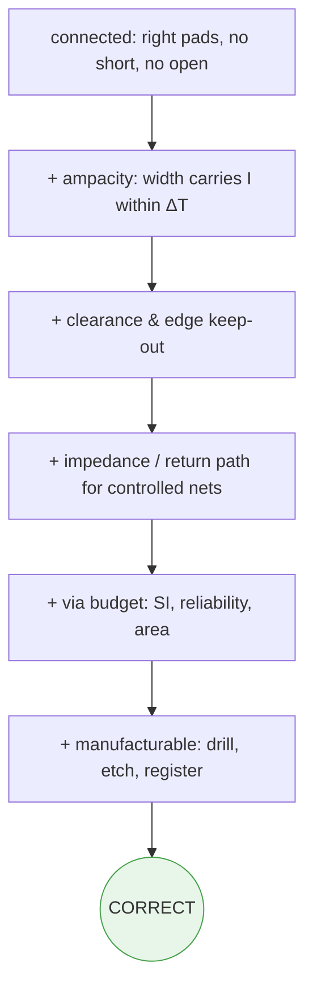
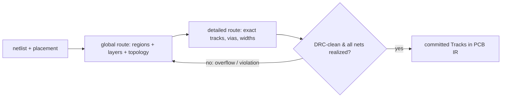

# Routing

**Summary.** Routing is the act of turning a *logical* netlist — "pin A and pin B are the same electrical node" — into *physical* copper: tracks, vias, layer assignments and clearances that realize every [Net](../../docs/foundation/engineering-domain-model.md#net) as [Track / Routing](../../docs/foundation/engineering-domain-model.md#track--routing) geometry on a [Board / Layer Stack](../../docs/foundation/engineering-domain-model.md#board--layer-stack). This document belongs in the Engineering Science Layer because the runtime's [Routing Planning](../../docs/state-machines/routing-planning.md) phase silently assumes a body of routing theory it never states: that a board is routed in *two* coupled stages (decide topology, then commit geometry); that copper is a *finite shared resource* whose contention (congestion) must be negotiated rather than grabbed first-come; that a via is a *cost*, not a free convenience; that net ordering changes the outcome and therefore demands rip-up-and-retry; and — most importantly — that a route which is merely *connected* is not the same as a route which is *correct*. The runtime's net-realization invariant (every Net's [Connections](../../docs/foundation/engineering-domain-model.md#connection) realized, "no more, no less") captures only connectivity; this document grounds the additional electrical, geometric, thermal and manufacturing conditions that separate a board that *works* from a board that merely *conducts*. It is the engineering-domain companion to the algorithmic treatment in [search-algorithms.md](../mathematics/search-algorithms.md) and the resource model in [graph-theory.md](../mathematics/graph-theory.md).

---

## Core principles

### 1. Correct vs. merely connected — the central distinction

A route is **connected** when copper electrically joins exactly the pads that belong to a net: no *opens* (a pad left unreached) and no *shorts* (two distinct nets touching). This is the [PCB IR](../../docs/compiler/ir/pcb-ir.md) *routing-fidelity* invariant, and it is **necessary but not sufficient**.

A route is **correct** when, in addition to being connected, it satisfies every constraint the physics and the fabricator impose on the copper that carries the signal:

```text
correct(net) ≡ connected(net)                       # topology: right pads, no short/open
             ∧ clearance(net) ≥ rule(net_class)      # DRC: spacing to every neighbour + edge
             ∧ width(net)     ≥ width_min(I, ΔT)     # ampacity: carries current without overheating
             ∧ Z0(net)        ∈ [Ztgt·(1−ε), Ztgt·(1+ε)]   # controlled-impedance nets
             ∧ return_path(net) continuous            # EMC: an adjacent, unbroken reference
             ∧ vias(net)      ≤ budget(net_class)     # reliability / SI / cost
             ∧ manufacturable(net)                    # DFM: drillable, etchable, registerable
```
*Listing: connectivity is one clause of correctness; the others are independent physics/fabrication constraints, each owned by a different verification phase.*

Each added clause is a *different physics domain* and a *different runtime gate*: clearance and edge keep-out are [DRC](../../docs/state-machines/drc-verification.md); width-for-current is [ohm's law / IR-drop and IPC-2152 ampacity](../electrical/ohms-law.md); impedance and return-path continuity are [Maxwell's equations](../physics/maxwell-equations.md) and [EMC analysis](../../docs/state-machines/emc-analysis.md); drillability/etchability is [DFM](../../docs/state-machines/dfm-verification.md). The runtime therefore *cannot* certify correctness inside Routing alone — it can only certify connectivity (`ValidatingRouting`) and must hand the remaining clauses to downstream gates. **Treating "connected" as "done" is the single most common routing fallacy, and the architecture is explicitly built to prevent it.**


*Figure: correctness is connectivity plus a stack of independent constraint clauses, each enforced by a distinct downstream phase.*

### 2. Two-stage routing — topology before geometry

Routing a whole board as one monolithic geometric search is intractable: the metric design-rule problem (exact track shapes, clearances) and the combinatorial ordering problem (which net gets which corridor) explode together. The discipline's answer, used by every serious router, is to **separate topology from geometry**:

- **Global (topological) routing.** Partition the board into a coarse grid of regions (*global cells* / *gcells*) and a *region-adjacency graph* whose edges carry a **capacity** (how many tracks can cross that boundary). Decide, for each net, the *sequence of regions and the layers* it traverses — its homotopy class, i.e. which side of each obstacle it passes — **without committing exact coordinates**. This is shortest path / Steiner-tree routing on the coarse graph (see [graph-theory.md](../mathematics/graph-theory.md)), with edge cost driven by congestion.
- **Detailed (geometric) routing.** Within each region, assign concrete track centre-lines, widths, bends and via locations that honour every design rule. Because global routing already fixed the topology and balanced the load, detailed routing is a local, bounded problem per region.


*Figure: the two-stage pipeline — topology is decided coarsely and cheaply, then realized as geometry; failures re-enter at the global stage.*

The payoff is **separation of concerns**: global routing owns *congestion and net ordering* (a discrete, graph problem); detailed routing owns *clearance and manufacturability* (a metric, geometry problem, see [computational-geometry.md](../mathematics/computational-geometry.md)). The runtime's `PlanningRouting` state performs both implicitly when it "plans a routing strategy and proposes Tracks — layer assignment, widths, via usage."

### 3. Layer assignment — crossings force vias, crossings force layers

Two nets that must cross **cannot share a layer**; planar copper does not intersect. Either one net changes layer (a **via**) or the two nets live on different layers. So layer assignment is fundamentally a *planarity / graph-colouring* problem: assign nets to copper layers so that same-layer nets do not cross.

- The minimum number of **signal layers** is bounded below by the board's *crossing density* — informally, how non-planar the netlist-plus-placement is. A fully planar net set routes on one layer; each irreducible family of mutual crossings demands another layer or a via.
- Each signal layer should be *referenced* by an adjacent plane (power or ground) so that high-frequency return current flows directly beneath the trace; this couples layer assignment to the **stack-up** decided in [floor planning](../../docs/state-machines/pcb-floor-planning.md) and to [Maxwell-equation](../physics/maxwell-equations.md) return-path physics. Orthogonal routing direction per layer (e.g. H on L1, V on L3) is the classical heuristic that maximizes the crossing capacity of a fixed layer count.
- Two-layer **constrained via minimization** — given a topology, choose layer assignments minimizing vias — reduces to a maximum-cut / maximum-independent-set problem on a *conflict graph* of net segments; it is polynomially solvable for two layers and NP-hard in general (see [optimization-theory.md](../mathematics/optimization-theory.md)).

### 4. Escape routing — getting out from under dense packages

Before a net can be globally routed, every pin must **escape** the footprint that owns it. For coarse parts this is trivial; for fine-pitch arrays (BGA, QFN, fine-pitch connectors) it is the *binding constraint on the entire board's layer count*. The number of tracks that fit between two adjacent pads/vias is a hard geometric budget:

```text
n_tracks_between_pads = floor( (pitch − d_pad − 2·clearance + track_pitch) / (w_track + clearance) )
```
*Listing: how many escape tracks fit in one pad-to-pad channel; if the inner rows of a BGA have more pins than the outer channels can drain, those rows must escape downward through vias to other layers.*

Escape routing is therefore solved **locally and first**: each pin is assigned a fanout (an in-line escape, a *dog-bone* via to an inner layer, or via-in-pad), producing a ring of *escaped endpoints* at the package boundary that global routing then connects. The count of inner rows that cannot escape on the surface *dictates the minimum signal-layer count* — a placement/floor-plan consequence discovered during routing, which is exactly why Routing can declare a board `Failed` and loop back to [placement](../../docs/state-machines/component-placement.md).

### 5. Congestion management — copper is a finite shared resource

Each region boundary has a **capacity** `cap(e)` = how many tracks of the relevant net-class width can cross it; each candidate routing imposes a **demand** `dem(e)`. The signed shortfall

```text
overflow(e) = max(0, dem(e) − cap(e))      # > 0 ⇒ over-subscribed boundary
```

is the *congestion* on edge `e`. A board routes successfully only if a topology exists with zero total overflow. Crucially, congestion is what makes routing **order-dependent**: the first net to claim a corridor may leave a later, equally-entitled net with nowhere to go even though a *global* feasible assignment exists. Two principled responses:

- **Negotiated congestion (the PathFinder principle).** Let all nets route *greedily and simultaneously*, permitting temporary over-subscription. Then iterate: raise the *cost* of each over-used resource in proportion to its historical and present overflow, and rip-and-reroute. Nets that have a cheap alternative voluntarily vacate contested corridors; the net with no alternative wins it. Iterating until overflow = 0 converges to a legal, *order-independent* solution. This is the rigorous cure for net-ordering bias.
- **Congestion-aware global routing.** Estimate a *congestion map* up front (demand ≈ predicted by placement density and [Rent's-rule](../mathematics/graph-theory.md) wiring estimates) and steer the global router's edge costs away from hotspots *before* detailed routing commits geometry.

### 6. Via minimization — every via is a debt

A via looks free in CAD; in physics and fabrication it is not. Each via incurs, simultaneously:

- **Signal integrity.** A via is an impedance discontinuity and, with its unterminated **stub**, a resonant antenna at high frequency; it adds series inductance. On controlled-impedance nets each via degrades the [Z0](../physics/rf-physics.md) match of clause 1.
- **Return-path disruption.** A signal via that changes reference layers forces the return current to find a new plane; without a nearby *stitching via* the return loop opens, radiating and coupling — an [EMC](../../docs/state-machines/emc-analysis.md) failure rooted in [Maxwell's equations](../physics/maxwell-equations.md).
- **Reliability.** A plated barrel is a thermomechanical fatigue site (barrel cracking under thermal cycling); fewer vias means fewer defect opportunities.
- **Area and routability.** Every via punches an *antipad* through the planes it passes and blocks a cell on each layer — consuming the very routing resource of clause 5, on layers the net does not even use.

The objective is therefore to **minimize via count subject to connectivity and the per-net-class via budget**, not to minimize copper length alone. In the search graph this is a *per-layer-change edge cost* (see [search-algorithms.md](../mathematics/search-algorithms.md) §2): a via is an expensive edge, so the shortest-path search naturally trades a slightly longer same-layer detour for one fewer layer change — exactly the engineering preference.

### 7. Net ordering and rip-up-and-retry

Sequential routing — route nets one at a time — is a *greedy* walk over the space of net orderings, and greedy order is frequently wrong (clause 5). Common ordering heuristics make the greedy pass less bad:

| Heuristic | Rationale |
|-----------|-----------|
| Shortest-net-first | short nets have few alternatives; route them while space is free |
| Most-constrained-first | the net with the fewest legal routes is hardest; give it first pick |
| Criticality-first | impedance-controlled, high-speed, and high-current ([power](../electrical/ohms-law.md)) nets get the cleanest corridors |
| Highest-pin-count-first | large nets shape the congestion map; place them before the map fills |

But **no fixed order is complete.** The completeness guarantee comes from **rip-up-and-retry**: when a net fails, identify the already-routed nets blocking it, rip up one or more, route the failed net through the freed space, and retry the ripped nets — while raising the congestion cost of the contested cells each round so the nets *negotiate* (clause 5) instead of thrashing, under a bounded round budget. This is the routing instance of conflict-directed backtracking ([constraint-satisfaction.md](../mathematics/constraint-satisfaction.md)) and is treated algorithmically in [search-algorithms.md](../mathematics/search-algorithms.md) §6. In the runtime it appears as the *outer* loop: Routing Planning is the **loop-back target for both [DRC](../../docs/state-machines/drc-verification.md) and [EMC](../../docs/state-machines/emc-analysis.md)**, and on loop-back it *edits* the existing routing, typically rerouting only the offending nets.

### 8. Matched routing — differential pairs and length/skew control

Some nets are correct only *as a group*. A **differential pair** carries a signal as the difference between two coupled traces; its behaviour depends on properties the connectivity check cannot see:

- **Coupled (differential) impedance.** The pair must hold a target `Zdiff`, which depends on trace width, spacing and the reference plane — so the two traces must be routed *together*, at fixed spacing, over a continuous reference. Splitting the pair or breaking the reference destroys `Zdiff` even though both traces remain connected.
- **Intra-pair skew.** The two traces must be **length-matched** to within a tight tolerance; a length mismatch `ΔL` converts differential signal into common-mode (timing skew `Δt = ΔL/v`, with `v` the on-board propagation velocity), the dominant radiated-emission and bit-error mechanism on high-speed links. Serpentine *tuning* deliberately adds length to the short trace to equalize.
- **Inter-net matching.** Parallel buses (clocked groups) additionally require *inter-pair* length matching so all bits arrive within a setup/hold window.

Matched routing is thus a constraint that *binds several Tracks into one correctness unit*: the [PCB IR](../../docs/compiler/ir/pcb-ir.md) Track carries a **differential-pair partner** precisely so the router and the verification gates can treat the pair as a single object. None of width, spacing or length-match is visible to the *connected* clause — they are pure additions to *correct* (clause 1).

---

## Why it matters for electronics & PCB design

- **A connected board can still be a broken board.** A net that reaches every pad but is too thin overheats ([ohm's law / ampacity](../electrical/ohms-law.md)); one routed without a continuous reference radiates ([EMC](../../docs/state-machines/emc-analysis.md)); one with a via stub rings on a high-speed edge. Connectivity is the *floor* of routing quality, never the ceiling — the difference is invisible in a connectivity check and catastrophic on the bench.
- **Layer count is money.** Each added copper layer raises board cost and lead time. Because layer count is forced by crossings (clause 3) and escape (clause 4), good routing topology is a direct manufacturing-cost lever, not an aesthetic one.
- **Vias are where boards fail in the field.** Plated-through-hole fatigue is a leading PCB failure mechanism; via minimization (clause 6) is a reliability decision with a physics basis, not a tidiness preference.
- **Order-dependence wastes whole phases.** Without negotiated congestion / rip-up, a routable board is wrongly declared unroutable, forcing an expensive loop-back to placement (clause 5, 7). Getting net ordering right is the difference between convergence and a loop-back storm.
- **Routing is where the abstract netlist meets real physics.** Every upstream abstraction (a net is "just a connection") is cashed out here against Maxwell, Fourier, Joule and the fabricator's drill — this is the phase where engineering science stops being optional.

---

## Mapping to the runtime

This section is the point of the layer: each principle names a concrete EAK artifact it grounds, and why violating it would be an engineering bug.

- **`ValidatingRouting` enforces clause 1's *connectivity* half, not correctness.** [`routing-planning.md`](../../docs/state-machines/routing-planning.md): the `ValidatingRouting` state checks "every Net's [Connections](../../docs/foundation/engineering-domain-model.md#connection) are realized — no more, no less" plus a width/clearance *pre-check*. That is the *connected* clause and a partial down-payment on the rest. The architecture deliberately defers the remaining correctness clauses to [DRC](../../docs/state-machines/drc-verification.md)/[DFM](../../docs/state-machines/dfm-verification.md)/[EMC](../../docs/state-machines/emc-analysis.md). **Bug if violated:** if Routing marked a board `Done` on connectivity alone and the downstream gates were skipped, the runtime would emit a [Manufacturing IR](../../docs/compiler/ir/manufacturing-ir.md) for a board that conducts but overheats or radiates.
- **The PCB IR routing-fidelity invariant is clause 1 made into a runtime law.** [`pcb-ir.md`](../../docs/compiler/ir/pcb-ir.md) invariant 2: "for each Net, the union of its Tracks electrically realizes *exactly* that Net's Connections — no more, no less … no shorts, no opens." This is connectivity as a checkable IR property; invariant 7 (manufacturing-gate readiness, no open error-severity [Violations](../../docs/foundation/engineering-domain-model.md#violation)) is the rest of correctness made a hard gate.
- **`PlanningRouting` performs the two-stage and layer-assignment work (clauses 2–4).** The state "plans a routing strategy and proposes Tracks — layer assignment, widths, via usage, differential-pair handling," reading "stack-up, and routing constraints (clearance, impedance, current)" in `LoadingPlacedBoard`. The stack-up it reads is produced by [floor planning](../../docs/state-machines/pcb-floor-planning.md); layer assignment (clause 3) and escape (clause 4) live here. **Bug if violated:** assigning a high-speed net to a layer with no adjacent reference plane silently breaks the clause-1 return-path requirement, surfacing only at EMC.
- **Per-net-class trace widths reshape the routing graph (clauses 1, 5, 6).** The Phase-3 per-net-class width feature means width is a *parameter of the search graph*, not a post-hoc edit: a wider net consumes more clearance, so fewer region-boundary tracks fit (clause 5 capacity) and fewer grid cells are traversable. The width-for-ampacity clause of correctness is satisfied *by construction* when the router searches the width-correct graph. **Bug if violated:** routing the nominal-width graph and widening afterward produces paths DRC then rejects — a guaranteed loop-back.
- **The board-edge keep-out is blocked routing resource (clauses 1, 5).** The DFM-sourced board-edge clearance keep-out (Phase-3 increment 9) marks an edge band as un-routable *before* any path is searched. It is part of `clearance(net)` in clause 1 and removes capacity in clause 5. **Bug if violated:** a router ignoring the edge band returns "optimal" copper that the [DFM](../../docs/state-machines/dfm-verification.md) edge-clearance rule rejects — the keep-out exists precisely so every searched path is edge-legal by construction.
- **The `differential-pair partner` field binds matched Tracks (clause 8).** [`pcb-ir.md`](../../docs/compiler/ir/pcb-ir.md) records a differential-pair partner on each [Track](../../docs/foundation/engineering-domain-model.md#track--routing), and `PlanningRouting` lists "differential-pair handling" as first-class work. This lets the router route the pair as one object (coupled `Zdiff`, fixed spacing) and lets [EMC](../../docs/state-machines/emc-analysis.md) check intra-pair skew. **Bug if violated:** routing the two halves independently keeps them *connected* but destroys `Zdiff` and skew — a correctness failure invisible to any per-net connectivity check.
- **The regulator VIN/VOUT rail split changes the routing instance (clauses 1, 6, 7).** Splitting one collapsed power rail into distinct VIN and VOUT [Nets](../../docs/foundation/engineering-domain-model.md#net) (Phase-3 increment 11) turns one wide-net target into *two* that must each be realized at their net-class width, each carrying real current per [ohm's law](../electrical/ohms-law.md). Net ordering and rip-up now mediate between them (clause 7); `ValidatingRouting` confirms both are realized. **Bug if violated:** a collapsed rail would route VIN and VOUT as one node — a short that no connectivity check on the *merged* net could even see.
- **DRC's unrouted-net rule is the connectivity backstop (clauses 1, 7).** [`drc-verification.md`](../../docs/state-machines/drc-verification.md): an independent rule (Phase-3 increment 7) flags any net the router failed to realize. This is the *external* re-assertion of the clause-1 *open* check, letting the inner router use fast, possibly-incomplete heuristics safely — defence in depth against a dropped net.
- **DRC/EMC loop-backs are rip-up-and-retry at project scale (clause 7).** [`routing-planning.md`](../../docs/state-machines/routing-planning.md) is "the loop-back target for *both* DRC and EMC." Each loop-back un-does part of the routing and re-searches with new no-goods (a clearance violation, an impedance miss) — the negotiated-congestion / backtracking loop of clauses 5 and 7 lifted to the [workflow orchestrator](../../docs/core/workflow-orchestration.md). The [Verification Engine](../../docs/engineering/verification-engine.md) gates are the goal tests.
- **The Constraint Engine is the correctness oracle for clauses 1, 3–6.** [`constraint-engine.md`](../../docs/engineering/constraint-engine.md) supplies the clearance, impedance, current and keep-out [Constraints](../../docs/foundation/engineering-domain-model.md#constraint) that *define* the correctness clauses; every candidate track is admitted only if it passes them. The [Planning Engine](../../docs/engineering/planning-engine.md) bounds the rip-up round budget so clause 7 terminates.
- **Bounded budgets guarantee termination (clause 7).** [`human-in-the-loop.md`](../../docs/engineering/human-in-the-loop.md) and the [planning engine](../../docs/engineering/planning-engine.md) supply the retry/replan and cost budgets that cap rip-up rounds; without them, negotiated congestion can in principle iterate forever (see Failure modes). The `Failed` outcome ("board unroutable under the current placement/constraints") is the *earned* declaration of clause-4/5 infeasibility, valid only because the inner search was made complete enough.

---

## Failure modes if violated

- **"Connected ⇒ done" (clause 1 ignored).** The router certifies a net on connectivity and skips ampacity/impedance/return-path; the board passes a netlist check and fails on the bench (overheating trace, radiating loop, ringing high-speed edge). The architecture forbids this by routing every clause through a *separate* downstream gate — but a router that pre-empts those gates re-introduces the fallacy.
- **Geometry before topology (clause 2 inverted).** Committing exact tracks before globally balancing congestion bakes in net-ordering bias; the detailed router then cannot legalize a region that a topology-first pass would have avoided, producing avoidable DRC loop-backs.
- **Layer/return-path mis-assignment (clause 3).** Putting a fast net on a layer with no adjacent reference plane satisfies connectivity yet violates the clause-1 return-path requirement; the defect is invisible until [EMC analysis](../../docs/state-machines/emc-analysis.md) and expensive to fix post-placement.
- **Escape ignored (clause 4).** Routing as if every pin escapes on the surface under-counts the required layers; the inner BGA rows have nowhere to go, and Routing must loop all the way back to [placement](../../docs/state-machines/component-placement.md)/floor-planning — the costliest backtrack in the pipeline.
- **First-come congestion grab (clause 5 / 7 ignored).** Without negotiated congestion or rip-up, a *routable* board is declared unroutable because an early net hoarded a corridor; the orchestrator wastes a placement loop-back re-searching a board that was always routable — a lying `FAILURE`.
- **Via inflation (clause 6 ignored).** Treating vias as free yields stub-laden, reliability-poor, plane-perforated copper that passes connectivity but fails SI/EMC and ages badly in the field; the via budget exists to make this cost explicit in the search.
- **Unbounded rip-up (clause 7 without a budget).** Without a round cap and rising congestion cost, nets trade the same corridor forever and the phase never terminates; EAK's bounded budget and `Failed`/escalation outcome exist precisely to forbid non-termination.
- **Pair split / skew (clause 8 ignored).** Routing the two halves of a differential pair separately, or breaking their shared reference, leaves both traces *connected* while destroying coupled impedance and intra-pair skew — a high-speed link that passes connectivity and fails on the eye diagram, caught only at EMC.
- **Searching a fiction (clauses 1, 5).** If width, clearance, the board-edge keep-out, or the VIN/VOUT split are *not* baked into the traversable-cell set and capacities, the router optimizes against a graph that does not match the rules; every "valid" path is later rejected and the project oscillates between phases without progress.

---

## Related documents

- [`search-algorithms.md`](../mathematics/search-algorithms.md) — the algorithmic engine of routing: maze/Lee, Dijkstra, A\* with admissible heuristics, and rip-up-and-retry as backtracking.
- [`graph-theory.md`](../mathematics/graph-theory.md) — the netlist and weighted routing-grid graphs, region-adjacency capacities, spanning/Steiner trees, and Rent's-rule wiring estimates.
- [`optimization-theory.md`](../mathematics/optimization-theory.md) — wirelength/via/congestion as the objective; constrained via minimization and layer assignment as combinatorial optimization.
- [`constraint-satisfaction.md`](../mathematics/constraint-satisfaction.md) — clearance/width/keep-out as constraints; conflict-directed backtracking and no-good learning behind rip-up.
- [`computational-geometry.md`](../mathematics/computational-geometry.md) — how clearance, footprints and keep-outs become the blocked cells and free region detailed routing runs over.
- [`ohms-law.md`](../electrical/ohms-law.md) — trace-width-for-current (ampacity) and IR-drop, the ampacity clause of correctness.
- [`maxwell-equations.md`](../physics/maxwell-equations.md) · [`rf-physics.md`](../physics/rf-physics.md) — controlled impedance, return-path continuity, and via discontinuities behind the impedance/EMC clauses.
- Runtime: [`routing-planning.md`](../../docs/state-machines/routing-planning.md) · [`pcb-ir.md`](../../docs/compiler/ir/pcb-ir.md) · [`pcb-floor-planning.md`](../../docs/state-machines/pcb-floor-planning.md) · [`component-placement.md`](../../docs/state-machines/component-placement.md) · [`drc-verification.md`](../../docs/state-machines/drc-verification.md) · [`dfm-verification.md`](../../docs/state-machines/dfm-verification.md) · [`emc-analysis.md`](../../docs/state-machines/emc-analysis.md) · [`constraint-engine.md`](../../docs/engineering/constraint-engine.md) · [`planning-engine.md`](../../docs/engineering/planning-engine.md) · [`verification-engine.md`](../../docs/engineering/verification-engine.md) · [`workflow-orchestration.md`](../../docs/core/workflow-orchestration.md) · [`GLOSSARY.md`](../../docs/GLOSSARY.md)
