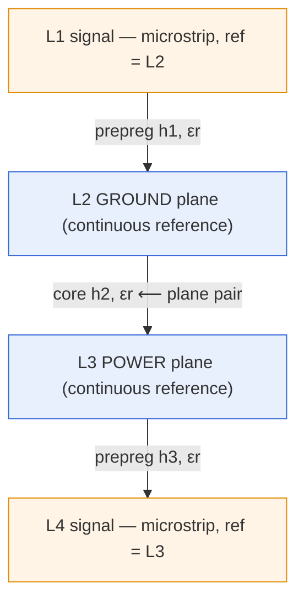
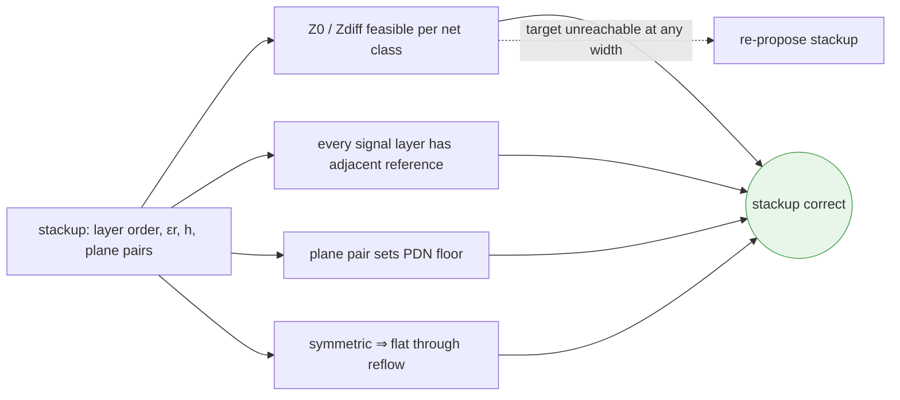

# Layer Stackup

**Summary.** The *stackup* is the vertical cross-section of a printed circuit board — the ordered sequence of copper layers and the dielectric (insulating) sheets that separate them, together with each layer's thickness, material and dielectric constant. It belongs in the Engineering Science Layer because the runtime decides a stackup *before any copper is routed* — the [PCB Floor Planning](../../docs/state-machines/pcb-floor-planning.md) phase's `AllocatingRegions` state "proposes the board outline, **layer stack-up**, and region-to-block assignment" — yet it never states the physics that makes a stackup *correct* rather than merely *present*. This document supplies that physics. The stackup is not a cosmetic packaging choice: it is the **precondition for controlled impedance, power integrity (PI) and electromagnetic compatibility (EMC)**. Trace impedance is fixed by dielectric height before a single track exists; the power-delivery network's high-frequency floor is fixed by plane-pair spacing; the board's flatness through reflow is fixed by the symmetry of the copper distribution; and every high-speed return current depends on a reference plane being *adjacent* to its signal layer. This doc grounds the [Board / Layer Stack](../../docs/foundation/engineering-domain-model.md#board--layer-stack) domain entity and the typed stack-up of the [PCB IR](../../docs/compiler/ir/pcb-ir.md), and explains why a stackup that violates these laws is an engineering bug the runtime must refuse — not a style preference.

---

## Core principles

### 1. The stackup is decided first and constrains everything downstream

A stackup is an *ordered list* of conductive and dielectric layers from top (component side) to bottom:

```text
L1  signal      ── copper, t≈35 µm (1 oz)
    prepreg     ── dielectric, height h1, εr
L2  ground      ── reference plane (continuous copper)
    core        ── dielectric, height h2, εr   (the "plane pair")
L3  power       ── reference plane (continuous copper)
    prepreg     ── dielectric, height h3, εr
L4  signal      ── copper
```
*Listing: a canonical symmetric 4-layer stack — outer signal layers each reference an adjacent plane; the GND/PWR pair forms the core.*

Three properties are *consequences of this ordering* and cannot be recovered later without changing the stack: (a) the characteristic impedance `Z0` of every trace (clause 3), (b) the impedance floor of the power-delivery network (clause 4), and (c) which return path each signal layer has (clause 6). Because routing can only choose a trace's *width and length within a fixed dielectric height*, the stackup is logically *upstream* of routing — exactly why the runtime fixes it in floor planning (phase 8) and merely *reads* it in [routing](../../docs/state-machines/routing-planning.md) (phase 10).

### 2. Layer count and ordering — bounded below by routability, bounded by physics

The **number of signal layers** is bounded below by the board's *crossing density* and *escape* demand (see [routing.md](routing.md) clauses 3–4): a fully planar net set needs one signal layer, and each irreducible family of crossings or un-escapable BGA row forces another. The **number of plane layers** is bounded below by the need to *reference every signal layer* (clause 6) and to *pair power with ground* for PI (clause 4). Ordering obeys four rules:

- **Every signal layer is adjacent to at least one reference plane.** A signal layer sandwiched between two signal layers has no defined return path (clause 6) — forbidden for any controlled or high-speed net.
- **Reference planes are paired with the planes that carry their return.** A power plane should sit directly over a ground plane so the two form a tight plane pair (clause 4).
- **The stack is symmetric about its mid-plane** (clause 5) — copper coverage and dielectric heights mirror top-to-bottom — which forces an **even total layer count** in practice.
- **Outer layers are *microstrip* (one adjacent plane); inner layers between two planes are *stripline*** (clause 3) — the two impedance regimes the formulas below distinguish.


*Figure: the 4-layer ordering — each signal layer is adjacent to a plane (microstrip), and the GND/PWR core is a tight plane pair. Symmetric about the mid-plane.*

### 3. Dielectric height sets characteristic impedance

For a controlled-impedance net the goal is a target `Z0` (single-ended, e.g. 50 Ω) or `Zdiff` (differential, e.g. 90/100 Ω). `Z0` is set by the trace geometry **relative to the dielectric height to its reference plane** — and that height is a *stackup* parameter, not a routing one. The IPC-2141 closed-form approximations make the dependence explicit. For a **microstrip** (outer layer, height `h` to the one adjacent plane, width `w`, copper thickness `t`, dielectric constant `εr`):

```text
Z0 ≈ (87 / sqrt(εr + 1.41)) · ln( 5.98·h / (0.8·w + t) )        [ 0.1 < w/h < 2 ]
```

For a **symmetric stripline** (inner layer centred between two planes spaced `b` apart):

```text
Z0 ≈ (60 / sqrt(εr)) · ln( 1.9·b / (0.8·w + t) )
```

Two facts follow that the runtime must honour. First, `Z0` falls roughly logarithmically as `w` rises and rises as `h` rises — so for a *fixed stackup height* there is exactly one trace width per layer that hits the target. Routing's job is to *find that width*; choosing `h` is the stackup's job. Second, the signal's **propagation velocity** and delay are also stackup properties, through the effective dielectric constant:

```text
εeff(microstrip) = (εr+1)/2 + (εr−1)/2 · 1/sqrt(1 + 12·h/w)
v  = c / sqrt(εeff)            tpd = sqrt(εeff) / c   [stripline: εeff = εr]
```
*Listing: impedance and delay are both functions of (εr, h) fixed by the stackup; width `w` is the one remaining routing degree of freedom. For differential pairs, `Zdiff ≈ 2·Z0·(1 − 0.48·e^(−0.96·s/h))`, so pair spacing `s` couples to the same `h`.*

### 4. Plane pairing for power integrity

A power plane placed directly above a ground plane, separated by a thin dielectric of height `d`, is a **distributed parallel-plate capacitor** with capacitance

```text
C_plane = ε0 · εr · A / d            (A = overlapping plane area)
```

and, more importantly, a **low loop inductance** for current flowing between the planes. The power-delivery network (PDN) must present a low impedance `Z_PDN(f) = |ΔV/ΔI|` across frequency so that transient load currents do not collapse the rail. At high frequency the PDN impedance is dominated by the *plane-pair loop inductance*, which scales with the dielectric height `d`: halving `d` roughly halves the spreading inductance and doubles the interplane capacitance, lowering the PDN impedance floor and pushing the plane-cavity resonance up. This is why a tight, thin power/ground core is the single most effective PI lever — and it is a *stackup* decision, taken before any decoupling capacitor is placed. See [power-integrity.md](../electrical/power-integrity.md) for the full PDN target-impedance treatment and [maxwell-equations.md](../physics/maxwell-equations.md) for the field picture.

### 5. Symmetry prevents warp

A laminate is a stack of materials with different coefficients of thermal expansion (copper ≈ 17 ppm/K; FR-4 in-plane ≈ 14–17 ppm/K but **z-axis ≈ 50–70 ppm/K**) cured at high temperature. On cool-down and again at reflow, each layer wants to contract by a different amount. If the copper distribution and dielectric heights are **symmetric about the mechanical mid-plane (neutral axis)**, the resulting in-plane stresses balance and the net **bending moment is zero** — the board stays flat. If the stack is *asymmetric* — say heavy copper on top, sparse on the bottom, or unequal prepreg heights — the unbalanced residual stress produces a bending moment, exactly like a bimetallic strip, and the board **bows (cylindrical curvature) or twists (saddle curvature)**:

```text
balanced stack:    Σ moments about neutral axis ≈ 0   ⇒  flat
asymmetric stack:  Σ moments ≠ 0                       ⇒  bow / twist on thermal cycle
```

Warp is not cosmetic: beyond roughly 0.75 % of the diagonal (a common IPC-A-600 acceptance limit) it causes solder-paste misregistration, tombstoning and open joints at assembly. Symmetry is therefore a *manufacturability* constraint of the stackup, owned downstream by [DFM](../../docs/state-machines/dfm-verification.md). The mechanics live in [materials-science.md](../physics/materials-science.md) and [thermal-physics.md](../physics/thermal-physics.md).

### 6. Signal layers must be adjacent to a continuous reference

At any frequency above a few megahertz, a signal's **return current does not spread across the whole plane** — it concentrates in the reference plane *directly beneath the trace*, because that path minimizes loop inductance (the field solution of [Maxwell's equations](../physics/maxwell-equations.md); the *image current*). Three consequences make adjacency non-negotiable:

- **No adjacent plane ⇒ no defined return ⇒ undefined `Z0`.** A signal layer with signal layers on both sides has no nearby return path; its impedance is uncontrolled and its loop area (hence radiation) is large. This is why clause 2 forbids signal-signal-signal sandwiches.
- **The reference must be *continuous* under the trace.** A split, gap or void in the plane beneath a trace forces the return current to detour around it, opening a loop that radiates and couples — an EMC failure even though the signal trace itself is intact. Routing a fast net *across a plane split* is the canonical version of this bug.
- **A layer change needs a return path too.** When a via moves a signal from a layer referenced to GND to one referenced to PWR, the return current must transfer between planes; without a nearby stitching via (or interplane capacitance from clause 4) the return loop opens. The stackup's *reference assignment per signal layer* determines how severe this is.

### 7. The stackup as a precondition for impedance and EMC

Pulling clauses 3–6 together: the stackup *is* the boundary condition for the board's electromagnetics. Impedance control is impossible without a fixed `(εr, h)`; EMC is impossible without an ordering that gives every signal layer an adjacent, continuous reference and a low-impedance plane pair to carry return current. The stackup must therefore be **frozen before routing and validated for feasibility against the net classes it must support** — if the impedance targets cannot be met at any manufacturable width for the chosen heights, the stackup itself must change (more layers, thinner dielectric), which is precisely the recoverable failure the floor-planning machine encodes.


*Figure: a stackup is correct only if it simultaneously makes impedance feasible, references every signal layer, sets a low PDN floor and stays balanced; failing the first re-proposes the stack.*

---

## Why it matters for electronics & PCB design

- **Impedance is a stackup property, not a trace property.** Two boards with identical layouts but different dielectric heights have different `Z0`. A controlled-impedance net cannot be "fixed in routing" if the stackup height is wrong — the width that hits the target may not exist at a manufacturable size.
- **The PDN impedance floor is poured before any capacitor.** Decoupling caps lose effectiveness above their mounting-inductance resonance; above that, only the plane-pair capacitance and low spreading inductance hold the rail. A loose (thick) power/ground core caps PI performance no amount of decoupling can recover.
- **Warp is a yield killer set at the stackup.** An asymmetric stack passes every electrical check and then fails at assembly with opens and tombstones. Symmetry is the cheapest defect-prevention decision on the board.
- **Return paths are won or lost in the layer order.** Most EMC failures are return-path failures, and the return path is determined by which plane sits next to which signal layer — a stackup decision, invisible in a connectivity check and catastrophic on the bench.
- **Layer count is money.** Each added copper layer raises cost and lead time; the count is forced from below by routability and from physics by referencing and plane-pairing. A good stackup uses the minimum count that satisfies all four constraints.

---

## Mapping to the runtime

This section is the point of the layer: each principle names a concrete EAK artifact it grounds, and why violating it would be an engineering bug.

- **The Board / Layer Stack entity is *specified* to make the stackup runtime state.** [`engineering-domain-model.md`](../../docs/foundation/engineering-domain-model.md#board--layer-stack) defines the [Board / Layer Stack](../../docs/foundation/engineering-domain-model.md#board--layer-stack); the [PCB IR](../../docs/compiler/ir/pcb-ir.md) is specified to carry "layer stack-up (copper/dielectric layers, thicknesses, materials, dielectric constants — all typed [Physical Quantities](../../docs/engineering/units-and-quantities.md))." Invariant 5 (*typed geometry & stack*) makes `εr`, layer height and copper thickness first-class typed quantities — exactly the `(εr, h, t)` that clause 3's impedance formula consumes. **Bug if violated:** an untyped or unit-confused dielectric height (mm vs mil) silently shifts every `Z0`, and the impedance constraint would pass against a fiction. *Spec-vs-impl gap:* the current `eak/` `Board` carries only the outline (`width`, `height`) and a copper **layer count** (`layers: u32`) — no per-layer height, `εr`, copper thickness, material or plane/signal role yet, so the typed `(εr, h, t)` stack is a spec-level claim, not implemented state today (see [`../compliance/compliance-report.md`](../compliance/compliance-report.md), findings PCB-1, PCB-5).
- **Floor Planning's `AllocatingRegions` is where the stackup is born (clauses 1–2).** [`pcb-floor-planning.md`](../../docs/state-machines/pcb-floor-planning.md): the `AllocatingRegions` state "proposes the board outline, **layer stack-up**, and region-to-block assignment," and `LoweringToPCBIR` is specified to persist "the Board, its **stack-up**, and regions." This is the intended runtime realization of clause 1 — the stackup is fixed *before* placement and routing. **Bug if violated:** proposing the stackup after routing would invalidate every routed `Z0`, forcing a full re-route. *Spec-vs-impl gap:* today the lowering clones the reduced `Board` (outline + `layers: u32`) into `PcbIr.board`, so the lowered PCB IR carries no typed stack-up — only the layer count survives; persisting the full `(εr, h, t)` stack remains future scope (see [`../compliance/compliance-report.md`](../compliance/compliance-report.md), finding PCB-1).
- **The floor-plan validation failure mode is clause 7 made executable.** [`pcb-floor-planning.md`](../../docs/state-machines/pcb-floor-planning.md) lists, verbatim, "**Stack-up infeasible for net classes** (e.g. impedance target needs more layers) is a recoverable validation failure that re-proposes the stack-up," and `ValidatingFloorPlan → AllocatingRegions` carries it. That is exactly clause 7's "if the target is unreachable at any manufacturable width, change the stack." **Bug if violated:** accepting an infeasible stackup would hand routing an impossible impedance target it could never satisfy, producing an endless DRC/EMC loop-back.
- **Routing *reads* the stackup; it does not get to change it (clauses 3, 6).** [`routing-planning.md`](../../docs/state-machines/routing-planning.md)'s `LoadingPlacedBoard` reads "stack-up, and routing constraints (clearance, impedance, current)," and `PlanningRouting` does "layer assignment." Layer assignment is constrained by clause 6 — a controlled net may only be placed on a layer with an adjacent reference. **Bug if violated:** assigning a high-speed net to a layer with no adjacent plane satisfies connectivity yet leaves `Z0` undefined and the return loop open, surfacing only at EMC.
- **Per-net-class trace widths *will be* the width-that-hits-`Z0` of clause 3.** A controlled-impedance width *is specified to be* picked *against the fixed dielectric height* — the single `w` that the IPC-2141 formula maps to the class's target `Z0`, with the stackup supplying `h` and the net class supplying the resulting `w`. **Implemented today:** the Phase-3 per-net-class width is a fixed per-class *constant* (Power/Ground 0.50 mm, Signal 0.25 mm), not impedance- or current-derived; `NetClass` is `{Power, Ground, Signal}` with no differential / controlled-impedance class and no `Z0`/`Zdiff` field, so no width is computed from `(εr, h)` yet (see [`../compliance/compliance-report.md`](../compliance/compliance-report.md), finding PCB-5). **Bug if violated:** once widths *are* impedance-derived, choosing them without reference to the stackup height yields traces whose impedance misses target — a defect [EMC](../../docs/state-machines/emc-analysis.md) catches and a routing loop-back must repair.
- **The regulator VIN/VOUT rail split lands on the plane pair (clause 4).** Splitting the collapsed power rail into distinct VIN and VOUT [Nets](../../docs/foundation/engineering-domain-model.md#net) (Phase-3 increment 11) makes the *power* side of the GND/PWR plane pair concrete: each rail's PDN impedance floor is set by the plane-pair spacing this document fixes. **Bug if violated:** a power net with no adjacent ground plane (a stackup ordering error) has no interplane capacitance and a high PDN floor — the rail collapses under transient load no decoupling can rescue.
- **DRC/DFM own the manufacturability of the stack (clause 5 + drillability).** [`dfm-verification.md`](../../docs/state-machines/dfm-verification.md) is where stack symmetry (warp risk), minimum dielectric height, and via **aspect ratio** (board thickness ÷ drill diameter, the stackup-thickness consequence) are checked; [`drc-verification.md`](../../docs/state-machines/drc-verification.md) checks the geometric rules the stack implies. The board-edge keep-out (increment 9) and these rules are all fabrication-sourced. **Bug if violated:** an asymmetric stack passes electrically and warps at reflow; the DFM gate exists to refuse it before [Manufacturing Generation](../../docs/state-machines/manufacturing-generation.md).
- **EMC analysis depends on the ordering this doc fixes (clause 6).** [`emc-analysis.md`](../../docs/state-machines/emc-analysis.md) checks return-path continuity and radiation — both of which are decided by whether each signal layer has an adjacent, continuous reference. EMC is a *consumer* of the stackup's correctness, and a stackup loop-back is the deepest fix when EMC fails on a referencing error. **Bug if violated:** EMC would flag radiation whose root cause is an un-referenced signal layer that no routing edit can cure.
- **The Constraint Engine carries the impedance/PI constraints; Units & Quantities type the stack.** [`constraint-engine.md`](../../docs/engineering/constraint-engine.md) holds the impedance, clearance and keep-out [Constraints](../../docs/foundation/engineering-domain-model.md#constraint) that the stackup must satisfy; [`units-and-quantities.md`](../../docs/engineering/units-and-quantities.md) (PCB IR invariant 5) guarantees `εr`, `h`, `t` are typed so clause 3's formula is dimensionally sound. [`standards-and-compliance.md`](../../docs/engineering/standards-and-compliance.md) is where the governing references (IPC-2141 impedance, IPC-A-600/IPC-6012 acceptance and warp limits, IPC-2152 ampacity coupling) attach to the stackup decision.

---

## Failure modes if violated

- **Un-referenced signal layer (clause 6).** A signal layer with no adjacent plane has undefined impedance and a large return loop; the net passes connectivity and fails impedance and radiation tests. Only a stackup re-order fixes it — the costliest possible loop-back.
- **Wrong dielectric height (clause 3).** If `h` is set so the target `Z0` needs a width below the fabricator's minimum (or above the routing channel budget), routing cannot hit the target. The defect is *designed in at the stackup*; routing thrashes trying to satisfy an impossible constraint. This is the failure floor planning's "stack-up infeasible" mode exists to catch *before* routing.
- **Loose power/ground core (clause 4).** A thick power-ground dielectric raises the PDN impedance floor and lowers the interplane capacitance; transient load currents droop the rail and no decoupling above the cap-mount resonance recovers it — a PI failure baked into the stack.
- **Asymmetric copper / dielectric (clause 5).** Unbalanced stress yields bow or twist on thermal cycling; the board is electrically perfect and mechanically unassemblable, failing at solder paste and reflow with opens and tombstones.
- **Plane split under a trace (clause 6).** A reference plane gap beneath a fast net detours the return current, opening a radiating loop — an EMC failure invisible to DRC connectivity, traceable only to the stackup's plane geometry plus routing.
- **Stackup chosen after routing (clauses 1, 7).** Deciding dielectric heights once tracks exist invalidates every routed impedance; the project must re-route. The runtime forbids this by fixing the stackup in floor planning (phase 8), upstream of routing (phase 10).
- **Odd / floating layers (clause 2).** An odd layer count or a plane left electrically floating breaks symmetry (warp) and removes a reference (impedance/EMC) simultaneously — two independent failures from one ordering mistake.
- **Aspect-ratio overrun (clause 5 + DFM).** A thick stack with small drills exceeds the reliable plating aspect ratio; barrels under-plate and crack in thermal cycling. Board thickness is a stackup output, so this is a stackup-sourced reliability defect the DFM gate must refuse.

---

## Related documents

- [`transmission-lines.md`](../electrical/transmission-lines.md) — the `Z0` the stackup geometry sets; microstrip/stripline as transmission lines.
- [`signal-integrity.md`](../electrical/signal-integrity.md) — why controlled impedance and continuous references matter for the signal the stackup carries.
- [`power-integrity.md`](../electrical/power-integrity.md) — the PDN target-impedance model the plane pair (clause 4) underwrites.
- [`maxwell-equations.md`](../physics/maxwell-equations.md) · [`electromagnetics.md`](../physics/electromagnetics.md) — return-current concentration, image currents and the field basis of impedance and EMC.
- [`materials-science.md`](../physics/materials-science.md) · [`thermal-physics.md`](../physics/thermal-physics.md) — laminate CTE, residual stress and the warp mechanics of clause 5.
- [`routing.md`](routing.md) — the layer-count drivers (crossings, escape) and the layer-assignment / return-path rules that consume the stackup.
- [`placement.md`](placement.md) — placement and floor planning, where the board frame and stack are first established.
- Runtime: [`pcb-floor-planning.md`](../../docs/state-machines/pcb-floor-planning.md) · [`pcb-ir.md`](../../docs/compiler/ir/pcb-ir.md) · [`routing-planning.md`](../../docs/state-machines/routing-planning.md) · [`drc-verification.md`](../../docs/state-machines/drc-verification.md) · [`dfm-verification.md`](../../docs/state-machines/dfm-verification.md) · [`emc-analysis.md`](../../docs/state-machines/emc-analysis.md) · [`constraint-engine.md`](../../docs/engineering/constraint-engine.md) · [`units-and-quantities.md`](../../docs/engineering/units-and-quantities.md) · [`standards-and-compliance.md`](../../docs/engineering/standards-and-compliance.md) · [`engineering-domain-model.md`](../../docs/foundation/engineering-domain-model.md) · [`GLOSSARY.md`](../../docs/GLOSSARY.md)
