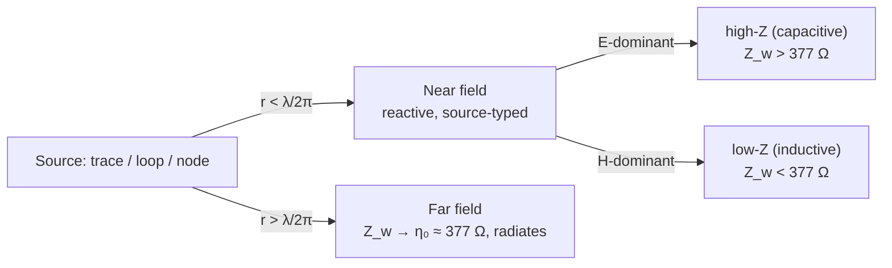
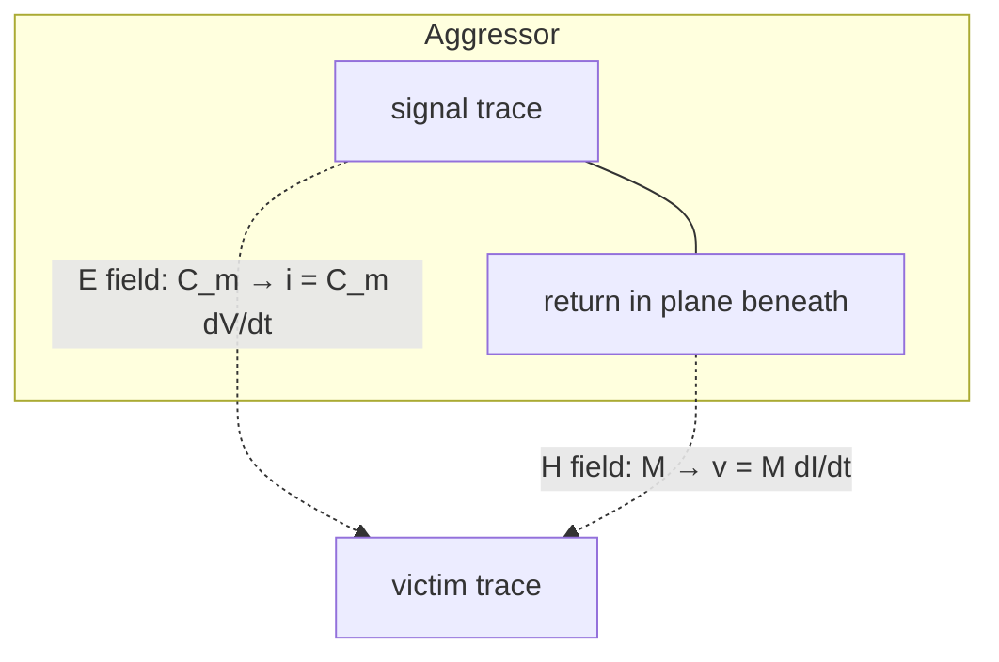
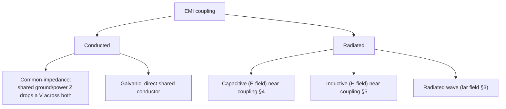

# Electromagnetics

**Summary.** Electromagnetics is the physics of electric (`E`) and magnetic (`H`) fields and the waves they form when they vary in time. It belongs in the Engineering Science Layer because a printed circuit board is not a schematic: a copper trace is not an ideal wire but a structure that *stores energy in the dielectric around it*, *carries a return current that closes a loop*, and *radiates*. Every voltage between two conductors is an `E` field in the board's dielectric; every current in a trace is an `H` field wrapped around it; and above a few tens of megahertz those fields couple between nets, crowd to conductor surfaces, leak out of the board edge, and emit. This document grounds the field-theory assumptions that the [EMC Analysis](../../docs/state-machines/emc-analysis.md) phase silently relies on, the loop-area and controlled-impedance reasoning behind [Routing Planning](../../docs/state-machines/routing-planning.md), the spacing/clearance and trace-width [Constraints](../../docs/foundation/engineering-domain-model.md#constraint) checked in [DRC](../../docs/state-machines/drc-verification.md)/[DFM](../../docs/state-machines/dfm-verification.md), and the dielectric/stack-up parameters carried in the [PCB IR](../../docs/compiler/ir/pcb-ir.md). It is the field-theoretic complement to [Maxwell's equations](maxwell-equations.md) (the source laws) and to the cut-set/return-current argument in [graph theory](../mathematics/graph-theory.md): when the runtime says "this board will pass EMC," it is asserting a claim about fields.

## Core principles

A vocabulary bridge first — every field quantity below names a PCB reality, so the physics and the runtime speak one language (units per [`units-and-quantities.md`](../../docs/engineering/units-and-quantities.md)):

| Field quantity | Symbol · unit | PCB meaning |
|----------------|---------------|-------------|
| Electric field | `E` · V/m | Set up by a *voltage* between conductors; lives in the dielectric |
| Magnetic field | `H` · A/m | Set up by a *current* in a conductor; wraps the trace |
| Permittivity | `ε = ε₀εᵣ` · F/m | Dielectric's ability to store `E`-field energy (`εᵣ` ≈ 4.0–4.6 for FR-4) |
| Permeability | `µ = µ₀µᵣ` · H/m | Stores `H`-field energy (`µᵣ ≈ 1` for copper/FR-4) |
| Conductivity | `σ` · S/m | Copper `σ ≈ 5.8×10⁷`; sets resistive loss & skin depth |
| Loss tangent | `tan δ` (Df) | Fraction of stored dielectric energy lost per cycle (FR-4 ≈ 0.02) |
| Wave impedance | `Z_w = E/H` · Ω | Ratio of the fields; → `η₀ ≈ 377 Ω` in the far field |

### 1. The four fields laws, in PCB terms

All of the following are consequences of [Maxwell's equations](maxwell-equations.md) with the constitutive relations `D = εE`, `B = µH`, `J = σE`:

```
∇·D = ρ            Gauss        — charge (a voltage) is the source of E
∇·B = 0            no monopoles — H field lines always close on themselves
∇×E = −∂B/∂t       Faraday      — a changing H induces a voltage  → inductive coupling
∇×H = J + ∂D/∂t    Ampère–Maxwell — current *and* a changing E make H → capacitive coupling
```

Two terms above are the entire story of board-level coupling. The `∂B/∂t` term (Faraday) means a time-varying magnetic field links a neighbouring loop and induces a voltage — **inductive coupling**. The `∂D/∂t` term (Maxwell's displacement current) means a time-varying electric field drives a real current across the gap between conductors with no metal contact — **capacitive coupling**. Both vanish at DC and both grow with frequency, which is why a layout that is electrically silent at 1 kHz fails EMC at 100 MHz.

### 2. Quasi-static vs. wave regime — is the trace "long"?

A trace behaves as a simple lumped node only while it is *electrically short*: signals at both ends are effectively the same at every instant. The dividing length is the wavelength

```
λ = v / f ,   v = c / √εᵣ_eff ≈ (3×10⁸ m/s) / √4.3 ≈ 1.45×10⁸ m/s on FR-4
```

so on FR-4 a 1 GHz signal has `λ ≈ 14.5 cm`. The standard engineering criterion is **lumped if physical length `l ≪ λ/10`**, otherwise the trace is a **transmission line** with distributed `L` and `C`, characteristic impedance `Z₀ = √(L/C)`, and propagation delay — reflections, ringing, and matched-termination behaviour all appear. The equivalent time-domain criterion uses edge rate: a net must be treated as a transmission line when the one-way flight time exceeds roughly a sixth of the signal rise time (`t_flight ≳ t_r/6`). This single threshold decides whether the runtime may model a net as a wire or must reason about its impedance and length.

### 3. Near field vs. far field, and wave impedance

Close to a source the fields are *reactive* (energy sloshes back into the source each cycle); far away they detach as a propagating wave. The boundary is

```
r_boundary ≈ λ / (2π)
```

In the **near field** (`r < λ/2π`) the wave impedance `Z_w = E/H` depends on the *source type*:

- A high-voltage / low-current source (an open stub, a fast `dV/dt` node) is **E-field dominant**: `Z_w > 377 Ω` — a *capacitive*, high-impedance near field.
- A high-current / low-voltage source (a current loop, a power-supply switching node) is **H-field dominant**: `Z_w < 377 Ω` — an *inductive*, low-impedance near field.

In the **far field** (`r > λ/2π`) the fields lock to the free-space wave impedance `Z_w → η₀ = √(µ₀/ε₀) ≈ 377 Ω` and the energy leaves as radiation that an EMC test antenna measures.


*Figure: which field dominates depends on distance and on whether the aggressor is voltage-driven or current-driven.*

### 4. Capacitive (electric-field) coupling

Two conductors separated by dielectric form a **mutual capacitance** `C_m`. A voltage swing on the aggressor drives a displacement current into the victim:

```
i_coupled = C_m · dV_aggressor/dt
```

The victim, presented to ground through impedance `Z_victim`, develops a crosstalk voltage that is a *capacitive divider* — it rises with `C_m`, with `dV/dt` (fast edges), with parallel run length, and with victim impedance, and falls with conductor separation. Capacitive coupling is the dominant mechanism for high-impedance, fast-edge nets routed close together.

### 5. Inductive (magnetic-field) coupling and the current loop

A current loop on the aggressor produces a magnetic flux; the fraction linking the victim's loop is the **mutual inductance** `M`. By Faraday's law the victim sees:

```
v_coupled = M · dI_aggressor/dt
```

The decisive geometric quantity is **loop area**: both `M` and the board's own radiation scale with the area enclosed between a signal current and its return current. This is why *return current* is a first-class field concept. At high frequency the return current does not spread across the whole ground plane — it concentrates in the plane *directly beneath the signal trace*, because that path minimises loop inductance (nature minimises stored `H`-field energy). A microstrip and its image return form a tight, low-area loop. Break that return path — with a slot, a plane split, or a missing reference layer — and the return current must detour, the loop area explodes, and both inductive crosstalk and radiated emission jump. This is the field reading of the [graph-theory cut-set](../mathematics/graph-theory.md) result: *a signal must never cross a plane cut, because the cut forces a large return loop.*


*Figure: the same adjacency couples two ways — capacitively through `E`, inductively through `H`.*

### 6. Skin effect

At DC, current fills the whole conductor cross-section; as frequency rises, the conductor's own changing `H` field drives eddy currents that expel current toward the surface. Current density decays exponentially into the metal with the **skin depth**:

```
δ = √( ρ / (π f µ) ) = 1 / √(π f µ σ)
```

For copper this is approximately **`δ ≈ 66 µm / √(f_MHz)`** — about 66 µm at 1 MHz, ~6.6 µm at 100 MHz, ~2.1 µm at 1 GHz. Because the useful conducting cross-section shrinks, the **AC resistance rises as `√f`** (surface resistance `R_s = ρ/δ = √(π f µ ρ)`). The consequences for a PCB: a trace's high-frequency resistance is far larger than its DC value, conductor (`I²R`) loss grows along a high-speed line, and simply widening a trace yields diminishing returns once it is many skin depths wide — only the perimeter conducts. Plating roughness further raises loss because the rough surface lengthens the high-frequency current path.

### 7. Proximity effect

Skin effect is a conductor reacting to its *own* field; **proximity effect** is a conductor reacting to a *neighbour's* field. In a signal-trace / return-plane pair, the plane's return current is pulled into a narrow band right under the trace (it follows the trace's field), and in tightly-packed parallel traces current crowds toward or away from neighbours depending on current direction. The redistributed, narrower current path raises AC resistance *beyond* what skin effect alone predicts and concentrates loss. Proximity effect is why the practical AC resistance of a microstrip cannot be computed from the trace in isolation — its reference plane is part of the conductor.

### 8. Energy in the dielectric, and dielectric loss

The board *stores* electromagnetic energy in the volume around its conductors, with energy densities

```
u_E = ½ ε E²        (electric, in the dielectric)
u_H = ½ µ H²        (magnetic, around the conductor)
```

and the energy flows along the line — not "in the wire" but in the field between the conductors — at a rate given by the **Poynting vector** `S = E × H` (W/m²). A transmission line's `C` is exactly this `E`-field storage per unit length and its `L` is the `H`-field storage, so `Z₀ = √(L/C)` and `v = 1/√(LC)` are energy statements. Real dielectrics are lossy: the permittivity is complex, `ε = ε₀εᵣ(1 − j·tan δ)`, where the **loss tangent** `tan δ` (dissipation factor `Df`) is the fraction of stored `E`-field energy converted to heat each cycle. Dielectric attenuation grows with frequency:

```
α_dielectric ∝ (π f √εᵣ_eff / c) · tan δ        →  loss per length ∝ f · tan δ · √εᵣ
```

So on a lossy laminate, high-frequency content is attenuated and the dielectric warms — the field-theory reason laminate selection (FR-4 vs. low-`Df` material) is an engineering decision, not a cosmetic one. (Note the symbol collision: skin-depth `δ` in §6 is unrelated to loss-tangent `tan δ` here.)

### 9. EMI coupling mechanisms: conducted vs. radiated

Electromagnetic interference reaches a victim by four paths, grouped as **conducted** (energy travels on a shared conductor) and **radiated** (energy travels as a field):


*Figure: the four EMI paths the layout and grounding strategy must each control.*

Two distinctions decide whether a board passes a radiated-emissions limit:

- **Differential-mode (DM) vs. common-mode (CM).** DM emission comes from the intended signal/return loop and scales as `∝ f² · A_loop · I_DM` — controlled by *shrinking loop area*. CM emission comes from unintended common-mode currents flowing out onto cables/chassis and scales as `∝ f · L_cable · I_CM`; even tiny CM currents (microamps) dominate emissions because the "antenna" (a cable) is long. CM current is created by ground-bounce and asymmetric return paths — i.e. by the very loop-integrity failures of §5.
- **Emission vs. susceptibility.** The same coupling paths run backwards: a board that radiates well also *receives* well. EMC limits ([standards](../../docs/engineering/standards-and-compliance.md) such as CISPR/FCC classes) bound both directions.

Common-impedance coupling deserves its own note: when two circuits share a finite-impedance ground or power conductor, one circuit's return current develops a voltage across that shared impedance that the other circuit sees as noise. Separating the conductors — giving a sensitive analog rail its own return, or splitting a regulator's input and output domains — removes the shared `Z` and thus the coupling.

## Why it matters for electronics & PCB design

- **Coupling is unavoidable but bounded by geometry.** `C_m`, `M`, and loop area are set entirely by where copper goes; the layout *is* the EMC design. There is no firmware fix for a 10× loop area.
- **High frequency changes the conductor.** Skin and proximity effects mean a trace's resistance, current capacity, and loss at 1 GHz are nothing like its DC values — width and reference-plane choices must be made in the AC regime ([Ohm's law](../electrical/ohms-law.md) gives the DC floor only).
- **The dielectric is a component.** `εᵣ` sets impedance and delay; `tan δ` sets high-frequency attenuation and heating. Stack-up is an electrical decision.
- **Return current is real current.** Every signal needs a low-impedance return directly beneath it; plane integrity is an EMC requirement, not an aesthetic one.
- **Edges and slots radiate.** Fields fringe out of board edges and detour around plane slots; both turn ordinary traces into antennas.

## Mapping to the runtime

This is the section that makes the field theory load-bearing. Each principle is embodied by a concrete EAK artifact.

- **Near/far field, loop area, DM/CM emission ↔ [EMC Analysis](../../docs/state-machines/emc-analysis.md).** EMC is the phase whose entire premise is §3–§5 and §9: in `ConfiguringAnalysis` it sets "frequency ranges, ports, scenarios" — i.e. the `λ`, near/far boundary, and the loops that radiate — and in `RunningAnalysis` it invokes an external field solver through the [Simulation port](../../docs/core/contracts.md). `InterpretingResults` compares emission against EMC limits with margins. When emission exceeds the limit, EMC's `Failed` terminal loops back to [Routing Planning](../../docs/state-machines/routing-planning.md) — because the only fix is geometric: shrink loop area, restore return paths, re-reference layers. Every number EMC interprets is an `E×H` field quantity from this document.

- **Controlled impedance & electrical length ↔ Routing Planning + the [PCB IR](../../docs/compiler/ir/pcb-ir.md) stack-up.** §2 and §8 say a net longer than `λ/10` (or faster than `t_r/6` flight) must be a transmission line with a target `Z₀ = √(L/C)`. The PCB IR's [Board / Layer Stack](../../docs/foundation/engineering-domain-model.md#board--layer-stack) carries the dielectric thickness, `εᵣ`, and `tan δ` that *fix* `Z₀`, `v`, and dielectric loss; [Routing Planning](../../docs/state-machines/routing-planning.md) must route a controlled-impedance net at the width/spacing that hits its `Z₀`. A lowering ([transformations](../../docs/compiler/transformations.md)) that dropped the dielectric parameters would make impedance uncomputable — a field-physics bug.

- **Return-path integrity ↔ plane cut-sets (graph theory) + DRC/EMC.** §5's loop-area law is the physical meaning of the [graph-theory cut-set](../mathematics/graph-theory.md) rule: *a signal track must not cross a plane split.* The runtime enforces it as a routing constraint and re-checks it where reference continuity breaks. Violating it is the canonical "passes DRC geometry, fails EMC" defect, caught late and expensively at [EMC Analysis](../../docs/state-machines/emc-analysis.md).

- **Skin effect & current capacity ↔ per-net-class trace widths (Phase-3 increment 10).** §6–§7 are why a net's *class* sets its minimum width: a power rail needs copper area for DC `I²R` and a high-speed net needs width/reference for AC resistance and impedance. The per-net-class width feeds the [Routing Planning](../../docs/state-machines/routing-planning.md) feasible edge set (it removes grid edges too narrow for the class) and is checked in [DFM](../../docs/state-machines/dfm-verification.md). The field content this encodes: at high frequency only a skin-depth-thick shell conducts, so width and current rating cannot be read off the DC cross-section.

- **Capacitive coupling ↔ spacing/clearance [Constraints](../../docs/foundation/engineering-domain-model.md#constraint) in the [Constraint Engine](../../docs/engineering/constraint-engine.md).** §4 makes `C_m` (hence crosstalk) a function of separation and parallel run length. Crosstalk/spacing and impedance constraints stored by the [Constraint Engine](../../docs/engineering/constraint-engine.md) and checked in [DRC](../../docs/state-machines/drc-verification.md) are exactly the discretised form of "keep `C_m·dV/dt` and `M·dI/dt` below the victim's noise budget." A clearance rule is a coupling bound in disguise.

- **Common-impedance coupling ↔ the regulator VIN/VOUT rail split.** The Phase-3 increment that **split the collapsed power rail (regulator VIN/VOUT)** is the §9 fix for common-impedance coupling: input and output are distinct nets at distinct potentials with distinct return domains, so they must not share a conductor whose finite `Z` would couple switching noise from VIN onto VOUT. The switching node is also the §3 *H-field-dominant, low-`Z` near-field* aggressor; keeping its loop tight and its rail separate is field-domain isolation, and the decoupling capacitors on each rail are the §8 `½εE²` energy reservoirs that supply transient current locally instead of through a long, radiating loop.

- **Edge-fired radiation ↔ the board-edge keep-out (DFM increment 9).** §1/§8 fringing fields leak from copper near a board edge, turning the edge into a radiator and a coupling aperture. The fabrication-sourced **board-edge clearance keep-out** removes near-edge routing (graph-theoretically, it deletes near-edge grid vertices), pulling fields back inside the stack-up; [DFM Verification](../../docs/state-machines/dfm-verification.md) and the [Manufacturing Generation](../../docs/state-machines/manufacturing-generation.md) gate confirm no copper sits in the forbidden band. Its EMC payoff is suppressing edge emission.

- **Units & limits ↔ [units-and-quantities](../../docs/engineering/units-and-quantities.md) and [standards-and-compliance](../../docs/engineering/standards-and-compliance.md).** Every quantity here (V/m, A/m, F, H, Ω, `εᵣ`, `tan δ`) is a typed [Physical Quantity](../../docs/foundation/engineering-domain-model.md#constraint); the EMC limits EMC checks against are the regulatory thresholds catalogued in [standards-and-compliance](../../docs/engineering/standards-and-compliance.md). The [Verification Engine](../../docs/engineering/verification-engine.md) (analysis mode) is where field results become machine-checkable margins, and accepted margins become [Waivers](../../docs/engineering/human-in-the-loop.md) under the Autonomy Level.

## Failure modes if violated

- **Treating an electrically long net as lumped.** Skip §2 and a high-speed net is routed as a wire: reflections, ringing, and timing failures that only a transmission-line model would have predicted.
- **Large signal/return loop area.** Ignore §5 — split planes crossed, signal far from its reference, no adjacent return — and DM radiation (`∝ f²·A_loop`) blows the [EMC](../../docs/state-machines/emc-analysis.md) limit; the board loops back to [Routing Planning](../../docs/state-machines/routing-planning.md) repeatedly.
- **Underestimating AC resistance.** Use the DC width/resistance and §6–§7 punish you: high-frequency `I²R` loss, attenuation, and local heating the thermal budget never accounted for.
- **Tight, long parallel runs.** Ignore §4's `C_m` and §5's `M` and crosstalk corrupts adjacent nets — caught, if at all, only as intermittent functional failure or susceptibility.
- **Wrong/loss-ignorant dielectric.** Omit `εᵣ`/`tan δ` from the stack-up (§8) and impedance is wrong (reflections) and high-frequency content is silently attenuated and the dielectric overheats.
- **Common-impedance / shared-rail coupling.** Collapse VIN and VOUT or share a sensitive return (§9) and switching noise couples through the shared `Z` — the exact defect the regulator-rail-split increment prevents.
- **Copper at the board edge.** Skip the edge keep-out (§1 fringing) and the board edge radiates; emissions fail with no schematic-level cause.

## Related documents

- [`maxwell-equations.md`](maxwell-equations.md) — the four source laws this document applies to copper and dielectric.
- [`../mathematics/graph-theory.md`](../mathematics/graph-theory.md) — the plane cut-set / return-current argument, here given its field meaning (loop area and emission).
- [`../electrical/ohms-law.md`](../electrical/ohms-law.md) — the DC floor for resistance and IR drop that skin/proximity effects raise at high frequency.
- [`../../docs/state-machines/emc-analysis.md`](../../docs/state-machines/emc-analysis.md) — the phase whose analysis *is* this field theory.
- [`../../docs/state-machines/routing-planning.md`](../../docs/state-machines/routing-planning.md) · [`../../docs/state-machines/drc-verification.md`](../../docs/state-machines/drc-verification.md) · [`../../docs/state-machines/dfm-verification.md`](../../docs/state-machines/dfm-verification.md) — loop area, impedance, spacing, width, and edge-clearance enforcement.
- [`../../docs/compiler/ir/pcb-ir.md`](../../docs/compiler/ir/pcb-ir.md) · [`../../docs/foundation/engineering-domain-model.md`](../../docs/foundation/engineering-domain-model.md) — the stack-up (`εᵣ`, `tan δ`, thickness) and Net/Track entities the fields live on.
- [`../../docs/engineering/constraint-engine.md`](../../docs/engineering/constraint-engine.md) · [`../../docs/engineering/verification-engine.md`](../../docs/engineering/verification-engine.md) — where coupling and emission become machine-checkable constraints and margins.
- [`../../docs/engineering/standards-and-compliance.md`](../../docs/engineering/standards-and-compliance.md) · [`../../docs/engineering/units-and-quantities.md`](../../docs/engineering/units-and-quantities.md) — EMC limits and the typed quantities (V/m, A/m, Ω, `εᵣ`, `tan δ`) used throughout.
