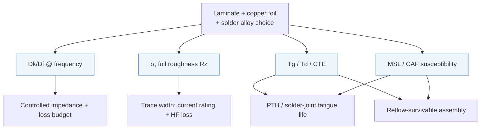

# Materials Science

**Summary.** Materials science is the study of how the *physical substances* a PCB is built from — glass-reinforced epoxy (FR-4), copper foil, solder alloys, solder mask, and the moisture and metallic phases that live inside them — respond to electricity, heat, mechanical stress, and time. It belongs in the Engineering Science Layer because the runtime treats a [Board / Layer Stack](../../docs/foundation/engineering-domain-model.md#board--layer-stack) as a stack of named materials with *numbers* — a dielectric constant, a loss tangent, a copper thickness, a glass-transition temperature, a coefficient of thermal expansion — and every one of those numbers is a property of a real material that varies with frequency, temperature, humidity, and process. When [Routing Planning](../../docs/state-machines/routing-planning.md) computes a controlled-impedance width, when [DFM Verification](../../docs/state-machines/dfm-verification.md) checks an annular ring or an acid trap, when [Manufacturing Generation](../../docs/state-machines/manufacturing-generation.md) emits a stack-up and a reflow-compatible laminate, the runtime is silently asserting facts about FR-4, copper, and tin. This document grounds those facts: the laws that make Dk/Df frequency-dependent, copper loss roughness-dependent, solder joints intermetallic-limited, and board reliability CTE- and moisture-limited. It is the substance-level complement to the field theory in [electromagnetics](electromagnetics.md) and [Maxwell's equations](maxwell-equations.md) — those say *how fields behave in a dielectric*; this says *what the dielectric actually is*.

## Core principles

A vocabulary bridge first, so the materials and the runtime speak one language (every property is a typed [Physical Quantity](../../docs/engineering/units-and-quantities.md)):

| Property | Symbol · unit | What it bounds |
|----------|---------------|----------------|
| Relative permittivity (Dk) | `εᵣ` · dimensionless | Trace impedance, velocity, capacitance |
| Loss tangent (Df) | `tan δ` · dimensionless | Dielectric (substrate) signal loss |
| Conductivity | `σ` · S/m | Copper resistive loss, current rating |
| Skin depth | `δ_s` · m | High-frequency conductor loss |
| Foil roughness | `Rz / Δ` · µm | Excess conductor loss above smooth |
| Glass-transition temp | `Tg` · °C | Onset of soft, high-CTE substrate behaviour |
| Decomposition temp | `Td` · °C | Maximum survivable reflow/assembly heat |
| CTE | `α` · ppm/°C | Thermal expansion → via/joint fatigue |
| Moisture sensitivity | `MSL` · level 1–6 | Floor life before reflow popcorning |

### 1. Dielectrics — Dk and Df vary with frequency (and are causally coupled)

FR-4 is not one material but a *composite*: E-glass fibre cloth (`εᵣ ≈ 6`) in a cured epoxy resin (`εᵣ ≈ 3`). Its bulk Dk is a volumetric mix (≈ 4.2–4.6 at 1 MHz), so two boards with the same "FR-4" label but different glass/resin ratios and weave styles have *different* Dk — this is why a stack-up must carry the laminate's actual measured Dk, not a textbook constant.

Dk falls slowly with frequency and Df rises, because a dielectric is a set of relaxing dipoles. The two are not independent: causality (Kramers–Kronig) forces a real, frequency-dependent permittivity to have an imaginary loss part. The wideband **Djordjevic–Sarkar / multi-pole Debye** model is the standard causal form used for signal-integrity:

```
ε(f) = ε_∞ + (ε_s − ε_∞) · [ ln((f₂ + jf)/(f₁ + jf)) / ln(f₂/f₁) ]
Dk(f) = Re ε(f) ,   Df(f) = −Im ε(f) / Re ε(f)
```

For everyday FR-4: `Dk ≈ 4.5 @ 100 MHz → ≈ 4.0 @ 10 GHz`, `Df ≈ 0.015 → 0.025` over the same span. Dielectric attenuation grows with frequency:

```
α_d ≈ (π · f · √Dk_eff / c) · tan δ        [Np/m]   — first-order, low-loss
```

The linear-in-`f` dielectric loss is *why* high-speed nets need low-Df laminate (Df ≈ 0.002–0.004 for RF-grade) rather than standard FR-4: at 10 GHz the FR-4 substrate alone can cost several dB per inch. The runtime's stack-up therefore needs Dk **and** Df **at the design frequency**, not a single DC-ish number.

### 2. Effective permittivity sets impedance and delay

A microstrip's fields share two media (substrate below, air above), so it sees an *effective* permittivity between 1 and `Dk`:

```
Dk_eff ≈ (Dk + 1)/2 + (Dk − 1)/2 · (1 + 12·h/w)^(−1/2)
v_p = c / √Dk_eff        (propagation velocity)
t_pd = √Dk_eff / c       (delay per unit length)
```

Characteristic impedance `Z₀` then follows from the trace/dielectric geometry (`w`, `h`, `t`, `Dk`). This is the exact dependency the controlled-impedance routing rule inverts: *given* `Z₀_target` and *given* the laminate `Dk`, solve for trace width `w`. A 10 % Dk error becomes roughly a 5 % impedance error — enough to violate a `±10 %` impedance spec. Effective permittivity is also frequency-dependent (microstrip dispersion: `Dk_eff` rises toward `Dk` as frequency climbs), which is why high-rate length-matching uses delay, not raw length.

### 3. Copper — finite conductivity, skin effect, and roughness

Copper is an excellent but *finite* conductor: annealed `σ ≈ 5.96×10⁷ S/m`, electrodeposited foil ≈ `5.8×10⁷ S/m`. Two regimes:

- **DC / low frequency** — current fills the whole cross-section. Sheet resistance `R_□ = ρ/t`; for 1 oz copper (`t ≈ 35 µm`), `R_□ ≈ 0.5 mΩ/□`. Trace resistance and IR drop scale with `length/width` (the basis of [Ohm's law](../electrical/ohms-law.md) trace sizing and the IPC-2221 current/temperature-rise curves).
- **High frequency** — current crowds into a surface layer of thickness:

```
δ_s = 1 / √(π · f · µ · σ)
```

```
f         δ_s (copper)
100 kHz   ≈ 206 µm    (≫ foil thickness → DC-like)
10 MHz    ≈ 20.6 µm
1 GHz     ≈ 2.06 µm
10 GHz    ≈ 0.65 µm
```

Once `δ_s ≪ t`, AC resistance rises as `√f`, and the *surface* is all that matters — which is where **roughness** enters. Foil is deliberately roughened (tooth profile, peak-to-valley `Rz`) for resin adhesion, but when `Rz` approaches `δ_s` the current must follow the longer rough path and loss climbs. The **Hammerstad–Jensen** correction multiplies smooth-copper loss by:

```
K_SR = 1 + (2/π) · arctan[ 1.4 · (Δ/δ_s)² ]     ,   1 ≤ K_SR ≤ 2
```

so rough foil can *double* conductor loss at high frequency (the asymptote is 2×). The **Huray "snowball"** model is the more accurate high-frequency form (it models the tooth as spheres on a base plane). This is why high-speed stack-ups specify low-profile foils (RTF, VLP `Rz ≈ 2–3 µm`, HVLP `< 1.5 µm`): roughness is a *material* choice with a direct electrical price, and it must travel with the stack-up just like Dk.

### 4. Solder metallurgy and intermetallics

A solder joint is not "glue" — it is a *metallurgical bond*. Molten solder dissolves a little copper and forms **intermetallic compounds (IMCs)** at the interface; that IMC layer is the actual bond. Two alloy families dominate:

| Alloy | Composition | Melt / liquidus | Interface IMC |
|-------|-------------|------------------|----------------|
| SnPb eutectic | Sn63/Pb37 | 183 °C | Cu₆Sn₅ |
| SAC305 (lead-free) | Sn96.5/Ag3.0/Cu0.5 | ≈ 217–220 °C | Cu₆Sn₅ (η), Cu₃Sn (ε) |

Two facts the runtime must respect:

- **A thin IMC is required; a thick IMC is brittle.** Cu₆Sn₅ and the harder Cu₃Sn are necessary for wetting but are brittle ceramics; an over-thick layer (from too-hot/too-long reflow or long hot service) embrittles the joint and cracks under shock or thermal cycling. IMC growth is diffusion-controlled and follows a parabolic, Arrhenius law:

```
x(t) = x₀ + √(D · t) ,   D = D₀ · exp(−Q / R·T)
```

so growth doubles roughly every 10–15 °C and is `√time` — a soak that is twice as long grows the layer by only `√2`, but a hotter peak grows it exponentially. This bounds the *reflow thermal profile* and, with it, the laminate that must survive it.

- **Lead-free raised every thermal limit.** SAC's ≈ 217 °C melt forces reflow peaks of ≈ 245–260 °C. The substrate, mask, and components must survive that — which is exactly the Tg/Td and MSL story below. The choice of alloy is therefore a *system* constraint, not just a BOM line.

### 5. Tg, Td, and CTE — the thermomechanical envelope

FR-4's epoxy is a thermoset glass with a **glass-transition temperature `Tg`** (standard ≈ 130–140 °C, high-Tg ≈ 170–180 °C). Below `Tg` the resin is stiff; above `Tg` it softens and its out-of-plane expansion *explodes*:

```
α_z ≈ 50–70 ppm/°C   below Tg
α_z ≈ 200–300 ppm/°C above Tg          (Z-axis, through-thickness)
α_xy ≈ 14–17 ppm/°C  (in-plane, constrained by the glass weave)
```

Copper's `α_Cu ≈ 17 ppm/°C` is close to the in-plane FR-4 value but *far* below the Z-axis value above `Tg`. The mismatch is the dominant failure driver:

- **Plated-through-hole (PTH) barrel cracking.** On every thermal cycle the resin tries to grow in Z far more than the copper barrel plated through it; the barrel is strained in tension. Cycle-to-failure follows a **Coffin–Manson** fatigue law:

```
N_f = C · (Δε_p)^(−n)        (n ≈ 1.5–2.5 for solder/copper fatigue)
```

so halving the plastic strain swing roughly multiplies life by `2^n`. Thicker barrel copper, lower-CTE (high-Tg or filled) laminate, and aspect-ratio limits all reduce `Δε_p` — these become PTH and aspect-ratio DFM rules.

- **`Td` is the hard ceiling.** The **decomposition temperature `Td`** (typically the 5 %-mass-loss point, IPC-TM-650 2.4.24.6) is where the resin chemically breaks down. For lead-free assembly with 245–260 °C peaks, the laminate *must* have `Td` comfortably above the peak (e.g. `Td ≳ 340 °C`) or it delaminates/blisters. `T260`/`T288` (minutes-to-delamination at those temperatures) and `Tg`-vs-peak margin are the acceptance metrics. **Td, not Tg, is the reflow-survival limit; Tg sets the in-service stiffness limit.**

### 6. Moisture and reliability

FR-4 is hygroscopic — it absorbs ~0.1–0.5 % water by weight from ambient humidity, and that water changes the board:

- **Electrical drift.** Water's `εᵣ ≈ 78` and high loss raise the laminate's Dk and Df, detuning controlled-impedance and high-frequency loss budgets.
- **Reflow "popcorning."** Absorbed moisture flashes to steam at reflow temperature; if a package or board absorbed too much, the steam delaminates it with an audible pop. This is governed by the **Moisture Sensitivity Level (MSL, J-STD-020)**: a floor-life-after-opening rating (MSL 1 = unlimited … MSL 6 = bake-before-use), with a mandatory bake to remove moisture before assembly.
- **CAF (Conductive Anodic Filament).** Under humidity *and* DC bias, copper migrates electrochemically along delaminated glass-fibre bundles, growing a conductive filament from anode to cathode and eventually shorting adjacent vias/traces. CAF growth is field-, spacing-, and glass-weave-dependent; the defence is minimum conductor-to-conductor and via-to-via spacing along the weave (anti-CAF spacing) — a humidity-reliability DRC/DFM rule, not just a manufacturing clearance.


*Figure: each material property fans out to a specific design or manufacturing limit the runtime must honour. Viewpoint: the Engineering Science Layer.*

## Why it matters for electronics & PCB design

Materials properties are the *bounds inside which every layout decision is legal*. They convert an abstract net into a manufacturable, reliable copper structure:

- **Stack-up is a materials specification.** Choosing layer count, dielectric thickness, copper weight, and laminate grade is choosing Dk, Df, Tg, Td, CTE, and roughness simultaneously. Impedance, loss, thermal survival, and fatigue life all follow from that one choice.
- **Trace width is doubly bounded by copper.** At DC, copper's finite `σ` and the IPC-2221 temperature-rise curve set a *minimum* width to carry current without overheating; at RF, skin effect and roughness set how much *loss* a given width costs. A power rail and a high-speed net size their copper for opposite reasons — both are materials limits.
- **Assembly is a thermal race against the laminate.** The solder alloy's melt point sets the reflow peak; the laminate's Td and the parts' MSL set what survives it; IMC kinetics set how long the joint stays reliable. A board that routes perfectly can still be unbuildable if its laminate cannot take its own reflow profile.
- **Reliability is mostly CTE and moisture.** Field failures of well-routed boards are dominated by PTH cracking, solder fatigue, delamination, and CAF — all materials phenomena. Designing for them (high-Tg laminate, aspect-ratio limits, anti-CAF spacing, MSL handling) is materials engineering expressed as design rules.

## Mapping to the runtime

This is the point of the layer: every property above is a number the runtime carries, computes with, or checks — and getting it wrong is an engineering bug, not a cosmetic one.

- **[Board / Layer Stack](../../docs/foundation/engineering-domain-model.md#board--layer-stack) in the [PCB IR](../../docs/compiler/ir/pcb-ir.md)** is literally a materials list: per the PCB IR schema it carries "copper/dielectric layers, thicknesses, materials, **dielectric constants** — all typed [Physical Quantities](../../docs/engineering/units-and-quantities.md)." Dk/Df/Tg/Td/CTE/`Rz` are exactly those typed quantities. The IR's "Typed geometry & stack" invariant ([P9](../../docs/foundation/principles.md)) is the runtime's contract that these are units-checked materials values, not bare floats — so a Dk in the wrong units cannot silently corrupt an impedance solve ([units-and-quantities](../../docs/engineering/units-and-quantities.md)).
- **[Routing Planning](../../docs/state-machines/routing-planning.md) + per-net-class trace widths (increment 10)** invert §2–§3: the controlled-impedance width for a net class is a function of the stack-up `Dk`, dielectric height, and copper weight; the loss budget uses `Df` and roughness. The per-net-class width table is materials physics resolved per class — a signal class sizes for `Z₀` and loss, a power class for current/temperature rise. If the [Constraint Engine](../../docs/engineering/constraint-engine.md) fed a wrong `Dk`, every impedance in that class would be wrong by ≈ ½ the Dk error: a real, shippable bug.
- **The regulator VIN/VOUT power-rail split (increment 11)** rests on §3's DC copper law: VIN and VOUT carry different currents at the same voltage, so they need different minimum widths for the same allowed temperature rise. The split exists precisely because one width cannot satisfy two current loads — copper conductivity makes that a hard materials constraint, surfaced through the width/clearance rules the [Constraint Engine](../../docs/engineering/constraint-engine.md) checks.
- **[DFM Verification](../../docs/state-machines/dfm-verification.md)** specializes the [Verification Engine](../../docs/engineering/verification-engine.md) with fab-process limits that are materials limits: annular-ring/aspect-ratio rules come from PTH plating + CTE fatigue (§5); acid-trap and solder-mask-sliver rules come from etch/mask materials behaviour; assembly spacing comes from solder wetting and IMC (§4). The phase loads "fab-process limits (standards, IPC classes, assembly rules)" — those classes (IPC-6012, IPC-A-600) *are* materials acceptance criteria.
- **The board-edge keep-out / DFM edge clearance (increment 9)** is materials-sourced: the edge is where depaneling stress, delamination, and moisture ingress concentrate, so copper and components are held back from it. Fabrication-sourcing that keep-out (rather than guessing) is honouring §5–§6 at the board boundary.
- **[Manufacturing Generation](../../docs/state-machines/manufacturing-generation.md)** lowers the PCB IR to the [Manufacturing IR](../../docs/compiler/ir/manufacturing-ir.md): it must emit a laminate/stack-up whose `Td` survives the assembly reflow profile (§4–§5) and whose MSL handling is recorded (§6). Emitting a board whose own laminate cannot take its own reflow peak is an internally inconsistent manufacturing output — the gate exists to prevent it.
- **[Standards & compliance](../../docs/engineering/standards-and-compliance.md)** is where these materials numbers acquire authority: IPC-4101 (laminate spec, defines Tg/Td/CTE classes), IPC-2221 (current/temperature-rise and spacing), IPC-6012 / IPC-A-600 (PTH and acceptance), J-STD-020 (MSL), IPC-9701 (solder-joint thermal-cycling reliability), IPC-TM-650 (the test methods that *measure* Dk, Df, Tg, Td, T260/T288). The runtime cites these so a material claim is traceable, not asserted.
- **[Learning Engine](../../docs/engineering/learning-engine.md)** is where measured-vs-modeled materials behaviour (e.g. a fab's actual Dk, or a roughness loss that overran budget) feeds back as improved defaults for future stack-ups — closing the loop between datasheet values and real laminate.

Violating any of these is an engineering bug in the runtime: a board that *passed* every phase but used a stale Dk, an under-sized power rail, a laminate that delaminates at its own reflow peak, or vias spaced for clearance but not for CAF — each is a clean pass that fails in the lab or the field.

## Failure modes if violated

- **Stale or generic Dk/Df.** Using a textbook `Dk = 4.5` when the laminate is 4.1 throws every controlled-impedance trace off by ≈ 5 %, busting a `±10 %` spec and the loss budget. *Cause:* §1–§2 ignored; the stack-up must carry measured, frequency-correct values.
- **Roughness ignored at high frequency.** Specifying standard foil for a 10+ GHz net under-budgets conductor loss by up to 2× (§3), so the link closes in simulation and fails on the bench.
- **Under-sized power copper.** Sizing VIN/VOUT for impedance but not for current overheats the rail (IR drop + temperature rise), drifting the regulator and stressing the laminate — the failure the rail-split (increment 11) and per-net-class widths (increment 10) exist to prevent.
- **Reflow exceeds Td / wrong Tg.** A low-Td laminate or low-Tg board under a lead-free 260 °C peak delaminates, blisters, or pops (§4–§5). Td, not Tg, is the survival limit; confusing them passes a board that cannot be built.
- **CTE-driven fatigue.** Standard-Tg laminate with high-aspect-ratio PTHs cycles to barrel cracking far short of its rated life (§5, Coffin–Manson); the board "works" then opens intermittently after thermal cycling.
- **Brittle IMC.** Too-hot/too-long reflow grows thick Cu₃Sn (§4); joints look fine and shear-fail under shock or after aging.
- **Moisture mishandled.** Skipping MSL bake popcorns parts/board at reflow; ignoring anti-CAF spacing grows conductive filaments that short biased vias months later in humidity (§6) — a clean DRC pass that fails the field.

## Related documents

- [`physics/electromagnetics.md`](electromagnetics.md) — how the fields these materials host actually behave (Dk/Df as field-energy storage and loss).
- [`physics/maxwell-equations.md`](maxwell-equations.md) — the source laws and the constitutive relations `D = εE`, `J = σE` that *define* Dk and conductivity.
- [`electrical/ohms-law.md`](../electrical/ohms-law.md) — the DC resistive/IR-drop basis of current-driven trace sizing.
- [`mathematics/numerical-methods.md`](../mathematics/numerical-methods.md) — solving the impedance/loss models that consume these material constants.
- [`compiler/ir/pcb-ir.md`](../../docs/compiler/ir/pcb-ir.md) — the stack-up that carries Dk/Df/Tg/Td/CTE as typed quantities.
- [`compiler/ir/manufacturing-ir.md`](../../docs/compiler/ir/manufacturing-ir.md) — the released laminate/assembly spec these properties bound.
- [`state-machines/routing-planning.md`](../../docs/state-machines/routing-planning.md) · [`state-machines/dfm-verification.md`](../../docs/state-machines/dfm-verification.md) · [`state-machines/manufacturing-generation.md`](../../docs/state-machines/manufacturing-generation.md) — the phases that consume these bounds.
- [`engineering/constraint-engine.md`](../../docs/engineering/constraint-engine.md) · [`engineering/standards-and-compliance.md`](../../docs/engineering/standards-and-compliance.md) · [`engineering/units-and-quantities.md`](../../docs/engineering/units-and-quantities.md) — where material constraints are stored, given authority, and typed.
- [`GLOSSARY.md`](../../docs/GLOSSARY.md) — canonical terms (Physical Quantity, Constraint, IR, Verification Engine).
