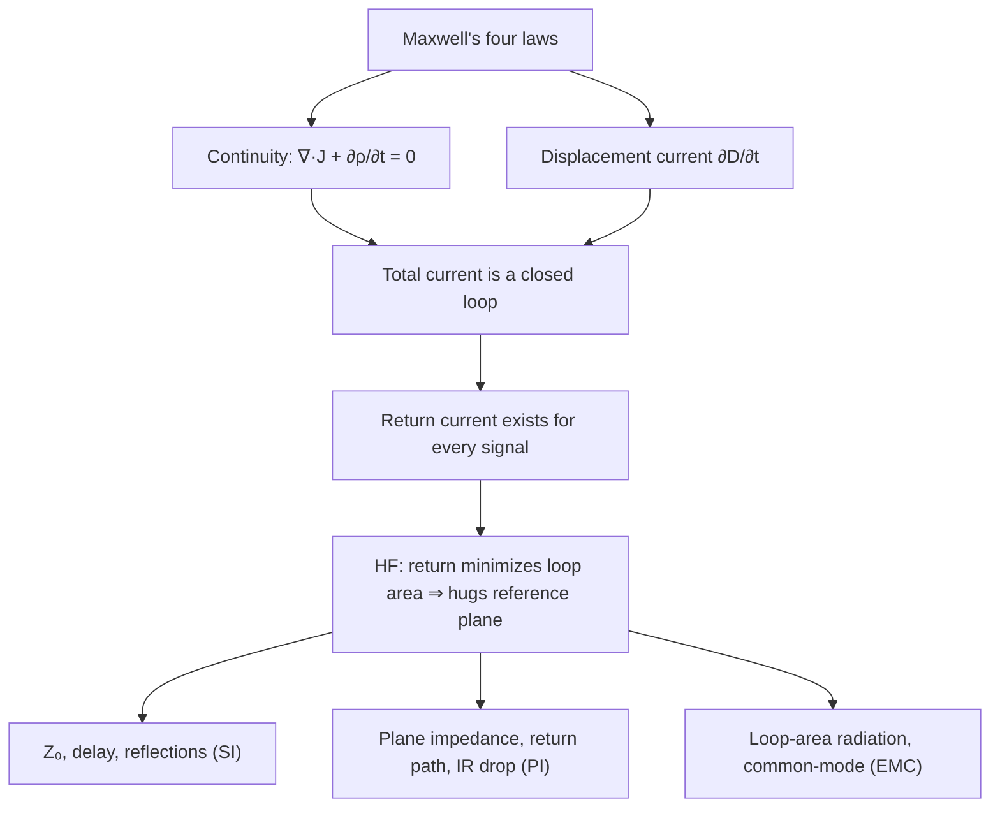
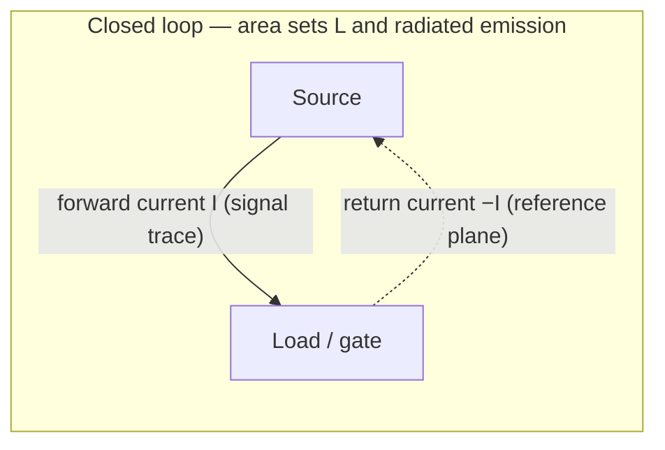

# Maxwell's Equations

**Summary.** Maxwell's equations are the four coupled field laws — plus the charge-continuity equation they imply — that govern every electric and magnetic field, and therefore every voltage, current, signal, and radiated emission on a printed circuit board. They belong in the Engineering Science Layer because they are the *root axioms* from which Signal Integrity (SI), Power Integrity (PI), and Electromagnetic Compatibility (EMC) all derive: impedance, return current, crosstalk, plane resonance, and radiated emission are not independent rules of thumb but theorems of these equations under a board's geometry. The runtime never solves Maxwell's equations directly, yet it *silently assumes their consequences* every time it routes a [Net](../../docs/foundation/engineering-domain-model.md#net), assigns a [trace width](../../docs/state-machines/routing-planning.md), checks a clearance in [DRC](../../docs/state-machines/drc-verification.md), or flags an electrically-long track in [EMC Analysis](../../docs/state-machines/emc-analysis.md). This document states the laws precisely, derives the single most important runtime consequence — *return currents must exist, form closed loops, and follow the reference plane* — and maps each consequence to the EAK engine, IR, or verification rule that depends on it.

---

## Core principles

### The four laws

In SI units, with `E` the electric field, `B` the magnetic flux density, `D = εE` the electric displacement, `H = B/μ` the magnetic field, `ρ` the free charge density, and `J` the free current density, Maxwell's equations are:

```text
Differential (point) form              Integral (global) form              Name / physical statement
-----------------------------------    --------------------------------    ----------------------------------------
∇·D = ρ                                ∮_S D·dA = Q_enc                    Gauss's law: charge sources E-field flux
∇·B = 0                                ∮_S B·dA = 0                        Gauss for magnetism: no magnetic monopoles
∇×E = −∂B/∂t                           ∮_C E·dl = −dΦ_B/dt                 Faraday: changing B induces a circulating E
∇×H = J + ∂D/∂t                        ∮_C H·dl = I_enc + dΦ_D/dt          Ampère–Maxwell: current AND changing E source H
```

The constitutive relations `D = εE`, `B = μH`, and Ohm's law in field form `J = σE` close the system inside materials (the copper, dielectric, and air of a board). See [Ohm's law](../electrical/ohms-law.md) for the lumped consequence of `J = σE`.

### Continuity: charge is conserved (and why this is the load-bearing law)

Take the divergence of the Ampère–Maxwell law. Because the divergence of any curl is identically zero (`∇·(∇×H) = 0`):

```text
0 = ∇·J + ∂(∇·D)/∂t = ∇·J + ∂ρ/∂t
⇒  ∇·J + ∂ρ/∂t = 0          (continuity equation, charge conservation)
```

This is not an extra postulate — it is *forced* by the displacement-current term `∂D/∂t`. Maxwell added that term precisely so the equations would not contradict charge conservation. The continuity equation is the field-theoretic parent of **Kirchhoff's Current Law**: in the quasi-static limit where `∂ρ/∂t ≈ 0` at a node, `∇·J = 0` means the currents into any node sum to zero. Current cannot begin or end in space; it can only circulate.

### Displacement current closes every loop

Define the **total current** as conduction plus displacement: `J_total = J + ∂D/∂t`. Continuity is equivalent to the statement

```text
∇·J_total = 0      ⇒   total current is solenoidal (divergence-free) ⇒  it forms closed loops, always.
```

Where copper carries `J`, the loop closes through conduction. Where there is no copper — across a capacitor's dielectric, across the gap between a trace and the plane beneath it, across a series capacitor or an IC's die — the loop closes through **displacement current** `∂D/∂t`. There is no such thing as a current that "stops." This single fact is the reason a high-frequency signal that *appears* to dead-end into a high-impedance gate input still draws a real, traceable return current: it flows as displacement current through the parasitic capacitance back to the source.

### Why every signal is a loop

A "signal" is energy transported by the electromagnetic field in the space *between* a forward conductor and its return conductor. By continuity, the forward current `I` on the signal trace is matched, at every frequency, by an equal and opposite return current `−I` somewhere. The pair is a loop. The energy does not travel *inside* the copper; it travels in the dielectric, guided by the conductors, with power density given by the Poynting vector `S = E × H`. The copper merely steers the fields. Two geometric quantities of that loop govern everything downstream:

```text
Loop self-inductance     L  ≈  (μ · enclosed loop area) / length      (smaller area ⇒ smaller L)
Distributed capacitance  C  ≈  (ε · conductor overlap) / separation
Characteristic impedance Z₀ =  √(L/C)        Propagation delay  t_pd = √(L·C)
```

### Return current follows the reference plane — derived, not asserted

Consider a signal trace at height `h` above a solid return plane (a microstrip). The return current is free to spread anywhere in the plane. Which path does it take? The system minimizes stored energy, i.e. minimizes loop inductance `L`, i.e. minimizes the *enclosed magnetic flux* `Φ_B` — a direct command of Faraday's and Ampère's laws. Minimizing enclosed area pulls the return current directly under the trace. Solving Maxwell's equations for the plane current density gives a Lorentzian distribution:

```text
J_return(x) = (I / (π·h)) · 1 / (1 + (x/h)²)
```

where `x` is lateral distance from the point under the trace. Roughly **80 % of the return current flows within ±3h** of the trace footprint, and it concentrates more tightly as frequency rises (skin effect plus the `∂D/∂t` coupling). The crucial design corollaries:

- **At DC / low frequency** the plane current spreads broadly to minimize *resistance* (`J = σE` dominates).
- **At high frequency** it hugs the trace to minimize *inductance* (`∂B/∂t` dominates). The crossover is near `f = R/(2πL)`, typically a few kHz to tens of kHz for board geometries — so for essentially any digital edge, the return rides directly beneath the signal.


*Figure: the derivation chain from the field axioms to the three board-level disciplines the runtime gates on.*

### Boundary conditions, skin effect, and where current actually flows

Maxwell's equations are incomplete without the **boundary conditions** they impose at a material interface — and on a PCB the copper/dielectric interface is where the engineering lives. Integrating the laws across a surface gives:

```text
n̂ · (D₁ − D₂) = ρ_s     tangential E is continuous:  n̂ × (E₁ − E₂) = 0
n̂ · (B₁ − B₂) = 0       tangential H jumps by surface current:  n̂ × (H₁ − H₂) = J_s
```

Inside a good conductor the field decays exponentially over the **skin depth** `δ = √(2 / (ω·μ·σ))`. Two consequences the runtime depends on:

- At high frequency current is a **surface current** on the side of the conductor facing the field — for a microstrip, on the *bottom* of the trace and the *top* of the plane, facing each other. This is why the return current can be so sharply localized under the trace, and why effective resistance rises with `√f` (the conductor's `R(f)` term in `Z₀`).
- Because tangential `E` is continuous and `J = σE`, the copper cannot support a large tangential field; it *guides* the wave that actually propagates in the dielectric. The conductor's job is to enforce boundary conditions, not to carry the energy.

### Electrically short vs electrically long: the quasi-static boundary

Whether lumped circuit intuition (Kirchhoff) or full-wave behavior (reflections, radiation) applies depends on the conductor length relative to the wavelength `λ = c / (f·√ε_eff)` of the highest significant frequency. The practical boundary the industry — and the runtime — uses is `λ/10`:

```text
λ        = c / f                      (free-space wavelength)
λ/10     = c / (10·f)                 (electrically-long threshold)
Example:  f = 100 MHz  ⇒  λ ≈ 3 m  ⇒  λ/10 ≈ 300 mm
          f = 1 GHz    ⇒  λ ≈ 0.3 m ⇒  λ/10 ≈ 30 mm
```

Below `λ/10` a conductor is *electrically short*: voltage is approximately uniform along it and lumped models hold. At or above it, phase varies along the conductor, the structure radiates and reflects, and it must be treated as a transmission line and a potential antenna. The free-space `c` is a deliberately lenient bound — including the dielectric velocity factor (`√ε_eff > 1`) only *shortens* `λ` and tightens the limit, so a free-space check never falsely passes a long trace. This `c/(10·f)` expression is exactly the closed form the runtime's `EmcAntennaLengthRule` evaluates.


*Figure: a signal is the loop, not the wire; the enclosed area governs inductance, impedance, and emission.*

### The root from which SI, PI, and EMC derive

- **Signal Integrity** is the Faraday/Ampère wave equation `∇²E = με ∂²E/∂t²` applied to the conductor loop: propagation delay, characteristic impedance `Z₀ = √(L/C)`, reflections at impedance discontinuities, and inter-loop coupling (crosstalk) via mutual `L`/`C`.
- **Power Integrity** is Gauss's + Ampère's laws applied to the power/ground planes: the plane pair is a parallel-plate capacitor and a 2-D transmission line; transient load current pulls return through it, producing `V = L·di/dt` rail collapse and plane resonances.
- **EMC** is the radiation solution of Maxwell's equations: a current loop of area `A` carrying current `I` at frequency `f` radiates as a small magnetic-dipole antenna with field `∝ A·f²·I`. Minimizing loop area (keeping the return tight under the signal) is the single most effective emission control. An *open* conductor of length near `λ/4` becomes an efficient electric-dipole antenna — the basis of the runtime's electrically-long-track rule.

---

## Why it matters for electronics & PCB design

Every PCB design failure in the SI/PI/EMC family is a Maxwell-equation consequence that the layout violated:

- A trace routed over a **gap or split in the reference plane** forces the return current to detour around the gap. The loop area balloons, `L` rises, `Z₀` shifts, the edge slows, and the enlarged loop radiates — a textbook EMC failure traceable to one geometric choice.
- A **fast edge** has a wide spectrum; the `∂D/∂t` term means even a "static" net carries displacement return current through parasitic capacitance. Ignoring it under-predicts coupling.
- **Crosstalk** between two traces is the mutual `L` and `C` of their overlapping field loops — pure Ampère/Gauss — and is why DRC clearance rules exist.
- **Rail collapse** under a switching load is `L·di/dt` on the power-return loop — pure continuity plus inductance — and is why power and ground need low-impedance plane pairs and why a regulator's input and output are *different* loops.

Because these are theorems, not heuristics, a runtime that respects the geometry the equations care about (continuous return reference, controlled loop area, frequency-aware impedance) is *correct by construction*; one that treats a net as a mere abstract connection list is electromagnetically blind.

---

## Mapping to the runtime

This is the point of the layer: the equations above are *implemented assumptions* of specific EAK artifacts. Where the runtime would silently produce an electromagnetically wrong board if the principle were ignored, that is an engineering bug.

| Maxwell consequence | Runtime artifact that embodies / depends on it | Why violating it is a runtime bug |
|---|---|---|
| Every signal is a closed loop (continuity) | [Routing Planning](../../docs/state-machines/routing-planning.md) realizes a [Net](../../docs/foundation/engineering-domain-model.md#net) as [Tracks](../../docs/foundation/engineering-domain-model.md#track--routing) enriching the [PCB IR](../../docs/compiler/ir/pcb-ir.md) | The net graph models the *forward* conductor; the return path is implied by the stack-up reference plane. If routing optimizes only forward topology, it can produce a graph-valid net whose return loop is broken — valid in the IR, wrong in physics. |
| `Z₀ = √(L/C)` is set by trace+plane geometry | [Per-net-class trace widths](../../docs/state-machines/routing-planning.md) (Phase-3 increment 10) via the [Constraint Engine](../../docs/engineering/constraint-engine.md) net-class impedance/width constraints | A width chosen without reference to the geometry that sets `L/C` yields the wrong impedance; reflections and timing failures follow. Width is a Maxwell quantity, not a style preference. |
| Electrically-long open conductors radiate (`λ`-resonance from the wave equation) | `EmcAntennaLengthRule` (`emc-antenna-length`) in [EMC Analysis](../../docs/state-machines/emc-analysis.md), Phase 13, over the [Verification Engine](../../docs/engineering/verification-engine.md) analysis mode | The `λ/10 = c/(10·f)` threshold *is* the wavelength that drops out of Maxwell's equations at the design's highest stated [Frequency](../../docs/engineering/units-and-quantities.md). A track past it is an antenna. Reading the wrong frequency, or guessing a spectrum when none is stated, would mis-gate emissions. |
| Crosstalk = mutual `L`/`C` of adjacent field loops | Clearance / track-to-track rules in [DRC Verification](../../docs/state-machines/drc-verification.md), Phase 11 | Clearance enforces a minimum field separation. Allowing arbitrary spacing lets coupled loops violate SI margins; the geometric rule is a proxy for the field integral. |
| Distinct current loops must not share return impedance | The **regulator VIN/VOUT power-rail split** (Phase-3 increment 11) that separates the collapsed power rail into input and output [Nets](../../docs/foundation/engineering-domain-model.md#net) | Input ripple current and output load current are *different loops* (continuity). Merging them into one net shares return impedance, coupling switching noise onto the regulated rail — a real bug the split prevents. |
| Fields fringe and fire at the board edge | The **board-edge keep-out** DFM clearance ([DFM Verification](../../docs/state-machines/dfm-verification.md), increment 9, fabrication-sourced) | Copper run to the edge lets the loop's fringing fields radiate from the edge. The keep-out is partly a manufacturability margin and partly an edge-emission control rooted in the fringing-field solution. |
| Return path is a substrate, not an abstraction | The stack-up / reference-plane model in the [PCB IR](../../docs/compiler/ir/pcb-ir.md) read by DRC, DFM, and EMC | If the IR does not carry a continuous reference for each routed layer, downstream verification cannot reason about return loops at all — the equations have nothing to bind to. |
| Displacement current makes behavior frequency-dependent | [Units & quantities](../../docs/engineering/units-and-quantities.md) typing of `Frequency`-dimensioned requirement targets, consumed by the EMC rule | The runtime is *silent rather than guessing* when no frequency is stated — correct, because the return-tightening and radiation consequences are frequency-keyed. A made-up spectrum would fabricate violations. |
| Emission is routing-dominated | The orchestrator routes the EMC and DRC `Failed` terminals **back to [Routing Planning](../../docs/state-machines/routing-planning.md)** | Loop area and return path are decided in routing, so that is where an emissions or clearance failure must be corrected. Looping back elsewhere would treat a routing-caused field problem at the wrong phase. |

In short: [Routing Planning](../../docs/state-machines/routing-planning.md) is where loop geometry is set, the [Constraint Engine](../../docs/engineering/constraint-engine.md) holds the Maxwell-derived numeric limits (impedance, clearance, width), and the [Verification Engine](../../docs/engineering/verification-engine.md) (as DRC/EMC) checks that the realized geometry respects them. The [Planning Engine](../../docs/engineering/planning-engine.md) and [Learning Engine](../../docs/engineering/learning-engine.md) supply the reasoning and recalled defaults, but the *truth* they must respect is this physics.

---

## Failure modes if violated

- **Reference-plane discontinuity under a signal.** A trace crossing a plane split or void forces the return current to detour, inflating loop area → impedance shift, slower edges, and radiated emission. If the runtime's routing/DRC model lacks a continuous-reference invariant, it can ship this board as "passing." This is the single most common Maxwell-violating layout bug.
- **Net modeled as forward-only.** Treating a [Net](../../docs/foundation/engineering-domain-model.md#net) as an abstract connection list with no return-path obligation lets [Routing Planning](../../docs/state-machines/routing-planning.md) produce a topology that is graph-complete but loop-broken — passes net-realization validation, fails physics.
- **Frequency ignored / displacement current dropped.** Assuming return current follows the lowest-*resistance* broad path (DC intuition) instead of the lowest-*inductance* path beneath the trace mis-predicts impedance and coupling for every real digital edge.
- **Shared return impedance.** Failing to split distinct current loops (e.g. regulator VIN vs VOUT) lets `L·di/dt` from one loop appear as noise on another — the bug the [VIN/VOUT split](../../docs/state-machines/routing-planning.md) increment exists to prevent.
- **Open electrically-long conductor.** A stub or trace near `λ/4` at the operating frequency becomes an efficient antenna; if the EMC rule reads the wrong [Frequency](../../docs/engineering/units-and-quantities.md) or guesses one, it will either miss the antenna or fabricate a false violation.
- **Edge-fired radiation.** Copper poured to the board edge radiates fringing fields; absent the [edge keep-out](../../docs/state-machines/dfm-verification.md), emissions rise with no DRC/DFM trace explaining why.

Each of these is detectable in principle from the geometry the runtime already holds; the Engineering Science Layer exists so the rules that catch them are understood as Maxwell theorems, not arbitrary constants.

---

## Related documents

- [Ohm's law](../electrical/ohms-law.md) — the lumped, low-frequency face of `J = σE`; resistance, IR drop, and current density.
- [Transmission lines & impedance](../electrical/transmission-lines.md) — `Z₀ = √(L/C)`, reflections, and the wave equation specialized to board traces.
- [Electromagnetic compatibility fundamentals](../pcb/emi-emc.md) — loop-area radiation, common-mode current, and the `λ/10` antenna threshold in depth.
- [Numerical methods](../mathematics/numerical-methods.md) — how field equations are discretized when a board is solved (the math behind any future Simulation port).
- [Linear algebra](../mathematics/linear-algebra.md) — Maxwell's equations as linear operators; the basis of field solvers and network parameters.
- Runtime anchors: [Routing Planning](../../docs/state-machines/routing-planning.md) · [DRC Verification](../../docs/state-machines/drc-verification.md) · [EMC Analysis](../../docs/state-machines/emc-analysis.md) · [Constraint Engine](../../docs/engineering/constraint-engine.md) · [Verification Engine](../../docs/engineering/verification-engine.md) · [PCB IR](../../docs/compiler/ir/pcb-ir.md) · [Units & quantities](../../docs/engineering/units-and-quantities.md) · [GLOSSARY](../../docs/GLOSSARY.md).
