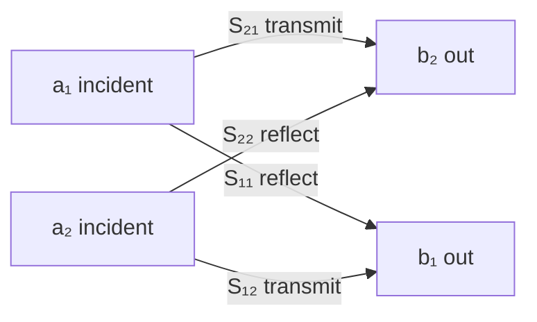
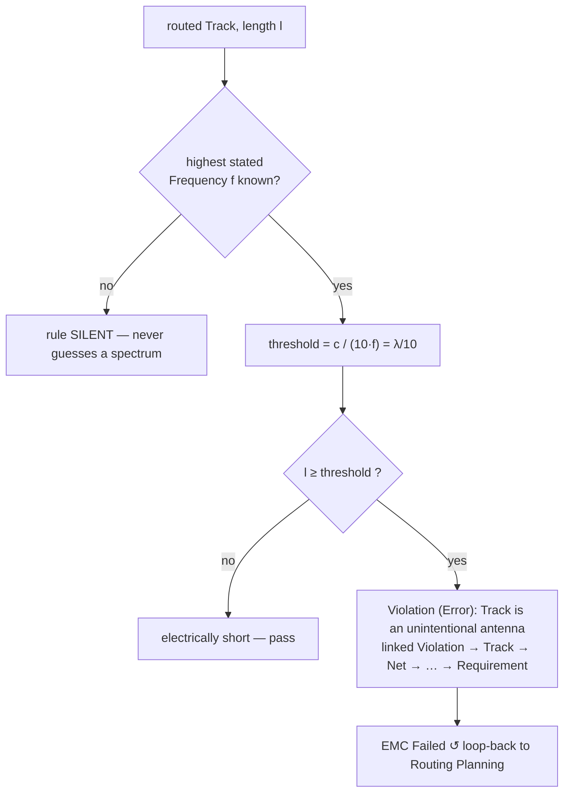

# RF Physics

**Summary.** This document covers the high-frequency behaviour of copper interconnect: the moment a piece of metal stops being a wire and starts being a *transmission line* or an *antenna*. It is the theory behind one short engineering question the runtime asks of every routed net — *"is this conductor electrically long at the design's highest frequency?"* — and the family of consequences that follow (characteristic impedance, reflections, VSWR, matching, scattering parameters, and resonance). It belongs in the Engineering Science Layer because the [EMC Analysis](../../docs/state-machines/emc-analysis.md) phase ships a *deterministic, closed-form* proxy for radiated emission — the `EmcAntennaLengthRule` (`emc-antenna-length`) with its `c / (10·f)` threshold — and that single inequality is a direct quotation of the electrically-long / unintentional-antenna criterion derived below. It also grounds why the [PCB IR](../../docs/compiler/ir/pcb-ir.md) stack-up must carry the dielectric parameters that fix impedance, and why [per-net-class trace widths](../../docs/state-machines/routing-planning.md) and the [regulator VIN/VOUT rail split](../../docs/state-machines/dfm-verification.md) are RF decisions wearing DC clothing. Where this document needs the underlying field laws it defers to [`maxwell-equations.md`](maxwell-equations.md) and [`electromagnetics.md`](electromagnetics.md); here we work one level up, in the language of waves on lines.

## Core principles

### 1. Wavelength, propagation velocity, and electrical length

A signal is not instantaneous along a conductor; it propagates at a finite velocity, so the voltage at the far end lags the near end. The *wavelength* is the distance one cycle of a sinusoid occupies on the line:

```
λ = v / f ,        v = c / √εᵣ_eff
```

`v` is the phase velocity, `c ≈ 2.998×10⁸ m/s` is the free-space speed of light, and `εᵣ_eff` is the *effective* relative permittivity the field sees. For a buried stripline `εᵣ_eff ≈ εᵣ` of the laminate (≈ 4.3 for FR-4); for a microstrip the field is partly in air, so `εᵣ_eff` is lower (≈ 3.0–3.3). On FR-4 stripline a 1 GHz signal has `λ ≈ 14.5 cm`; a 100 MHz signal, `λ ≈ 1.45 m`.

A conductor is **electrically short** — and may be modelled as a single lumped node — only while every point on it is at effectively the same instantaneous potential. The standard threshold is:

```
electrically short   :  l ≪ λ/10        (lumped node — a "wire")
electrically long    :  l ≳ λ/10        (distributed — a transmission line / radiator)
```

The `λ/10` figure is the engineering rounding of "the phase difference end-to-end stays below ~36°, so reflections and radiation are second-order." Stricter design (high-speed digital, RF) uses `λ/20`. The equivalent **time-domain** criterion uses edge rate, not frequency: a net must be treated as distributed once the one-way flight time exceeds roughly a sixth of the signal's rise time, `t_flight ≳ t_r / 6`. The two are consistent because a rising edge's significant spectral content extends to roughly `f_knee ≈ 0.35 / t_r`. This one threshold is the hinge of the whole document: below it, the net is Ohm's-law copper; above it, everything in §2–§7 turns on.

> **Runtime note.** The shipped `EmcAntennaLengthRule` uses exactly `λ/10 = c / (10·f)` and deliberately uses *free-space* `c` (not `c/√εᵣ_eff`). This is the *lenient* choice: dividing by `√εᵣ_eff` would shorten `λ`, lower the threshold length, and flag *more* tracks. Using free-space `c` is therefore a conservative-for-the-tool, permissive-for-the-design first-order model whose only refinement direction is to tighten — a documented scope boundary, not an error.

### 2. Characteristic impedance

A transmission line is a ladder of distributed series inductance/resistance and shunt capacitance/conductance per unit length (`L`, `R`, `C`, `G`). Its **characteristic impedance** — the ratio of voltage to current of a single travelling wave, independent of line length — is:

```
Z₀ = √( (R + jωL) / (G + jωC) )        (general)
Z₀ ≈ √( L / C )                        (low-loss / high-frequency limit, real)
v  = 1 / √(L·C) = c / √εᵣ_eff          (phase velocity, same v as §1)
```

In the low-loss limit `Z₀` is a real number set purely by the *geometry and dielectric*: trace width and thickness, dielectric height to the reference plane, and `εᵣ`. Widening the trace raises `C` and lowers `Z₀`; moving the reference plane away raises `L` and `Z₀`. Typical targets: 50 Ω single-ended, 90/100 Ω differential. `Z₀` is a property the runtime can only *hit* if the stack-up parameters that determine it are present in the IR — which is precisely why they are first-class fields of the [Board / Layer Stack](../../docs/foundation/engineering-domain-model.md#board--layer-stack).

### 3. The terminated line: reflection, return loss, and VSWR

When a wave of impedance `Z₀` meets a load `Z_L ≠ Z₀`, part of it reflects. The **reflection coefficient** is:

```
Γ = (Z_L − Z₀) / (Z_L + Z₀)            (|Γ| ∈ [0, 1] for passive loads)
Return Loss  RL = −20·log₁₀|Γ|  (dB)   (larger dB = less reflection)
VSWR = (1 + |Γ|) / (1 − |Γ|)            (∈ [1, ∞))
```

- **Matched** (`Z_L = Z₀`): `Γ = 0`, `VSWR = 1`, `RL = ∞`. All energy delivered; no standing wave.
- **Open / short** (`Z_L = ∞` or `0`): `|Γ| = 1`, `VSWR = ∞`, `RL = 0 dB`. Full reflection; a pure standing wave.

The reflected wave superimposes on the incident one to form a standing wave whose peak/trough ratio *is* the VSWR. On a digital net this is *ringing* and *overshoot*; on an RF net it is lost power and mistuned circuits. VSWR is the single scalar that tells an engineer how badly a port is mismatched.

### 4. S-parameters

At low frequency we characterise a network by voltages and currents (Z, Y, H matrices). At RF, open/short reference standards are unstable and probe parasitics dominate, so we instead characterise it by *travelling waves* terminated in a known reference impedance `Z₀`. Define the normalised incident/reflected waves at each port:

```
aᵢ = (Vᵢ + Z₀·Iᵢ) / (2·√Z₀)     (wave INTO port i)
bᵢ = (Vᵢ − Z₀·Iᵢ) / (2·√Z₀)     (wave OUT of port i)
b = S · a                        (scattering matrix S relates them)
```

For a two-port, with the unused port terminated in `Z₀` (so its `a = 0`):

```
S₁₁ = b₁/a₁  — input reflection  (= Γ at port 1; this is what VSWR/return loss measure)
S₂₁ = b₂/a₁  — forward transmission (insertion loss / gain): |S₂₁| in dB
S₁₂ = b₁/a₂  — reverse transmission (isolation)
S₂₂ = b₂/a₂  — output reflection
```

A reciprocal passive network has `S₁₂ = S₂₁`; a lossless one has a unitary `S`. S-parameters are the native currency of every signal-integrity (SI) and EMC field solver: an extracted interconnect *is* an S-matrix, channel insertion loss is `|S₂₁|`, and a connector's match is `|S₁₁|`. The full S-parameter / [Analysis Result](../../docs/foundation/engineering-domain-model.md#analysis-result) path is the documented (currently deferred) external-[Simulation port](../../docs/core/contracts.md) target of [EMC Analysis](../../docs/state-machines/emc-analysis.md); the shipped deterministic gate is the closed-form proxy of §6.


*Figure: a two-port scattering network — every interconnect the runtime routes is, to a field solver, exactly this S-matrix.*

### 5. Matching and maximum power transfer

There are two distinct, often-conflated reasons to match impedances:

1. **Reflectionless match** (`Z_L = Z₀`): kills the standing wave and reflections — the SI/EMC motive.
2. **Conjugate match** (`Z_source = Z_load*`): delivers maximum power into the load — the power/antenna motive.

A *matching network* transforms one impedance to another using lossless reactances so both ends see what they want. Common forms: the **L-network** (two reactances, transforms one real impedance to another), the **quarter-wave transformer** (`Z_t = √(Z₀·Z_L)`, a `λ/4` line that inverts impedance), and **stub matching** (an open/short stub whose reactance cancels the load's). The point for a runtime is that matching is *geometry and value selection under a frequency*: it can only be planned if the design's operating frequency and the net's `Z₀` are known quantities.

### 6. Unintentional antennas — the antenna-length EMC rule

Any conductor radiates; the question is *how efficiently*. Radiation efficiency rises sharply as a structure's length approaches a resonant fraction of `λ`:

```
quarter-wave monopole  : l ≈ λ/4   (strong resonant radiator)
half-wave dipole       : l ≈ λ/2   (strong resonant radiator)
loop antenna           : circumference ≈ λ
"electrically long"    : l ≳ λ/10  (radiation is no longer negligible)
```

A short conductor's radiation resistance scales as `(l/λ)²`, so below `λ/10` it couples little energy to free space — but at and beyond `λ/10` an *unintentional* conductor (a long trace, a cable pigtail, a seam in a shield, a slot in a plane) becomes an effective antenna driven by whatever noise sits on it. Two emission families matter:

- **Differential-mode** (the signal/return loop): radiated field `∝ f²·A_loop·I` — small loop, fixable by tightening loop area (see [`electromagnetics.md`](electromagnetics.md) §5).
- **Common-mode** (a long conductor carrying in-phase current against ground): field `∝ f·l·I_cm` — the *dominant real-world emitter*, and the one a length test catches, because it scales with conductor length `l`.

The `EmcAntennaLengthRule` is the closed-form encoding of this principle: a routed `Track` longer than `c / (10·f)` at the design's **highest stated operating/emission frequency** is flagged as a blocking emission risk. It is deliberately *one* inequality over geometry, not a field solve — a deterministic proxy that catches the dominant mechanism without an external simulator.


*Figure: the shipped `EmcAntennaLengthRule` decision — the §1 electrical-length threshold and the §6 antenna criterion are the same inequality.*

### 7. Resonance

Resonance is where reactive energy oscillates between electric and magnetic stores with no net dissipation, producing a sharp impedance extremum. It is the mechanism behind both intended tuning and unintended EMC disasters:

```
lumped LC          : f₀ = 1 / (2π·√(L·C))
quarter-wave stub  : open stub of length λ/4 looks like a SHORT at f (and vice-versa)
plane-pair cavity  : f_mn = (c / (2·√εᵣ)) · √((m/a)² + (n/b)²)   for plane dimensions a×b
slot / aperture    : resonates strongly at l ≈ λ/2
```

Consequences the runtime must respect: a power/ground **plane pair** is a resonant cavity that amplifies emission at `f_mn`; a **decoupling network** has an *anti-resonance* between a capacitor's ESL and the plane capacitance where PDN impedance peaks; an open **stub** on a high-speed net resonates and notches the channel; a **slot** in a reference plane radiates at `λ/2`. Every one of these is geometry meeting frequency — the same two inputs the electrical-length test needs.

## Why it matters for electronics & PCB design

A board that is functionally perfect at DC can fail completely at frequency. The three classic failure surfaces are all in this document:

- **Signal integrity.** An electrically-long net routed as a wire (no controlled `Z₀`, unterminated) rings, overshoots, and violates timing. The fix is §2–§5: target a `Z₀`, terminate to it, keep VSWR near 1.
- **Power integrity.** A PDN with an anti-resonance (§7) presents high impedance at exactly the frequency the load draws transient current, collapsing the rail. The fix is decoupling that flattens PDN impedance.
- **EMC / radiated emissions.** A long common-mode conductor or a resonant slot (§6–§7) radiates and fails a regulatory limit ([standards-and-compliance](../../docs/engineering/standards-and-compliance.md)) with *no schematic-level cause* — the most expensive class of defect because it appears only at compliance testing. The fix is geometric and is owned by routing.

The unifying lesson: above `λ/10`, length and shape are electrical parameters. A runtime that reasons about nets purely as connectivity is blind to all three surfaces.

## Mapping to the runtime

This is the load-bearing section. Each RF principle is embodied by a concrete EAK artifact, and violating the principle is a specific, locatable runtime bug.

- **Electrical-length / antenna threshold ↔ the shipped `EmcAntennaLengthRule` (`emc-antenna-length`).** §1 and §6 *are* this rule. [EMC Analysis](../../docs/state-machines/emc-analysis.md) (Phase 13, increment 6) runs a [Verification Engine](../../docs/engineering/verification-engine.md) rule set over the routed [PCB IR](../../docs/compiler/ir/pcb-ir.md); the rule reads the largest `Frequency`-dimensioned requirement target, computes `c / (10·f)`, and flags any longer `Track` as a blocking [Violation](../../docs/foundation/engineering-domain-model.md#violation) linked to the implicated `Track` (so it is traceable `Violation → Track → Net → … → Requirement → Intent`). Absent any stated frequency the rule is **silent**, never guessing a spectrum — the runtime's refusal to fabricate a limit. Its `Failed` terminal loops back to [Routing Planning](../../docs/state-machines/routing-planning.md), because the only fix is geometric (shorten the net, segment it, change layer). Were this threshold computed wrong — say, using a *lumped* model with no `f` dependence — the runtime would ship boards that radiate; the inequality in §1/§6 is therefore a correctness contract.

- **Frequency dimension is read, not assumed ↔ [units-and-quantities](../../docs/engineering/units-and-quantities.md).** The rule keys off a `Frequency`-dimensioned [Physical Quantity](../../docs/engineering/units-and-quantities.md), a *different dimension* than the trace-width rule's length floor, so the two never contend for the same requirement target. Typed quantities are what make "the design's highest frequency" a machine-resolvable fact rather than a comment.

- **Characteristic impedance `Z₀` ↔ Routing Planning + the PCB IR stack-up.** §2 says `Z₀ = √(L/C)` is fixed by width, dielectric height, and `εᵣ`. The [Board / Layer Stack](../../docs/foundation/engineering-domain-model.md#board--layer-stack) in the [PCB IR](../../docs/compiler/ir/pcb-ir.md) carries those dielectric parameters; [Routing Planning](../../docs/state-machines/routing-planning.md) must route a controlled-impedance net at the width/spacing that hits its target `Z₀`, and its `ValidatingRouting` width/clearance pre-check is the discrete guard. A [transformation](../../docs/compiler/transformations.md) that lowered the IR while dropping `εᵣ`/thickness would make `Z₀` uncomputable — an RF-physics bug masquerading as a missing field.

- **Per-net-class width ↔ controlled impedance and current capacity (increment 10).** §2 (impedance) and skin-effect AC resistance (see [`electromagnetics.md`](electromagnetics.md) §6) are *why a net's class sets its minimum width*. The [per-net-class trace widths](../../docs/state-machines/routing-planning.md) remove grid edges too narrow for the class from the routing feasible set and are re-checked in [DFM](../../docs/state-machines/dfm-verification.md). A high-speed class is narrowed/spaced for `Z₀`; a power class is widened for current — both are frequency-aware width decisions, not cosmetic defaults.

- **VSWR / matching / S-parameters ↔ deferred external Simulation port, with a deterministic proxy today.** §3–§5 (full reflection/match/S-matrix interpretation with margins, confidence, and HITL disposition) are the documented target of [EMC Analysis](../../docs/state-machines/emc-analysis.md) over the [Simulation port](../../docs/core/contracts.md), and are **deferred** (reasoning/external-tool-driven, like Datasheet Intelligence). The shipped board does *not* fabricate an S-parameter result it cannot compute; it ships the closed-form §6 antenna proxy instead. This is the [Verification Engine](../../docs/engineering/verification-engine.md) policy — a design is never *falsely passed* on absent analysis — applied to RF: when the solver is unavailable, EMC goes `Failed`/indeterminate rather than green.

- **Resonance / common-impedance coupling ↔ the regulator VIN/VOUT rail split (increment 11).** §7 anti-resonance and shared-conductor coupling are the physics behind [splitting the collapsed regulator VIN/VOUT rail](../../docs/state-machines/dfm-verification.md): VIN and VOUT are distinct nets at distinct potentials whose switching-node loop is a §6 aggressor; collapsing them into one conductor lets the conductor's finite impedance couple switching noise from VIN to VOUT (a resonant PDN path). Keeping the rails separate, each with local decoupling, is RF-domain isolation.

- **Edge-fired / slot radiation ↔ the board-edge keep-out (DFM increment 9).** §6's resonant-slot and §7's edge-radiation mechanisms are why copper must not sit at the board edge. The fabrication-sourced [board-edge clearance keep-out](../../docs/state-machines/dfm-verification.md) deletes near-edge routing (graph-theoretically, near-edge grid vertices), pulling fringing fields back inside the stack-up, and the [Manufacturing Generation](../../docs/state-machines/manufacturing-generation.md) gate confirms the forbidden band is empty. Its RF payoff is suppressing edge emission.

- **The loop-back economy ↔ [workflow orchestration](../../docs/core/workflow-orchestration.md).** Because an antenna/impedance defect is geometric, EMC's `Failed` is routed back to [Routing Planning](../../docs/state-machines/routing-planning.md), not to schematic or placement — the orchestrator encodes the physical fact that *emission is routing-dominated*. A workflow plan that looped an EMC antenna failure back to component selection would be chasing the wrong variable.

## Failure modes if violated

- **Electrically-long net treated as lumped.** Skip §1 and a fast net is routed as a wire: reflections, ringing, and timing failures a transmission-line model would have predicted. In the runtime, this is the `EmcAntennaLengthRule` firing late instead of being designed out early.
- **Impedance discontinuity / mismatch.** Ignore §2–§3 and `Z_L ≠ Z₀` gives `VSWR > 1`: standing waves, overshoot, and lost power. A connector or stub left unmatched shows up as poor `|S₁₁|`.
- **Unintentional antenna.** Ignore §6 and a `l ≳ λ/10` conductor radiates `∝ f·l·I_cm` (common-mode) — the board fails radiated-emission limits at compliance with no schematic cause, and loops back to [Routing Planning](../../docs/state-machines/routing-planning.md) repeatedly until the geometry changes.
- **Resonance left in the structure.** Ignore §7 and a plane cavity, PDN anti-resonance, slot, or open stub peaks at a working frequency — emission spikes, rails collapse, or a channel notches out.
- **Common-impedance coupling on a shared rail.** Collapse VIN and VOUT (§7) and switching noise couples through the shared `Z` — the exact defect the regulator rail-split increment prevents.
- **Fabricating an RF result.** Returning a confident S-parameter/VSWR pass with no solver (violating §4's honesty) would let an emitting board through — which is why the deferred path is *deferred*, not stubbed with a fake green.

## Related documents

- [`maxwell-equations.md`](maxwell-equations.md) — the source laws (the quasi-static-vs-wave boundary this document builds the `λ/10` threshold on).
- [`electromagnetics.md`](electromagnetics.md) — fields on copper: near/far field, loop-area emission, skin effect, and dielectric loss that this document's wave view assumes.
- [`../electrical/ohms-law.md`](../electrical/ohms-law.md) — the DC/lumped regime that holds *below* the electrically-long threshold and that this document supersedes above it.
- [`../mathematics/graph-theory.md`](../mathematics/graph-theory.md) — the routing-grid and plane cut-set model in which "delete near-edge vertices" and "remove too-narrow edges" are expressed.
- [`../../docs/state-machines/emc-analysis.md`](../../docs/state-machines/emc-analysis.md) — the phase that ships `EmcAntennaLengthRule` and owns the deferred S-parameter/Simulation-port target.
- [`../../docs/state-machines/routing-planning.md`](../../docs/state-machines/routing-planning.md) · [`../../docs/state-machines/dfm-verification.md`](../../docs/state-machines/dfm-verification.md) · [`../../docs/state-machines/manufacturing-generation.md`](../../docs/state-machines/manufacturing-generation.md) — controlled-impedance routing, per-net-class widths, the VIN/VOUT split, and the edge keep-out / final gate.
- [`../../docs/compiler/ir/pcb-ir.md`](../../docs/compiler/ir/pcb-ir.md) · [`../../docs/foundation/engineering-domain-model.md`](../../docs/foundation/engineering-domain-model.md) — the stack-up (`εᵣ`, `tan δ`, thickness) and Net/Track/Violation entities the RF behaviour lives on.
- [`../../docs/engineering/constraint-engine.md`](../../docs/engineering/constraint-engine.md) · [`../../docs/engineering/verification-engine.md`](../../docs/engineering/verification-engine.md) — where impedance targets and emission limits become machine-checkable constraints and margins.
- [`../../docs/engineering/units-and-quantities.md`](../../docs/engineering/units-and-quantities.md) · [`../../docs/engineering/standards-and-compliance.md`](../../docs/engineering/standards-and-compliance.md) — the typed `Frequency`/`Length`/`Ω` quantities and the regulatory EMC limits the antenna rule defends.
