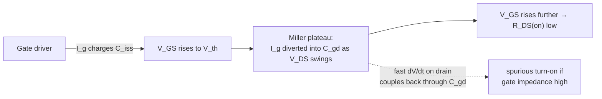
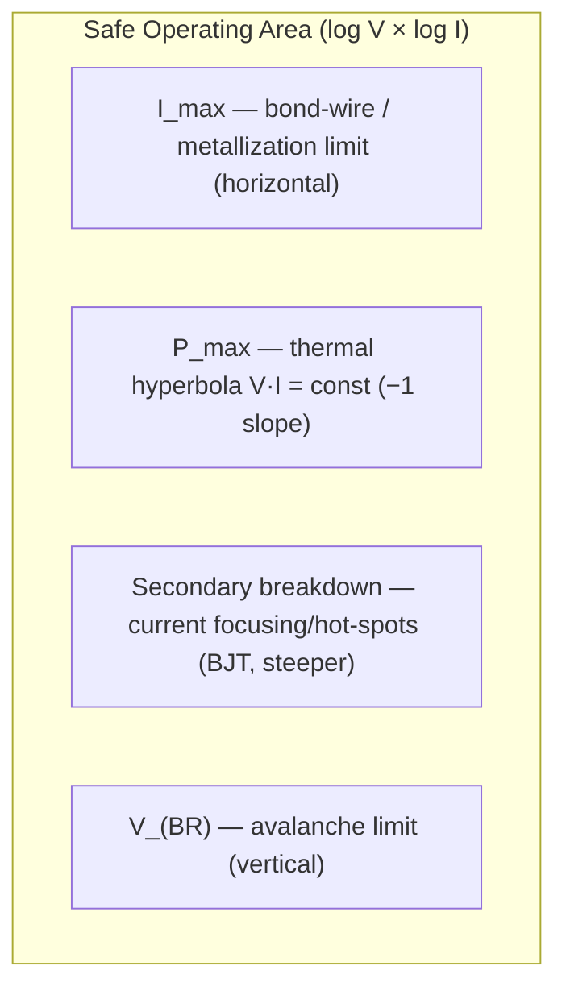

# Semiconductor Physics

**Summary.** Semiconductor physics is the device-level theory behind the symbols a schematic draws: a diode is a `pn` junction, a transistor is a controllable junction or channel, and a "capacitor" is a lossy, inductive two-terminal device, not the ideal `C` the symbol implies. It belongs in the Engineering Science Layer because the runtime manipulates *parts* — it selects them, constrains them, places them, and gates manufacturing on them — yet the symbol carries none of the physics that decides whether the part survives, switches cleanly, or stays cool. A MOSFET has a turn-on threshold, a gate that must be *driven* and not left floating, a Miller capacitance that fights its own switching, a Safe Operating Area outside which it is destroyed, and a junction temperature that can run away. This document grounds the absolute-maximum and recommended ratings that [Datasheet Intelligence](../../docs/state-machines/datasheet-intelligence.md) extracts, the pin electrical types and driver rules [ERC](../../docs/state-machines/erc-verification.md) checks, the decoupling/protection patterns the [Schematic Agent](../../docs/agents/schematic-agent.md) inserts, the derating the [units-and-quantities](../../docs/engineering/units-and-quantities.md) type system models, and the thermal limits the [Constraint Engine](../../docs/engineering/constraint-engine.md) enforces. When the runtime asserts "this part is within ratings," it is asserting a claim about carrier physics inside silicon. It is the device-level complement to the field theory in [electromagnetics](electromagnetics.md) and the DC laws in [Ohm's law](../electrical/ohms-law.md).

## Core principles

A vocabulary bridge first — each device parameter below names a runtime fact a part record must carry (typed per [`units-and-quantities.md`](../../docs/engineering/units-and-quantities.md)):

| Quantity | Symbol · unit | Device meaning |
|----------|---------------|----------------|
| Thermal voltage | `V_T = kT/q` · V | `≈ 25.85 mV` at 300 K; sets the exponential steepness of every junction |
| Threshold voltage | `V_th` · V | Gate-source voltage at which a MOSFET channel forms |
| On-resistance | `R_DS(on)` · Ω | Triode-region channel resistance of a MOSFET used as a switch |
| Gate/Miller charge | `Q_g`, `Q_gd` · C | Charge to switch a MOSFET; `Q_gd` sets the slow "Miller plateau" |
| Input/reverse capacitance | `C_iss`, `C_rss` · F | `C_iss = C_gs + C_gd`; `C_rss = C_gd` (the Miller cap) |
| Equivalent series R/L | `ESR` · Ω, `ESL` · H | A real capacitor's loss and lead/plate inductance |
| Junction-to-ambient resistance | `θ_JA` · °C/W | Steady-state temperature rise per watt dissipated |
| Absolute-maximum rating | `V_(BR)`, `I_max`, `T_j(max)` | The cliff edge; exceeding it destroys or degrades the part |

### 1. The pn junction and the diode

A `pn` junction is the contact between p-type silicon (mobile holes) and n-type silicon (mobile electrons). Diffusion of carriers across the metallurgical boundary leaves behind a charged **depletion region** and a **built-in potential** `V_bi` (`≈ 0.6–0.7 V` for silicon). Applying a forward voltage lowers this barrier exponentially; the current is the **Shockley diode equation**:

```
I = I_s · ( exp( V / (n·V_T) ) − 1 ),     V_T = kT/q ≈ 25.85 mV at 300 K
```

where `I_s` is the saturation current and `n` (≈1–2) the ideality factor. Two consequences are load-bearing for the runtime:

- **The forward drop is roughly constant and temperature-dependent.** Because current is exponential in `V`, a forward-conducting silicon junction sits near `0.6–0.7 V` over decades of current, and that drop falls about `−2 mV/°C`. This is why a diode is a *voltage reference and a heater*, not a resistor, and why the `−2 mV/°C` term reappears as a thermal-runaway driver in §8.
- **The junction is also a capacitor.** Reverse bias widens the depletion region, giving a voltage-dependent **junction capacitance** `C_j(V) = C_j0 / (1 − V/V_bi)^m` (m ≈ 0.3–0.5). Reverse breakdown at `V_(BR)` (avalanche or Zener) is an absolute-maximum limit; deliberately operated, it is a Zener/TVS clamp. Switching a diode off is not instantaneous — stored minority charge must be removed (**reverse-recovery charge `Q_rr`**), a real switching loss and EMI source.

### 2. The BJT — current-controlled

A bipolar junction transistor is two junctions sharing a thin base. In the **forward-active** region the base–emitter junction is forward biased and the base–collector reverse biased; collector current follows the same exponential law and the base current is a small fraction of it:

```
I_C = I_s · exp( V_BE / V_T ) ,     I_C = β · I_B     (β = current gain, ~50–300)
```

The operating regions are the runtime-relevant abstraction:

| Region | Condition | Behaviour |
|--------|-----------|-----------|
| Cut-off | `V_BE < V_(on)` | Off; only leakage flows |
| Forward-active | BE on, BC off | `I_C = β·I_B`; analog amplification, but *dissipative* |
| Saturation | both junctions on | Fully on; `V_CE(sat)` small — the "switch closed" state |

`β` varies with temperature, current, and part-to-part (often 3:1), so robust designs never *rely* on a precise `β`. As a switch, a BJT is driven hard into saturation; as a linear element it sits in the active region and dissipates `V_CE·I_C` — the regime where Safe Operating Area (§7) and secondary breakdown bite.

### 3. The MOSFET — voltage-controlled

A MOSFET conducts through a channel induced under the gate oxide when `V_GS` exceeds the threshold `V_th`. With no gate leakage at DC it is *charge-controlled*, which is why it dominates switching power and logic. Two operating regions matter:

```
Triode (V_DS < V_GS − V_th):     I_D ≈ µ·C_ox·(W/L)·[ (V_GS − V_th)·V_DS − V_DS²/2 ]
Saturation (V_DS ≥ V_GS − V_th): I_D ≈ ½·µ·C_ox·(W/L)·(V_GS − V_th)²·(1 + λ·V_DS)
```

For a **switch** the device is driven deep into triode, where it looks like the resistor `R_DS(on) = V_DS / I_D`; conduction loss is `I_D²·R_DS(on)`. `R_DS(on)` has a **positive temperature coefficient** (it roughly doubles from 25 °C to 125 °C), which is benign for paralleling (current self-balances) but is a derating the runtime must apply. For a **linear** element (a regulator pass device, a load switch ramping) the MOSFET sits in saturation and dissipates `V_DS·I_D` — again the SOA regime.

### 4. Device parasitics: the capacitances and the real capacitor

No symbol shows the parasitics, yet they govern switching and power integrity.

**MOSFET inter-electrode capacitances** `C_gs`, `C_gd`, `C_ds` are unavoidable (datasheets list `C_iss = C_gs + C_gd`, `C_oss = C_ds + C_gd`, `C_rss = C_gd`). The reverse capacitance `C_gd` is the troublemaker — the **Miller capacitance** — because it couples the swinging drain back into the gate. During a switching edge the gate driver must source/sink the charge to swing `V_DS` *through* `C_gd`, producing the flat **Miller plateau** in `V_GS` where the device transitions and dissipates most of its switching loss:

```
P_switching ≈ ½ · V_DS · I_D · (t_rise + t_fall) · f_sw      (overlap loss)
P_conduction ≈ I_D²(rms) · R_DS(on) · D                       (on-state loss)
```


*Figure: switching a MOSFET is a charge sequence dominated by the Miller capacitance `C_gd`.*

**A real capacitor is `C` in series with `ESR` and `ESL`.** Its impedance is

```
Z(f) = ESR + j·( 2π f · ESL − 1 / (2π f · C) ) ,   self-resonance at  f_SRF = 1 / (2π·√(ESL·C))
```

Below `f_SRF` the part is capacitive; **above `f_SRF` it is inductive** and a poorer bypass than a smaller capacitor. `ESL` is set by the package *and the mounting* (pads, vias, the loop to the plane), so a capacitor's value alone does not describe it. This is the device fact behind decoupling (§5) and behind the `ESR/ESL` parasitics named in [electromagnetics §8](electromagnetics.md).

### 5. Why decoupling is needed

A switching load draws current in fast steps. The power-delivery path from the regulator has inductance `L` (planes, vias, package), and inductance opposes change in current:

```
ΔV_droop = L · dI/dt
```

A 100 mA edge in 1 ns through even 1 nH is `0.1 V` of rail collapse — enough to corrupt logic and to push a CM current onto cables ([electromagnetics §9](electromagnetics.md)). **Decoupling capacitors are local charge reservoirs** that supply the transient `dI/dt` from *millimetres* away, so the high-`dI/dt` loop is tiny and the rail holds. The design target is a power-delivery-network impedance below

```
Z_target = ΔV_allowed / I_transient        (PDN must stay below this across frequency)
```

across the load's spectrum. Because each capacitor is only useful below its `f_SRF` (§4), a real PDN stacks bulk + ceramic + small high-frequency parts, and the **mounting inductance**, not the capacitance, sets the high-frequency floor — which is why decoupling caps must be placed *at the pin* with short vias, a placement constraint, not a schematic one.

### 6. The diode/transistor as a circuit element the runtime must respect

Three device truths drive electrical rules:

- **A gate/base must be driven to a known state.** A floating MOSFET gate is a high-impedance node that `C_gd` will charge during a `dV/dt` event and switch the device on uncommanded (the §4 spurious-turn-on path) — hence pull-down/gate resistors and "no floating inputs" are physics, not style.
- **Two outputs must not fight.** Two low-impedance drivers on one net (or a half-bridge whose high- and low-side both conduct, **shoot-through**) is a near-short limited only by `R_DS(on)` — a destructive current the §7 SOA never permits.
- **Junctions need protection.** ESD, inductive flyback, and reverse polarity all exceed `V_(BR)`; clamp/TVS/flyback diodes are inserted *because* §1 says the junction breaks down.

### 7. Safe Operating Area (SOA)

Every power device has a region in the `V_DS`–`I_D` (or `V_CE`–`I_C`) plane inside which it is guaranteed to survive. Its boundaries are four distinct physics limits:


*Figure: the SOA box is bounded by current, power/thermal, secondary-breakdown, and voltage limits — each a separate failure mode.*

- **`I_max`** — fusing of bond wires / metallization.
- **`P_max = V·I`** — the thermal hyperbola; staying under it keeps `T_j` (§8) in bounds. SOA is **time-dependent**: pulsed operation allows more because the die has thermal mass (`Z_th(t)` < `θ_JA`), so DC, 1 ms, 100 µs… curves nest outward.
- **Secondary breakdown** (BJTs especially) — local current focusing creates hot spots that thermally run away *below* the average `P_max`; this is why a BJT in the linear region is far more fragile than its power rating suggests.
- **`V_(BR)`** — avalanche.

Linear operation (a pass transistor, a hot-swap MOSFET, an inrush limiter) is the dangerous case: simultaneous high `V` and high `I` push the operating point toward the `P_max`/secondary-breakdown corner where margin is thinnest.

### 8. Junction temperature and thermal runaway

Power dissipated in the die raises the junction temperature above ambient:

```
T_j = T_a + P_dissipated · θ_JA          (steady state)
T_j(t) = T_a + P · Z_th(t)               (transient, Z_th → θ_JA as t → ∞)
```

`T_j(max)` (typically 150 °C / 175 °C) is an absolute-maximum rating; exceeding it degrades or destroys the part. `θ_JA` is **not** a fixed device property — it depends on the package *and the copper area, vias, and airflow around it*, so it is a layout outcome, not just a datasheet number.

**Thermal runaway** is positive feedback between temperature and dissipation. It is unstable when an increase in `T_j` raises dissipation faster than the heat path can shed it:

```
Runaway condition:   d(P_dissipated)/dT_j  >  1 / θ_JA
```

Three device mechanisms supply the `dP/dT_j > 0`:

- **BJT bias drift.** At fixed `V_BE`, `I_C` rises with temperature (the `−2 mV/°C` of §1 plus leakage), so `P = V_CE·I_C` rises with `T_j` → hotter → more `I_C`. Emitter degeneration breaks the loop.
- **Linear-MOSFET threshold drift.** `V_th` falls with temperature; in the linear region a hotter cell carries more current, focuses it, and runs away — the reason power-MOSFET *linear* SOA is derated hard even though `R_DS(on)`'s positive coefficient stabilizes the *switching* use.
- **Capacitor ESR self-heating.** Ripple current `I_rms²·ESR` heats an electrolytic; higher temperature raises `ESR`, raising heating — an ageing-and-failure runaway.

The stabilizing term is always the heat path `1/θ_JA`: better thermal design (copper, vias, spacing) is what keeps the inequality on the safe side.

## Why it matters for electronics & PCB design

- **The symbol omits the survival envelope.** A schematic shows a MOSFET, not its `V_(BR)`, `I_max`, SOA, or `T_j(max)`. Design correctness is *entirely* in those omitted numbers, so they must be made first-class data, not assumed.
- **Switching behaviour is set by parasitics.** `C_gd`, gate charge, and `R_DS(on)` decide loss, edge rate, EMI, and whether a device self-turns-on — none are on the schematic.
- **A capacitor is not `C`.** `ESR`/`ESL` and `f_SRF` decide whether a "decoupling cap" actually decouples; placement and mounting are part of the component.
- **Effective ≠ nominal.** Ceramic capacitance collapses under DC bias and temperature; `R_DS(on)` rises with heat; `β` drifts. Checking nominal values hides worst-case failures.
- **Temperature closes a feedback loop.** `θ_JA` lives in the layout, and the runaway inequality means a thermally-careless placement can destroy an electrically-correct design.

## Mapping to the runtime

This is the section that makes the device physics load-bearing. Each principle is embodied by a concrete EAK artifact.

- **Absolute-maximum / recommended ratings & SOA ↔ [Datasheet Intelligence](../../docs/state-machines/datasheet-intelligence.md) + [Engineering IR](../../docs/compiler/ir/engineering-ir.md).** The [Datasheet Agent](../../docs/agents/datasheet-agent.md) extracts exactly the §1–§8 numbers — "absolute-maximum and recommended ratings, pin map and pin electrical types, package/thermal data" — as typed [Physical Quantities](../../docs/foundation/engineering-domain-model.md#constraint) into the [Knowledge Graph](../../docs/knowledge/knowledge-graph.md) and enriches the [Engineering IR](../../docs/compiler/ir/engineering-ir.md). Those facts are the machine form of `V_(BR)`, `I_max`, `T_j(max)`, `θ_JA`, and the SOA box. A part record missing `θ_JA` cannot have its junction temperature checked — a §8 bug — so the extraction's completeness *is* device-physics coverage.

- **Pin electrical types & driver rules ↔ [ERC](../../docs/state-machines/erc-verification.md).** §6 is the physics under ERC's rule set: `EvaluatingRules` checks "output-driving-output, unconnected power, no-connect violations" via the [Verification Engine](../../docs/engineering/verification-engine.md). *Output-driving-output* is two §3 low-impedance drivers fighting (shoot-through current bounded only by `R_DS(on)`); *unconnected power / floating input* is the §6 undriven-gate hazard that `C_gd` turns into spurious conduction. These are not stylistic lint — each is a path to a destructive current.

- **Decoupling & protection patterns ↔ the [Schematic Agent](../../docs/agents/schematic-agent.md) + [schematic-planning](../../docs/state-machines/schematic-planning.md).** The agent "applies known-good patterns — decoupling caps, pull-ups/downs, ESD/protection, reference circuits." §5 is *why* a decoupling cap exists (the `L·dI/dt` reservoir), §1/§6 *why* a clamp/TVS/flyback diode exists (`V_(BR)`), and §6 *why* a pull-down sits on a gate. The runtime inserting these patterns is enacting this document; inserting them *without* the §4 `ESL`/placement reasoning produces a cap that does nothing above `f_SRF`.

- **Decoupling-near-pin & thermal zones ↔ [Placement](../../docs/agents/placement-agent.md) + the [Constraint Engine](../../docs/engineering/constraint-engine.md).** The Placement Agent honours "decoupling-near-pin" and "thermal spreading / thermal zones." §4–§5 make *near-pin* a hard requirement (mounting `ESL` sets the PDN's high-frequency floor), and §8 makes copper area a term in `θ_JA` — so a placement constraint is literally setting the thermal-runaway stability margin `1/θ_JA`.

- **Derating (effective ≠ nominal) ↔ [units-and-quantities](../../docs/engineering/units-and-quantities.md) / [ADR-0007](../../docs/decisions/0007-units-and-physical-quantity-type-system.md).** The type system models derating as "a ceramic capacitor loses capacitance under DC bias and temperature; a device must run below its absolute-maximum" — exactly §3 (`R_DS(on)` vs. temperature), §4 (DC-bias capacitance loss), §8 (run below `T_j(max)`). Because tolerance and derating are first-class, the [Constraint Engine](../../docs/engineering/constraint-engine.md) and [Verification Engine](../../docs/engineering/verification-engine.md) check against *effective* values, surfacing the "passes nominally, fails at worst case" device failures this physics predicts.

- **Voltage/current/thermal limits as constraints ↔ [Constraint Engine](../../docs/engineering/constraint-engine.md) + [Engineering Analysis](../../docs/state-machines/engineering-analysis.md).** Phase-2 architecture decomposition produces "electrical budgets (power/thermal/area)"; the [Planning Agent](../../docs/agents/planning-agent.md) derives "voltage/current limits, thermal limits." Those budgets are the §7 SOA and §8 thermal inequality made into bounds the [Constraint Engine](../../docs/engineering/constraint-engine.md) stores and checks; a part operated past them is an open error-severity [Violation](../../docs/foundation/engineering-domain-model.md#violation) that **blocks the manufacturing gate** in the [Verification Engine](../../docs/engineering/verification-engine.md).

- **The regulator VIN/VOUT rail split ↔ §3–§5, §7–§8.** The Phase-3 increment that **split the collapsed power rail (regulator VIN/VOUT)** is device physics in three ways: the regulator's pass/switch element is the §3/§7 device whose SOA and `θ_JA` must be respected; its switching node is a §4 high-`dV/dt`/`C_gd` aggressor; and the decoupling on *each* rail is the §5 charge reservoir that keeps the input and output `L·dI/dt` loops small and separate. Collapsing the rails would force input switching `dI/dt` to share VOUT's path — exactly the power-integrity defect §5 forbids.

- **Per-net-class trace widths ↔ §3/§8 current capacity (Phase-3 increment 10).** A power MOSFET's drain/source current must reach the device through copper sized for `I²R` heating; the per-net-class minimum width feeds the [Routing Planning](../../docs/state-machines/routing-planning.md) feasible edge set. The device link: §8's `P_dissipated` includes the interconnect, and a too-thin power trace adds series resistance and heat that the §8 budget never accounted for.

- **Device models & thermal/PI analysis ↔ the [Simulation port](../../docs/core/contracts.md).** SPICE (§1–§3 device equations), thermal (`T_j`, §8), and power-integrity (PDN impedance, §5) analyses enter through the [Simulation Interface](../../docs/integration/simulation-interface.md) as typed [Analysis Results](../../docs/foundation/engineering-domain-model.md#analysis-result) — the high-fidelity evaluation of this document's models, recorded as [Evidence](../../docs/foundation/engineering-domain-model.md#evidence) rather than computed in the kernel. [EMC Analysis](../../docs/state-machines/emc-analysis.md) consumes the §4/§5 "decoupling adequacy" and the switching-node `dV/dt` as an emission source (link to [electromagnetics §9](electromagnetics.md)).

## Failure modes if violated

- **Operate past an absolute-maximum.** Exceed `V_(BR)`, `I_max`, or `T_j(max)` (§1, §7, §8) and the part fails instantly or latently. The defence is the [Datasheet Intelligence](../../docs/state-machines/datasheet-intelligence.md) rating + [Constraint Engine](../../docs/engineering/constraint-engine.md) bound; a missing `θ_JA` or SOA fact silently disables the check.
- **Undriven gate / two drivers.** Skip §6 and a floating gate self-conducts through `C_gd`, or two outputs short — the destructive currents [ERC](../../docs/state-machines/erc-verification.md) exists to catch.
- **Decoupling that ignores `ESL`.** Treat a bypass cap as ideal `C` (§4) and above `f_SRF` it is inductive; the rail droops on every edge, logic glitches, and the loop radiates ([electromagnetics §9](electromagnetics.md)). Caused by far-from-pin placement or value-only selection.
- **Nominal-value blindness.** Use a ceramic cap's printed value (§4 DC-bias derating) or cold `R_DS(on)` (§3) and the PDN/thermal budget that passed on paper fails in hardware — the exact "passes nominally" defect [ADR-0007](../../docs/decisions/0007-units-and-physical-quantity-type-system.md) derating prevents.
- **Linear-region SOA / secondary breakdown ignored.** Run a transistor hot in the active region (§7) — a pass device, inrush limiter, hot-swap — without DC-SOA and secondary-breakdown margin, and it dies below its average power rating.
- **Underestimated `θ_JA` → thermal runaway.** Treat `θ_JA` as a fixed number, ignore the §8 layout dependence and the `dP/dT_j > 1/θ_JA` inequality, and an electrically-correct board cooks itself — the placement/thermal-zone constraints are the only defence.
- **Reverse-recovery / flyback unclamped.** Switch an inductive or reverse-biased junction (§1) without a clamp and the `Q_rr`/flyback spike exceeds `V_(BR)`.

## Related documents

- [`electromagnetics.md`](electromagnetics.md) — `ESR/ESL`, switching-node `dV/dt`, decoupling-loop fields; the field-side of the parasitics named here.
- [`maxwell-equations.md`](maxwell-equations.md) — the source laws under the junction's depletion-region electrostatics and the displacement current that makes `C_gd` couple.
- [`../electrical/ohms-law.md`](../electrical/ohms-law.md) — the DC `I²R`/`V=IR` floor that `R_DS(on)` conduction loss and PDN droop build on.
- [`../mathematics/numerical-methods.md`](../mathematics/numerical-methods.md) — how the nonlinear §1–§3 device equations are solved (SPICE); [`../mathematics/probability-and-statistics.md`](../mathematics/probability-and-statistics.md) — `β`/tolerance/worst-case derating distributions.
- [`../../docs/state-machines/datasheet-intelligence.md`](../../docs/state-machines/datasheet-intelligence.md) · [`../../docs/agents/datasheet-agent.md`](../../docs/agents/datasheet-agent.md) — extraction of ratings, `θ_JA`, pin types, SOA.
- [`../../docs/state-machines/erc-verification.md`](../../docs/state-machines/erc-verification.md) · [`../../docs/engineering/verification-engine.md`](../../docs/engineering/verification-engine.md) — driver/pin-type rules and the manufacturing gate.
- [`../../docs/engineering/units-and-quantities.md`](../../docs/engineering/units-and-quantities.md) · [`../../docs/decisions/0007-units-and-physical-quantity-type-system.md`](../../docs/decisions/0007-units-and-physical-quantity-type-system.md) — typed ratings, tolerance, and derating.
- [`../../docs/engineering/constraint-engine.md`](../../docs/engineering/constraint-engine.md) · [`../../docs/agents/placement-agent.md`](../../docs/agents/placement-agent.md) — voltage/current/thermal limits and decoupling-near-pin / thermal-zone constraints.
- [`../../docs/integration/simulation-interface.md`](../../docs/integration/simulation-interface.md) · [`../../docs/core/contracts.md`](../../docs/core/contracts.md) — SPICE/thermal/PI analyses returning typed Analysis Results.
