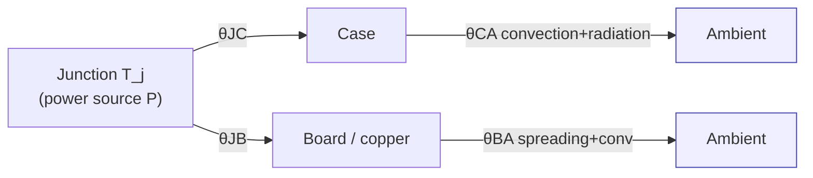
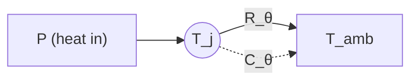

# Thermal Physics

**Summary.** Thermal physics is the study of how heat is generated, stored, and transported through matter. It belongs in the Engineering Science Layer because every electronic component dissipates power as heat, and the temperature that heat produces is what *actually* destroys parts, voids datasheet ratings, and shortens field life — yet temperature is invisible in a netlist and a copper layout. The EAK runtime silently assumes a thermal model whenever it sizes a power trace, chooses a copper pour, places a regulator, or asserts a junction-temperature limit. This document grounds those assumptions: it defines conduction/convection/radiation, the **thermal resistance network** (`θJA`, `θJC`) that lets the runtime predict junction temperature from dissipated power, copper-as-heatsink and thermal-via physics, derating against `T_j,max`, and transient heating. Concretely it underpins the *thermal* constraint type in the [Constraint Engine](../../docs/engineering/constraint-engine.md) (junction-temperature limits, copper-area minima for power devices), the current-driven trace-width and copper decisions in [Routing Planning](../../docs/state-machines/routing-planning.md), and the thermal rules a [DFM Verification](../../docs/state-machines/dfm-verification.md) pass evaluates before the [Manufacturing](../../docs/state-machines/manufacturing-generation.md) gate. When the runtime says "this 5 V→3.3 V regulator at 0.8 A is fine on this board," it is asserting a theorem about heat flow.

## Core principles

### 0. The thermal–electrical analogy (why a "network" works at all)

Steady-state heat conduction obeys the same linear algebra as resistive circuits, so the runtime can reuse the same solver and the same mental model. The correspondence is exact:

| Thermal quantity | Symbol & unit | Electrical analogue |
|------------------|---------------|---------------------|
| Temperature difference | `ΔT` [K] | Voltage `V` |
| Heat-flow rate (power) | `Q` or `P` [W] | Current `I` |
| Thermal resistance | `R_θ` [K/W] | Resistance `R` [Ω] |
| Thermal capacitance | `C_θ` [J/K] | Capacitance `C` [F] |

Ohm's law becomes `ΔT = P · R_θ`, and series/parallel composition rules are identical (this is exactly the [Ohm's-law](../electrical/ohms-law.md) reasoning applied to heat). Resistances in a heat path **add in series**; parallel paths (e.g. many thermal vias) **add as reciprocals**. Because the relations are linear, a thermal network is solved by the same node-equation machinery as a resistor mesh — see [linear algebra](../mathematics/linear-algebra.md). This analogy is the formal license for the entire `θ`-based design method below.

### 1. Conduction — Fourier's law

Heat flows down a temperature gradient through solid matter:

```text
q = −k · A · (dT/dx)          (1-D Fourier's law)
R_cond = L / (k · A)          thermal resistance of a slab  [K/W]
```

where `k` is **thermal conductivity** [W/(m·K)], `A` the cross-section, `L` the path length. The conductivity spread on a PCB is enormous and dominates every layout decision:

| Material | `k` [W/(m·K)] | Note |
|----------|---------------|------|
| Copper | ≈ 385–400 | the only good in-plane conductor on the board |
| FR-4 (through-plane) | ≈ 0.3 | a near-insulator vertically |
| FR-4 (in-plane) | ≈ 0.8 | anisotropic; still poor |
| Solder (SnAgCu) | ≈ 55–60 | the die→pad bottleneck |
| Still air | ≈ 0.026 | effectively no conduction |

The ≈ 1300:1 ratio between copper and FR-4 is *the* reason copper geometry, not board substrate, governs spreading — and why a heat source on FR-4 with no copper has almost nowhere to go.

### 2. Convection — Newton's law of cooling

Heat leaves a surface into a moving fluid (usually air):

```text
Q = h · A · (T_s − T_amb)
R_conv = 1 / (h · A)          [K/W]
```

`h` is the **convective coefficient** [W/(m²·K)]: roughly 5–25 for natural convection, 25–250 for forced air. Convective resistance falls with surface area `A`, which is part of why a larger copper pour cools better — it presents more surface, not just more spreading.

### 3. Radiation — Stefan–Boltzmann

Every surface radiates:

```text
Q = ε · σ · A · (T_s⁴ − T_amb⁴)
h_rad ≈ 4 · ε · σ · T_m³      linearized coefficient about mean temp T_m
```

with emissivity `ε` (≈ 0.8–0.9 for solder mask, ≈ 0.05 for bare copper) and `σ = 5.67×10⁻⁸ W/(m²·K⁴)`. Radiation is secondary at the modest `ΔT` of most boards but becomes significant for hot, large, high-emissivity surfaces and in still air or vacuum. Linearizing it to `h_rad` lets it enter the same resistance network as a parallel leg to convection.

### 4. The thermal resistance network: θJA and θJC

Compose the three mechanisms from the silicon die (junction) out to ambient and the network reduces to a few datasheet numbers. The two canonical ones:

```text
θJA = (T_j − T_amb) / P        junction-to-ambient   [K/W]   (whole path)
θJC = (T_j − T_case) / P       junction-to-case      [K/W]   (internal only)

⇒  T_j = T_amb + θJA · P       the predictor the runtime needs
```


*Figure: the junction-to-ambient path is two parallel branches (through the case, and down into the board); `θJA` is their parallel combination plus the source.*

Critical caveat the runtime must encode: **`θJA` is not a property of the part alone.** It is measured on a JEDEC-standard test board (JESD51, typically 2s2p) in still air; the *real* `θJA` depends on the actual copper area, layer count, airflow, and neighbours. `θJC` (junction-to-case) and `θJB` (junction-to-board) are far more intrinsic and are the honest inputs when a real heat path is designed. Treating a datasheet `θJA` as ground truth on a copper-starved board is a classic, dangerous error — the runtime must model the board-dependent legs, not copy a single number.

### 5. Copper as heatsink — spreading resistance

A small heat source (a regulator pad) dumping into a wide copper plane sees a **spreading resistance**: heat must fan out radially from the contact before the plane's bulk conductivity helps. For a source of radius `r` on a plane of thickness `t`:

```text
R_spread ≈ 1 / (k_cu · √(π · A_source))     order-of-magnitude, thin disc on a plane
```

Key consequences the layout reasoning depends on:

- **More copper area lowers `θJA`, with diminishing returns.** Doubling pour area does *not* halve resistance; the benefit saturates once the plane is ≫ the source, because distant copper is thermally "far."
- **Copper weight matters.** 1 oz/ft² = 35 µm; 2 oz = 70 µm. Thicker copper both lowers in-plane `R` and carries more current (Section 8 below).
- **Continuous beats fragmented.** A pour cut by traces or thermal-relief spokes raises spreading resistance — geometry, not just area, governs (this is a [computational-geometry](../mathematics/computational-geometry.md) question about the connected copper region).

### 6. Thermal vias

A hot pad on the top layer can pour heat into an internal or bottom plane *through* the FR-4 only via copper-plated holes, because the dielectric itself is a near-insulator (Section 1). Each via is a thin copper cylinder:

```text
R_via ≈ t_board / (k_cu · A_wall)            A_wall = π·(d_outer² − d_inner²)/4
R_array ≈ R_via / N                           N vias in parallel (ignoring crowding)
```

Design facts that fall out:

- Vias **add in parallel**, so an *array* (a grid under the thermal pad) is what works; one via is nearly useless.
- Plating wall thickness (≈ 20–25 µm) — not hole diameter — sets a single via's conductance; many small vias beat a few large ones for a given pad area.
- Filled/capped vias improve conduction and prevent solder wicking, a manufacturability concern owned by [DFM](../../docs/state-machines/dfm-verification.md).

### 7. Derating and the junction-temperature limit

Every device has an absolute-maximum `T_j,max` (commonly 125 °C or 150 °C). Two laws make staying *well below* it mandatory, not optional:

- **The hard ceiling.** `T_j ≤ T_j,max` is an absolute-maximum rating; exceeding it even briefly can destroy the die. The design rule is `T_amb,max + θJA · P_max ≤ T_j,max`, leaving a **derating margin** (often operate at ≤ 80 % of the limit).
- **The reliability law (Arrhenius).** Failure-acceleration rises exponentially with temperature: `AF = exp[(E_a/k_B)·(1/T_use − 1/T_stress)]`. The field rule of thumb — *life roughly halves for each ~10 °C rise* — comes directly from this. Cooler is not just safer, it is exponentially longer-lived.

Datasheets also publish **power-derating curves**: above some ambient, allowable dissipation falls linearly to zero at `T_j,max` with slope `1/θJA`. The runtime's job is to keep the operating point under that curve at the *worst-case* ambient.

### 8. Current-driven self-heating of copper (the trace-width link)

A trace is itself a resistor dissipating `P = I²·R` (this is [Ohm's law](../electrical/ohms-law.md) again), and that heat raises the trace's own temperature above ambient. The governing empirical law is **IPC-2152**: for a target temperature rise `ΔT`, the required cross-sectional area `A` scales as

```text
I = k · ΔT^0.44 · A^0.725      (IPC-2152 form; k depends on internal vs external layer)
```

So *current sets a minimum copper cross-section* (width × thickness) for a tolerable rise — the physics behind per-net-class trace widths and the special treatment of power rails. A trace that is electrically fine (low enough voltage drop) can still cook itself if too narrow.

### 9. Transient heating — thermal capacitance and `Z_θ(t)`

Heat does not arrive instantly. A body stores energy in its **thermal capacitance** `C_θ = m·c_p` [J/K], so the lumped first-order model is an RC circuit:

```text
C_θ · dT/dt = P − (T − T_amb)/R_θ
T(t) = T_amb + P·R_θ · (1 − e^(−t/τ)),     τ = R_θ · C_θ   (thermal time constant)
```


*Figure: the lumped thermal RC — a power step charges `C_θ` through `R_θ`; steady state is `P·R_θ` reached over ~`5τ`.*

Implications:

- **Pulses survive what steady power would not.** For a burst shorter than `τ`, the part rides the rising exponential and may never reach the steady `T_j` — datasheets capture this as **transient thermal impedance** `Z_θ(t)`, where `Z_θ(t) → θ_steady` as `t → ∞`.
- **Real parts are multi-pole.** Die, attach, package, and board each have their own `R·C`, modeled as a Foster or Cauer ladder; the single pole above is the first-order approximation.
- **Solving the transient** for arbitrary power waveforms is an ODE-integration problem — see [numerical methods](../mathematics/numerical-methods.md).

## Why it matters for electronics & PCB design

Thermal failure is the quiet killer of electronics: a board can pass every electrical rule, route cleanly, and still fail in the field because a part runs 30 °C too hot. The physics above is what converts an abstract "0.8 A drop from 5 V to 3.3 V" into a concrete copper-and-placement requirement:

- **It sizes the heat path before the part is placed.** `T_j = T_amb + θJA·P` tells you whether a regulator needs a copper pour, a via array, or a different package *at schematic time* — long before layout.
- **It connects current to copper geometry.** Section 8 makes trace width a thermal decision, not only an electrical one; power nets need wider copper than signal nets carrying the same logic.
- **It dictates placement.** Hot parts must spread out (their `θJA` branches share the same ambient and the same board copper), sit near board edges/airflow, and avoid heating temperature-sensitive neighbours (crystals, references, electrolytics).
- **It sets manufacturable rules.** Thermal-via arrays, minimum copper area under power pads, and pour continuity are DFM-checkable geometry derived from Sections 5–6.
- **It bounds reliability.** The Arrhenius law means the difference between 90 °C and 110 °C junctions is roughly a 4× difference in lifetime — a business-critical outcome decided by copper.

## Mapping to the runtime

This is where the physics becomes runtime behavior. Thermal limits are **first-class [Constraints](../../docs/foundation/engineering-domain-model.md#constraint)**, and the [Constraint Engine](../../docs/engineering/constraint-engine.md) already names the *thermal* type explicitly: "junction-temperature limits, copper-area minima for power devices." Each anchor below is a place where violating thermal physics is an engineering bug in the runtime.

- **Constraint Engine — the thermal constraint type.** `T_j,max`, `θJA`/`θJC`, and copper-area minima enter as typed bounds, each a [Physical Quantity](../../docs/engineering/units-and-quantities.md) carrying its unit (K, K/W, mm²). The engine must compare them dimensionally — a `θ` in K/W can never be silently compared to a temperature in K. A thermal bound is **indeterminate** until the design has enough information (placement, copper, ambient) to evaluate `T_j`, and the engine must report `indeterminate`, never `pass` — exactly the contract in [`constraint-engine.md`](../../docs/engineering/constraint-engine.md) §5.

- **Datasheet Intelligence → derived bounds.** The [Datasheet Intelligence](../../docs/state-machines/datasheet-intelligence.md) phase extracts `θJA`, `θJC`, `T_j,max`, and power-derating curves into the Knowledge Graph; these become derived constraint bounds via the Constraint Engine's Knowledge port. The runtime must record `θJA`'s *board-dependence* (Section 4) as provenance — treating a JEDEC `θJA` as the as-built value is a falsified prediction.

- **Routing Planning + per-net-class trace widths.** [Routing Planning](../../docs/state-machines/routing-planning.md) assigns widths and copper per net class. The IPC-2152 law (Section 8) is the physical justification for **per-net-class trace widths**: power/rail classes get wider copper because they carry current that self-heats. The recent **regulator VIN/VOUT rail split** exists precisely so these high-current nets are their own net class with a current-derived (thermal) minimum width — collapsing them back into a generic signal class would under-size copper and let a rail overheat. The width pre-check in `ValidatingRouting` consults the Constraint Engine for exactly this ampacity bound.

- **Component Placement & Floor Planning.** [Component Placement](../../docs/state-machines/component-placement.md) and [PCB Floor Planning](../../docs/state-machines/pcb-floor-planning.md) must honor thermal spacing and copper-availability: power devices share the board's copper and ambient (the parallel `θJB` legs of Section 4), so crowding them violates the superposition that `θJA` assumes. Thermal-sensitive parts are kept away from hot sources.

- **DFM Verification & the board-edge keep-out.** [DFM Verification](../../docs/state-machines/dfm-verification.md) checks thermal-via arrays, copper-pour continuity, and minimum copper area under power pads — the manufacturable encodings of Sections 5–6. The **fabrication-sourced board-edge keep-out** also interacts thermally: copper pulled back from the edge for fabrication reduces spreading area near the rim, which the thermal estimate must account for rather than assume edge-to-edge copper.

- **Verification Engine & the manufacturing gate.** A junction-temperature [Rule](../../docs/foundation/engineering-domain-model.md#rule) ("`T_j,est ≤ T_j,max` at worst-case ambient") specializes the thermal constraint for a verification domain. Through the [Verification Engine](../../docs/engineering/verification-engine.md), an estimated over-temperature becomes an **error-severity [Violation](../../docs/foundation/engineering-domain-model.md#violation)** that blocks the transition to [Manufacturing Generation](../../docs/state-machines/manufacturing-generation.md) unless explicitly [waived](../../docs/engineering/verification-engine.md) with provenance. Letting a thermally-failing board reach manufacture *because the check was skipped or silently passed* is the canonical bug this layer forbids.

- **Standards & compliance.** IPC-2152 (current capacity vs. temperature rise) and JEDEC JESD51 (`θ` measurement conditions) are standards-as-constraints; see [Standards & Compliance](../../docs/engineering/standards-and-compliance.md). The runtime must apply the *right* IPC-2152 coefficient for internal vs. external layers — an internal trace runs hotter for the same current.

- **Transient checks & numerical methods.** Pulse-power and transient `Z_θ(t)` evaluation (Section 9) is an analysis, not a pass/fail rule — it produces an [Analysis Result](../../docs/foundation/engineering-domain-model.md#analysis-result), the same family as [EMC Analysis](../../docs/state-machines/emc-analysis.md), and leans on the ODE machinery in [numerical methods](../mathematics/numerical-methods.md).

## Failure modes if violated

- **Datasheet-`θJA` fallacy.** Using the JEDEC `θJA` on a copper-starved real board under-predicts `T_j` by tens of degrees; the part runs over `T_j,max` despite a "passing" estimate. The runtime must model board-dependent legs (`θJC` + board path), not copy one number.
- **Thermally under-sized power net.** A rail trace sized only for voltage drop, not IPC-2152 current rise, self-heats and delaminates or opens. This is exactly what the VIN/VOUT rail split and per-net-class widths exist to prevent; merging power into a signal class re-introduces the failure.
- **Single thermal via / fragmented pour.** Relying on one via or a pour chopped by traces (Section 6) leaves the heat path with no parallel conductance — measured `θJA` is far worse than designed.
- **Lost dimensional soundness.** Comparing a `θ` (K/W) to a temperature (K), or mixing °C and K offsets, yields a nonsense bound that the [Physical Quantity](../../docs/engineering/units-and-quantities.md) rules must reject at assertion time, never coerce.
- **Steady-state-only thinking.** Treating a pulsed load as continuous over-designs (wasted copper/cost) or, worse, treating continuous power as a survivable pulse under-designs — both come from ignoring `τ` and `Z_θ(t)` (Section 9).
- **Silent gate bypass.** A skipped or indeterminate thermal check collapsed into "pass" lets a thermally-failing design reach [Manufacturing Generation](../../docs/state-machines/manufacturing-generation.md) — a direct violation of the Verification Engine's "indeterminate is not a pass" contract.

## Related documents

- [`../electrical/ohms-law.md`](../electrical/ohms-law.md) — `ΔT = P·R_θ` is Ohm's law for heat; trace self-heating is `I²R`.
- [`./maxwell-equations.md`](./maxwell-equations.md) — current distribution and skin effect set where copper actually carries (and heats).
- [`../mathematics/linear-algebra.md`](../mathematics/linear-algebra.md) — solving the resistance-network node equations.
- [`../mathematics/numerical-methods.md`](../mathematics/numerical-methods.md) — integrating the transient heat ODE / multi-pole `Z_θ(t)`.
- [`../mathematics/computational-geometry.md`](../mathematics/computational-geometry.md) — copper-pour area and continuity as geometry.
- Runtime: [`constraint-engine.md`](../../docs/engineering/constraint-engine.md) · [`verification-engine.md`](../../docs/engineering/verification-engine.md) · [`units-and-quantities.md`](../../docs/engineering/units-and-quantities.md) · [`standards-and-compliance.md`](../../docs/engineering/standards-and-compliance.md) · [`routing-planning.md`](../../docs/state-machines/routing-planning.md) · [`dfm-verification.md`](../../docs/state-machines/dfm-verification.md) · [`component-placement.md`](../../docs/state-machines/component-placement.md) · [`manufacturing-generation.md`](../../docs/state-machines/manufacturing-generation.md) · [`GLOSSARY.md`](../../docs/GLOSSARY.md)
