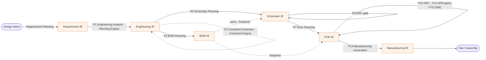
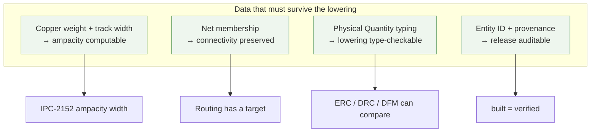

# Mapping → the Compiler IR chain

**Summary.** This document is the *binding proof* between the Engineering Science Layer and the runtime's compiler spine. The EAK runtime lowers design intent through a fixed sequence of typed Intermediate Representations — Requirement → Engineering → {BOM, Schematic} → PCB → Manufacturing — exactly as a compiler lowers a program from a high-level AST to machine code (see [`compiler/compiler-ir.md`](../../docs/compiler/compiler-ir.md) and the [lowering passes](../../docs/compiler/transformations.md)). The thesis here is narrow and load-bearing: **every engineering invariant a science doc states is a *type rule* on that chain**, and each rule must (a) hold *within* an IR and (b) *survive* a lowering, or a downstream phase becomes uncomputable. Connectivity must be preserved schematic→PCB or routing has nothing to realize; copper weight must survive into the PCB IR or [ampacity](../electrical/ohms-law.md) is uncomputable. This doc treats the IR chain as the compiler, the invariants as its type system, the check phases (ERC/DRC/DFM) as the type checker, and the verification loop-backs as error recovery — and it pins each claim to a real runtime artifact so the type system is demonstrably *enforced*, not merely asserted.

## The compiler analogy

| Compiler concept | EAK runtime realization | Anchor |
|------------------|--------------------------|--------|
| Source / AST | [Design Intent](../../docs/foundation/engineering-domain-model.md) parsed by Requirement Planning | [requirement-planning](../../docs/state-machines/requirement-planning.md) |
| Typed IRs | the six [IRs](../../docs/compiler/compiler-ir.md), each a *projection* of the one canonical [domain model](../../docs/foundation/engineering-domain-model.md) (P6) | [`eak-compiler/src/lib.rs`](../../eak/crates/eak-compiler/src/lib.rs) |
| Lowering pass | a [transformation](../../docs/compiler/transformations.md) `IR_n → IR_{n+1}` adding one phase's content | [transformations.md](../../docs/compiler/transformations.md) (P1–P13) |
| Type rules | engineering invariants (this layer's science docs) checked at each IR boundary | per-IR **Invariants** sections |
| Type checker | the check phases [ERC](../../docs/state-machines/erc-verification.md) / [DRC](../../docs/state-machines/drc-verification.md) / [DFM](../../docs/state-machines/dfm-verification.md), via the [Verification Engine](../../docs/engineering/verification-engine.md) | [`eak-engines/src/lib.rs`](../../eak/crates/eak-engines/src/lib.rs) |
| Codegen / emit | Manufacturing Generation emitting the terminal [Manufacturing IR](../../docs/compiler/ir/manufacturing-ir.md) | [manufacturing-generation](../../docs/state-machines/manufacturing-generation.md) |
| Error recovery | verification failures route the workflow *backward* (DRC/EMC→Routing, DFM→Placement, ERC→Schematic) | [architecture-views.md](../../docs/foundation/architecture-views.md) |

*Figure: the IR chain as a compiler. Solid arrows are lowerings (produce a new IR); dotted self-loops are enrichments/checks on one IR. Phase identities are authoritative in [`architecture-views.md`](../../docs/foundation/architecture-views.md).*

## The type-rule table

Each row is one level or lowering. The **type rule** column is the engineering invariant that must hold for the boundary to be crossed; the **science** column is the foundation doc that says *why* the rule is real; the **runtime enforcement** column names the concrete symbol — an [`IrError`](../../eak/crates/eak-compiler/src/lib.rs) variant raised by an IR's `project()`, or a [verification Rule](../../eak/crates/eak-engines/src/lib.rs) ID — that rejects a design violating it. These are exact symbols from the Phase-1–3 implementation, not illustrations — *except* where a cell is marked *(spec, not yet implemented)*, which flags a type rule the spec defines but the current `eak/` code does not yet enforce. The implemented-vs-specified ledger behind these marks is the [compliance report](../compliance/compliance-report.md).

| Level / lowering | IR boundary | Type rule (engineering invariant) | Science it enforces | Runtime enforcement point |
|------------------|-------------|-----------------------------------|---------------------|---------------------------|
| Requirement Planning (front-end) | → [Requirement IR](../../docs/compiler/ir/requirement-ir.md) | every Requirement is rooted in a source; an *Accepted* one is testable | traceability ([P3](../../docs/foundation/principles.md)) | `RequirementIr::project` → `IrError::OrphanRequirement` / `UntestableAccepted` |
| P1 Engineering Analysis | Requirement → [Engineering IR](../../docs/compiler/ir/engineering-ir.md) | every Functional Block traces to ≥1 upstream Requirement | requirement decomposition | `EngineeringIr::project` → `IrError::BlockWithoutRequirement` |
| P2 Constraint Extraction (enrich) | Engineering → Engineering IR | each Constraint is a typed, scoped projection of a Requirement | [constraint-satisfaction](../mathematics/constraint-satisfaction.md), [constraint-systems](../industry/constraint-systems.md) | [Constraint Engine](../../docs/engineering/constraint-engine.md); bounds typed as [Physical Quantities](../../docs/engineering/units-and-quantities.md) |
| P4 BOM Planning | Engineering → [BOM IR](../../docs/compiler/ir/bom-ir.md) | every Component is covered by ≥1 line ordering an existing Part | sourcing integrity | `BomIr::project` → `IrError::UncoveredComponent` / `UnknownPart` / `LineItemUnknownComponent` |
| P5 Schematic Planning | Engineering → [Schematic IR](../../docs/compiler/ir/schematic-ir.md) | every Component is minted from a real Block; **every Net member resolves to an existing Pin** | [graph-theory](../mathematics/graph-theory.md) (net = hyperedge), [Kirchhoff](../electrical/kirchhoff-laws.md) | `SchematicIr::project` → `IrError::OrphanComponent` / `UnknownNetMember` |
| P6 ERC (gate) | Schematic → Schematic IR | every power Net is driven (no floating supply) | [circuit-theory](../electrical/circuit-theory.md) | rule `erc-power-net-undriven` |
| P7 Floor Planning | Schematic → [PCB IR](../../docs/compiler/ir/pcb-ir.md) | a Board outline exists; **every Net carries through**; *(spec, not yet implemented)* footprint↔symbol agree and the stack-up (incl. copper weight) is typed | [graph](../mathematics/graph-theory.md) connectivity, [stackup](../pcb/stackup.md) | `PcbIr::project` → `IrError::NoBoard`. Implemented `eak-domain::Board` = outline + copper-layer *count* only; copper weight / dielectric / per-layer materials are specified ([pcb-ir](../../docs/compiler/ir/pcb-ir.md), [domain model §Board / Layer Stack](../../docs/foundation/engineering-domain-model.md)) but not yet carried |
| P8 Component Placement (enrich) | PCB → PCB IR | every Component is placed within board outline and its region | [computational-geometry](../mathematics/computational-geometry.md) | `PcbIr::project` → `IrError::UnplacedComponent` / `PlacementUnknownComponent` |
| P9 Routing Planning (enrich) | PCB → PCB IR | every Track realizes a real Net; width is a fixed per-`NetClass` default (Power/Ground 0.50 mm, Signal 0.25 mm) — the ampacity/IR-drop rule `width = max(ampacity, IR-drop)` is *(spec, not yet implemented)* | [ohms-law](../electrical/ohms-law.md), [power-distribution](../pcb/power-distribution.md) | `PcbIr::project` → `IrError::TrackUnknownNet`; per-`NetClass` constant `class_width_mm` in [`eak-phases/src/routing_planning.rs`](../../eak/crates/eak-phases/src/routing_planning.rs) |
| P10 DRC (gate) | PCB → PCB IR | width ≥ process floor; every Net routed; courtyards disjoint; geometry in-bounds | [ohms-law](../electrical/ohms-law.md) (width floor), [graph](../mathematics/graph-theory.md), [comp-geometry](../mathematics/computational-geometry.md) | rules `drc-trace-width` (checks the fabrication process floor only), `drc-unrouted-net`, `drc-courtyard-overlap`, `drc-out-of-bounds` |
| P11 DFM (gate) | PCB → PCB IR | copper-to-edge clearance ≥ fab keep-out band | [dfm-principles](../manufacturing/dfm-principles.md), [IPC-2221](../manufacturing/ipc-standards.md) | rules `dfm-edge-clearance`, `dfm-trace-edge-clearance` |
| P13 Manufacturing Generation (back-end) | PCB + BOM → [Manufacturing IR](../../docs/compiler/ir/manufacturing-ir.md) | no open error-severity Violation; every placed Component resolves to a real MPN; the two seams agree | [IPC](../manufacturing/ipc-standards.md) data-exchange | `ManufacturingIr::project` → `IrError::UnsourcedPlacement` / `PlacementUnknownComponent` / `UnknownPart` |

> EMC analysis (P12, [emc-analysis](../../docs/state-machines/emc-analysis.md)) is *not* a gate: it annotates the PCB IR with [Analysis Results](../../docs/foundation/engineering-domain-model.md) and may motivate a loop-back, but it does not block the lowering. Its science lives in [emi-emc](../pcb/emi-emc.md) and [electromagnetics](../physics/electromagnetics.md).

## Cross-lowering invariants that must survive

A type rule that holds *inside* one IR is worthless if the next lowering drops the data it depends on. These five invariants are the ones that must *survive the boundary*, with the failure each prevents.

1. **Copper weight must survive into the PCB IR, or ampacity is uncomputable.** Sizing a conductor is `width = max(ampacity, IR-drop, process-floor)` ([ohms-law §7](../electrical/ohms-law.md), [power-distribution](../pcb/power-distribution.md)), and the IPC-2152 ampacity term ([ipc-standards](../manufacturing/ipc-standards.md)) is a function of *cross-section* = trace width × copper thickness. Width is already realized as a typed quantity in the runtime (`Track.width` on `PcbIr`, a [Physical Quantity](../../docs/engineering/units-and-quantities.md)); **copper weight is the stack-up parameter the same Board / Layer Stack projection must preserve** ([stackup](../pcb/stackup.md), [thermal-physics](../physics/thermal-physics.md)). Drop it at the Schematic→PCB lowering and the `drc-trace-width` floor can still be checked but the *ampacity* width — the one that keeps `ΔT` in budget — cannot be computed at all. This is the canonical "an invariant must survive a lowering" case. *Implementation gap:* this is currently a spec-level requirement, not enforced — the implemented `eak-domain::Board` is outline + copper-layer count only and carries no copper weight (specified in [pcb-ir](../../docs/compiler/ir/pcb-ir.md) / [domain model §Board / Layer Stack](../../docs/foundation/engineering-domain-model.md) but not yet projected), which is exactly why the realized track width is a fixed per-class constant today rather than the ampacity-derived width.
2. **Connectivity is preserved schematic→PCB.** The Schematic IR's net membership ([graph-theory](../mathematics/graph-theory.md): a Net is a hyperedge over Pins) is the *only* definition of what must be physically connected. The PCB IR's **net carry-through** invariant ([pcb-ir.md](../../docs/compiler/ir/pcb-ir.md)) requires every Schematic Net to appear in the PCB IR — none dropped, none invented — and routing fidelity requires each Net's Tracks to realize exactly its Connections. The runtime enforces the floor of this at projection time (`PcbIr::project` rejects `TrackUnknownNet` — a track on a phantom net) and the completeness half at check time (`drc-unrouted-net` flags a Net with no copper). Lose connectivity here and the board is a different circuit than the one ERC approved.
3. **Every physical value stays a typed Physical Quantity.** No bare numbers cross a boundary ([units-and-quantities](../../docs/engineering/units-and-quantities.md), P9): widths, clearances, dielectric heights, and positions are dimensioned. This is what lets a lowering be *type-checked* rather than guessed — a clearance compared against a width is a category error the type system rejects, exactly as a compiler rejects adding a pointer to a float.
4. **Provenance and Entity IDs are stable across every lowering.** Each IR keeps the stable [Entity ID](../../docs/foundation/engineering-domain-model.md) and provenance link of every entity ([P5](../../docs/foundation/principles.md)), so the chain Requirement → Constraint → Net → Track → Manufacturing artifact survives. The Manufacturing IR's `PartAssignment` (refdes → MPN) in [`eak-compiler`](../../eak/crates/eak-compiler/src/lib.rs) is the terminal link: it ties a placed Component back through the BOM line to the Part, so "what we built = what we verified" is provable.
5. **Adjacent IR schema versions must reconcile.** Each IR records the schema version of the IR it was lowered from (`requirement_ir_schema_version`, `schematic_ir_schema_version`, `pcb_ir_schema_version`, `bom_ir_schema_version` in [`eak-compiler`](../../eak/crates/eak-compiler/src/lib.rs)). A mismatch is a hard incompatibility, not a silent coercion — the compiler analogue of an ABI break between front-end and back-end.

*Figure: four cross-lowering invariants and the downstream capability each one keeps computable. Drop any input on the left and the capability on the right becomes impossible, not merely degraded.*

## A worked lowering: one power net through the chain

To make the type system concrete, follow a single rail — a 3.3 V supply driven by an LM1117 regulator — from intent to fab. This is the exact shape exercised by the projection tests in [`eak-compiler/src/lib.rs`](../../eak/crates/eak-compiler/src/lib.rs) (a `Regulator` component `U1`, a `Power`-class net, part `LM1117-3.3`), so every row below is a real boundary the runtime crosses, not a hypothetical.

| Boundary | What the rail *is* at this IR | Type rule that fires | Runtime symbol |
|----------|-------------------------------|----------------------|----------------|
| [Requirement IR](../../docs/compiler/ir/requirement-ir.md) | a requirement "provide a 3.3 V, ≥1 A rail", rooted in intent and testable | requirement rooted + Accepted⇒testable | `RequirementIr::project` → `OrphanRequirement` / `UntestableAccepted` |
| [Engineering IR](../../docs/compiler/ir/engineering-ir.md) | a *regulation* Functional Block tracing to that requirement | block traces to ≥1 requirement | `EngineeringIr::project` → `BlockWithoutRequirement` |
| Engineering IR (enriched) | a typed current/voltage Constraint scoping the block | Constraint is a typed projection of the requirement | [Constraint Engine](../../docs/engineering/constraint-engine.md); bound is a [Physical Quantity](../../docs/engineering/units-and-quantities.md) |
| [BOM IR](../../docs/compiler/ir/bom-ir.md) | part `LM1117-3.3` chosen; a line item covers the regulator Component | every Component covered by a line ordering a real Part | `BomIr::project` → `UncoveredComponent` / `UnknownPart` |
| [Schematic IR](../../docs/compiler/ir/schematic-ir.md) | Component `U1` minted from the block; the `VCC` Net joins its power-out Pin | component from a real block; every Net member is a real Pin | `SchematicIr::project` → `OrphanComponent` / `UnknownNetMember` |
| Schematic IR (checked) | the `VCC` [power Net](../electrical/circuit-theory.md) must have a driver | power net is driven | rule `erc-power-net-undriven` |
| [PCB IR](../../docs/compiler/ir/pcb-ir.md) | `U1` placed on the board; `VCC` realized as a Track whose typed width is the fixed `Power`-class default (current-based sizing is spec, not yet implemented) | net carries through; placed; track on a real net; [width by net class](../pcb/power-distribution.md) | `PcbIr::project` → `NoBoard` / `UnplacedComponent` / `TrackUnknownNet` |
| PCB IR (checked) | the `VCC` track is wide enough and actually routed | width ≥ floor; net routed | rules `drc-trace-width` (process floor only), `drc-unrouted-net` |
| PCB IR (checked) | `VCC` copper stays off the board edge | copper-to-edge keep-out | rule `dfm-trace-edge-clearance` |
| [Manufacturing IR](../../docs/compiler/ir/manufacturing-ir.md) | `PartAssignment { U1 → LM1117-3.3 }`; the `VCC` copper carried as fabrication geometry | every placed Component → a real MPN; no open error-severity Violation | `ManufacturingIr::project` → `UnsourcedPlacement` / `UnknownPart` |

The rail is never re-authored; at each boundary the runtime *re-projects* it from canonical state and the type rule above must hold or the lowering aborts. The same stable [Entity ID](../../docs/foundation/engineering-domain-model.md) identifies "this rail" at every level, which is what makes the final `PartAssignment` provably the *same* regulator the requirement asked for.

## Gating and error recovery

The check phases are the type checker, and they behave like one: a *check* pass ([ERC](../../docs/state-machines/erc-verification.md), [DRC](../../docs/state-machines/drc-verification.md), [DFM](../../docs/state-machines/dfm-verification.md)) annotates an IR with [Violations](../../docs/foundation/engineering-domain-model.md) but adds no design content, and an **open error-severity Violation is a hard gate** — the next lowering is blocked unless a human records a [Waiver](../../docs/foundation/engineering-domain-model.md) ([P10](../../docs/foundation/principles.md)). The PCB IR makes this explicit as a *manufacturing-gate-readiness* invariant ([pcb-ir.md](../../docs/compiler/ir/pcb-ir.md)) and the Manufacturing IR re-asserts it as a *verified-source precondition* ([manufacturing-ir.md](../../docs/compiler/ir/manufacturing-ir.md)): the P13 lowering may not run over a board with an open error-severity Violation. This is the compiler refusing to emit code for a program that did not type-check.

Recovery mirrors a compiler's, too. A failed check does not corrupt the chain; it routes the workflow *backward* to the phase that owns the fix (DRC/EMC → Routing, DFM → Placement, ERC → Schematic, per the [default plan](../../docs/foundation/architecture-views.md)), the engineer or agent edits canonical state, and the affected IRs are **re-projected** — not duplicated — because [Entity IDs](../../docs/foundation/engineering-domain-model.md) are stable across the re-run ([transformations.md → re-entrancy](../../docs/compiler/transformations.md)). Undo is a state-level operation, never an IR-level one: you move canonical state to an earlier point and re-project. The [Verification Engine](../../docs/engineering/verification-engine.md) computes the diagnostics; the [orchestrator](../../docs/core/workflow-orchestration.md) owns the loop-back edges.

## Where the science layer binds in

The mapping is bidirectional: each foundation doc declares which IR boundary and runtime symbol it grounds, and this table is the reverse index for the IR chain specifically. The deeper "why" of each rule lives in the sibling docs — [graph-theory](../mathematics/graph-theory.md) for connectivity, [ohms-law](../electrical/ohms-law.md) and [power-distribution](../pcb/power-distribution.md) for width sizing, [stackup](../pcb/stackup.md) and [thermal-physics](../physics/thermal-physics.md) for copper weight, [constraint-satisfaction](../mathematics/constraint-satisfaction.md) for the constraint enrichment, [dfm-principles](../manufacturing/dfm-principles.md) and [ipc-standards](../manufacturing/ipc-standards.md) for the manufacturing gates. Knowledge captured across runs (which constraints actually bind, which lowerings regress) feeds the [Learning Engine](../../docs/engineering/learning-engine.md), [Knowledge Graph](../../docs/knowledge/knowledge-graph.md), and [Vector Memory](../../docs/knowledge/vector-memory.md); the [Planning Engine](../../docs/engineering/planning-engine.md) sequences the lowerings the [orchestrator](../../docs/core/workflow-orchestration.md) drives.

## How to read this

- **Start from the type-rule table** if you have a design that failed a check: find the row whose runtime enforcement symbol matches the error, then read its science column for *why* the rule exists. The `IrError` variants and rule IDs are searchable verbatim in [`eak-compiler`](../../eak/crates/eak-compiler/src/lib.rs) and [`eak-engines`](../../eak/crates/eak-engines/src/lib.rs).
- **Start from "cross-lowering invariants"** if you are adding a new IR field or a new lowering: ask which of the five survival invariants your change touches, and confirm the data it depends on is preserved across the boundary, not just present within one IR.
- **Authoritative sources.** Phase/agent/engine identities: [`architecture-views.md`](../../docs/foundation/architecture-views.md). Pass semantics: [`transformations.md`](../../docs/compiler/transformations.md). Per-IR invariants: the [`compiler/ir/`](../../docs/compiler/compiler-ir.md) docs. Entities and IDs: [`engineering-domain-model.md`](../../docs/foundation/engineering-domain-model.md). Terms: [`GLOSSARY.md`](../../docs/GLOSSARY.md).

## Related documents

[`compiler/compiler-ir.md`](../../docs/compiler/compiler-ir.md) · [`compiler/transformations.md`](../../docs/compiler/transformations.md) · [`compiler/ir/requirement-ir.md`](../../docs/compiler/ir/requirement-ir.md) · [`compiler/ir/engineering-ir.md`](../../docs/compiler/ir/engineering-ir.md) · [`compiler/ir/schematic-ir.md`](../../docs/compiler/ir/schematic-ir.md) · [`compiler/ir/bom-ir.md`](../../docs/compiler/ir/bom-ir.md) · [`compiler/ir/pcb-ir.md`](../../docs/compiler/ir/pcb-ir.md) · [`compiler/ir/manufacturing-ir.md`](../../docs/compiler/ir/manufacturing-ir.md) · [`foundation/architecture-views.md`](../../docs/foundation/architecture-views.md) · [`engineering/verification-engine.md`](../../docs/engineering/verification-engine.md) · sibling science: [graph-theory](../mathematics/graph-theory.md) · [ohms-law](../electrical/ohms-law.md) · [power-distribution](../pcb/power-distribution.md) · [stackup](../pcb/stackup.md) · [ipc-standards](../manufacturing/ipc-standards.md)
