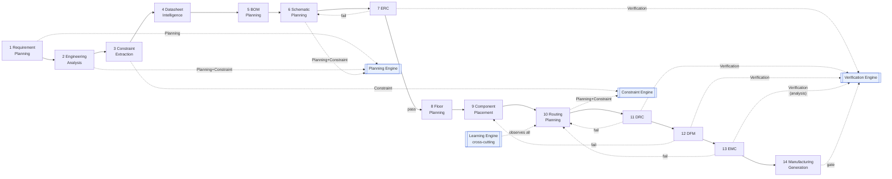

# Concept → Runtime Crosswalk (master)

> **Layer:** Engineering Science · runtime-mapping (binding). This is the single page that proves the theory is *load-bearing*: every engineering-science concept in the six foundation folders is traced to the concrete runtime that embodies it — a **runtime engine**, a **compiler IR**, a **state-machine phase**, a **constraint or verification rule**, and a **learning hook**. If a concept appears in the science layer but has no row here, it is decoration; if it has a row, the link resolves to a real document or a real symbol in the `eak` workspace.

The spine of this mapping — *phase → state machine → agent → engine → IR* — is taken verbatim from the canonical reconciliation table in [`../../docs/foundation/architecture-views.md`](../../docs/foundation/architecture-views.md). The runtime engines named in the "Runtime artifact / engine" column are the four deterministic domain engines defined in [`../../docs/engineering/`](../../docs/engineering/constraint-engine.md): the [Constraint Engine](../../docs/engineering/constraint-engine.md) (store / resolve / check), the [Planning Engine](../../docs/engineering/planning-engine.md) (propose / decompose), the [Verification Engine](../../docs/engineering/verification-engine.md) (rule → violation → waiver → gate), and the cross-cutting [Learning Engine](../../docs/engineering/learning-engine.md) (capture / distill / curate), plus the two knowledge capabilities — [Knowledge Graph](../../docs/knowledge/knowledge-graph.md) and [Vector Memory](../../docs/knowledge/vector-memory.md) — and the [Units & Quantities](../../docs/engineering/units-and-quantities.md) type system that makes every bound dimensionally sound. Rule IDs in the table (e.g. `dfm-edge-clearance`, `drc-trace-width`) are the *actual* identifiers defined on rule structs in [`../../eak/crates/eak-engines/src/lib.rs`](../../eak/crates/eak-engines/src/lib.rs) (and registered into engines by the `eak-phases` verification modules), not invented names.

## The phase → FSM → engine spine

This is the runtime skeleton onto which every concept below hangs. It is the [default workflow plan](../../docs/core/workflow-orchestration.md) of [`architecture-views.md`](../../docs/foundation/architecture-views.md), annotated with the engine each phase leans on. Verification phases loop back on failure; the [Learning Engine](../../docs/engineering/learning-engine.md) observes all of them and owns no phase of its own.

*Figure: the 14-phase pipeline with the engine(s) each phase invokes. The four engines are deterministic ([P3](../../docs/foundation/principles.md)); reasoning enters only through an [Agent's](../../docs/foundation/architecture-views.md) reasoning half.*

### Engines & capabilities legend

The "Runtime artifact / engine" column draws from exactly this fixed set. Knowing these six (plus the typed-value system) lets you read every row without re-deriving it.

| Runtime artifact | Doc | One-line role in the crosswalk |
|---|---|---|
| Constraint Engine | [constraint-engine](../../docs/engineering/constraint-engine.md) | stores, resolves (authority → specificity → restrictiveness), and checks typed bounds; raises a **Conflict** rather than inventing one |
| Planning Engine | [planning-engine](../../docs/engineering/planning-engine.md) | decomposes intent and *proposes* schematic / placement / routing structure for the engineer to dispose |
| Verification Engine | [verification-engine](../../docs/engineering/verification-engine.md) | the generic rule → violation → waiver → **gate** framework that ERC/DRC/DFM/EMC specialize |
| Learning Engine | [learning-engine](../../docs/engineering/learning-engine.md) | cross-cutting; captures patterns, defaults, and engineer corrections; **no phase, no IR of its own** |
| Knowledge Graph | [knowledge-graph](../../docs/knowledge/knowledge-graph.md) | structured facts (part ratings, material Dk/Df) that become derived constraint bounds |
| Vector Memory | [vector-memory](../../docs/knowledge/vector-memory.md) | semantic retrieval of similar past designs/lessons that the Learning Engine indexes |
| Units & Quantities | [units-and-quantities](../../docs/engineering/units-and-quantities.md) | every bound is a [Physical Quantity](../../docs/engineering/units-and-quantities.md) with unit + tolerance; a mismatch is an error, never a silent coercion |

---

## Master crosswalk

Each block opens with the one idea that ties its concepts to the runtime, then the rows.

Grouped by foundation folder. **Engineering concept** is the load-bearing idea from the science doc; **Science doc** links to the sibling document that develops it; **Runtime artifact / engine** is the deterministic runtime that embodies it; **Compiler IR** is the [phase-boundary representation](../../docs/compiler/compiler-ir.md) it is recorded in; **State machine (phase)** is where it executes; **Constraint / Verification rule** names the real rule or check (rule IDs are live `eak` symbols); **Learning hook** is what the [Learning Engine](../../docs/engineering/learning-engine.md) captures from it.

### Mathematics

*The discipline that becomes the engines' machinery: graphs are nets, optimisation is placement/routing, CSP is the Constraint Engine, and probability is the Learning Engine's confidence.*

| Engineering concept | Science doc | Runtime artifact / engine | Compiler IR | State machine (phase) | Constraint / Verification rule | Learning hook |
|---|---|---|---|---|---|---|
| Net / connectivity graph, ratsnest | [graph-theory](../mathematics/graph-theory.md) | [Planning Engine](../../docs/engineering/planning-engine.md) builds the net graph; routing traverses it | [Schematic IR](../../docs/compiler/ir/schematic-ir.md) → [PCB IR](../../docs/compiler/ir/pcb-ir.md) | [schematic-planning](../../docs/state-machines/schematic-planning.md), [routing-planning](../../docs/state-machines/routing-planning.md) | `drc-unrouted-net` (`DrcUnroutedNetRule`, [drc_verification.rs](../../eak/crates/eak-phases/src/drc_verification.rs)) | reusable net topologies per requirement class |
| Cost-minimised placement & routing | [optimization-theory](../mathematics/optimization-theory.md) | [Planning Engine](../../docs/engineering/planning-engine.md) (objective + cost) | [PCB IR](../../docs/compiler/ir/pcb-ir.md) | [pcb-floor-planning](../../docs/state-machines/pcb-floor-planning.md), [component-placement](../../docs/state-machines/component-placement.md) | `drc-courtyard-overlap`, `drc-out-of-bounds` ([drc_verification.rs](../../eak/crates/eak-phases/src/drc_verification.rs)) | placement strategies that minimised area / crossings |
| Constraint satisfaction & resolution | [constraint-satisfaction](../mathematics/constraint-satisfaction.md) | [Constraint Engine](../../docs/engineering/constraint-engine.md) (precedence: authority → specificity → restrictiveness) | [Engineering IR](../../docs/compiler/ir/engineering-ir.md) | [constraint-extraction](../../docs/state-machines/constraint-extraction.md) | `ConstraintConsistencyRule` ([constraint_verification.rs](../../eak/crates/eak-phases/src/constraint_verification.rs)) | default constraint profiles per requirement class |
| Courtyard / keep-out geometry, edge clearance | [computational-geometry](../mathematics/computational-geometry.md) | [Verification Engine](../../docs/engineering/verification-engine.md) (geometric predicates) | [PCB IR](../../docs/compiler/ir/pcb-ir.md) | [dfm-verification](../../docs/state-machines/dfm-verification.md), [drc-verification](../../docs/state-machines/drc-verification.md) | `dfm-edge-clearance`, `dfm-trace-edge-clearance` ([dfm_verification.rs](../../eak/crates/eak-phases/src/dfm_verification.rs)) | fab-sourced keep-out defaults |
| Coordinate transforms, nodal matrices | [linear-algebra](../mathematics/linear-algebra.md) | [Units & Quantities](../../docs/engineering/units-and-quantities.md) for typed geometry; ERC nodal checks | [PCB IR](../../docs/compiler/ir/pcb-ir.md) | [component-placement](../../docs/state-machines/component-placement.md), [erc-verification](../../docs/state-machines/erc-verification.md) | dimensional comparison via [Physical Quantity](../../docs/engineering/units-and-quantities.md) rules | transform/footprint reuse patterns |
| Iterative solving, tolerance & convergence | [numerical-methods](../mathematics/numerical-methods.md) | [Constraint Engine](../../docs/engineering/constraint-engine.md) typed-bound comparison (`satisfied / violated / not-applicable / indeterminate`) | [Engineering IR](../../docs/compiler/ir/engineering-ir.md) | [engineering-analysis](../../docs/state-machines/engineering-analysis.md) | typed bound with unit + tolerance (`indeterminate` is first-class) | tolerance defaults that repeatedly held |
| Confidence, decay, statistical yield | [probability-and-statistics](../mathematics/probability-and-statistics.md) | [Learning Engine](../../docs/engineering/learning-engine.md) confidence/curation | — (observes all) | cross-cutting (no FSM) | lesson confidence derived deterministically from outcomes | **the core learning hook**: lesson strengthen/decay |
| Maze / shortest-path routing search | [search-algorithms](../mathematics/search-algorithms.md) | [Planning Engine](../../docs/engineering/planning-engine.md) (route search) | [PCB IR](../../docs/compiler/ir/pcb-ir.md) | [routing-planning](../../docs/state-machines/routing-planning.md) | `drc-unrouted-net`, `drc-trace-width` ([drc_verification.rs](../../eak/crates/eak-phases/src/drc_verification.rs)) | routing-order heuristics from past boards |
| Gate / waiver / proposal decisions, autonomy | [decision-theory](../mathematics/decision-theory.md) | [Verification Engine](../../docs/engineering/verification-engine.md) gate + [human-in-the-loop](../../docs/engineering/human-in-the-loop.md) autonomy | [Manufacturing IR](../../docs/compiler/ir/manufacturing-ir.md) | all verification phases → [manufacturing-generation](../../docs/state-machines/manufacturing-generation.md) | manufacturing gate: open errors block unless waived | engineer **overrides** captured as correction lessons |
| Feedback loops & stability | [control-theory](../mathematics/control-theory.md) | [Workflow Orchestrator](../../docs/core/workflow-orchestration.md) loop-back edges + [Learning Engine](../../docs/engineering/learning-engine.md) feedback loop | — | [drc-verification](../../docs/state-machines/drc-verification.md)→routing, [erc-verification](../../docs/state-machines/erc-verification.md)→schematic | gate re-evaluation on loop-back (deterministic replay) | closed accept/correct loop is itself a curation signal |

### Physics

*Physical law enters as derived constraint bounds (thermal limits, device abs-max, material Dk/Df from the Knowledge Graph) and as analysis-flavoured EMC/SI checks.*

| Engineering concept | Science doc | Runtime artifact / engine | Compiler IR | State machine (phase) | Constraint / Verification rule | Learning hook |
|---|---|---|---|---|---|---|
| Field coupling, radiated emission | [electromagnetics](../physics/electromagnetics.md) | [Verification Engine](../../docs/engineering/verification-engine.md) (analysis-flavoured) | [PCB IR](../../docs/compiler/ir/pcb-ir.md) | [emc-analysis](../../docs/state-machines/emc-analysis.md) | `emc-antenna-length` (`EmcAntennaLengthRule`, [emc_analysis.rs](../../eak/crates/eak-phases/src/emc_analysis.rs)) | EMC mitigation patterns |
| Wave propagation foundations (SI / EMC) | [maxwell-equations](../physics/maxwell-equations.md) | [Verification Engine](../../docs/engineering/verification-engine.md) via [Simulation port](../../docs/core/workflow-orchestration.md) | [PCB IR](../../docs/compiler/ir/pcb-ir.md) | [emc-analysis](../../docs/state-machines/emc-analysis.md) | `emc-antenna-length` as radiated-emission proxy | stackup / return-path lessons |
| Junction temperature, copper-area heat-spreading | [thermal-physics](../physics/thermal-physics.md) | [Constraint Engine](../../docs/engineering/constraint-engine.md) (thermal limits, copper minima) | [Engineering IR](../../docs/compiler/ir/engineering-ir.md) | [constraint-extraction](../../docs/state-machines/constraint-extraction.md), [component-placement](../../docs/state-machines/component-placement.md) | thermal-limit + copper-area-minima constraints | thermal-driven placement defaults |
| Dielectric Dk/Df, copper properties | [materials-science](../physics/materials-science.md) | [Knowledge Graph](../../docs/knowledge/knowledge-graph.md) facts → [Constraint Engine](../../docs/engineering/constraint-engine.md) derived bounds | [Engineering IR](../../docs/compiler/ir/engineering-ir.md) (stackup) | [constraint-extraction](../../docs/state-machines/constraint-extraction.md) | impedance-target constraint built on material facts | material / stackup choices that worked |
| Device ratings, absolute-maximum limits | [semiconductor-physics](../physics/semiconductor-physics.md) | [Knowledge Graph](../../docs/knowledge/knowledge-graph.md) (datasheet facts) → [Constraint Engine](../../docs/engineering/constraint-engine.md) | [Engineering IR](../../docs/compiler/ir/engineering-ir.md), [BOM IR](../../docs/compiler/ir/bom-ir.md) | [datasheet-intelligence](../../docs/state-machines/datasheet-intelligence.md), [bom-planning](../../docs/state-machines/bom-planning.md) | voltage / current-limit constraints from abs-max ratings | part-family default selections |
| RF transmission-line & antenna effects | [rf-physics](../physics/rf-physics.md) | [Constraint Engine](../../docs/engineering/constraint-engine.md) (impedance) + [Verification Engine](../../docs/engineering/verification-engine.md) | [PCB IR](../../docs/compiler/ir/pcb-ir.md) | [routing-planning](../../docs/state-machines/routing-planning.md), [emc-analysis](../../docs/state-machines/emc-analysis.md) | `emc-antenna-length`; no dedicated high-speed `NetClass` yet — today the `Signal` class + `emc-antenna-length`; a high-speed class is the gap | RF routing patterns |

### Electrical

*Circuit law is split cleanly: connectivity/driver correctness is ERC verification on the Schematic IR; current/impedance/power become Constraint-Engine bounds realised as PCB-IR track widths.*

| Engineering concept | Science doc | Runtime artifact / engine | Compiler IR | State machine (phase) | Constraint / Verification rule | Learning hook |
|---|---|---|---|---|---|---|
| Schematic topology, components & nets | [circuit-theory](../electrical/circuit-theory.md) | [Planning Engine](../../docs/engineering/planning-engine.md) (Schematic Agent) | [Schematic IR](../../docs/compiler/ir/schematic-ir.md) | [schematic-planning](../../docs/state-machines/schematic-planning.md) | ERC rule set (see Kirchhoff row) | reusable circuit topologies |
| Current → trace width, power dissipation | [ohms-law](../electrical/ohms-law.md) | [Constraint Engine](../../docs/engineering/constraint-engine.md) (current limits) + per-net-class width | [PCB IR](../../docs/compiler/ir/pcb-ir.md) (track widths) | [routing-planning](../../docs/state-machines/routing-planning.md) | `drc-trace-width` (`DrcTraceWidthRule`) checks only the fabrication process floor; per-`NetClass` `class_width_mm` is fixed constants — `Power`/`Ground` 0.50 mm, `Signal` 0.25 mm (not yet ampacity-derived) ([routing_planning.rs](../../eak/crates/eak-phases/src/routing_planning.rs)) | current-driven width defaults per net class |
| KCL/KVL, drivers & connectivity integrity | [kirchhoff-laws](../electrical/kirchhoff-laws.md) | [Verification Engine](../../docs/engineering/verification-engine.md) (ERC) | [Schematic IR](../../docs/compiler/ir/schematic-ir.md) | [erc-verification](../../docs/state-machines/erc-verification.md) | `ErcMultipleDriversRule`, `ErcPowerNetUndrivenRule` ([erc_verification.rs](../../eak/crates/eak-phases/src/erc_verification.rs)) | driver-pattern corrections (output-driving-output) |
| Characteristic impedance, length matching | [transmission-lines](../electrical/transmission-lines.md) | [Constraint Engine](../../docs/engineering/constraint-engine.md) (impedance target) + [Planning Engine](../../docs/engineering/planning-engine.md) | [PCB IR](../../docs/compiler/ir/pcb-ir.md) | [routing-planning](../../docs/state-machines/routing-planning.md) | no high-speed `NetClass` yet — today `Signal`-class `drc-trace-width`; an impedance-driven high-speed class is the gap | impedance / length-match patterns |
| Reflections, crosstalk, eye closure | [signal-integrity](../electrical/signal-integrity.md) | [Verification Engine](../../docs/engineering/verification-engine.md) (analysis via Simulation port) | [PCB IR](../../docs/compiler/ir/pcb-ir.md) | [emc-analysis](../../docs/state-machines/emc-analysis.md), [routing-planning](../../docs/state-machines/routing-planning.md) | `emc-antenna-length`; no high-speed `NetClass` yet (today `Signal`-class width/clearance; a high-speed class is the gap) | SI mitigation lessons |
| PDN, decoupling, rail integrity | [power-integrity](../electrical/power-integrity.md) | [Constraint Engine](../../docs/engineering/constraint-engine.md) (power) + [Planning Engine](../../docs/engineering/planning-engine.md) | [Schematic IR](../../docs/compiler/ir/schematic-ir.md) → [PCB IR](../../docs/compiler/ir/pcb-ir.md) | [schematic-planning](../../docs/state-machines/schematic-planning.md), [pcb-floor-planning](../../docs/state-machines/pcb-floor-planning.md) | `ErcPowerNetUndrivenRule`; regulator VIN/VOUT rail split ([schematic_planning.rs](../../eak/crates/eak-phases/src/schematic_planning.rs)) | decoupling / PDN defaults |

### PCB

*The layout disciplines are where the Planning Engine proposes and the Verification Engine (DRC/EMC) disposes — all over the PCB IR, with stackup reaching back into the Engineering IR.*

| Engineering concept | Science doc | Runtime artifact / engine | Compiler IR | State machine (phase) | Constraint / Verification rule | Learning hook |
|---|---|---|---|---|---|---|
| Component placement strategy | [placement](../pcb/placement.md) | [Planning Engine](../../docs/engineering/planning-engine.md) (Placement Agent) | [PCB IR](../../docs/compiler/ir/pcb-ir.md) | [pcb-floor-planning](../../docs/state-machines/pcb-floor-planning.md), [component-placement](../../docs/state-machines/component-placement.md) | `drc-courtyard-overlap`, `drc-out-of-bounds` ([drc_verification.rs](../../eak/crates/eak-phases/src/drc_verification.rs)) | placement strategies & corrections |
| Trace routing | [routing](../pcb/routing.md) | [Planning Engine](../../docs/engineering/planning-engine.md) (Routing Agent) | [PCB IR](../../docs/compiler/ir/pcb-ir.md) | [routing-planning](../../docs/state-machines/routing-planning.md) | `drc-unrouted-net`, `drc-trace-width` ([routing_planning.rs](../../eak/crates/eak-phases/src/routing_planning.rs)) | routing heuristics |
| Ground planes, plane assignment | [ground-plane](../pcb/ground-plane.md) | [Planning Engine](../../docs/engineering/planning-engine.md) + [Constraint Engine](../../docs/engineering/constraint-engine.md) (stackup) | [Engineering IR](../../docs/compiler/ir/engineering-ir.md) (stackup) → [PCB IR](../../docs/compiler/ir/pcb-ir.md) | [pcb-floor-planning](../../docs/state-machines/pcb-floor-planning.md) | clearance / return constraints | plane-assignment patterns |
| Power distribution network | [power-distribution](../pcb/power-distribution.md) | [Constraint Engine](../../docs/engineering/constraint-engine.md) + [Planning Engine](../../docs/engineering/planning-engine.md) | [PCB IR](../../docs/compiler/ir/pcb-ir.md) | [pcb-floor-planning](../../docs/state-machines/pcb-floor-planning.md), [routing-planning](../../docs/state-machines/routing-planning.md) | power-class `drc-trace-width` (wider `class_width_mm`) | PDN width defaults |
| Return-path continuity | [return-path](../pcb/return-path.md) | [Verification Engine](../../docs/engineering/verification-engine.md) (EMC/SI) + [Constraint Engine](../../docs/engineering/constraint-engine.md) | [PCB IR](../../docs/compiler/ir/pcb-ir.md) | [emc-analysis](../../docs/state-machines/emc-analysis.md), [routing-planning](../../docs/state-machines/routing-planning.md) | `emc-antenna-length` (return-discontinuity proxy) | return-path patterns |
| Differential pairs | [differential-pairs](../pcb/differential-pairs.md) | [Planning Engine](../../docs/engineering/planning-engine.md) + [Constraint Engine](../../docs/engineering/constraint-engine.md) (impedance/skew) | [PCB IR](../../docs/compiler/ir/pcb-ir.md) | [routing-planning](../../docs/state-machines/routing-planning.md) | no high-speed `NetClass` yet — today `Signal`-class width/clearance; a differential/high-speed class is the gap | diff-pair routing patterns |
| Layer stackup | [stackup](../pcb/stackup.md) | [Constraint Engine](../../docs/engineering/constraint-engine.md) + [Knowledge Graph](../../docs/knowledge/knowledge-graph.md) (materials) | [Engineering IR](../../docs/compiler/ir/engineering-ir.md) (stackup) | [constraint-extraction](../../docs/state-machines/constraint-extraction.md), [pcb-floor-planning](../../docs/state-machines/pcb-floor-planning.md) | impedance-vs-thickness **Conflict** (engine refuses to invent a bound) | stackup defaults |
| High-speed design | [high-speed-design](../pcb/high-speed-design.md) | [Verification Engine](../../docs/engineering/verification-engine.md) + [Constraint Engine](../../docs/engineering/constraint-engine.md) (no dedicated high-speed class yet; `Signal` class today) | [PCB IR](../../docs/compiler/ir/pcb-ir.md) | [emc-analysis](../../docs/state-machines/emc-analysis.md), [routing-planning](../../docs/state-machines/routing-planning.md) | `emc-antenna-length`; `Signal`-class `drc-trace-width` (a high-speed class is the gap) | high-speed routing lessons |
| Analog / mixed-signal partitioning | [analog-layout](../pcb/analog-layout.md) | [Planning Engine](../../docs/engineering/planning-engine.md) + [Constraint Engine](../../docs/engineering/constraint-engine.md) (keep-out) | [PCB IR](../../docs/compiler/ir/pcb-ir.md) | [component-placement](../../docs/state-machines/component-placement.md) | keep-out / partition clearance constraints | analog partitioning patterns |
| EMI / EMC suppression | [emi-emc](../pcb/emi-emc.md) | [Verification Engine](../../docs/engineering/verification-engine.md) (EMC Analysis) | [PCB IR](../../docs/compiler/ir/pcb-ir.md) | [emc-analysis](../../docs/state-machines/emc-analysis.md) | `emc-antenna-length` ([emc_analysis.rs](../../eak/crates/eak-phases/src/emc_analysis.rs)) | EMI mitigation lessons |

### Manufacturing

*Fabrication reality enters as fab-sourced constraints, is enforced by DFM rules, and is gated before the PCB IR is lowered to the released Manufacturing IR.*

| Engineering concept | Science doc | Runtime artifact / engine | Compiler IR | State machine (phase) | Constraint / Verification rule | Learning hook |
|---|---|---|---|---|---|---|
| Fab-process limits (min trace/space, drill, annular ring) | [manufacturing-constraints](../manufacturing/manufacturing-constraints.md) | [Constraint Engine](../../docs/engineering/constraint-engine.md) (fab-sourced) + [Verification Engine](../../docs/engineering/verification-engine.md) (DFM) | [PCB IR](../../docs/compiler/ir/pcb-ir.md) → [Manufacturing IR](../../docs/compiler/ir/manufacturing-ir.md) | [dfm-verification](../../docs/state-machines/dfm-verification.md), [manufacturing-generation](../../docs/state-machines/manufacturing-generation.md) | `dfm-edge-clearance`, `dfm-trace-edge-clearance` (edge keep-out sourced from fabrication, [dfm_verification.rs](../../eak/crates/eak-phases/src/dfm_verification.rs)) | house DFM rule packs |
| IPC class limits as constraints | [ipc-standards](../manufacturing/ipc-standards.md) | [Constraint Engine](../../docs/engineering/constraint-engine.md) (standards-as-constraints) → [Verification Engine](../../docs/engineering/verification-engine.md) | [PCB IR](../../docs/compiler/ir/pcb-ir.md) / [Manufacturing IR](../../docs/compiler/ir/manufacturing-ir.md) | [dfm-verification](../../docs/state-machines/dfm-verification.md) | DFM rule set (`dfm-*`) built on IPC-derived constraints | standard-conformance defaults |
| Manufacturability gate | [dfm-principles](../manufacturing/dfm-principles.md) | [Verification Engine](../../docs/engineering/verification-engine.md) manufacturing gate | [Manufacturing IR](../../docs/compiler/ir/manufacturing-ir.md) | [dfm-verification](../../docs/state-machines/dfm-verification.md) → [manufacturing-generation](../../docs/state-machines/manufacturing-generation.md) | terminal-phase global gate: open error-severity violations block release | recurring DFM violation→fix pairs |

### Industry (engineering judgement)

*Professional judgement becomes engine heuristics, deterministic precedence policy, and — crucially — the human-in-command workflow whose corrections are the Learning Engine's richest signal.*

| Engineering concept | Science doc | Runtime artifact / engine | Compiler IR | State machine (phase) | Constraint / Verification rule | Learning hook |
|---|---|---|---|---|---|---|
| Functional-grouping placement philosophy | [placement-philosophy](../industry/placement-philosophy.md) | [Planning Engine](../../docs/engineering/planning-engine.md) (Placement Agent heuristics) | [PCB IR](../../docs/compiler/ir/pcb-ir.md) | [pcb-floor-planning](../../docs/state-machines/pcb-floor-planning.md), [component-placement](../../docs/state-machines/component-placement.md) | clearance / keep-out constraints | placement-philosophy lessons |
| Routing order & priority discipline | [routing-philosophy](../industry/routing-philosophy.md) | [Planning Engine](../../docs/engineering/planning-engine.md) (Routing Agent) | [PCB IR](../../docs/compiler/ir/pcb-ir.md) | [routing-planning](../../docs/state-machines/routing-planning.md) | per-net-class ordering + `drc-trace-width` | routing-order heuristics |
| Constraint systems in EDA | [constraint-systems](../industry/constraint-systems.md) | [Constraint Engine](../../docs/engineering/constraint-engine.md) (precedence + conflict) | [Engineering IR](../../docs/compiler/ir/engineering-ir.md) | [constraint-extraction](../../docs/state-machines/constraint-extraction.md) | `ConstraintConsistencyRule` + deterministic precedence | constraint-default lessons |
| Manufacturing hand-off methodology | [manufacturing-methodology](../industry/manufacturing-methodology.md) | [Verification Engine](../../docs/engineering/verification-engine.md) gate + [Workflow Orchestrator](../../docs/core/workflow-orchestration.md) | [Manufacturing IR](../../docs/compiler/ir/manufacturing-ir.md) | [manufacturing-generation](../../docs/state-machines/manufacturing-generation.md) | terminal phase + global completeness gate | hand-off completeness lessons |
| Engineer-in-command workflow & autonomy | [human-workflow](../industry/human-workflow.md) | [Workflow Orchestrator](../../docs/core/workflow-orchestration.md) + [human-in-the-loop](../../docs/engineering/human-in-the-loop.md) autonomy levels | — (all phases) | every gate / approval point | waiver authorization at the project's autonomy level | **corrections/overrides captured as first-class lessons** ([P10](../../docs/foundation/principles.md)) |

---

## How to read this

- **A row is a contract, not a metaphor.** Read it left-to-right as one sentence: *"this concept is realised by this engine, recorded in this IR, run in this phase, enforced by this rule, and learned from via this hook."* If you cannot follow that sentence end-to-end in the codebase, the row is wrong — report it.
- **Engines are deterministic; reasoning is not in this table.** The [Constraint](../../docs/engineering/constraint-engine.md), [Planning](../../docs/engineering/planning-engine.md), [Verification](../../docs/engineering/verification-engine.md), and [Learning](../../docs/engineering/learning-engine.md) engines never call a model ([P3](../../docs/foundation/principles.md)). An [Agent](../../docs/foundation/architecture-views.md) may *propose* a value via the reasoning port, but only the deterministic engine evaluates it and only the runtime commits it.
- **IR direction follows the lowerings.** Where a cell shows `A → B`, the concept is *lowered* from IR A to IR B at a phase boundary — see [`../../docs/compiler/transformations.md`](../../docs/compiler/transformations.md). The full IR set is in [`../../docs/compiler/ir/`](../../docs/compiler/compiler-ir.md).
- **Rule IDs are live symbols.** Kebab-case IDs (`dfm-edge-clearance`, `drc-trace-width`, `drc-unrouted-net`, `drc-out-of-bounds`, `emc-antenna-length`, `bom-lifecycle`) and PascalCase rule structs (`ErcMultipleDriversRule`, `ErcPowerNetUndrivenRule`, `DrcCourtyardOverlapRule`, `ConstraintConsistencyRule`) are **defined** in [`../../eak/crates/eak-engines/src/lib.rs`](../../eak/crates/eak-engines/src/lib.rs); the `eak-phases/src/{drc,erc,dfm,emc}_verification.rs` modules only register/assemble them into engines. The implemented [`NetClass`](../../eak/crates/eak-domain/src/lib.rs) has exactly three variants — `Power`, `Ground`, `Signal` — and these drive `class_width_mm` (`Power`/`Ground` => 0.50 mm, `Signal` => 0.25 mm) in [routing_planning.rs](../../eak/crates/eak-phases/src/routing_planning.rs); `trace-floor` / `load-only` / `high-speed` are names of **test-fixture reasoner doubles** in the `eak-phases` test module, not net classes, and do not drive width. See the [compliance report](../compliance/compliance-report.md) for the full reconciliation.
- **The Learning Engine has no IR/phase column-cell of its own.** It is cross-cutting ([architecture-views.md](../../docs/foundation/architecture-views.md): *engine, not phase*); its "Learning hook" column is what it harvests from every other row. Product-build know-how is explicitly *out of scope* for it — that goes to ECC ([learning-engine.md](../../docs/engineering/learning-engine.md) §5).

## Related documents

- Spine source — [`../../docs/foundation/architecture-views.md`](../../docs/foundation/architecture-views.md) · domain vocabulary — [`../../docs/foundation/engineering-domain-model.md`](../../docs/foundation/engineering-domain-model.md) · dependency rule — [`../../docs/foundation/principles.md`](../../docs/foundation/principles.md) · [`../../docs/GLOSSARY.md`](../../docs/GLOSSARY.md)
- Engines — [`constraint-engine`](../../docs/engineering/constraint-engine.md) · [`planning-engine`](../../docs/engineering/planning-engine.md) · [`verification-engine`](../../docs/engineering/verification-engine.md) · [`learning-engine`](../../docs/engineering/learning-engine.md) · typed bounds — [`units-and-quantities`](../../docs/engineering/units-and-quantities.md)
- Knowledge — [`knowledge-graph`](../../docs/knowledge/knowledge-graph.md) · [`vector-memory`](../../docs/knowledge/vector-memory.md)
- Compiler — [`compiler-ir`](../../docs/compiler/compiler-ir.md) · [`transformations`](../../docs/compiler/transformations.md) · IRs in [`../../docs/compiler/ir/`](../../docs/compiler/ir/requirement-ir.md)
- Orchestration — [`workflow-orchestration`](../../docs/core/workflow-orchestration.md) · all 14 phases in [`../../docs/state-machines/`](../../docs/state-machines/README.md)
- Foundation science layer — [`../mathematics`](../mathematics/graph-theory.md) · [`../physics`](../physics/electromagnetics.md) · [`../electrical`](../electrical/circuit-theory.md) · [`../pcb`](../pcb/placement.md) · [`../manufacturing`](../manufacturing/dfm-principles.md) · [`../industry`](../industry/constraint-systems.md)
</content>
</invoke>
