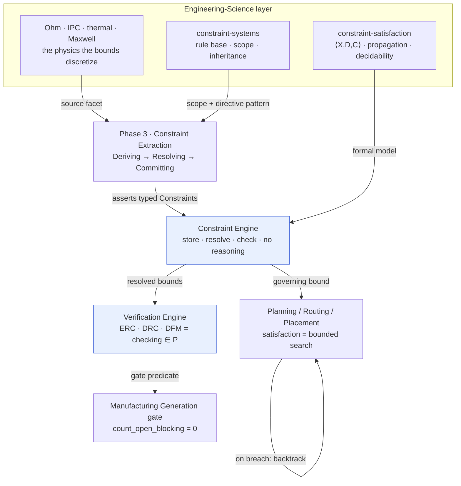
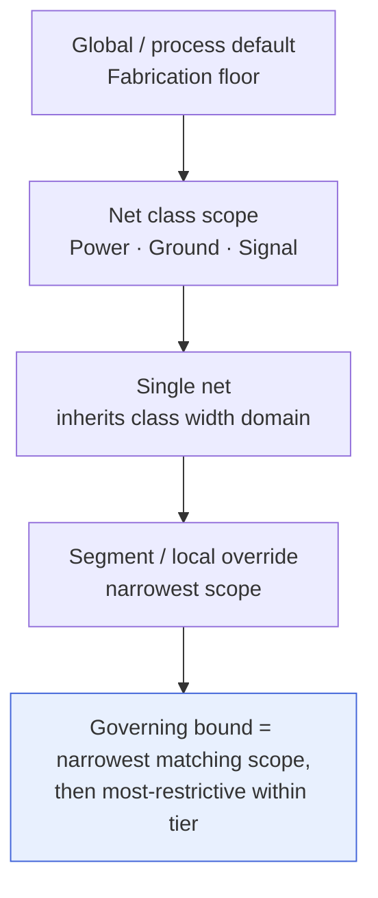

# Mapping → the Constraint Engine

**Summary.** This is a *binding* document: it proves that the abstract machinery of constraint satisfaction — the formal `⟨X, D, C⟩` of [constraint-satisfaction](../mathematics/constraint-satisfaction.md) and the EDA *rule-base-separated-from-canvas* pattern of [constraint-systems](../industry/constraint-systems.md) — is not a metaphor in EAK but a thing made of running code. Every engineering principle that says "the design must respect a bound" lands on two concrete runtime artifacts: the **[Constraint Extraction](../../docs/state-machines/constraint-extraction.md) phase** (Phase 3), which *derives* typed bounds from requirements, standards, parts, and fabrication process, and the **[Constraint Engine](../../docs/engineering/constraint-engine.md)**, the deterministic service that *stores, resolves, and checks* them. This doc traces each step of that path — which physical law sources each constraint (Ohm → trace width, IPC/DFM → clearance, thermal → copper area), how a bound becomes a typed [Physical Quantity](../../docs/engineering/units-and-quantities.md) comparison, how net classes scope it, how inheritance and precedence reduce overlaps to one governing bound, and how the realized impl in [`eak/crates/`](../../eak/crates/) embodies all of it — so that a reader can follow any rule from a law of physics to the exact symbol that enforces it.

---

## The binding at a glance

| Engineering concept | Science source (sibling doc) | Runtime phase / engine | Realized in code |
|---------------------|------------------------------|------------------------|------------------|
| A design rule *is* a relation in a constraint network | [constraint-satisfaction](../mathematics/constraint-satisfaction.md) `⟨X,D,C⟩` | [Constraint Engine](../../docs/engineering/constraint-engine.md) holds `C`, checks subsets | `ConstraintEngine` — [`eak-engines/src/lib.rs`](../../eak/crates/eak-engines/src/lib.rs) |
| Rules are data, scoped to groups, separate from any canvas | [constraint-systems](../industry/constraint-systems.md) P1–P2 | canonical [Engineering IR](../../docs/compiler/ir/engineering-ir.md), not the UI ([P11](../../docs/foundation/principles.md)) | `Constraint` record — [`eak-domain/src/lib.rs`](../../eak/crates/eak-domain/src/lib.rs) |
| Deriving bounds from intent/standards/process | [constraint-systems](../industry/constraint-systems.md) P6 (directives flow) | [Constraint Extraction](../../docs/state-machines/constraint-extraction.md) phase (Phase 3) | [`eak-phases/src/constraint_extraction.rs`](../../eak/crates/eak-phases/src/constraint_extraction.rs) |
| A bound is a typed quantity comparison, dimensionally sound | [units-and-quantities](../../docs/engineering/units-and-quantities.md), [P9](../../docs/foundation/principles.md) | Physical Quantity type system the engine consumes | `PhysicalQuantity::try_compare` — [`eak-units/src/lib.rs`](../../eak/crates/eak-units/src/lib.rs) |
| Net classes carry shared electrical/physical rules | [constraint-systems](../industry/constraint-systems.md) P3 (grouping) | [Routing Planning](../../docs/state-machines/routing-planning.md) per-class widths | `class_width_mm`, `NetClass` — [`eak-phases/src/routing_planning.rs`](../../eak/crates/eak-phases/src/routing_planning.rs) |
| Overlapping rules reduce to one governing bound | [constraint-systems](../industry/constraint-systems.md) P5 (inheritance) | [Constraint Engine](../../docs/engineering/constraint-engine.md) resolution + conflict | `ConstraintEngine::contradiction` — [`eak-engines/src/lib.rs`](../../eak/crates/eak-engines/src/lib.rs) |
| Checking a realized design is decidable verification | [constraint-satisfaction](../mathematics/constraint-satisfaction.md) (checking ∈ P) | [Verification Engine](../../docs/engineering/verification-engine.md): ERC/DRC/DFM | `DrcTraceWidthRule`, `DfmEdgeClearanceRule` — [`eak-engines/src/lib.rs`](../../eak/crates/eak-engines/src/lib.rs) |
| Searching for a legal design is NP-hard but bounded | [constraint-satisfaction](../mathematics/constraint-satisfaction.md) (satisfaction) | [Planning Engine](../../docs/engineering/planning-engine.md) drives routing/placement | [`eak-phases/src/component_placement.rs`](../../eak/crates/eak-phases/src/component_placement.rs) |
| Past resolutions inform future proposals | [decision-theory](../mathematics/decision-theory.md) | [Learning Engine](../../docs/engineering/learning-engine.md) (cross-cutting) | observes via [Knowledge Graph](../../docs/knowledge/knowledge-graph.md) |

---

## The binding pipeline

The science layer supplies two halves — the *mathematics* (CSP) and the *architecture* (EDA constraint systems) — and the runtime fuses them into a single path from law to gate.

*Figure: the science layer (left) sources and shapes constraints; Constraint Extraction writes `C`; the Constraint Engine resolves; planning searches and verification checks; the terminal decidable predicate is the [Manufacturing Generation](../../docs/state-machines/manufacturing-generation.md) gate.*

---

## What a constraint *is* in the runtime

The EDA pattern says a rule is `⟨scope, predicate, priority, source⟩`; the CSP frame says a constraint is `⟨scope Sⱼ, relation Rⱼ⟩`. The realized `Constraint` record in [`eak-domain/src/lib.rs`](../../eak/crates/eak-domain/src/lib.rs) is exactly the intersection of those two views:

| Field | Binds the science notion | Realized type |
|-------|--------------------------|---------------|
| `statement` | human-readable rule text | `String` |
| `subject_requirement` | the intent the bound serves — the **source/provenance** facet ([P5](../../docs/foundation/principles.md)) | `EntityId` |
| `kind` | the **predicate sense** — `Max` / `Min` / `Equal` (a quantifier-free comparison `≤ / ≥ / =`) | `ConstraintKind` |
| `bound` | the **typed bound** — a [Physical Quantity](../../docs/engineering/units-and-quantities.md) carrying unit + dimension | `PhysicalQuantity` |
| `source` | provenance link to the deriving entity | `EntityId` |
| `status` | `Active` / `Superseded` — constraints are **never deleted, only superseded** | `ConstraintStatus` |

Two design facts matter for the mapping. First, the *bound* is a `PhysicalQuantity`, so every check runs through `PhysicalQuantity::try_compare` ([`eak-units/src/lib.rs`](../../eak/crates/eak-units/src/lib.rs)), which **errors rather than coerces** on a dimension mismatch — the runtime form of [P9](../../docs/foundation/principles.md) and the "decidable comparison of physical quantities" premise that keeps the gate a total function. Second, `Superseded` rather than delete is precisely the [Constraint Extraction](../../docs/state-machines/constraint-extraction.md) phase's *post-commit rollback* contract: a reversed constraint is marked superseded and the change records a `Decision`, preserving [provenance](../../docs/core/provenance-and-traceability.md).

> The richer *category* taxonomy in the [Constraint Engine](../../docs/engineering/constraint-engine.md) spec (clearance, voltage limit, impedance target, thermal, keep-out, compliance) is realized not as enum variants on `Constraint` but as the **rule set** that checks each category — `DrcTraceWidthRule`, `DfmEdgeClearanceRule`, `ErcPowerNetUndrivenRule`, `ConstraintConsistencyRule` in [`eak-engines/src/lib.rs`](../../eak/crates/eak-engines/src/lib.rs). The bound is generic (`kind` + `PhysicalQuantity`); the *meaning* lives in the rule that consumes it.

---

## Which physical law sources each constraint

This is the "source" facet made literal: every machine-checkable bound is the discretized shadow of a specific law. The `source` is never guessed — for fabrication bounds it is read from a `RequirementCategory::Fabrication` requirement, the runtime honouring the EDA pattern's provenance discipline (increment 9).

| Constraint | Sourcing law (science doc) | Discretized form | Runtime rule |
|------------|----------------------------|------------------|--------------|
| Minimum trace width | [Ohm's law](../electrical/ohms-law.md) ampacity + IR-drop; [power-integrity](../electrical/power-integrity.md) | `width ≥ f(I)` per net | `DrcTraceWidthRule` — floor from `Fabrication` slot 0, [`eak-engines/src/lib.rs`](../../eak/crates/eak-engines/src/lib.rs) |
| Copper-to-copper / board-edge clearance | [IPC standards](../manufacturing/ipc-standards.md), [dfm-principles](../manufacturing/dfm-principles.md); breakdown from [Maxwell](../physics/maxwell-equations.md)/[electromagnetics](../physics/electromagnetics.md) | keep-out band `≥ d` | `DfmEdgeClearanceRule` — band from `Fabrication` slot 1 via `resolve_edge_keepout_si`, [`eak-engines/src/lib.rs`](../../eak/crates/eak-engines/src/lib.rs) |
| Courtyard / placement separation | [placement](../pcb/placement.md), [manufacturing-constraints](../manufacturing/manufacturing-constraints.md) | `no-overlap` over rectangles | `DrcCourtyardOverlapRule` — [`eak-engines/src/lib.rs`](../../eak/crates/eak-engines/src/lib.rs) |
| Power-net must be driven; no contention | [kirchhoff-laws](../electrical/kirchhoff-laws.md), [circuit-theory](../electrical/circuit-theory.md) | exactly one driver per net | `ErcPowerNetUndrivenRule`, `ErcMultipleDriversRule` |
| Every net realized (completeness) | [constraint-satisfaction](../mathematics/constraint-satisfaction.md) (no unbound variable at solution time) | `∀ net ∃ track` | `DrcUnroutedNetRule` — [`eak-engines/src/lib.rs`](../../eak/crates/eak-engines/src/lib.rs) |
| Thermal copper-area minima | [thermal-physics](../physics/thermal-physics.md), [power-distribution](../pcb/power-distribution.md) | `area ≥ f(P_dissipated)` | category constraint asserted in extraction |
| Impedance target / coupling | [transmission-lines](../electrical/transmission-lines.md), [signal-integrity](../electrical/signal-integrity.md), [differential-pairs](../pcb/differential-pairs.md) | `Z₀ = target ± tol` over a pair | scoped to net class / pair group |

The fabrication-sourced pair is the cleanest proof of the binding: `fabrication_length_targets` reads Length-dimensioned targets stated on `Fabrication` requirements, slot 0 becomes the trace-width floor and slot 1 the edge keep-out band — so both bounds **trace to a stated fab capability**, not a hard-coded guess, exactly as [constraint-systems](../industry/constraint-systems.md) Principle 4 demands.

---

## Net classes and rule inheritance

[constraint-systems](../industry/constraint-systems.md) Principle 3 says the net class is the single most-used scope; Principle 5 says overlapping scopes resolve *most-specific-wins → restrictiveness*. The runtime realizes the first directly and the second deterministically.

*Figure: the inheritance ladder. EAK's `NetClass` enum (`Power`, `Ground`, `Signal`) is the class tier; `class_width_mm` assigns each its own width domain.*

In [`eak-phases/src/routing_planning.rs`](../../eak/crates/eak-phases/src/routing_planning.rs), `class_width_mm` maps `NetClass::Power` and `NetClass::Ground` → `0.50 mm` and `NetClass::Signal` → `0.25 mm` (increment 10, *per-net-class trace widths*). This is the CSP pattern of a **domain template by class**: instead of one global width, each net inherits its class's permitted value, so power rails carry more copper for their current (the Ohm's-law ampacity source) while signals stay tight. The match is *exhaustive — no wildcard*, so adding a `NetClass` variant is a compile error until it is given a width: the type system enforcing "no member inherits a bound by accident," which is [constraint-systems](../industry/constraint-systems.md)'s failure mode "per-object rules instead of scopes" made impossible. The width a track actually carries flows downstream to `DrcTraceWidthRule`, so if a class width ever fell below the fab floor it is *flagged and looped back*, not silently accepted.

---

## Resolution: governing bound and conflict

The [Constraint Engine](../../docs/engineering/constraint-engine.md)'s precedence — **source authority → specificity → restrictiveness** — must be a *function*, or incremental re-checking could disagree with the gate ([reproducibility](../../docs/foundation/principles.md), [P4](../../docs/foundation/principles.md)). The realized impl in [`eak-engines/src/lib.rs`](../../eak/crates/eak-engines/src/lib.rs) carries the deterministic core of that function:

- **Checking** — `ConstraintEngine::satisfies(value, constraint)` compares a `PhysicalQuantity` against the bound by `kind`: `Max ⇒ not Greater`, `Min ⇒ not Less`, `Equal ⇒ Equal`. It returns a `UnitError` (never a silent `false`) on a dimension mismatch — a malformed bound never masquerades as a verdict.
- **Restrictiveness / conflict** — `ConstraintEngine::contradiction(a, b)` reduces two constraints on the same dimension to their **feasible intervals on the SI axis** (`feasible_interval`) and reports a contradiction iff those intervals are *disjoint* (e.g. `power ≤ 5 W` and `power ≥ 8 W`). Constraints on different dimensions never contradict. This is the CSP *empty-domain-as-proof*: an unsatisfiable set is detected by intersection, and the [Constraint Extraction](../../docs/state-machines/constraint-extraction.md) machine routes it to `AwaitingConflictResolution` — surfaced to the engineer, **never patched with an invented bound** ([P10](../../docs/foundation/principles.md)).

A **Conflict** (unsatisfiable set) is thus distinct from a **Violation** (a satisfiable bound the design currently breaks); the first lives in extraction/resolution, the second in the [Verification Engine](../../docs/engineering/verification-engine.md) lifecycle.

---

## The three hardening increments, as constraint operations

The most recent runtime work (increments 9–11, commits up to `5d12adf`) maps one-for-one onto operations this binding describes — each is a constraint-modelling move, not cosmetics:

| Increment | CSP / EDA operation | Runtime change |
|-----------|---------------------|----------------|
| **9 — board-edge keep-out, fab-sourced** | a **unary spatial constraint** ([node consistency](../mathematics/constraint-satisfaction.md)) whose `source` is the [DFM](../../docs/state-machines/dfm-verification.md) fab process, not a guess | `resolve_edge_keepout_si` reads `Fabrication` slot 1; `DfmEdgeClearanceRule` enforces it — [`eak-engines/src/lib.rs`](../../eak/crates/eak-engines/src/lib.rs) |
| **10 — per-net-class trace widths** | a **domain template by class** — a finite family of class-scoped width domains replacing one global width | `class_width_mm` over `NetClass` — [`eak-phases/src/routing_planning.rs`](../../eak/crates/eak-phases/src/routing_planning.rs) |
| **11 — regulator VIN/VOUT rail split** | **introducing variables to remove an over-constraint** — a collapsed power net carried two contradictory voltage scopes (input + output rail) at once | split into a VBUS-driven input rail and a VOUT-driven load rail, two single-driver nets — [`eak-phases/src/lib.rs`](../../eak/crates/eak-phases/src/lib.rs) |

Increment 11 is the textbook CSP escape from a `contradiction`: one net with two disjoint voltage intervals is an emptied domain; splitting it into two `Net`s, each with a consistent bound, makes the model satisfiable — a *correctness* fix the engine's `contradiction` check would otherwise have to raise forever.

---

## The decidable gate

Because every bound is a `PhysicalQuantity` comparison over a finite domain, *checking* is polynomial and total. The terminal proof of the whole binding is the **manufacturing gate**: `VerificationEngine::count_open_blocking` ([`eak-engines/src/lib.rs`](../../eak/crates/eak-engines/src/lib.rs)) counts open `ViolationSeverity::Error` violations, and [Manufacturing Generation](../../docs/state-machines/manufacturing-generation.md) may transition only when that count is zero. That gate is a pure predicate over a finite conjunction of decidable comparisons — which is *why* the same design always yields the same verdict, the [determinism-and-replay](../../docs/foundation/principles.md) guarantee the runtime is built on. The `indeterminate` result (a net not yet routed) is kept first-class and treated by a gate as "not yet passable," with `DrcUnroutedNetRule` asserting completeness so an unbound net cannot slip through as a pass.

---

## How to read this

- Start from a **law** (e.g. [Ohm's law](../electrical/ohms-law.md)), follow the *"Which physical law sources each constraint"* table to its runtime rule, then open that symbol in [`eak/crates/`](../../eak/crates/) to see the enforcement.
- For the **mathematics** of why checking is decidable and search is bounded, read the sibling [constraint-satisfaction](../mathematics/constraint-satisfaction.md); for the **architecture** of scopes and inheritance, read [constraint-systems](../industry/constraint-systems.md). This doc is the *bridge* between those two and the code.
- For the **spec** of the engine this binds to, read [constraint-engine](../../docs/engineering/constraint-engine.md); for the phase that feeds it, [constraint-extraction](../../docs/state-machines/constraint-extraction.md); for where it sits among all phases, the canonical map in [architecture-views](../../docs/foundation/architecture-views.md).

## Related documents

- Engineering-Science siblings: [`../mathematics/constraint-satisfaction.md`](../mathematics/constraint-satisfaction.md) · [`../industry/constraint-systems.md`](../industry/constraint-systems.md) · [`../electrical/ohms-law.md`](../electrical/ohms-law.md) · [`../manufacturing/ipc-standards.md`](../manufacturing/ipc-standards.md) · [`../manufacturing/dfm-principles.md`](../manufacturing/dfm-principles.md) · [`../physics/thermal-physics.md`](../physics/thermal-physics.md) · [`../pcb/differential-pairs.md`](../pcb/differential-pairs.md)
- Runtime engines & quantities: [`constraint-engine`](../../docs/engineering/constraint-engine.md) · [`verification-engine`](../../docs/engineering/verification-engine.md) · [`planning-engine`](../../docs/engineering/planning-engine.md) · [`learning-engine`](../../docs/engineering/learning-engine.md) · [`units-and-quantities`](../../docs/engineering/units-and-quantities.md) · [`knowledge-graph`](../../docs/knowledge/knowledge-graph.md)
- Phases & compiler: [`constraint-extraction`](../../docs/state-machines/constraint-extraction.md) · [`routing-planning`](../../docs/state-machines/routing-planning.md) · [`drc-verification`](../../docs/state-machines/drc-verification.md) · [`dfm-verification`](../../docs/state-machines/dfm-verification.md) · [`manufacturing-generation`](../../docs/state-machines/manufacturing-generation.md) · [`engineering-ir`](../../docs/compiler/ir/engineering-ir.md) · [`transformations`](../../docs/compiler/transformations.md)
- Foundations: [`architecture-views`](../../docs/foundation/architecture-views.md) · [`engineering-domain-model`](../../docs/foundation/engineering-domain-model.md) · [`principles`](../../docs/foundation/principles.md) · [`GLOSSARY`](../../docs/GLOSSARY.md)
- Realized impl: [`eak-domain/src/lib.rs`](../../eak/crates/eak-domain/src/lib.rs) · [`eak-engines/src/lib.rs`](../../eak/crates/eak-engines/src/lib.rs) · [`eak-units/src/lib.rs`](../../eak/crates/eak-units/src/lib.rs) · [`eak-phases/src/constraint_extraction.rs`](../../eak/crates/eak-phases/src/constraint_extraction.rs) · [`eak-phases/src/routing_planning.rs`](../../eak/crates/eak-phases/src/routing_planning.rs)
