# Dependency Map of the Science Layer

**Summary.** This is a *binding* document seen through one lens: **dependency**. The forty-odd concept docs of the Engineering-Science layer are not a flat glossary — they form a **directed acyclic graph**, where each concept is *derived from* a smaller set of more fundamental ones (a transmission line is Maxwell's equations made distributed; a return path is Kirchhoff's current law made physical; a routed board is a graph-theory problem made manufacturable). This doc draws that DAG, names its roots and its shared foundations, and shows that **the direction of every science dependency is the same direction the clean-architecture [Dependency Rule (P1)](../../docs/foundation/principles.md) makes law for the code**: concrete, outer concepts depend on abstract, inner ones, and never the reverse. Physics and mathematics are the *Entities* of the science layer — they depend on nothing and know nothing of what is built on them; PCB practice and industry methodology are the *outer rings* that consume them. The same shape recurs in the runtime as the compiler's IR-lowering chain and the engine layering, so a reader can follow any law from its root, down its derivation chain, to the exact runtime artifact that enforces its consequence.

---

## Why a dependency map exists

Three readers need this graph. The **engineer** wants to know that fixing a routing problem may require reasoning about return paths, which requires Maxwell, not a connectivity checker. The **architect** wants to confirm the science layer is acyclic — because a cyclic concept graph would force a cyclic *code* graph, breaking [P1](../../docs/foundation/principles.md). The **runtime** wants each derivation edge to land on a real artifact, so that "respect this law" is a thing made of running code, not a footnote. The dependency DAG answers all three at once: it is the science layer's [engineering-domain-model](../../docs/foundation/engineering-domain-model.md) for *ideas*.

## The dependency DAG

Read every arrow as **"is derived from / depends on."** Tier 0 (mathematics, physics) sits at the bottom and depends on nothing inside the layer — exactly as **Entities** depend on nothing in [P1](../../docs/foundation/principles.md). Each higher tier may depend only on tiers below it.

```mermaid
flowchart TB
  subgraph T0M[Tier 0 - Mathematics roots]
    GT[graph-theory]
    CSP[constraint-satisfaction]
    OPT[optimization-theory]
    CG[computational-geometry]
    SRCH[search-algorithms]
    LA[linear-algebra]
    NUM[numerical-methods]
    PROB[probability-and-statistics]
    DEC[decision-theory]
    CTRL[control-theory]
  end
  subgraph T0P[Tier 0 - Physics roots]
    MAX[maxwell-equations]
    THERM[thermal-physics]
    MAT[materials-science]
    SEMI[semiconductor-physics]
  end
  MAX --> EM[electromagnetics]
  EM --> RF[rf-physics]

  subgraph T1[Tier 1 - Electrical]
    CKT[circuit-theory]
    OHM[ohms-law]
    KCL[kirchhoff-laws]
    TL[transmission-lines]
    SI[signal-integrity]
    PI[power-integrity]
  end
  MAX --> CKT
  CKT --> OHM
  CKT --> KCL
  EM --> TL
  TL --> SI
  OHM --> PI
  KCL --> PI

  subgraph T2[Tier 2 - PCB physical design]
    GND[ground-plane]
    RET[return-path]
    PDN[power-distribution]
    DIFF[differential-pairs]
    HS[high-speed-design]
    STK[stackup]
    PLC[placement]
    RTG[routing]
    ANA[analog-layout]
    EMC[emi-emc]
  end
  KCL --> RET
  MAX --> RET
  EM --> GND
  RET --> GND
  PI --> PDN
  OHM --> PDN
  TL --> DIFF
  TL --> HS
  SI --> HS
  RET --> HS
  MAX --> EMC
  RET --> EMC
  HS --> EMC
  GT --> RTG
  CG --> PLC
  OPT --> PLC
  THERM --> ANA
  PI --> ANA
  MAT --> STK
  EM --> STK

  subgraph T3[Tier 3 - Manufacturing]
    MFC[manufacturing-constraints]
    IPC[ipc-standards]
    DFM[dfm-principles]
  end
  MAT --> MFC
  MFC --> IPC
  IPC --> DFM

  subgraph T4[Tier 4 - Industry methodology]
    PPHI[placement-philosophy]
    RPHI[routing-philosophy]
    CSYS[constraint-systems]
    MMETH[manufacturing-methodology]
    HWF[human-workflow]
  end
  PLC --> PPHI
  RTG --> RPHI
  CSP --> CSYS
  DFM --> MMETH
  DEC --> HWF

  classDef root fill:#fde8e8,stroke:#c0392b;
  classDef edaface fill:#e8f0fe,stroke:#4063d8;
  class MAX,CSP,GT,KCL root;
  class CSYS,RTG,EMC edaface;
```

*Figure: the science-layer dependency DAG. Red nodes are the **shared roots** that the most chains trace back to. The arrows point from concrete to abstract — the same direction [P1](../../docs/foundation/principles.md) forces on source dependencies. No arrow ever points up a tier; the graph is acyclic by construction (see [Cycles and shared foundations](#cycles-and-shared-foundations)).*

## The four canonical chains, bound to runtime

The lens names four derivation chains explicitly. Each is a path *down* the DAG, and each path's **leaf consequence lands on a concrete runtime artifact** — proving the dependency is load-bearing, not decorative.

| Derivation chain (concrete → abstract) | What the chain establishes | Runtime artifact that enforces the leaf | Realized in code |
|----------------------------------------|----------------------------|------------------------------------------|------------------|
| [emi-emc](../pcb/emi-emc.md) → [return-path](../pcb/return-path.md) → [kirchhoff-laws](../electrical/kirchhoff-laws.md) / [maxwell-equations](../physics/maxwell-equations.md) | Emissions are loop-area physics; the return current, not the trace, is the radiator | [EMC Analysis](../../docs/state-machines/emc-analysis.md) phase + [Verification Engine](../../docs/engineering/verification-engine.md) | [`eak-phases/src/emc_analysis.rs`](../../eak/crates/eak-phases/src/emc_analysis.rs) |
| [power-distribution](../pcb/power-distribution.md) → [power-integrity](../electrical/power-integrity.md) → [ohms-law](../electrical/ohms-law.md) / [kirchhoff-laws](../electrical/kirchhoff-laws.md) | Rail copper must carry current within an IR-drop / ampacity budget | `DrcTraceWidthRule` width floor; per-class width domains | [`eak-engines/src/lib.rs`](../../eak/crates/eak-engines/src/lib.rs), [`eak-phases/src/routing_planning.rs`](../../eak/crates/eak-phases/src/routing_planning.rs) |
| [high-speed-design](../pcb/high-speed-design.md) / [differential-pairs](../pcb/differential-pairs.md) → [transmission-lines](../electrical/transmission-lines.md) → [electromagnetics](../physics/electromagnetics.md) | At fast edges a trace is a distributed line with a characteristic impedance and a coupled partner | impedance-target / pair constraints scoped to net classes in [Routing Planning](../../docs/state-machines/routing-planning.md) | [`eak-phases/src/routing_planning.rs`](../../eak/crates/eak-phases/src/routing_planning.rs) |
| [constraint-systems](../industry/constraint-systems.md) → [constraint-satisfaction](../mathematics/constraint-satisfaction.md) | A design rule is a relation `⟨X,D,C⟩` in a constraint network, separate from the canvas | [Constraint Engine](../../docs/engineering/constraint-engine.md) + [Constraint Extraction](../../docs/state-machines/constraint-extraction.md) | [`eak-engines/src/lib.rs`](../../eak/crates/eak-engines/src/lib.rs), [`eak-phases/src/constraint_extraction.rs`](../../eak/crates/eak-phases/src/constraint_extraction.rs) |

The deepest sibling treatments of these chains live in [`../pcb/return-path.md`](../pcb/return-path.md) (chains 1 and partly 3) and the sibling binding [`constraint-mapping.md`](constraint-mapping.md) (chain 4). This doc is the *index* over those chains; those docs are the depth.

## How the DAG mirrors the inward Dependency Rule

[P1 — the Dependency Rule](../../docs/foundation/principles.md) says source dependencies point **only inward**: outer rings depend on inner rings, inner rings know nothing of outer rings. The science DAG obeys the identical law, one tier standing in for one ring. The table aligns them.

| Science tier | Clean-architecture ring ([P1](../../docs/foundation/principles.md)) | Depends on | Knows nothing of | Runtime counterpart |
|--------------|----------------------------------------------------|------------|------------------|---------------------|
| **Tier 0** — mathematics, physics | **Entities** ([engineering-domain-model](../../docs/foundation/engineering-domain-model.md)) | nothing | every tier above it | the domain types: [`eak-domain`](../../eak/crates/eak-domain/src/lib.rs), [`eak-units`](../../eak/crates/eak-units/src/lib.rs) |
| **Tier 1** — electrical (circuit/Ohm/Kirchhoff/TL/SI/PI) | **Use cases / engines** | Tier 0 only | PCB practice, methodology | the four engines: [constraint](../../docs/engineering/constraint-engine.md), [planning](../../docs/engineering/planning-engine.md), [verification](../../docs/engineering/verification-engine.md), [learning](../../docs/engineering/learning-engine.md) |
| **Tier 2** — PCB physical design | **Interface adapters** | Tiers 0–1 | fab process, shop methodology | phase state machines: [`eak-phases`](../../eak/crates/eak-phases/src/lib.rs) realizing [`state-machines/`](../../docs/state-machines/routing-planning.md) |
| **Tier 3** — manufacturing constraints | **Adapters at the outer edge** | Tiers 0–2 | shop preference | [DFM](../../docs/state-machines/dfm-verification.md) rules sourced from a `Fabrication` requirement |
| **Tier 4** — industry methodology / philosophy | **Frameworks & drivers / policy** | all below | nothing below depends on it | the [workflow orchestrator](../../docs/core/workflow-orchestration.md) plan + [human-in-the-loop](../../docs/foundation/principles.md) policy |

The structural claim is exact: **just as a [Maxwell](../physics/maxwell-equations.md) doc must never reference a [routing](../pcb/routing.md) doc, the [`eak-domain`](../../eak/crates/eak-domain/src/lib.rs) entity crate must never import [`eak-phases`](../../eak/crates/eak-phases/src/lib.rs).** The science DAG is the *idea-level shadow* of the crate dependency graph enforced by [ADR-0001](../../docs/decisions/0001-adopt-clean-architecture-dependency-rule.md) and the ring-per-crate decision ([ADR-0011](../../docs/decisions/0011-implementation-language-and-ring-per-crate.md)). One dependency rule, two manifestations.

### The same shape in the compiler's lowering DAG

The runtime's own internal dependency chain — the [compiler IR](../../docs/compiler/compiler-ir.md) lowering — runs in the *opposite physical order* (intent flows forward, requirement → manufacturing) but the *dependency* direction agrees: every later IR is a projection that **depends on** the entities the earlier ones established ([P6 — one canonical model, many projections](../../docs/foundation/principles.md)).

*Figure: the [transformations](../../docs/compiler/transformations.md) chain over the [IRs](../../docs/compiler/ir/requirement-ir.md). Science Tier 1 concepts ground the [engineering-ir](../../docs/compiler/ir/engineering-ir.md) and [schematic-ir](../../docs/compiler/ir/schematic-ir.md); Tier 2 concepts ground the [pcb-ir](../../docs/compiler/ir/pcb-ir.md); Tier 3 grounds the [manufacturing-ir](../../docs/compiler/ir/manufacturing-ir.md). The IR DAG is the science DAG, re-expressed as data.*

## Cycles and shared foundations

A dependency map is only trustworthy if it is honest about loops and joins. Three findings.

**The graph is acyclic — and that is the whole point.** No concept derives from something that (transitively) derives from it. This is *required*, not incidental: a cycle in the concept graph would license a cycle in the crate graph, which [P1](../../docs/foundation/principles.md) forbids. Acyclicity is what lets the runtime layer cleanly into entities → engines → phases.

**Apparent cycles that resolve by layering.** Two pairs *look* mutually dependent and are not:

- [signal-integrity](../electrical/signal-integrity.md) ↔ [power-integrity](../electrical/power-integrity.md): SI degrades when the reference rail sags, and PI is loaded by switching SI currents. The cycle breaks because **both depend on lower roots** — SI on [transmission-lines](../electrical/transmission-lines.md), PI on [ohms-law](../electrical/ohms-law.md)/[kirchhoff-laws](../electrical/kirchhoff-laws.md) — and only *interact* through the shared [return-path](../pcb/return-path.md) plane at Tier 2, never by depending on each other.
- [placement](../pcb/placement.md) ↔ [routing](../pcb/routing.md): placement quality is judged by routability, and routing is constrained by placement. At the *concept* level neither derives from the other; both derive from their math roots ([computational-geometry](../mathematics/computational-geometry.md), [graph-theory](../mathematics/graph-theory.md)). Their coupling is a **runtime control-flow loop**, not a dependency edge — handled by the [workflow orchestrator](../../docs/core/workflow-orchestration.md) re-running placement when routing fails, exactly the verification loop-backs (`ERC→Schematic`, `DRC→Routing`) in [architecture-views](../../docs/foundation/architecture-views.md). **Control flow may point outward; source dependency may not.** Keeping these two distinct is the single most important discipline this map teaches.

**Shared foundations (the high-fan-out roots).** Four nodes carry most of the layer's weight; touching their truth ripples furthest:

| Root | Feeds (direct + transitive) | Runtime consequence of the shared root |
|------|-----------------------------|-----------------------------------------|
| [maxwell-equations](../physics/maxwell-equations.md) | circuit-theory, transmission-lines (via EM), return-path, ground-plane, emi-emc, stackup | the physical truth behind impedance, clearance breakdown, and emissions checks across [DRC](../../docs/state-machines/drc-verification.md)/[DFM](../../docs/state-machines/dfm-verification.md)/[EMC](../../docs/state-machines/emc-analysis.md) |
| [kirchhoff-laws](../electrical/kirchhoff-laws.md) | power-integrity, return-path, power-distribution, analog-layout | "a signal is a loop" and "one driver per net" — `ErcPowerNetUndrivenRule`, `ErcMultipleDriversRule` in [`eak-engines/src/lib.rs`](../../eak/crates/eak-engines/src/lib.rs) |
| [constraint-satisfaction](../mathematics/constraint-satisfaction.md) | constraint-systems, and indirectly every rule-checked Tier 2/3 concept | the entire [Constraint Engine](../../docs/engineering/constraint-engine.md) `⟨X,D,C⟩` model; see [`constraint-mapping.md`](constraint-mapping.md) |
| [graph-theory](../mathematics/graph-theory.md) | routing, return-path topology, net connectivity | nets-as-graphs in [Routing Planning](../../docs/state-machines/routing-planning.md); completeness via `DrcUnroutedNetRule` |

Because these roots are *shared*, the runtime stores their consequences once — as typed [Physical Quantities](../../docs/engineering/units-and-quantities.md) and [Constraints](../../docs/engineering/constraint-engine.md) in the canonical model ([P6](../../docs/foundation/principles.md)) — rather than re-deriving them per phase. A shared concept root maps to a shared runtime service, not duplicated logic; that is the dependency map paying for itself.

## How to read this

- To **trace a symptom to its science**, start at a Tier 2/3 leaf (e.g. [emi-emc](../pcb/emi-emc.md)) and walk arrows *down* to the root; the runtime artifact in the canonical-chains table is what acts on that leaf.
- To **check an architectural claim**, read a tier as a ring and confirm the dependency points inward; if you ever find a science doc citing a doc in a *higher* tier, that is a [P1](../../docs/foundation/principles.md) violation worth an [ADR](../../docs/decisions/0001-adopt-clean-architecture-dependency-rule.md).
- To **see a chain in depth**, follow it to its sibling binding: [`constraint-mapping.md`](constraint-mapping.md) (CSP chain), [`compiler-ir-mapping.md`](compiler-ir-mapping.md) (the IR lowering DAG), [`state-machine-mapping.md`](state-machine-mapping.md) (phases), [`verification-mapping.md`](verification-mapping.md) (the check leaves), and [`learning-mapping.md`](learning-mapping.md) (how shared roots feed the [Knowledge Graph](../../docs/knowledge/knowledge-graph.md)).
- Remember the one rule a reader must not blur: **dependency arrows are not control-flow arrows.** The orchestrator's loop-backs run outward; concept derivation runs inward.

## Related documents

- Runtime-mapping siblings: [`compiler-ir-mapping.md`](compiler-ir-mapping.md) · [`constraint-mapping.md`](constraint-mapping.md) · [`state-machine-mapping.md`](state-machine-mapping.md) · [`verification-mapping.md`](verification-mapping.md) · [`learning-mapping.md`](learning-mapping.md)
- Foundations: [`architecture-views`](../../docs/foundation/architecture-views.md) · [`principles`](../../docs/foundation/principles.md) (P1, P6) · [`engineering-domain-model`](../../docs/foundation/engineering-domain-model.md) · [`GLOSSARY`](../../docs/GLOSSARY.md) · [ADR-0001](../../docs/decisions/0001-adopt-clean-architecture-dependency-rule.md) · [ADR-0011](../../docs/decisions/0011-implementation-language-and-ring-per-crate.md)
- Engines & compiler: [`constraint-engine`](../../docs/engineering/constraint-engine.md) · [`planning-engine`](../../docs/engineering/planning-engine.md) · [`verification-engine`](../../docs/engineering/verification-engine.md) · [`learning-engine`](../../docs/engineering/learning-engine.md) · [`units-and-quantities`](../../docs/engineering/units-and-quantities.md) · [`compiler-ir`](../../docs/compiler/compiler-ir.md) · [`transformations`](../../docs/compiler/transformations.md) · [`knowledge-graph`](../../docs/knowledge/knowledge-graph.md)
- Science roots referenced: [`../physics/maxwell-equations.md`](../physics/maxwell-equations.md) · [`../electrical/kirchhoff-laws.md`](../electrical/kirchhoff-laws.md) · [`../electrical/transmission-lines.md`](../electrical/transmission-lines.md) · [`../pcb/return-path.md`](../pcb/return-path.md) · [`../pcb/emi-emc.md`](../pcb/emi-emc.md) · [`../mathematics/constraint-satisfaction.md`](../mathematics/constraint-satisfaction.md) · [`../mathematics/graph-theory.md`](../mathematics/graph-theory.md) · [`../industry/constraint-systems.md`](../industry/constraint-systems.md)
- Realized impl: [`eak-domain/src/lib.rs`](../../eak/crates/eak-domain/src/lib.rs) · [`eak-engines/src/lib.rs`](../../eak/crates/eak-engines/src/lib.rs) · [`eak-phases/src/routing_planning.rs`](../../eak/crates/eak-phases/src/routing_planning.rs) · [`eak-phases/src/emc_analysis.rs`](../../eak/crates/eak-phases/src/emc_analysis.rs) · [`eak-phases/src/constraint_extraction.rs`](../../eak/crates/eak-phases/src/constraint_extraction.rs)
