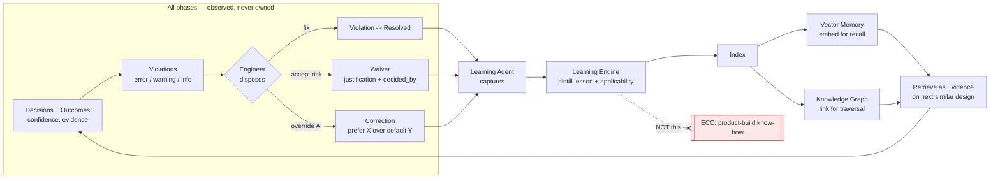

# Mapping → Knowledge & Learning

This document is the **knowledge-and-learning binding** of the Engineering Science Layer. The sibling science docs (`../mathematics/…`, `../physics/…`, `../electrical/…`, `../pcb/…`) capture *durable, first-principles* engineering knowledge — the physics and mathematics that do not change between projects. This doc proves how that durable knowledge, **plus** the *empirical* knowledge a real design run produces (which part qualified, which topology held, which [Violation](../../docs/foundation/engineering-domain-model.md) the engineer waived), is captured, ranked by confidence, and reused — through the runtime's three knowledge organs: the [Knowledge Graph](../../docs/knowledge/knowledge-graph.md) (structured facts), [Vector Memory](../../docs/knowledge/vector-memory.md) (similarity recall), and the [Learning Engine](../../docs/engineering/learning-engine.md) (distilled lessons). It is the **control-theory + probability** view of the runtime: outcomes feed back as confidence-weighted [Evidence](../../docs/foundation/engineering-domain-model.md) that improves the next proposal, while a hard boundary keeps three kinds of knowledge apart — *durable science* (this layer), *learned per-project experience* (the knowledge organs), and *product-build know-how* (ECC, out of the runtime entirely). Where the other runtime-mapping docs trace one phase down the pipeline, this one traces knowledge **sideways across all phases**, because — per the [canonical phase map](../../docs/foundation/architecture-views.md) — learning is an *engine, not a phase*.

---

## The three knowledge tiers (the boundary, stated first)

The whole point of this mapping is a clean separation of *what kind of knowledge lives where*. Conflating them is the failure this layer exists to prevent.

| Tier | What it holds | Where it lives | Changes when… | Durability |
|------|---------------|----------------|---------------|------------|
| **Durable science** | first-principles physics, math, IPC standards — *why* a rule is true | **this layer** (`../mathematics/`, `../physics/`, `../electrical/`, `../pcb/`, `../manufacturing/`) + the [GLOSSARY](../../docs/GLOSSARY.md) | the laws of physics change (never) | permanent |
| **Learned experience** | empirical lessons from real runs: topologies that held, defaults that recurred, corrections the engineer made | runtime knowledge organs — [Knowledge Graph](../../docs/knowledge/knowledge-graph.md), [Vector Memory](../../docs/knowledge/vector-memory.md), distilled by the [Learning Engine](../../docs/engineering/learning-engine.md) | new designs accumulate; confidence decays | per-project / per-org, curated |
| **Per-project state** | *this* board's [Requirement/Schematic/PCB IRs](../../docs/compiler/compiler-ir.md), its [Violations](../../docs/foundation/engineering-domain-model.md) and [Waivers](../../docs/foundation/engineering-domain-model.md) | the design's [Engineering State](../../docs/compiler/ir/engineering-ir.md) + the product docs under `../../docs/` | the engineer edits the design | scoped to one project |
| **Product-build know-how** *(NOT here)* | prompt patterns, doc conventions, agent-design patterns — *how we build EAK* | **ECC** ([GLOSSARY](../../docs/GLOSSARY.md)) | the team improves the product | out of the runtime — never the Learning Engine |

> The defining rule of the [Learning Engine](../../docs/engineering/learning-engine.md): reusable intelligence about *the engineering domain* is captured by the runtime; reusable intelligence about *building the product* goes to ECC. This document is tier 1 (durable science); it names the bridge to tier 2 and the wall to tier 4.

---

## The core mapping: engineering concept → knowledge runtime

Every engineering concept must resolve down the runtime spine — Runtime → Compiler → State Machines → Constraint Engine → Verification → Learning. Read through the **knowledge-and-learning lens**, each stage is a place where knowledge is *typed, asserted, checked, or distilled*.

| Runtime stage | Knowledge artifact (real) | What knowledge is captured / reused here | Science grounding (sibling) |
|---------------|---------------------------|------------------------------------------|-----------------------------|
| **Runtime** | [Event Bus](../../docs/foundation/architecture-views.md) history; the [Learning Agent](../../docs/foundation/architecture-views.md) observes *all* phases | raw experience: every [Decision](../../docs/foundation/engineering-domain-model.md), correction, and outcome becomes a replayable event — the substrate a lesson is distilled from | [control-theory](../mathematics/control-theory.md) (feedback signal), [probability-and-statistics](../mathematics/probability-and-statistics.md) |
| **Compiler** | typed IRs — [Requirement](../../docs/compiler/ir/requirement-ir.md) → [Engineering](../../docs/compiler/ir/engineering-ir.md) → [Schematic](../../docs/compiler/ir/schematic-ir.md) → [PCB](../../docs/compiler/ir/pcb-ir.md); [lowerings](../../docs/compiler/transformations.md) | knowledge is *typed and quantity-bearing* ([units & quantities](../../docs/engineering/units-and-quantities.md)) before it can be indexed as a fact — a lesson references IR shapes, not free text | [linear-algebra](../mathematics/linear-algebra.md), [graph-theory](../mathematics/graph-theory.md) (the netlist a fact attaches to) |
| **State machines** | per-phase FSMs in [`state-machines/`](../../docs/foundation/architecture-views.md) — e.g. [schematic-planning](../../docs/state-machines/schematic-planning.md), [routing-planning](../../docs/state-machines/routing-planning.md) | each phase emits prior-art *requests* ("designs like this one") and *outcomes* ("this topology passed ERC") — the per-phase hooks of the learning loop | [search-algorithms](../mathematics/search-algorithms.md), [decision-theory](../mathematics/decision-theory.md) |
| **Constraint engine** | [Constraint](../../docs/foundation/engineering-domain-model.md) bounds derived from facts | the [Knowledge Graph](../../docs/knowledge/knowledge-graph.md) supplies the *facts* a bound is derived from (a part's datasheet thermal limit → a Max constraint); learned defaults seed plausible bounds | [constraint-satisfaction](../mathematics/constraint-satisfaction.md), [optimization-theory](../mathematics/optimization-theory.md) |
| **Verification** | [Violation](../../docs/foundation/engineering-domain-model.md) → [Waiver](../../docs/foundation/engineering-domain-model.md) lifecycle ([verification-engine](../../docs/engineering/verification-engine.md)) | violation/waiver **pairs** are the highest-value learning signal — a recurring `drc-trace-width` violation-and-fix becomes a reusable lesson; a [Waiver](../../docs/foundation/engineering-domain-model.md)'s `justification` is captured prior art | [ipc-standards](../manufacturing/ipc-standards.md), [dfm-principles](../manufacturing/dfm-principles.md) |
| **Learning** | the [Learning Engine](../../docs/engineering/learning-engine.md): capture → distill → curate, backed by [Vector Memory](../../docs/knowledge/vector-memory.md) + [Knowledge Graph](../../docs/knowledge/knowledge-graph.md) | lessons are distilled, embedded for fuzzy recall, linked for precise traversal, and **decayed by confidence** — then surfaced as [Evidence](../../docs/foundation/engineering-domain-model.md) on the next similar design | [control-theory](../mathematics/control-theory.md), [probability-and-statistics](../mathematics/probability-and-statistics.md), [decision-theory](../mathematics/decision-theory.md) |

The two retrieval organs split by **question shape** — the same split as the science vs. similarity distinction:

| | [Knowledge Graph](../../docs/knowledge/knowledge-graph.md) | [Vector Memory](../../docs/knowledge/vector-memory.md) |
|--|------------------------------------------------------------|--------------------------------------------------------|
| Question | precise, structured, relational — "active RoHS parts with this footprint" | approximate, semantic — "reference designs like this one" |
| Result | exact matches + traversals (deterministic) | ranked candidates + similarity scores |
| Science grounding | [graph-theory](../mathematics/graph-theory.md) (traversal, pattern match) | [linear-algebra](../mathematics/linear-algebra.md) (vector space), [probability-and-statistics](../mathematics/probability-and-statistics.md) (ranking) |
| Role in a flow | *qualify / verify* candidates | *discover* candidates |

The canonical pattern is **fuzzy-then-precise**: Vector Memory finds candidates, the Knowledge Graph qualifies them, the engineer disposes. A similarity hit alone never becomes a design decision.

---

## The feedback loop (the control-theory view)

Learning is a **closed control loop** across the whole pipeline, not a phase in it. The engineer's accept/override at the end is the error signal fed back to the start.

*Figure: the closed learning loop. Violations, waivers, and corrections feed back as confidence-weighted Evidence; the loop's gain is curated by confidence decay. Product-build know-how is explicitly outside the loop — it goes to ECC.*

The loop's three feedback signals map to real domain types in the implementation:

| Feedback signal | Real type ([`eak-domain/src/lib.rs`](../../eak/crates/eak-domain/src/lib.rs)) | Why it is the richest signal |
|-----------------|--------------------------------------------------------------------------------|------------------------------|
| **Fix** | [`Violation`](../../eak/crates/eak-domain/src/lib.rs) status `Open → Resolved` (`rule`, `subjects`, `severity`) | a recurring rule-and-fix (e.g. `drc-unrouted-net`, `dfm-edge-clearance`) generalizes to a default |
| **Waiver** | [`Waiver { violation, justification, decided_by }`](../../eak/crates/eak-domain/src/lib.rs) | "we accepted this risk, here's why" is auditable prior art for the same context |
| **Correction** | [`Decision`](../../eak/crates/eak-domain/src/lib.rs) overriding a proposal (`decider`, `rationale`, `evidence`) | a human disagreeing with the AI default is the strongest "prefer X here" lesson |

---

## The probability / confidence view

Knowledge in this runtime is never a flat "true/false" — every reusable unit carries a **scalar confidence**, and retrieval is **ranking under uncertainty**. This is the probability-and-statistics grounding ([../mathematics/probability-and-statistics.md](../mathematics/probability-and-statistics.md)) and the decision-theoretic grounding ([../mathematics/decision-theory.md](../mathematics/decision-theory.md)) of the whole knowledge layer.

| Quantity | Where (real symbol) | Meaning | Curation behaviour |
|----------|---------------------|---------|--------------------|
| [`Decision.confidence: f64`](../../eak/crates/eak-domain/src/lib.rs) | every recorded decision | the runtime's belief in a proposal | recorded; a low-confidence default is a candidate for a correction lesson |
| [`Evidence.reliability: f64`](../../eak/crates/eak-domain/src/lib.rs) | every supporting fact | how much a cited fact should be trusted | conflicting facts are modelled explicitly, not overwritten |
| reasoning `confidence` | [`eak-reasoning`](../../eak/crates/eak-reasoning/src/anthropic.rs) verdicts | the reasoning provider's self-reported certainty | surfaced as Evidence, never as silent state |
| lesson confidence | [Learning Engine](../../docs/engineering/learning-engine.md) curation | how often a lesson held vs. was overridden | **decays** when stale/overridden; strengthens when validated — computed deterministically from recorded outcomes |
| similarity score | [Vector Memory](../../docs/knowledge/vector-memory.md) results | distance in embedding space | the consumer *thresholds*; below-threshold candidates are ignored, never forced |

Because confidence and curation are computed **deterministically from recorded outcomes** ([learning-engine](../../docs/engineering/learning-engine.md), [verification-engine](../../docs/engineering/verification-engine.md)), the same history replays to the same lessons — the probabilistic surface sits on a reproducible base. This is the line between *durable science* (always true) and *learned experience* (true-so-far, with a confidence that can fall): the science docs in this layer assert; the Learning Engine *believes, with evidence, and can be corrected*.

---

## What each phase contributes to learning

Because learning *observes all phases* (it has no state machine of its own), every phase is both a **producer** of experience and a **consumer** of it. The contributions are concrete and asymmetric:

| Phase ([state machine](../../docs/foundation/architecture-views.md)) | Produces (captured experience) | Consumes (reused experience) | Science grounding |
|----------------------------------------------------------------------|--------------------------------|------------------------------|-------------------|
| [requirement-planning](../../docs/state-machines/requirement-planning.md) | requirement classes that recur | prior requirement phrasings / target ranges | [decision-theory](../mathematics/decision-theory.md) |
| [constraint-extraction](../../docs/state-machines/constraint-extraction.md) | which facts justified which bounds | datasheet-derived limits from the [Knowledge Graph](../../docs/knowledge/knowledge-graph.md) | [constraint-satisfaction](../mathematics/constraint-satisfaction.md) |
| [schematic-planning](../../docs/state-machines/schematic-planning.md) | topologies that passed [ERC](../../docs/state-machines/erc-verification.md) | "reference designs like this" via [Vector Memory](../../docs/knowledge/vector-memory.md) | [circuit-theory](../electrical/circuit-theory.md) |
| [component-placement](../../docs/state-machines/component-placement.md) / [routing-planning](../../docs/state-machines/routing-planning.md) | placement strategies, route patterns that cleared [DRC](../../docs/state-machines/drc-verification.md) | similar-board placement/route prior art | [placement-philosophy](../industry/placement-philosophy.md), [routing-philosophy](../industry/routing-philosophy.md) |
| [drc-verification](../../docs/state-machines/drc-verification.md) / [dfm-verification](../../docs/state-machines/dfm-verification.md) | `drc-…` / `dfm-…` violation-and-fix pairs, waiver rationales | "last time this rule fired here, the fix was X" | [dfm-principles](../manufacturing/dfm-principles.md), [ipc-standards](../manufacturing/ipc-standards.md) |
| [manufacturing-generation](../../docs/state-machines/manufacturing-generation.md) | which gated designs shipped clean | the verification gate's authoritative violation set | [manufacturing-constraints](../manufacturing/manufacturing-constraints.md) |

The asymmetry is the point: a verification phase is a *rich producer* (its violation/waiver pairs are gold), while a planning phase is a *rich consumer* (it most wants prior art). Learning routes experience from the producers to the consumers, deterministically and with provenance.

## A lesson, end to end (worked example)

To show the binding is real, trace one lesson from capture to reuse — the `drc-trace-width` rule observed in [`eak-phases`](../../eak/crates/eak-phases/src/):

1. **Produce.** On board A, a power net fails [`drc-trace-width`](../../docs/engineering/verification-engine.md); the engineer widens the trace. The runtime records a [`Violation`](../../eak/crates/eak-domain/src/lib.rs) `Open → Resolved` plus the [`Decision`](../../eak/crates/eak-domain/src/lib.rs) that fixed it (with `confidence` and `evidence`).
2. **Capture.** The [Learning Agent](../../docs/foundation/architecture-views.md) observes the event pair from the [Event Bus](../../docs/foundation/architecture-views.md).
3. **Distill.** The [Learning Engine](../../docs/engineering/learning-engine.md) forms a lesson — *pattern* ("widen trace for high-current net") + *applicability context* (net class, current target) + *provenance* (the Decision/Violation it came from).
4. **Index.** The lesson is embedded in [Vector Memory](../../docs/knowledge/vector-memory.md) (fuzzy recall) and linked in the [Knowledge Graph](../../docs/knowledge/knowledge-graph.md) (this pattern relates to this net class / [IPC width clause](../manufacturing/ipc-standards.md)).
5. **Retrieve.** On board B, a similar power net appears. Vector Memory returns the lesson as a *candidate*; the Knowledge Graph *qualifies* it against board B's exact current target ([power-distribution](../pcb/power-distribution.md), [power-integrity](../electrical/power-integrity.md)).
6. **Inform & dispose.** The [Routing Agent](../../docs/foundation/architecture-views.md) surfaces a wider default trace as [Evidence](../../docs/foundation/engineering-domain-model.md); the engineer accepts or overrides. Either way, the outcome re-enters at step 1 — accept *strengthens* the lesson's confidence, override *decays* it.

This is the durable-vs-learned line in one trace: the *minimum* width is durable science ([IPC](../manufacturing/ipc-standards.md), [ohms-law](../electrical/ohms-law.md) on conductor heating); the *preferred default for this net class* is a learned lesson that can be corrected.

## Why this binding matters

- **It prevents knowledge pollution.** Without the three-tier boundary, a per-project quirk ("on *this* board we waived edge clearance") could masquerade as durable science, and product-build trivia could leak into user-facing reasoning. The mapping keeps [`drc-…`/`dfm-…` rule outcomes](../../docs/engineering/verification-engine.md) as *learned experience*, IPC clearances as *durable science* ([../manufacturing/ipc-standards.md](../manufacturing/ipc-standards.md)), and prompts/conventions in ECC.
- **It makes reuse auditable.** Every surfaced suggestion is [Evidence](../../docs/foundation/engineering-domain-model.md) with provenance back to the [Decisions](../../docs/foundation/engineering-domain-model.md) and events it was distilled from — a suggestion can always be traced to the past designs that justify it.
- **It keeps the engineer in command.** A lesson is a *proposal*, never a silent state change; only the deterministic runtime commits state, and only with the usual validation and human disposal. The science layer supplies the *why*; the engineer supplies the *whether*.

---

## How to read this

- **Start at the boundary table** to place any piece of knowledge in one of the three live tiers (or recognise it belongs in ECC).
- **Use the core mapping** to follow a concept down the runtime spine and see where it is typed, checked, and distilled — the knowledge-and-learning slice of the [canonical phase map](../../docs/foundation/architecture-views.md).
- **Use the feedback-loop diagram** for the control-theory intuition: violations/waivers/corrections are the error signal; lessons are the controller; confidence decay is the gain.
- For the *first-principles* knowledge a lesson is grounded in, follow the **sibling links** into [`../mathematics/`](../mathematics/control-theory.md), [`../physics/`](../physics/thermal-physics.md), [`../electrical/`](../electrical/signal-integrity.md), [`../pcb/`](../pcb/routing.md). For the runtime *mechanisms*, follow the **`../../docs/` anchors**.

## Related documents

- Runtime organs: [`learning-engine.md`](../../docs/engineering/learning-engine.md) · [`knowledge-graph.md`](../../docs/knowledge/knowledge-graph.md) · [`vector-memory.md`](../../docs/knowledge/vector-memory.md) · [`verification-engine.md`](../../docs/engineering/verification-engine.md) · [`constraint-engine.md`](../../docs/engineering/constraint-engine.md)
- Anchors: [`architecture-views.md`](../../docs/foundation/architecture-views.md) (canonical map) · [`engineering-domain-model.md`](../../docs/foundation/engineering-domain-model.md) (Decision, Evidence, Violation, Waiver) · [`principles.md`](../../docs/foundation/principles.md) · [`GLOSSARY.md`](../../docs/GLOSSARY.md) (ECC boundary)
- Real implementation: [`eak-domain/src/lib.rs`](../../eak/crates/eak-domain/src/lib.rs) (the durable types) · [`eak-phases/`](../../eak/crates/eak-phases/src/) (rule outcomes) · [`eak-reasoning/`](../../eak/crates/eak-reasoning/src/anthropic.rs) (confidence)
- Science grounding: [`control-theory.md`](../mathematics/control-theory.md) · [`probability-and-statistics.md`](../mathematics/probability-and-statistics.md) · [`decision-theory.md`](../mathematics/decision-theory.md) · [`graph-theory.md`](../mathematics/graph-theory.md)
