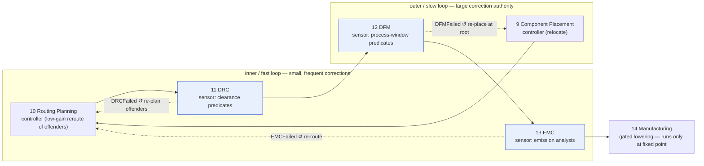

# Mapping → the Phase State Machines

> **Layer:** Engineering Science → **Runtime Mapping** (the *binding* layer). This document is one of the bridges that prove the foundation science is not decoration: every concept in `mathematics/`, `physics/`, `electrical/`, `pcb/`, `manufacturing/`, and `industry/` is shown *terminating* in a concrete runtime artifact.

**Summary.** The EAK runtime is a chain of [phase state machines](../../docs/state-machines/README.md) — fourteen of them, enumerated authoritatively in the [canonical phase map](../../docs/foundation/architecture-views.md#the-canonical-phase-map). Each machine is not arbitrary control flow: it is the *enforcement organ* of one dominant engineering science. Floor planning and placement are spatial optimization under geometric constraints; routing is graph search over a congestion-priced resource graph; ERC/DRC/DFM are deterministic predicate checks; EMC is bounded analysis; manufacturing is a gated lowering. This document is the **binding table** between the two halves of the repository: for every phase it names the science it enforces, the foundation doc that grounds the *why*, the [state machine](../../docs/state-machines/README.md) that *is* the enforcement, the [engine](../../docs/engineering/constraint-engine.md) it calls, and the [IR](../../docs/compiler/compiler-ir.md) it produces or checks. It then shows the two structural facts that make the chain a *system* rather than a list: the iterative **↺ loop-backs** (DRC↺Routing, EMC↺Routing, DFM↺Placement) are a closed-loop control system grounded in [control-theory](../mathematics/control-theory.md), and the **gates** between phases are decision thresholds grounded in [decision-theory](../mathematics/decision-theory.md). Read this when you need to answer "*which science does this phase enforce, and where in the runtime does it live?*" — every claim below links to a real artifact whose path resolves.

---

## The master mapping table

The phase numbering, FSM names, engines, and IRs are taken verbatim from the [canonical phase map](../../docs/foundation/architecture-views.md#the-canonical-phase-map) — this table adds the **dominant science enforced** and its **foundation doc** for each phase, and is consistent with that source of truth, not a competing list. (Phase 4, *Datasheet Intelligence*, is reasoning-driven and deferred; it feeds the [Knowledge Graph](../../docs/knowledge/knowledge-graph.md) rather than enforcing a checkable law, so it carries no science-enforcement row here.)

| # | Phase · State machine | Dominant science it enforces | Foundation doc (the *why*) | Engine | IR effect |
|---|----------------------|------------------------------|----------------------------|--------|-----------|
| 1 | [Requirement Planning](../../docs/state-machines/requirement-planning.md) | Quantities carry units + tolerance; intent → testable statements | [units-and-quantities](../../docs/engineering/units-and-quantities.md), [probability-and-statistics](../mathematics/probability-and-statistics.md) | Planning | produces [Requirement IR](../../docs/compiler/ir/requirement-ir.md) |
| 2 | [Engineering Analysis](../../docs/state-machines/engineering-analysis.md) | Power/thermal/signal **budgets** must balance (conservation) | [circuit-theory](../electrical/circuit-theory.md), [thermal-physics](../physics/thermal-physics.md) | Planning, Constraint | lowers → [Engineering IR](../../docs/compiler/ir/engineering-ir.md) |
| 3 | [Constraint Extraction](../../docs/state-machines/constraint-extraction.md) | A design is a **CSP**: rules become machine-checkable predicates | [constraint-satisfaction](../mathematics/constraint-satisfaction.md), [constraint-systems](../industry/constraint-systems.md) | Constraint | enriches Engineering IR |
| 5 | [BOM Planning](../../docs/state-machines/bom-planning.md) | Selection under cost/availability/compliance constraints | [optimization-theory](../mathematics/optimization-theory.md), [decision-theory](../mathematics/decision-theory.md) | Constraint | produces [BOM IR](../../docs/compiler/ir/bom-ir.md) |
| 6 | [Schematic Planning](../../docs/state-machines/schematic-planning.md) | Connectivity is a **graph**; nets are equivalence classes of pins | [graph-theory](../mathematics/graph-theory.md), [kirchhoff-laws](../electrical/kirchhoff-laws.md) | Planning, Constraint | produces [Schematic IR](../../docs/compiler/ir/schematic-ir.md) |
| 7 | [ERC Verification](../../docs/state-machines/erc-verification.md) | Electrical legality: every net driven, no driver conflict | [kirchhoff-laws](../electrical/kirchhoff-laws.md), [circuit-theory](../electrical/circuit-theory.md) | Verification | checks Schematic IR |
| 8 | [PCB Floor Planning](../../docs/state-machines/pcb-floor-planning.md) | Region allocation + stack-up: geometry × layered fields | [computational-geometry](../mathematics/computational-geometry.md), [stackup](../pcb/stackup.md), [placement-philosophy](../industry/placement-philosophy.md) | Planning, Constraint | lowers → [PCB IR](../../docs/compiler/ir/pcb-ir.md) |
| 9 | [Component Placement](../../docs/state-machines/component-placement.md) | Spatial **optimization** under non-overlap + thermal/keep-out | [optimization-theory](../mathematics/optimization-theory.md), [computational-geometry](../mathematics/computational-geometry.md), [placement](../pcb/placement.md) | Constraint | enriches PCB IR |
| 10 | [Routing Planning](../../docs/state-machines/routing-planning.md) | **Search** over a congestion-priced routing graph | [search-algorithms](../mathematics/search-algorithms.md), [graph-theory](../mathematics/graph-theory.md), [routing](../pcb/routing.md) | Constraint, Planning | enriches PCB IR |
| 11 | [DRC Verification](../../docs/state-machines/drc-verification.md) | Geometric/electrical **clearance** predicates | [computational-geometry](../mathematics/computational-geometry.md), [manufacturing-constraints](../manufacturing/manufacturing-constraints.md) | Verification | checks PCB IR |
| 12 | [DFM Verification](../../docs/state-machines/dfm-verification.md) | Manufacturability: geometry within a **statistical process window** | [dfm-principles](../manufacturing/dfm-principles.md), [ipc-standards](../manufacturing/ipc-standards.md) | Verification | checks PCB IR |
| 13 | [EMC Analysis](../../docs/state-machines/emc-analysis.md) | Emission/coupling **analysis** vs. limits (field physics) | [emi-emc](../pcb/emi-emc.md), [electromagnetics](../physics/electromagnetics.md), [maxwell-equations](../physics/maxwell-equations.md) | Verification (analysis) | analyzes PCB IR |
| 14 | [Manufacturing Generation](../../docs/state-machines/manufacturing-generation.md) | Gated **lowering** to fab/assembly outputs (terminal) | [manufacturing-methodology](../industry/manufacturing-methodology.md), [ipc-standards](../manufacturing/ipc-standards.md) | Verification (the gate) | lowers PCB+BOM → [Manufacturing IR](../../docs/compiler/ir/manufacturing-ir.md) |
| — | Learning (cross-cutting, no FSM) | Bayesian update of thresholds/lessons from outcomes | [probability-and-statistics](../mathematics/probability-and-statistics.md), [decision-theory](../mathematics/decision-theory.md) | [Learning Engine](../../docs/engineering/learning-engine.md) | observes all + [vector memory](../../docs/knowledge/vector-memory.md) |

*Every entry maps a science doc to the runtime artifact that makes it executable; the "engine" and "IR effect" columns are the authoritative values from [architecture-views](../../docs/foundation/architecture-views.md#the-canonical-phase-map).*

### Two domains, one seam

The fourteen phases fall into two halves, and the science changes character at the boundary:

- **Logical domain (phases 1–7)** is *discrete and topological*: requirements, blocks, a connectivity graph, electrical legality. The dominant sciences are [graph-theory](../mathematics/graph-theory.md), [constraint-satisfaction](../mathematics/constraint-satisfaction.md), and [kirchhoff-laws](../electrical/kirchhoff-laws.md). There is no geometry yet — only *what connects to what*.
- **Physical domain (phases 8–14)** is *continuous and geometric/field-theoretic*: positions, copper, clearances, emissions, fabrication tolerances. The dominant sciences become [computational-geometry](../mathematics/computational-geometry.md), [optimization-theory](../mathematics/optimization-theory.md), [electromagnetics](../physics/electromagnetics.md), and [dfm-principles](../manufacturing/dfm-principles.md).

The two halves meet at exactly **one lowering seam**: [PCB Floor Planning](../../docs/state-machines/pcb-floor-planning.md) lowers [Schematic IR](../../docs/compiler/ir/schematic-ir.md) → [PCB IR](../../docs/compiler/ir/pcb-ir.md), turning logical nets into a board with regions and a [stack-up](../pcb/stackup.md). Every loop-back in the next section stays *within* the physical half (it re-routes or re-places), except [ERC↺Schematic](../../docs/state-machines/erc-verification.md), which is the logical half's own correction loop. The seam is one-way: physical iteration never edits the schematic graph, it only re-realizes it.

---

## The ↺ loops are a control system, not a retry

The chain is *not* a one-way pipeline. The [default workflow plan](../../docs/foundation/architecture-views.md#default-workflow-plan) carries three dotted loop-back edges, and they are exactly the negative-feedback control loops grounded in [control-theory](../mathematics/control-theory.md): the verification phases are **sensors**, the [manufacturing gate](../../docs/engineering/verification-engine.md) is the **comparator** (reference `r = ∅` open errors), and the fixing phases are **controllers** that emit a corrective action.

*Figure: the three loop-backs as cascade control. The DRC↺Routing / EMC↺Routing inner loop fires often and moves little; only when it cannot converge does control escalate to the slower DFM↺Placement outer loop. Edge names are the real loop-back signals (`DRCFailed`, `EMCFailed`, `DFMFailed`) the [orchestrator](../../docs/core/workflow-orchestration.md) routes.*

Why these targets and not others (each is a *recorded* transition in the named FSM):

- **DRC↺Routing** and **EMC↺Routing** both land on [Routing Planning](../../docs/state-machines/routing-planning.md) (`Idle → LoadingPlacedBoard: … DRC or EMC loop-back`). Clearance breaches and emission/coupling are *routing-dominated*, so the controller re-plans **only the offending nets** (`ValidatingRouting → PlanningRouting: re-plan offenders`) — the low-gain correction that keeps the loop from oscillating. The damping is the negotiated-congestion **historical-cost ratchet** that [search-algorithms](../mathematics/search-algorithms.md) and [control-theory](../mathematics/control-theory.md) describe; without it the same two nets swap the same track forever (a limit cycle).
- **DFM↺Placement** lands on [Component Placement](../../docs/state-machines/component-placement.md) (`Idle → LoadingFloorPlan: … DFM loop-back`) because manufacturability defects are usually *placement*-rooted; this is the slow outer loop with greater correction authority. Rerouting a board the placement makes infeasible is iterating an empty feasible set — the cascade escalation is the only correct exit.
- **ERC↺Schematic** is the logical-domain analogue: [ERC Verification](../../docs/state-machines/erc-verification.md)'s `Failed` loops to [Schematic Planning](../../docs/state-machines/schematic-planning.md), correcting an electrical-legality defect at its topological source.

Every loop is **bounded** — a stated, finite iteration budget (the orchestrator's "convergence safeguards"), never a silent cap ([P13](../../docs/foundation/principles.md)). Hitting the bound is not failure; it is the *diagnostic signal* that the feasible set is empty, which triggers either the outer cascade loop or a [human-in-the-loop](../../docs/engineering/human-in-the-loop.md) decision. See [control-theory § Bounded iteration](../mathematics/control-theory.md) for the full argument; the runtime obligation lives in [workflow-orchestration](../../docs/core/workflow-orchestration.md).

---

## The gates are decision thresholds

Between phases sit **gates**: a gate decides whether the design may *advance*. Grounded in [decision-theory](../mathematics/decision-theory.md), every gate is the cost-ratio threshold `τ = C_FR / (C_FR + C_FA)` — and for shipping hardware the cost of a false accept (`C_FA`, a fabricated defect) dominates, driving safety-critical gates to the degenerate `τ → 0`: *any* open error-severity violation blocks. This is why the gate is a **hard predicate**, not a tunable score.

| Gate (in FSM) | Predicate enforced | Decision-theoretic reading | Real artifact |
|---------------|--------------------|----------------------------|---------------|
| Per-phase DRC | no open `error` violation from DRC's *own* rules | `τ → 0` (false accept = clearance failure shipped) | `EvaluatingRules → Failed` in [drc-verification](../../docs/state-machines/drc-verification.md); rules `drc-out-of-bounds`, `drc-courtyard-overlap`, `drc-trace-width`, `drc-unrouted-net` |
| Per-phase DFM | no open `error` violation from DFM's own rules | `τ → 0` (false accept = un-buildable board) | [dfm-verification](../../docs/state-machines/dfm-verification.md); rules `dfm-edge-clearance`, `dfm-trace-edge-clearance` |
| EMC | results within limits, or recorded acceptance; **indeterminate ≠ pass** | minimax: an unknown state is priced at worst case | `InterpretingResults → Passed` / `RunningAnalysis → Failed` (`EMCIndeterminate`) in [emc-analysis](../../docs/state-machines/emc-analysis.md); rule `emc-antenna-length` |
| ERC | every net driven, no driver conflict | `τ → 0` on electrical-legality errors | [erc-verification](../../docs/state-machines/erc-verification.md); rules `erc-power-net-undriven`, `erc-multiple-drivers` |
| **Manufacturing (global)** | **zero** open `error` violations across **all** phases, no valid waiver | the `C_FA → ∞` degenerate gate; the loop's stopping condition made enforceable | `CheckingGate → Blocked` in [manufacturing-generation](../../docs/state-machines/manufacturing-generation.md) — `ctx.violations().filter(is_blocking).count() > 0` |
| Autonomy / HITL | may the runtime *dispose* autonomously, or must it escalate? | `τ` shifts with autonomy level; per-capability `C_FA` pulls it back to 0 | `ProposingPlacement → AwaitingApproval` (supervised) vs `→ CommittingPlacement` (autonomous) across the planning FSMs |

A **[Waiver](../../docs/engineering/verification-engine.md)** is the recorded acceptance of residual risk: it removes a violation's *blocking* status (`τ` raised by a decider who owns the consequence) without deleting the evaluation fact — the audit trail survives. The manufacturing gate spans ERC/DRC/BOM/DFM/EMC precisely because it is the **comparator** of the control loop above: it is the single point where the cross-phase error signal `e = r − y` is formed, and `e = ∅` is the fixed point that means *manufacturable*. See [control-theory § The comparator](../mathematics/control-theory.md) and [decision-theory § The manufacturing gate](../mathematics/decision-theory.md).

---

## Where the compiler and engines fit

Each phase is one object seen from several layers at once: a **Runtime** FSM that is also a **Compiler** transformation, calling **Engines**, observed by **Learning**. That is the doc's full lens — *Runtime → Compiler → State Machines → Constraint Engine → Verification → Learning* — and the phases are where the layers meet:

- **Compiler.** The forward edges of the pipeline are [IR lowerings](../../docs/compiler/transformations.md): Requirement → Engineering → Schematic → PCB → Manufacturing, with BOM as a side IR. A *planning* phase **lowers or enriches** an IR (e.g. [PCB Floor Planning](../../docs/state-machines/pcb-floor-planning.md) lowers Schematic IR → [PCB IR](../../docs/compiler/ir/pcb-ir.md)); a *verification* phase **checks** an IR without mutating it (DRC/DFM write only [Violations](../../docs/foundation/engineering-domain-model.md#violation)/[Waivers](../../docs/engineering/verification-engine.md)). The "IR effect" column of the [master table](#the-master-mapping-table) *is* the compiler view of each FSM; the [Manufacturing IR](../../docs/compiler/ir/manufacturing-ir.md) is the released artifact ([compiler-ir overview](../../docs/compiler/compiler-ir.md)).
- **Constraint Engine.** The [Constraint Engine](../../docs/engineering/constraint-engine.md) holds the *setpoints* every controller drives toward — clearances, per-net-class widths, keep-outs, thermal limits — resolved from [Constraint Extraction](../../docs/state-machines/constraint-extraction.md). A planning phase reads them as its objective's hard constraints; a verification phase reads the same values as the predicate it tests. One source, two readings — the [constraint-satisfaction](../mathematics/constraint-satisfaction.md) feasibility oracle.
- **Verification Engine.** ERC/DRC/DFM/EMC and the manufacturing gate all run on one shared [Verification Engine](../../docs/engineering/verification-engine.md) Rule→Violation→Waiver lifecycle; the per-phase gates and the global gate differ only in *scope*, not mechanism.
- **Learning.** The cross-cutting [Learning Engine](../../docs/engineering/learning-engine.md) observes every disposal, waiver, and field outcome and updates the gate thresholds and lessons ([vector memory](../../docs/knowledge/vector-memory.md), [knowledge-graph](../../docs/knowledge/knowledge-graph.md)) — the [probability-and-statistics](../mathematics/probability-and-statistics.md) Bayesian-update view of the same loop. It binds to no FSM because it is a policy over *all* of them.

## Three phases in depth (science → state → transition)

To show the binding is literal and not hand-waved, three representative phases traced from science down to a named transition:

- **Routing as priced search.** [search-algorithms](../mathematics/search-algorithms.md) and [routing](../pcb/routing.md) say a router explores a state space of partial paths over a resource graph, paying a cost surface that rises on contended resources. That *is* [Routing Planning](../../docs/state-machines/routing-planning.md): `LoadingPlacedBoard` reads the net classes and clearances (the graph + edge weights), `PlanningRouting` proposes [Tracks](../../docs/foundation/engineering-domain-model.md#track--routing) under those weights, and `ValidatingRouting → PlanningRouting (re-plan offenders)` is one search iteration with the congestion cost updated. The **per-net-class trace width** (Phase-3 increment 10) is the concrete setpoint the width sub-loop drives to; a width breach is a non-zero error nulled by widening or re-pathing.
- **Placement as constrained geometry optimization.** [optimization-theory](../mathematics/optimization-theory.md) + [computational-geometry](../mathematics/computational-geometry.md) + [placement](../pcb/placement.md) frame placement as minimizing an objective (wirelength, thermal spread) subject to **non-overlap** and keep-out. [Component Placement](../../docs/state-machines/component-placement.md) enforces exactly the geometric constraints in `ValidatingPlacement` ("courtyards do not overlap; placements stay inside their region; keep-out and thermal constraints hold"), and `ValidatingPlacement → ProposingPlacement (overlap / keep-out breach)` is the re-optimization step.
- **DFM as a process-window predicate.** [dfm-principles](../manufacturing/dfm-principles.md) says geometry must fall inside a *statistically-bounded* fabrication window. The **board-edge keep-out** (increment 9) is sourced from the fabrication process, sized to the worst-case edge tolerance — a [decision-theory](../mathematics/decision-theory.md) minimax margin — and checked by `dfm-trace-edge-clearance` in [DFM Verification](../../docs/state-machines/dfm-verification.md); a track inside it is a blocking `error` that loops back to placement.
- **ERC as graph legality (the logical-domain analogue).** [graph-theory](../mathematics/graph-theory.md) models a netlist as pins partitioned into [Nets](../../docs/foundation/engineering-domain-model.md#net) (equivalence classes); [kirchhoff-laws](../electrical/kirchhoff-laws.md) demand every node be *driven* and free of conflicting drivers. [Schematic Planning](../../docs/state-machines/schematic-planning.md) builds that graph (it explicitly does *not* check legality), and [ERC Verification](../../docs/state-machines/erc-verification.md) enforces the legality predicates — `erc-power-net-undriven` (a floating power node) and `erc-multiple-drivers` (a short between drivers) — looping back to schematic on failure. This is the same sensor→comparator→controller shape as the physical loops, one ring earlier in the pipeline.

The implementing machines live under [`eak/crates/eak-phases/src/`](../../eak/crates/eak-phases/src/) (`routing_planning.rs`, `component_placement.rs`, `dfm_verification.rs`, …); the verification rule sets they run on the shared [Verification Engine](../../docs/engineering/verification-engine.md) are wired in [`eak/crates/eak-phases/src/lib.rs`](../../eak/crates/eak-phases/src/lib.rs); the IR lowerings they drive are in [`eak/crates/eak-compiler/src/`](../../eak/crates/eak-compiler/src/) and described in [transformations](../../docs/compiler/transformations.md).

---

## Failure modes if the binding is wrong

The mapping is load-bearing: get the phase→science or gate→threshold binding wrong and the runtime fails in a way that *looks* like working software. Each row below is a concrete bug, not a hypothetical.

- **A phase enforcing the wrong science.** If [DRC](../../docs/state-machines/drc-verification.md) were given a *placement* objective (optimize) instead of a *clearance* predicate (decide), it would silently "improve" a board past a violation rather than block it — the sensor would lie. A verification phase must enforce a [decision-theory](../mathematics/decision-theory.md) predicate; a planning phase must run an [optimization-theory](../mathematics/optimization-theory.md) search. Swapping the two is the most common architectural smell.
- **A gate set at `τ = 0.5`.** Any cost-blind threshold ships defects whenever `P(unsafe) < 0.5` despite an unbounded `C_FA`. Every error-severity gate in the [table above](#the-gates-are-decision-thresholds) must pin `τ → 0`; the [manufacturing global gate](../../docs/state-machines/manufacturing-generation.md) is the canonical instance ([decision-theory](../mathematics/decision-theory.md)).
- **A loop-back that re-plans the whole board.** Re-planning everything on a minor breach is high loop gain (`L ≥ 1`): each pass creates as many violations as it clears, so the [control loop](../mathematics/control-theory.md) thrashes. The `re-plan offenders` localization in [routing-planning](../../docs/state-machines/routing-planning.md) is the low-gain correction that keeps it stable.
- **An unbounded loop, or a silent cap.** A loop with no iteration budget hangs on a non-convergent project; a *hidden* cap that returns best-so-far masks non-convergence as success — the most dangerous failure of all, since an unmanufacturable board reaches the fab. The bound must be **stated** ([P13](../../docs/foundation/principles.md)), and hitting it must escalate, not pass.
- **`indeterminate` collapsed to pass.** Treating a missing EMC analysis or an unrouted net as "safe" prices an unknown state at its best case. The [EMC](../../docs/state-machines/emc-analysis.md) `RunningAnalysis → Failed (EMCIndeterminate)` edge and the `drc-unrouted-net` completeness guard exist precisely to keep an unknown a non-pass.

## How to read this

- **Start from a phase** in the [master table](#the-master-mapping-table). The "dominant science" column tells you *which law the phase exists to enforce*; the foundation-doc link is the *why*; the FSM link is the *how* (states, transitions, events).
- **Following a failure?** Use the [control-system diagram](#the--loops-are-a-control-system-not-a-retry): a verification `Failed` is a sensor reading, and the dotted edge tells you which controller (FSM) the [orchestrator](../../docs/core/workflow-orchestration.md) will re-enter and why.
- **Asking "can this advance / ship?"** Use the [gate table](#the-gates-are-decision-thresholds): the predicate is a decision threshold, almost always `τ → 0` for error-severity, and the global manufacturing gate is the cross-phase all-clear.
- **One claim per artifact.** This is a *binding* doc: it adds no new law and no new state. Where it states a state name, transition, rule ID, or engine, that value is owned by the linked [state-machine](../../docs/state-machines/README.md), [engine](../../docs/engineering/verification-engine.md), or [architecture-views](../../docs/foundation/architecture-views.md) doc, never invented here.

## Related documents

- **Science this doc binds:** [control-theory](../mathematics/control-theory.md) (the loop-backs) · [decision-theory](../mathematics/decision-theory.md) (the gates) · [optimization-theory](../mathematics/optimization-theory.md) · [search-algorithms](../mathematics/search-algorithms.md) · [graph-theory](../mathematics/graph-theory.md) · [computational-geometry](../mathematics/computational-geometry.md) · [constraint-satisfaction](../mathematics/constraint-satisfaction.md) · [kirchhoff-laws](../electrical/kirchhoff-laws.md) · [placement](../pcb/placement.md) · [routing](../pcb/routing.md) · [emi-emc](../pcb/emi-emc.md) · [dfm-principles](../manufacturing/dfm-principles.md).
- **Runtime anchors:** [architecture-views](../../docs/foundation/architecture-views.md) (canonical map) · [workflow-orchestration](../../docs/core/workflow-orchestration.md) (loop graph + gates) · [verification-engine](../../docs/engineering/verification-engine.md) (rules/severity/waivers) · [constraint-engine](../../docs/engineering/constraint-engine.md) · [planning-engine](../../docs/engineering/planning-engine.md) · [learning-engine](../../docs/engineering/learning-engine.md) · [human-in-the-loop](../../docs/engineering/human-in-the-loop.md) · [principles](../../docs/foundation/principles.md) (P13 stated bounds) · [GLOSSARY](../../docs/GLOSSARY.md).
- **State machines (all 14):** the [state-machines index](../../docs/state-machines/README.md).
- **Implementation:** [`eak/crates/eak-phases/src/`](../../eak/crates/eak-phases/src/) (the machines) · [`eak/crates/eak-engines/src/`](../../eak/crates/eak-engines/src/) (constraint/verification/planning/learning) · [`eak/crates/eak-compiler/src/`](../../eak/crates/eak-compiler/src/) (IR lowerings) · [`eak/crates/eak-domain/src/`](../../eak/crates/eak-domain/src/).
