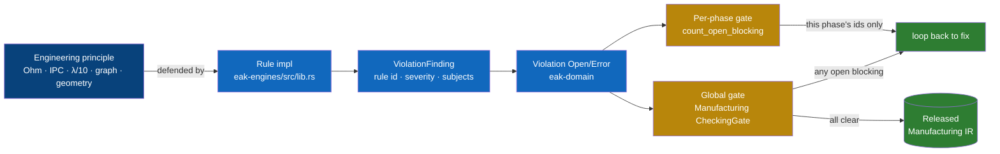
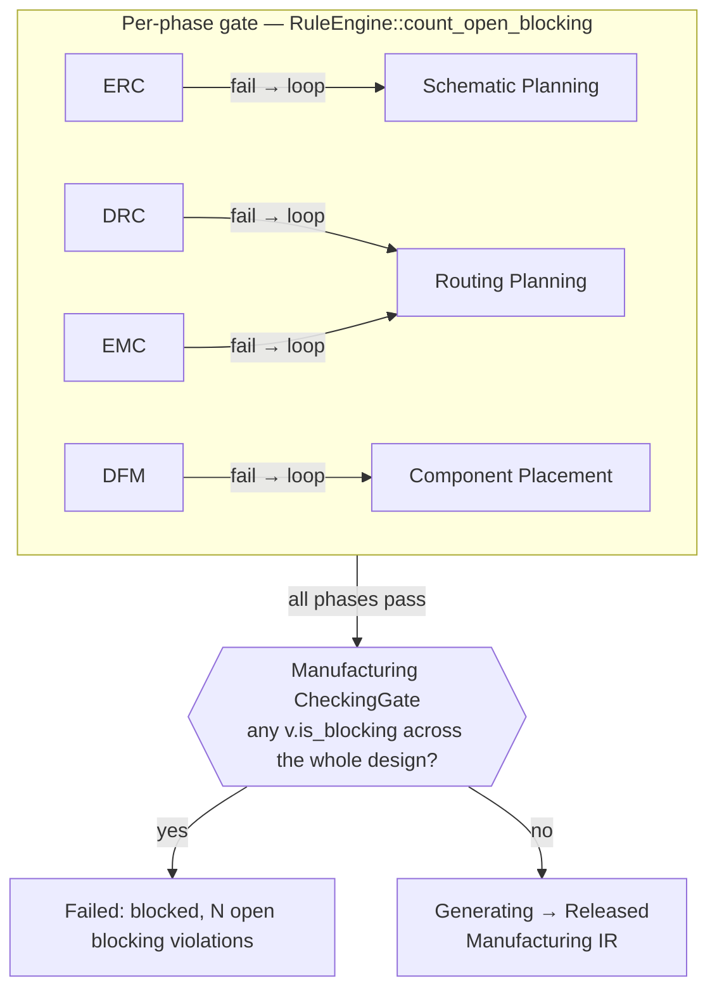

# Mapping → Verification (DRC/ERC/DFM/EMC + the gate)

> **Layer:** runtime-mapping (the binding layer). This document is a *lens*, not a tutorial: it takes each verification **rule actually implemented** in [`eak-engines`](../../eak/crates/eak-engines/src/lib.rs) and traces it back to the engineering principle it defends and forward to the runtime that runs it. The claim it proves is narrow and checkable — *every rule ID in the codebase exists because a named law of physics, geometry, or manufacturing says a board fails without it*, and *no design with an open blocking defect is ever released*. Verification is where the Engineering Science Layer stops being prose and becomes a pass/fail predicate over an [IR](../../docs/compiler/compiler-ir.md). If a link here does not resolve or a rule ID is invented, this doc has failed its only job.

EAK has **four rule-check phases** (ERC, DRC, DFM, EMC) plus two upstream consistency checks (constraint, BOM), each modeled as a state machine and each backed by concrete `Rule` implementations. They all share one shape — a rule reads a [`VerificationContext`](../../docs/engineering/verification-engine.md), emits zero or more `ViolationFinding`s, and the phase raises them as first-class [`Violation`](../../docs/foundation/engineering-domain-model.md)s. A phase fails on *its own* open blocking findings; the [Manufacturing Generation](../../docs/state-machines/manufacturing-generation.md) phase fails on *anyone's*. That two-tier gate is the manufacturing all-clear.

## The shape of every rule

*Figure: a principle becomes a `Rule`, a `Rule` emits a `ViolationFinding`, a finding is raised as a [`Violation`](../../docs/foundation/engineering-domain-model.md), and two gates read those violations. Severity/status live in [`eak-domain`](../../eak/crates/eak-domain/src/lib.rs); `Error` is the only severity that can block, and only while `Open`.*

## The rule → principle → runtime table

Every row is real: the **Rule ID** is the literal `pub const ID` string in [`eak-engines/src/lib.rs`](../../eak/crates/eak-engines/src/lib.rs); the **Principle** links the foundation doc that justifies it; the **Phase** links the state machine that runs it.

| Rule ID (real `const ID`) | Principle it defends | Foundation doc | Runtime phase / FSM |
|---|---|---|---|
| `erc-power-net-undriven` | A power net with no driver cannot establish a node potential — Kirchhoff/circuit law. | [kirchhoff-laws](../electrical/kirchhoff-laws.md), [circuit-theory](../electrical/circuit-theory.md) | [erc-verification](../../docs/state-machines/erc-verification.md) |
| `erc-multiple-drivers` | Two outputs on one net is bus contention — undefined logic, possible short. | [circuit-theory](../electrical/circuit-theory.md) | [erc-verification](../../docs/state-machines/erc-verification.md) |
| `drc-out-of-bounds` | A footprint outside the board outline cannot be fabricated — geometric containment. | [computational-geometry](../mathematics/computational-geometry.md), [placement](../pcb/placement.md) | [drc-verification](../../docs/state-machines/drc-verification.md) |
| `drc-courtyard-overlap` | Overlapping courtyards collide at assembly — IPC-7351 courtyard rule. | [ipc-standards](../manufacturing/ipc-standards.md), [placement](../pcb/placement.md) | [drc-verification](../../docs/state-machines/drc-verification.md) |
| `drc-trace-width` | Copper finer than the process floor cannot be etched / cannot carry the current — Ohm + IPC-2152. | [ohms-law](../electrical/ohms-law.md), [ipc-standards](../manufacturing/ipc-standards.md) | [drc-verification](../../docs/state-machines/drc-verification.md) |
| `drc-unrouted-net` | A net with no track is an open circuit — graph connectivity (a net is an edge that must be realized). | [graph-theory](../mathematics/graph-theory.md), [routing](../pcb/routing.md) | [drc-verification](../../docs/state-machines/drc-verification.md) |
| `dfm-edge-clearance` | A body inside the board-edge keep-out is nicked during depanelization — fab keep-out band. | [manufacturing-constraints](../manufacturing/manufacturing-constraints.md), [dfm-principles](../manufacturing/dfm-principles.md) | [dfm-verification](../../docs/state-machines/dfm-verification.md) |
| `dfm-trace-edge-clearance` | Copper inside the same keep-out is sheared at the panel break — the copper twin of the rule above. | [manufacturing-constraints](../manufacturing/manufacturing-constraints.md), [dfm-principles](../manufacturing/dfm-principles.md) | [dfm-verification](../../docs/state-machines/dfm-verification.md) |
| `emc-antenna-length` | A track longer than λ/10 at the worst-case operating frequency radiates — RF antenna rule of thumb. | [rf-physics](../physics/rf-physics.md), [emi-emc](../pcb/emi-emc.md) | [emc-analysis](../../docs/state-machines/emc-analysis.md) |
| `bom-coverage` | A component with no part cannot be ordered — BOM completeness. | [manufacturing-methodology](../industry/manufacturing-methodology.md) | [bom-planning](../../docs/state-machines/bom-planning.md) |
| `bom-lifecycle` | An EOL part cannot be sourced (Error); an NRND part is a future risk (Warning). | [manufacturing-methodology](../industry/manufacturing-methodology.md) | [bom-planning](../../docs/state-machines/bom-planning.md) |
| `constraint-consistency` | A requirement cannot demand mutually contradictory targets — constraint satisfiability. | [constraint-satisfaction](../mathematics/constraint-satisfaction.md), [constraint-systems](../industry/constraint-systems.md) | [constraint-extraction](../../docs/engineering/constraint-engine.md) |

## What each rule reads — the `VerificationContext`

A rule is a pure function of one read-only struct, `VerificationContext` in [`eak-engines/src/lib.rs`](../../eak/crates/eak-engines/src/lib.rs). It carries borrowed slices of the engineering state — `requirements`, `constraints`, `components`, `pins`, `nets`, `parts`, `bom_line_items`, `board: Option`, `placements`, `tracks` — so a rule never mutates state; it only *reads an IR slice and emits findings*. Which slice a rule reads is itself a fact about which IR it verifies:

| Rule | Reads from context | Verifies which IR |
|---|---|---|
| `erc-power-net-undriven`, `erc-multiple-drivers` | `nets`, `pins` | [Schematic IR](../../docs/compiler/ir/schematic-ir.md) |
| `drc-out-of-bounds`, `drc-courtyard-overlap` | `placements`, `board` | [PCB IR](../../docs/compiler/ir/pcb-ir.md) (placement) |
| `drc-trace-width`, `drc-unrouted-net` | `tracks`, `nets`, `requirements` | [PCB IR](../../docs/compiler/ir/pcb-ir.md) (routing) |
| `dfm-edge-clearance`, `dfm-trace-edge-clearance` | `placements`/`tracks`, `board`, `requirements` | [PCB IR](../../docs/compiler/ir/pcb-ir.md) |
| `emc-antenna-length` | `tracks`, `requirements` | [PCB IR](../../docs/compiler/ir/pcb-ir.md) |
| `bom-coverage`, `bom-lifecycle` | `components`, `parts`, `bom_line_items` | [BOM IR](../../docs/compiler/ir/bom-ir.md) |
| `constraint-consistency` | `constraints`, `requirements` | [Engineering IR](../../docs/compiler/ir/engineering-ir.md) |

The `board` being `Option` is load-bearing: with no outline there is no edge to measure from, so both DFM edge rules stay silent rather than inventing a board — the same "no stated input → no finding" discipline as `drc-trace-width`.

## Five worked traces (the load-bearing ones)

**`drc-trace-width` ← Ohm + IPC-2152.** `DrcTraceWidthRule` takes the design's *minimum manufacturable trace width* as the **first** Length target on a `Fabrication` requirement (`fabrication_length_targets(...).next()`), converts both it and each `Track.width` to SI metres via `si_magnitude()` ([P9 — unit discipline](../../docs/engineering/units-and-quantities.md)), and raises an `Error` when a track is finer than that floor by more than a ~1 nm relative epsilon. With no stated process floor the rule emits nothing — it refuses to invent a number. This is the runtime form of two principles at once: the etch/ampacity floor of [IPC-2152](../manufacturing/ipc-standards.md) and the current-vs-resistance reasoning of [Ohm's law](../electrical/ohms-law.md).

**`emc-antenna-length` ← λ/10.** `EmcAntennaLengthRule` computes `critical_len = SPEED_OF_LIGHT_M_S / (ELECTRICAL_LENGTH_DIVISOR * f)` with the literal constants `SPEED_OF_LIGHT_M_S = 299_792_458.0` and `ELECTRICAL_LENGTH_DIVISOR = 10.0` — i.e. **one-tenth of a wavelength** at the *highest* stated frequency target (shortest wavelength → tightest limit). Each track's straight-line copper length (`dx.hypot(dy)`) over that limit is flagged as a radiated-emissions `Error`. A stated-but-malformed (non-positive / non-finite) frequency is surfaced loudly rather than silently passing an electrically-long board ([P13 — no silent failure](../../docs/foundation/principles.md)). This is exactly the [RF physics](../physics/rf-physics.md) / [EMI-EMC](../pcb/emi-emc.md) antenna heuristic made executable.

**`dfm-edge-clearance` ← manufacturing keep-out.** Both DFM edge rules read one shared band, `resolve_edge_keepout_si(...)`: the **second** `Fabrication` Length target (slot 1) when stated, else `DFM_EDGE_CLEARANCE_FALLBACK_MM = 0.5`. `dfm-edge-clearance` checks component courtyards; `dfm-trace-edge-clearance` checks copper — the two always agree because they resolve the *same* number. The band is the [manufacturing constraint](../manufacturing/manufacturing-constraints.md) that depanelization nicks anything too close to the edge; sourcing it from a `Fabrication` requirement (with a constant fallback) is how a [DFM principle](../manufacturing/dfm-principles.md) becomes per-design data rather than a magic literal.

**`drc-unrouted-net` ← graph connectivity.** `DrcUnroutedNetRule` treats every committed `Net` as an edge that must be *realized* by at least one `Track`; a net with no copper is an electrical break, raised as an `Error`. It is the downstream check that makes net-realization completeness a first-class, traceable [`Violation`](../../docs/foundation/engineering-domain-model.md) instead of resting on the upstream "every component placed" invariant. The principle is [graph theory](../mathematics/graph-theory.md): connectivity is not assumed from the netlist, it is *proved* against the routed [PCB IR](../../docs/compiler/ir/pcb-ir.md).

**`drc-courtyard-overlap` ← IPC-7351 placement.** `DrcCourtyardOverlapRule` does an axis-aligned rectangle intersection on the SI axis for every same-side placement pair (`i < j`, strict `<` so edge-touching is *not* flagged), raising an `Error` on overlap. This is the [IPC-7351](../manufacturing/ipc-standards.md) courtyard contract — the keep-out box around a footprint must not intersect another's — enforced as [computational geometry](../mathematics/computational-geometry.md) over the [placement](../pcb/placement.md) state.

## The two ERC traces (schematic correctness before any copper)

ERC is the gate of the *schematic* correctness loop — it runs on the [Schematic IR](../../docs/compiler/ir/schematic-ir.md) before floor planning, and its failures loop back to [Schematic Planning](../../docs/state-machines/erc-verification.md), not to any layout phase. Two rules carry it:

- **`erc-power-net-undriven`.** `ErcPowerNetUndrivenRule` walks each power-class `Net` and checks that at least one connected `Pin` is a driver. A power net with only sink pins has no source to establish its node potential — a direct consequence of [Kirchhoff's current law](../electrical/kirchhoff-laws.md): current into a node must be supplied from somewhere. Raised as `Error` against the offending net.
- **`erc-multiple-drivers`.** `ErcMultipleDriversRule` flags a net driven by more than one output pin — bus contention. Two low-impedance sources fighting over one node is undefined logic and a thermal/short hazard ([circuit-theory](../electrical/circuit-theory.md)). Both rules implicate the net (and through it the requirement → intent), so the [`Violation::subjects`](../../docs/foundation/engineering-domain-model.md) chain stays traceable all the way up.

Catching these here is the cheapest place to catch them: a contention error fixed in the schematic costs a re-route at worst, whereas the same error discovered post-fabrication costs a board. That is the whole economic argument for an early gate — verification is push-left.

## The two-tier gate (the manufacturing all-clear)

Severity and status are the whole gate logic. In [`eak-domain`](../../eak/crates/eak-domain/src/lib.rs), `Violation::is_blocking()` is *exactly* `severity == Error && status == Open` — `Warning`/`Info` never block, and a `Waived` or `Resolved` error never blocks. Everything else is which violations you count.

*Figure: loop-back targets are the real ones — [ERC→Schematic](../../docs/state-machines/erc-verification.md), [DRC→Routing](../../docs/state-machines/drc-verification.md), [DFM→Placement](../../docs/state-machines/dfm-verification.md), [EMC→Routing](../../docs/state-machines/emc-analysis.md) — owned by the [workflow orchestrator](../../docs/core/workflow-orchestration.md). The architecture-views [default workflow plan](../../docs/foundation/architecture-views.md) draws the same edges.*

- **Per-phase gate.** `RuleEngine::count_open_blocking(&violations)` filters to violations whose `rule` id belongs to *this engine's own rules*, then counts the blocking ones. So a DRC error never fails the ERC phase, and vice-versa — each phase's pass/fail is about its *own* checks. This is in [`eak-engines/src/lib.rs`](../../eak/crates/eak-engines/src/lib.rs) (`count_open_blocking`).
- **Global gate.** The `CheckingGate` state of [`manufacturing_generation`](../../eak/crates/eak-phases/src/manufacturing_generation.rs) counts `ctx.violations().iter().filter(|v| v.is_blocking())` across **every** rule from **every** phase. One open blocking violation anywhere → `Failed("blocked: N open blocking violation(s) remain")`; zero → `Generating` → emit `ManufacturingGenerated` and report `Done` (`Released`). This is the literal "no design with an open blocking defect is ever released to manufacture" invariant, and it is why a [Manufacturing IR](../../docs/compiler/ir/manufacturing-ir.md) only ever projects a clean design.

A waived violation is not blocking, so an *accepted* defect (engineer-in-command, [P10](../../docs/foundation/principles.md)) clears the gate without deleting the audit record — the `Violation` stays in state with `status = Waived`, fully traceable via `subjects`.

## The fabrication-target slot contract (why the numbers are real, not magic)

Three rules draw their limits from the same place, by a documented **positional slot contract** over `Fabrication` Length targets (`fabrication_length_targets` in [`eak-engines/src/lib.rs`](../../eak/crates/eak-engines/src/lib.rs)):

| Slot | Consumer rule | Meaning | Fallback when unstated |
|---|---|---|---|
| 0 (first) | `drc-trace-width` | minimum manufacturable trace width | rule is silent (no guessed floor) |
| 1 (second) | `dfm-edge-clearance`, `dfm-trace-edge-clearance` | board-edge keep-out band | `0.5 mm` constant |

A lone trace-width target therefore never weakens the keep-out, and a lone keep-out never weakens the trace-width floor. This is the binding-layer proof that DFM/DRC limits are *design data lowered from requirements*, not hard-coded — the same lowering discipline described in [transformations](../../docs/compiler/transformations.md) and the [constraint engine](../../docs/engineering/constraint-engine.md).

## Traceability — every finding names its cause

A `ViolationFinding` is never anonymous: it carries `subjects: Vec<EntityId>` — the exact entities (the offending net, the two overlapping placements, the too-thin track, the requirement with the bad frequency). When the phase raises it as a [`Violation`](../../docs/foundation/engineering-domain-model.md), those `subjects` are the traceability anchor that lets the runtime walk the provenance chain `Violation → entity → … → Requirement → Intent`. That is why a waived violation is safe to keep: the audit record still points at *what* was accepted and *why it was flagged*. Findings are emitted in deterministic order (slice order, sorted/deduped subjects) so the same design always produces the same diagnostics — a precondition for the diff-based [Learning Engine](../../docs/engineering/learning-engine.md) and for reproducible CI.

## What is deliberately *not* a rule yet

Honesty is part of the mapping — these gaps are real and intentional, not omissions:

- **Minimum clearance between courtyards.** `drc-courtyard-overlap` uses strict `<`, so two footprints that touch edge-to-edge (zero clearance) pass. A positive minimum-clearance band is a separate future rule; today only true *intersection* fails.
- **No process floor → no trace-width check.** `drc-trace-width` is silent when no `Fabrication` Length target is stated. A design that has not pinned a process is not spuriously failed — the rule refuses to guess an IPC class.
- **EMC is analysis, not a hard physics solve.** `emc-antenna-length` is a λ/10 *rule of thumb* over straight-line track length, not a field solver. It interprets stated frequency targets; it does not run [Maxwell's equations](../physics/electromagnetics.md). It is loud about malformed inputs precisely because it is a heuristic standing in for the real [EMI-EMC](../pcb/emi-emc.md) analysis.

Each gap is a one-line `const`/comparison change away from tightening, which is the point of sourcing limits from requirements rather than hard-coding them.

## Where Learning closes the loop

Every `Violation` raised here is an observation. The cross-cutting [Learning Engine](../../docs/engineering/learning-engine.md) watches the verification stream — which rules fire, which get waived, which loop-backs recur — and feeds that back into the [knowledge graph](../../docs/knowledge/knowledge-graph.md) so future placement/routing proposals avoid the defect class. Verification is the *detector*; learning is what makes the detector teach. (Learning is an engine, not a phase — it has no state machine; see the [canonical map](../../docs/foundation/architecture-views.md).)

## How to read this

- **A row in the rule table is a contract.** The Rule ID is a literal string you can `grep` in [`eak-engines/src/lib.rs`](../../eak/crates/eak-engines/src/lib.rs); the Principle column is *why the string exists*; the Phase column is *who runs it*. If you add a rule, add a row — and it must cite a foundation doc, or it is an opinion, not a verification.
- **Severity is binary at the gate.** Only `Error` + `Open` blocks. Encode "should fix but can ship" as `Warning`; encode "engineer accepted it" as `Waived`. See `Violation::is_blocking` in [`eak-domain`](../../eak/crates/eak-domain/src/lib.rs).
- **Two gates, two scopes.** Per-phase = *my* rules only (`count_open_blocking`); global = *all* rules (Manufacturing `CheckingGate`). A phase can pass while the design still cannot ship.

## Related documents

- Sibling lenses: [constraint-mapping](./constraint-mapping.md) · [state-machine-mapping](./state-machine-mapping.md) · [learning-mapping](./learning-mapping.md) *(this folder)*
- Runtime: [verification-engine](../../docs/engineering/verification-engine.md) · [constraint-engine](../../docs/engineering/constraint-engine.md) · [learning-engine](../../docs/engineering/learning-engine.md) · [workflow-orchestration](../../docs/core/workflow-orchestration.md)
- Canonical map & domain: [architecture-views](../../docs/foundation/architecture-views.md) · [engineering-domain-model](../../docs/foundation/engineering-domain-model.md) · [principles](../../docs/foundation/principles.md) · [GLOSSARY](../../docs/GLOSSARY.md)
- Real impl: [`eak-engines/src/lib.rs`](../../eak/crates/eak-engines/src/lib.rs) · [`eak-domain/src/lib.rs`](../../eak/crates/eak-domain/src/lib.rs) · [`eak-phases/src/manufacturing_generation.rs`](../../eak/crates/eak-phases/src/manufacturing_generation.rs)
